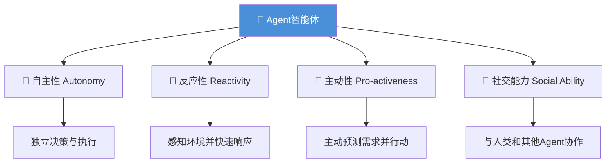
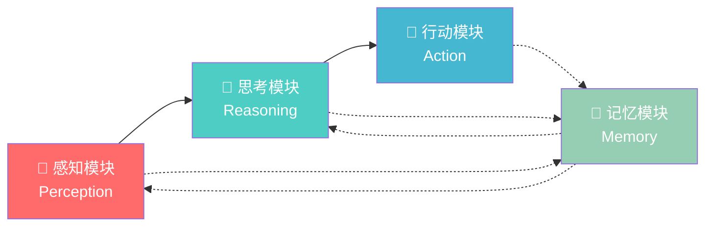
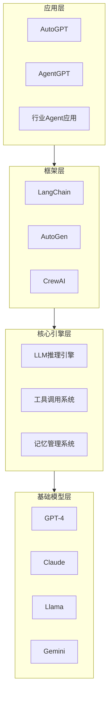

# 第一章：Agent基础概念

## 📖 章节概述

本章将带你深入理解什么是Agent（智能体），掌握Agent的核心特征、基本架构，了解Agent的发展历程和应用场景。通过本章学习，你将对Agent建立一个完整的认知框架，为后续的深入学习打下坚实基础。

**学习时长**：1-2周  
**难度等级**：⭐ 入门  
**核心技能**：理解Agent定义、掌握架构组件、认知应用场景

---

## 1.1 Agent的定义与特征

### 1.1.1 什么是Agent？

在人工智能领域，**Agent（智能体）**是指能够自主感知环境、做出决策并执行动作的智能系统。与传统的程序不同，Agent具有独立思考和行动的能力，能够在没有人类持续干预的情况下完成复杂任务。

简单来说，Agent就像一个"智能助手"：
- 它能**理解**你的需求
- 它能**思考**如何完成任务
- 它能**行动**执行具体操作
- 它能从**经验中学习**和改进

### 1.1.2 Agent的四大核心特征

Agent具有四个核心特征，这也是区分Agent和普通程序的关键：

#### 1️⃣ 自主性（Autonomy）

**定义**：Agent能够独立运作，不需要人类持续的控制或干预。

**表现**：
- 自动决定下一步行动
- 自我管理和自我修复
- 在复杂环境中自主导航

**示例**：
```python
# 传统程序：需要人类一步步指导
if user_input == "订机票":
    show_flight_options()
    # 等待用户选择
    if user_selects_flight():
        book_flight()

# Agent程序：自主决策和执行
class AutonomousAgent:
    def handle_request(self, user_request):
        # 理解用户意图
        intent = self.understand(user_request)
        
        # 自主规划执行步骤
        plan = self.plan(intent)
        
        # 自动执行完整流程
        result = self.execute(plan)
        
        # 返回结果
        return result
```

#### 2️⃣ 反应性（Reactivity）

**定义**：Agent能够感知环境变化，并快速做出相应的响应。

**表现**：
- 实时响应用户输入
- 监控环境状态变化
- 动态调整行动策略

**示例**：
```python
# Agent能够感知环境变化并响应
class ReactiveAgent:
    def __init__(self):
        self.environment_state = {}
    
    def perceive(self):
        """感知环境变化"""
        # 接收外部信号、用户输入、API响应等
        new_inputs = self.get_external_inputs()
        self.environment_state.update(new_inputs)
        return self.environment_state
    
    def react(self):
        """对环境变化做出反应"""
        state = self.perceive()
        
        # 检测到变化时自动响应
        if state.get("user_emotion") == "frustrated":
            self.escalate_to_human()
        elif state.get("error_count") > 5:
            self.trigger_recovery()
        
        return self.determine_action()
```

#### 3️⃣ 主动性（Pro-activeness）

**定义**：Agent不仅被动响应，还能主动采取行动实现目标。

**表现**：
- 预测未来需求并提前准备
- 主动发起有益的行动
- 不等待指令，主动优化结果

**示例**：
```python
class ProactiveAgent:
    def proactive_behavior(self):
        """主动性行为"""
        
        # 主动预测需求
        predicted_needs = self.predict_user_needs()
        
        # 主动提供帮助
        for need in predicted_needs:
            if not self.has_addressed(need):
                self.anticipate_and_prepare(need)
        
        # 主动优化执行
        if self.should_optimize():
            self.optimize_current_strategy()
```

#### 4️⃣ 社交能力（Social Ability）

**定义**：Agent能够与其他Agent或人类进行有效的交互和协作。

**表现**：
- 与人类自然对话
- 与其他Agent协作完成任务
- 理解社交语境和意图

**示例**：
```python
class SocialAgent:
    def interact_with_user(self, message):
        """与用户社交互动"""
        # 理解社交语境
        context = self.analyze_social_context(message)
        
        # 生成合适的响应
        response = self.generate_contextual_response(context)
        
        return response
    
    def collaborate_with_agents(self, task):
        """与其他Agent协作"""
        # 与专家Agent沟通
        expert_opinion = self.consult("expert_agent", task)
        
        # 与执行Agent协调
        execution_plan = self.coordinate("executor_agent", task)
        
        return self.integrate_results(expert_opinion, execution_plan)
```

#### 四大特征关系图



### 1.1.3 Agent vs 传统程序 vs LLM

| 特性 | 传统程序 | 大语言模型(LLM) | Agent |
|------|---------|----------------|-------|
| **执行方式** | 确定性规则 | 概率性生成 | 智能决策 |
| **交互模式** | 被动响应 | 对话生成 | 主动行动 |
| **工具使用** | 需要编程 | 无法直接使用 | 原生支持 |
| **记忆能力** | 无状态 | 上下文窗口 | 持久记忆 |
| **自主程度** | 完全受控 | 中等自主 | 高度自主 |
| **任务复杂度** | 简单任务 | 理解生成 | 复杂任务 |

---

## 1.2 Agent的基本架构

### 1.2.1 Agent核心组件

一个完整的Agent系统由四大核心组件构成：

```
┌─────────────────────────────────────────────────────┐
│                    Agent 系统                         │
│                                                     │
│  ┌──────────┐    ┌──────────┐    ┌──────────┐     │
│  │   感知   │───▶│   思考   │───▶│   行动   │     │
│  │Perception│    │Reasoning │    │   Action │     │
│  └──────────┘    └──────────┘    └──────────┘     │
│        │                │                │         │
│        └────────────────┴────────────────┘         │
│                         │                          │
│                  ┌──────────┐                      │
│                  │   记忆   │                      │
│                  │  Memory  │                      │
│                  └──────────┘                      │
└─────────────────────────────────────────────────────┘
```



#### 组件详解

### 📡 感知模块（Perception）

**职责**：接收和处理来自环境的信息

**输入类型**：
- 文本：用户消息、文档内容
- 图像：截图、照片、图表
- 音频：语音指令、会议录音
- 结构化数据：API响应、数据库记录

**实现示例**：
```python
from dataclasses import dataclass
from typing import List, Any, Dict
from enum import Enum

class InputType(Enum):
    TEXT = "text"
    IMAGE = "image"
    AUDIO = "audio"
    STRUCTURED = "structured"

@dataclass
class PerceivedInput:
    input_type: InputType
    content: Any
    metadata: Dict[str, Any]
    timestamp: float

class PerceptionModule:
    def __init__(self):
        self.input_processors = {
            InputType.TEXT: self.process_text,
            InputType.IMAGE: self.process_image,
            InputType.AUDIO: self.process_audio,
            InputType.STRUCTURED: self.process_structured,
        }
    
    def perceive(self, raw_input: Any) -> PerceivedInput:
        """感知外部输入"""
        input_type = self.detect_input_type(raw_input)
        
        processor = self.input_processors[input_type]
        processed_content = processor(raw_input)
        
        return PerceivedInput(
            input_type=input_type,
            content=processed_content,
            metadata=self.extract_metadata(raw_input),
            timestamp=self.get_current_time()
        )
    
    def process_text(self, text: str) -> str:
        """处理文本输入"""
        # 清理和标准化
        cleaned = text.strip()
        # 分词（如果需要）
        tokens = self.tokenize(cleaned)
        return cleaned
    
    def process_image(self, image_data: bytes) -> Dict:
        """处理图像输入"""
        # 图像预处理
        # 特征提取
        return {"processed": True, "features": []}
    
    def process_audio(self, audio_data: bytes) -> str:
        """处理音频输入"""
        # 语音识别
        # 转为文本
        return self.speech_to_text(audio_data)
    
    def process_structured(self, data: Dict) -> Dict:
        """处理结构化数据"""
        return data
```

### 🧠 思考模块（Reasoning）

**职责**：处理信息、进行推理和决策的核心逻辑

**核心能力**：
- 理解用户意图
- 分解复杂任务
- 制定执行计划
- 评估行动结果
- 进行逻辑推理

**实现示例**：
```python
class ReasoningModule:
    def __init__(self, llm_client):
        self.llm = llm_client
        self.reasoning_strategies = {
            "chain_of_thought": self.chain_of_thought,
            "tree_of_thoughts": self.tree_of_thoughts,
            "react": self.react_reasoning,
        }
    
    def think(self, perception_result: PerceivedInput, 
               context: Dict) -> "ReasoningResult":
        """思考和推理"""
        
        # 1. 理解意图
        intent = self.understand_intent(perception_result.content)
        
        # 2. 分析情况
        situation = self.analyze_situation(intent, context)
        
        # 3. 制定计划
        plan = self.create_plan(situation)
        
        # 4. 推理决策
        decision = self.reason(plan, context)
        
        return ReasoningResult(
            intent=intent,
            situation=situation,
            plan=plan,
            decision=decision
        )
    
    def understand_intent(self, content: str) -> Intent:
        """理解用户意图"""
        prompt = f"""分析以下用户输入的意图：
        
        输入：{content}
        
        识别出：
        1. 主要意图
        2. 涉及的实体
        3. 期望的结果
        """
        response = self.llm.generate(prompt)
        return self.parse_intent(response)
    
    def analyze_situation(self, intent: Intent, 
                         context: Dict) -> Situation:
        """分析当前情况"""
        # 检查资源可用性
        available_tools = self.get_available_tools()
        available_memory = self.get_relevant_memory(intent)
        
        return Situation(
            goal=intent,
            constraints=self.get_constraints(),
            resources=available_tools,
            relevant_knowledge=available_memory
        )
    
    def create_plan(self, situation: Situation) -> Plan:
        """制定执行计划"""
        # 任务分解
        subtasks = self.decompose_task(situation.goal)
        
        # 排序和优化
        ordered_tasks = self.order_tasks(subtasks)
        
        # 生成具体步骤
        steps = []
        for task in ordered_tasks:
            step = self.create_step(task, situation)
            steps.append(step)
        
        return Plan(steps=steps, metadata={})
    
    def reason(self, plan: Plan, context: Dict) -> Decision:
        """推理决策"""
        # 选择推理策略
        strategy = self.select_reasoning_strategy(plan)
        
        # 执行推理
        reasoning_func = self.reasoning_strategies[strategy]
        decision = reasoning_func(plan, context)
        
        return decision
    
    def chain_of_thought(self, plan: Plan, 
                         context: Dict) -> Decision:
        """链式思维推理"""
        reasoning_chain = []
        current_step = 0
        
        while current_step < len(plan.steps):
            step = plan.steps[current_step]
            
            # 推理当前步骤
            thought = self.reason_about_step(step, context)
            reasoning_chain.append(thought)
            
            # 检查是否需要调整
            if thought.requires_adjustment:
                plan.adjust_step(current_step, thought.suggestion)
            
            current_step += 1
        
        return Decision(
            action_sequence=plan.steps,
            reasoning_chain=reasoning_chain,
            confidence=self.calculate_confidence(reasoning_chain)
        )
    
    def react_reasoning(self, plan: Plan, 
                       context: Dict) -> Decision:
        """ReAct推理（推理+行动）"""
        observations = []
        
        for step in plan.steps:
            # 推理
            reasoning = self.generate_reasoning(step, context)
            
            # 行动
            action = self.execute_step(step)
            
            # 观察结果
            observation = self.observe_result(action)
            observations.append(observation)
            
            # 基于观察调整
            context.update({"observation": observation})
        
        return Decision(
            reasoning=reasoning,
            action=action,
            observation=observation
        )
```

### 🎯 行动模块（Action）

**职责**：执行具体的动作，与环境进行交互

**行动类型**：
- **内部行动**：思考、推理、决策
- **外部行动**：调用工具、API、网络请求
- **通信行动**：发送消息、请求帮助

**实现示例**：
```python
from typing import Callable, Any
import asyncio

class ActionModule:
    def __init__(self, tool_registry):
        self.tool_registry = tool_registry
        self.action_history = []
    
    def act(self, decision: Decision, 
            context: Dict) -> "ActionResult":
        """执行行动"""
        
        results = []
        
        for action in decision.action_sequence:
            # 执行单个行动
            result = self.execute_action(action, context)
            results.append(result)
            
            # 记录历史
            self.action_history.append({
                "action": action,
                "result": result,
                "timestamp": self.get_current_time()
            })
            
            # 检查是否成功
            if not result.success:
                # 处理失败
                recovery = self.handle_action_failure(result)
                results.append(recovery)
        
        return ActionResult(
            success=all(r.success for r in results),
            outputs=results,
            summary=self.summarize_results(results)
        )
    
    def execute_action(self, action: Action, 
                      context: Dict) -> ActionOutput:
        """执行单个行动"""
        
        if action.type == ActionType.TOOL_CALL:
            return self.execute_tool_action(action, context)
        elif action.type == ActionType.API_CALL:
            return self.execute_api_action(action, context)
        elif action.type == ActionType.MESSAGE:
            return self.execute_message_action(action, context)
        elif action.type == ActionType.INTERNAL:
            return self.execute_internal_action(action, context)
    
    def execute_tool_action(self, action: Action, 
                           context: Dict) -> ActionOutput:
        """执行工具调用"""
        tool = self.tool_registry.get_tool(action.tool_name)
        
        if not tool:
            return ActionOutput(
                success=False,
                error=f"Tool {action.tool_name} not found"
            )
        
        # 准备参数
        prepared_args = self.prepare_tool_args(
            action.arguments, context
        )
        
        # 执行工具
        try:
            if tool.is_async:
                result = asyncio.run(
                    tool.execute(**prepared_args)
                )
            else:
                result = tool.execute(**prepared_args)
            
            return ActionOutput(
                success=True,
                result=result,
                tool_used=action.tool_name
            )
        except Exception as e:
            return ActionOutput(
                success=False,
                error=str(e),
                tool_used=action.tool_name
            )
    
    def execute_api_action(self, action: Action, 
                          context: Dict) -> ActionOutput:
        """执行API调用"""
        # API调用逻辑
        response = requests.post(
            action.endpoint,
            headers=action.headers,
            json=action.body
        )
        
        return ActionOutput(
            success=response.status_code == 200,
            result=response.json() if response.ok else None,
            error=response.text if not response.ok else None
        )
```

### 💾 记忆模块（Memory）

**职责**：存储和管理Agent的知识、经验和历史信息

**记忆类型**：
- **短期记忆**：当前会话上下文
- **长期记忆**：持久化存储的知识
- **工作记忆**：当前任务相关的信息

**实现示例**：
```python
from datetime import datetime, timedelta
from typing import List, Dict, Any
import json

class MemoryModule:
    def __init__(self, vector_store=None):
        # 短期记忆
        self.working_memory = []
        self.max_working_memory = 10
        
        # 长期记忆
        self.episodic_memory = []  # 事件记忆
        self.semantic_memory = []  # 语义记忆
        self.procedural_memory = []  # 程序记忆
        
        # 向量存储（用于语义检索）
        self.vector_store = vector_store
        
        # 记忆配置
        self.importance_threshold = 0.7
        self.forgetting_rate = 0.1
    
    def add_to_memory(self, experience: Dict[str, Any]):
        """添加新记忆"""
        # 评估重要性
        importance = self.assess_importance(experience)
        
        # 决定存储位置
        if experience.get("type") == "episodic":
            self.store_episodic(experience, importance)
        elif experience.get("type") == "semantic":
            self.store_semantic(experience, importance)
        elif experience.get("type") == "procedural":
            self.store_procedural(experience, importance)
        
        # 更新工作记忆
        self.update_working_memory(experience)
    
    def retrieve(self, query: str, 
                memory_type: str = "all",
                top_k: int = 5) -> List[Dict]:
        """检索记忆"""
        
        if memory_type in ["working", "all"]:
            working_results = self.retrieve_from_working(query)
        else:
            working_results = []
        
        if memory_type in ["episodic", "all"]:
            episodic_results = self.retrieve_episodic(query, top_k)
        else:
            episodic_results = []
        
        if memory_type in ["semantic", "all"]:
            semantic_results = self.retrieve_semantic(query, top_k)
        else:
            semantic_results = []
        
        # 合并和排序结果
        all_results = (
            working_results + 
            episodic_results + 
            semantic_results
        )
        
        return self.rank_and_filter_results(all_results, top_k)
    
    def retrieve_from_working(self, query: str) -> List[Dict]:
        """从工作记忆中检索"""
        query_embedding = self.embed(query)
        
        results = []
        for memory in self.working_memory:
            similarity = self.cosine_similarity(
                query_embedding,
                memory.get("embedding", query_embedding)
            )
            if similarity > 0.5:
                results.append({
                    "memory": memory,
                    "similarity": similarity,
                    "source": "working_memory"
                })
        
        return sorted(results, 
                     key=lambda x: x["similarity"], 
                     reverse=True)
    
    def retrieve_semantic(self, query: str, 
                         top_k: int) -> List[Dict]:
        """语义记忆检索"""
        if not self.vector_store:
            return []
        
        results = self.vector_store.search(
            query=query,
            top_k=top_k
        )
        
        return [{
            "memory": r["document"],
            "similarity": r["score"],
            "source": "semantic_memory"
        } for r in results]
    
    def store_episodic(self, experience: Dict, 
                      importance: float):
        """存储情景记忆"""
        memory = {
            "content": experience,
            "importance": importance,
            "timestamp": datetime.now(),
            "context": experience.get("context", {}),
            "embedding": self.embed(str(experience))
        }
        
        self.episodic_memory.append(memory)
        
        # 存储到向量数据库
        if self.vector_store:
            self.vector_store.add(
                document=str(experience),
                metadata={
                    "type": "episodic",
                    "importance": importance
                }
            )
    
    def update_working_memory(self, new_experience: Dict):
        """更新工作记忆"""
        self.working_memory.append(new_experience)
        
        # 如果超出容量，进行压缩
        if len(self.working_memory) > self.max_working_memory:
            self.compress_working_memory()
    
    def compress_working_memory(self):
        """压缩工作记忆"""
        # 保留最重要的记忆
        important_memories = [
            m for m in self.working_memory
            if m.get("importance", 0) > self.importance_threshold
        ]
        
        # 合并相似记忆
        compressed = self.consolidate_similar(important_memories)
        
        self.working_memory = compressed[:self.max_working_memory]
    
    def consolidate_similar(self, memories: List[Dict]) -> List[Dict]:
        """合并相似记忆"""
        if not memories:
            return []
        
        consolidated = [memories[0]]
        
        for memory in memories[1:]:
            should_merge = False
            
            for existing in consolidated:
                similarity = self.calculate_similarity(
                    memory, existing
                )
                if similarity > 0.8:
                    # 合并记忆
                    merged = self.merge_memories(memory, existing)
                    consolidated.remove(existing)
                    consolidated.append(merged)
                    should_merge = True
                    break
            
            if not should_merge:
                consolidated.append(memory)
        
        return consolidated
```
（详见 [第4章 - 工具与记忆系统](chapter4-tools-memory/chapter4-tools-memory.md)）

### 1.2.2 Agent架构模式

#### 基础架构：ReAct模式

```python
class ReActAgent:
    """ReAct (Reasoning + Acting) Agent"""
    
    def __init__(self, llm, tools, memory):
        self.llm = llm
        self.tools = tools
        self.memory = memory
    
    def run(self, task: str) -> str:
        """运行Agent"""
        observations = []
        thoughts = []
        
        # 多次迭代思考-行动循环
        for step in range(5):  # 最大5步
            # 1. 思考
            thought = self.think(task, thoughts, observations)
            thoughts.append(thought)
            
            # 2. 决定行动
            action = self.decide_action(thought, self.tools)
            
            # 3. 执行行动
            if action.type == "finish":
                return action.result
            
            # 4. 观察结果
            observation = self.execute(action)
            observations.append(observation)
            
            # 5. 存储到记忆
            self.memory.add({
                "thought": thought,
                "action": action,
                "observation": observation
            })
        
        return "Task not completed within step limit"
```

#### 高级架构：多组件协同

```python
class AdvancedAgent:
    """高级Agent架构"""
    
    def __init__(self):
        # 各组件初始化
        self.perception = PerceptionModule()
        self.reasoning = ReasoningModule()
        self.action = ActionModule()
        self.memory = MemoryModule()
        
        # 协调器
        self.coordinator = AgentCoordinator()
        
        # 监控器
        self.monitor = AgentMonitor()
    
    def process_task(self, input_data):
        """处理任务的主流程"""
        
        # 1. 感知阶段
        perceived = self.perception.perceive(input_data)
        
        # 2. 检索相关记忆
        relevant_memories = self.memory.retrieve(
            perceived.content
        )
        
        # 3. 思考和规划
        plan = self.reasoning.create_plan(
            perceived,
            relevant_memories
        )
        
        # 4. 执行计划
        results = []
        for step in plan.steps:
            result = self.action.execute(step)
            results.append(result)
            
            # 5. 持续监控
            if self.monitor.should_abort(result):
                break
        
        # 6. 存储执行经验
        self.memory.add_experience(
            task=input_data,
            plan=plan,
            results=results
        )
        
        # 7. 返回最终结果
        return self.summarize_results(results)
```

---

## 1.3 Agent的发展历程

### 1.3.1 发展时间线

```
1956 ─── Dartmouth Conference
        人工智能概念诞生
          │
1950s ─── Turing Test
          │
          │    符号主义时代
          │
1980s ───├── Expert Systems
          │   MYCIN, DENDRAL
          │
          │    互联网时代
          │
1990s ───├── Web Agents
          │   搜索引擎爬虫
          │
          │    机器学习时代
          │
2000s ───├── Reinforcement Learning Agents
          │   Atari Games, AlphaGo
          │
          │    深度学习时代
          │
2010s ───├── Deep RL Agents
          │   DeepMind, OpenAI
          │
          │    大模型时代 ⭐
          │
2020s ───├── LLM-powered Agents
          │   GPT-4, Claude, Agent框架
          │
          │    Agent应用爆发期
          │
2024+ ───├── Autonomous Agents
              AutoGPT, AgentOps
```

### 1.3.2 各阶段特征

#### 🤖 传统AI Agent（1980-2010）

**代表技术**：
- 专家系统（Expert Systems）
- 基于规则的推理
- 有限状态机

**特点**：
- 依赖人工编写的规则
- 处理特定领域问题
- 缺乏学习和适应能力

**局限性**：
- 无法处理模糊信息
- 难以适应新情况
- 知识获取困难

#### 🧠 机器学习Agent（2010-2020）

**代表技术**：
- 深度强化学习
- AlphaGo系列
- OpenAI Five

**特点**：
- 通过数据学习
- 能够自我改进
- 处理复杂决策

**突破**：
- 超越人类在特定任务上的表现
- 创造性策略发现
- 端到端学习能力

#### 🌟 大语言模型Agent（2020-至今）

**代表技术**：
- GPT系列、Claude系列
- LangChain、AutoGen
- Toolformer

**特点**：
- 强大的语言理解能力
- 广泛的知识储备
- 灵活的工具使用
- 自然语言交互

**创新点**：
```
┌────────────────────────────────────┐
│     LLM Agent 的核心突破           │
├────────────────────────────────────┤
│ 1. 自然语言理解与生成              │
│ 2. 零样本/少样本学习能力           │
│ 3. 工具使用和函数调用              │
│ 4. 复杂任务的分解和规划            │
│ 5. 多模态感知能力                 │
│ 6. 持续学习和适应                 │
└────────────────────────────────────┘
```

### 1.3.3 当前Agent生态

```
                    ┌─────────────────┐
                    │   Agent 应用层   │
                    │  (AutoGPT等)    │
                    └────────┬────────┘
                             │
┌────────────────┐   ┌───────┴────────┐   ┌────────────────┐
│  框架和工具层   │◀──│   核心引擎层    │──▶│   部署和监控    │
│ LangChain      │   │ (LLM + 推理)   │   │  AgentOps      │
│ AutoGen        │   └───────┬────────┘   └────────────────┘
│ CrewAI         │           │
└────────────────┘   ┌───────┴────────┐
                     │   基础模型层    │
                     │ GPT-4/Claude/   │
                     │ Llama/Gemini   │
                     └────────────────┘
```


（详见 [第8章 - 多Agent系统](chapter8-multi-agent-systems/chapter8-multi-agent-systems.md)）

---

## 1.4 章节练习

### 🎯 练习一：实现一个简单Agent

**目标**：实现一个能够处理用户查询并提供帮助的简单Agent

**要求**：
1. 包含感知、思考、行动三个核心模块
2. 能够理解用户意图
3. 提供合理的响应

**参考代码框架**：
```python
class SimpleAgent:
    def __init__(self):
        # 初始化各组件
        pass
    
    def run(self, user_input):
        """运行Agent处理用户输入"""
        # 1. 感知阶段
        perceived = self.perceive(user_input)
        
        # 2. 思考阶段
        thought = self.think(perceived)
        
        # 3. 行动阶段
        response = self.act(thought)
        
        return response

# 测试
agent = SimpleAgent()
response = agent.run("帮我预订明天去北京的机票")
print(response)
```

### 🎯 练习二：设计Agent记忆系统

**目标**：设计一个支持短期记忆和长期记忆的系统

**要求**：
1. 实现工作记忆（短期）
2. 实现持久化记忆（长期）
3. 支持记忆检索

**提示**：
- 使用类来封装不同类型的记忆
- 实现简单的相似度计算
- 考虑记忆的优先级和衰减

### 🎯 练习三：分析现有Agent应用

**目标**：分析一个现有的Agent应用（如AutoGPT）

**任务**：
1. 阅读AutoGPT的架构设计
2. 识别其核心组件
3. 绘制架构图
4. 分析其优缺点

**提交内容**：
- 架构分析文档
- 组件关系图
- 改进建议

---

## 📚 延伸阅读

### 推荐资源

#### 📖 论文
1. **"A Survey of Agent-based Automated Systems"** - 经典综述
2. **"ReAct: Synergizing Reasoning and Acting in Language Models"** - ReAct框架
3. **"Tree of Thoughts: Deliberate Problem Solving with Large Language Models"** - ToT框架
4. **"Toolformer: Language Models Can Teach Themselves to Use Tools"** - 工具使用

#### 🌐 在线资源
1. [OpenAI Agent文档](https://platform.openai.com/docs/guides/agents)
2. [LangChain Agent指南](https://python.langchain.com/docs/modules/agents/)
3. [AutoGen官方文档](https://microsoft.github.io/autogen/)

#### 📺 视频课程
1. Stanford CS224n: NLP with Deep Learning
2. DeepLearning.AI的Agent专项课程
3. 各框架的官方教程视频

---

## ✅ 章节总结

### 核心要点回顾

1. **Agent定义**：能够自主感知、思考、行动的智能系统
2. **四大特征**：自主性、反应性、主动性、社交能力
3. **核心架构**：感知 → 思考 → 行动 + 记忆系统
4. **发展历程**：从规则系统到LLM驱动的演进

### 关键术语

| 术语 | 解释 |
|------|------|
| Agent | 智能体，能够自主行动的AI系统 |
| Autonomy | 自主性，独立运作的能力 |
| Reactivity | 反应性，对环境变化的响应能力 |
| Pro-activeness | 主动性，主动采取行动的能力 |
| Memory | 记忆系统，存储知识和经验 |
| Tool Use | 工具使用，调用外部工具的能力 |

### 下章预告

在下一章中，我们将深入学习**大语言模型基础**，包括：
- Transformer架构原理
- 主流LLM模型对比
- LLM的能力与局限性
- 如何选择合适的LLM

---

**完成本章学习后，你将具备理解复杂Agent系统的基础知识！🎉**

[← 返回课程目录](../course-overview.md) | [→ 进入第二章：大语言模型基础](../chapter2-llm-fundamentals/chapter2-llm-fundamentals.md)
