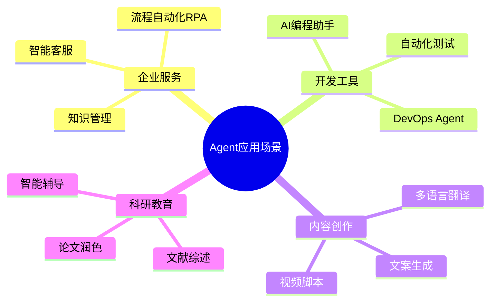

# 第十一章：Agent实际应用案例

## 📖 章节概述

本章聚焦Agent技术的商业落地场景和实战案例。你将学习如何将Agent应用于企业服务、开发工具、内容创作、科研教育等领域，掌握实际项目的设计思路和开发方法。

**学习时长**：2-3周  
**难度等级**：⭐⭐⭐⭐ 高级  
**核心技能**：应用设计、项目开发、部署运维、案例分析

---



## 11.1 企业级应用

### 11.1.1 智能客服系统

```python
"""
智能客服Agent架构：

┌─────────────────────────────────────────────────────────┐
│                   智能客服系统                           │
├─────────────────────────────────────────────────────────┤
│                                                          │
│  用户 ──▶│意图识别│──▶│Agent处理│──▶│知识库│           │
│         │       │    │        │    │检索  │           │
│         │       │    │        │    │      │           │
│         │       │    │        │──▶│工单  │           │
│         │       │    │        │    │系统  │           │
│         │       │    │        │    │      │           │
│         │       │    │        │──▶│CRM  │           │
│         └───────┘    └────────┘    └──────┘           │
│                                                          │
└─────────────────────────────────────────────────────────┘
"""

class CustomerServiceAgent:
    """企业智能客服Agent"""
    
    def __init__(self, llm_client, knowledge_base, crm_system):
        self.llm = llm_client
        self.knowledge_base = knowledge_base
        self.crm = crm_system
        
        self.system_prompt = """
你是公司客服助手，职责：
1. 解答产品使用问题
2. 处理售后咨询
3. 引导客户自助
4. 收集反馈建议

原则：
- 热情专业
- 简洁清晰
- 必要时转人工
        """
    
    def handle_customer(
        self,
        customer_id: str,
        message: str
    ) -> Dict:
        """处理客户咨询"""
        
        # 1. 获取客户信息
        customer = self.crm.get_customer(customer_id)
        
        # 2. 意图识别
        intent = self.identify_intent(message)
        
        # 3. 根据意图处理
        if intent == "product_question":
            return self.handle_product_query(customer, message)
        elif intent == "complaint":
            return self.handle_complaint(customer, message)
        elif intent == "refund":
            return self.handle_refund(customer, message)
        else:
            return self.handle_general(customer, message)
    
    def identify_intent(self, message: str) -> str:
        """识别用户意图"""
        
        prompt = f"""
判断客户消息的意图类别：
消息：{message}

类别：
- product_question: 产品问题
- complaint: 投诉
- refund: 退款
- general: 一般咨询

只返回类别名称。
        """
        
        return self.llm.chat(prompt).strip()
    
    def handle_product_query(
        self,
        customer: Dict,
        message: str
    ) -> Dict:
        """处理产品咨询"""
        
        # 检索知识库
        relevant_docs = self.knowledge_base.search(message)
        
        context = "\n".join([doc.content for doc in relevant_docs])
        
        prompt = f"""
客户信息：{customer}
客户问题：{message}

参考知识：
{context}

请提供专业、准确的回答。
        """
        
        response = self.llm.chat(prompt)
        
        return {
            "response": response,
            "type": "product_question",
            "sources": [doc.source for doc in relevant_docs]
        }
    
    def handle_complaint(
        self,
        customer: Dict,
        message: str
    ) -> Dict:
        """处理投诉"""
        
        # 投诉需要更敏感的处理
        prompt = f"""
处理客户投诉：
客户：{customer['name']}
问题：{message}

请：
1. 表示理解和歉意
2. 记录问题细节
3. 承诺跟进解决

回复客户：
        """
        
        response = self.llm.chat(prompt)
        
        # 创建工单
        ticket_id = self.crm.create_ticket(
            customer_id=customer['id'],
            type='complaint',
            description=message
        )
        
        return {
            "response": response,
            "type": "complaint",
            "ticket_id": ticket_id,
            "escalate": True  # 需要人工跟进
        }
```

### 11.1.2 业务流程自动化

```python
class BusinessProcessAutomation:
    """业务流程自动化"""
    
    def __init__(self, llm_client):
        self.llm = llm_client
        self.processes = {}
    
    def register_process(
        self,
        name: str,
        steps: List[Dict],
        conditions: Dict
    ):
        """注册业务流程"""
        
        self.processes[name] = {
            "steps": steps,
            "conditions": conditions
        }
    
    async def execute_process(
        self,
        process_name: str,
        input_data: Dict
    ) -> Dict:
        """执行流程"""
        
        if process_name not in self.processes:
            raise ValueError(f"未知的流程: {process_name}")
        
        process = self.processes[process_name]
        current_state = input_data
        execution_log = []
        
        for step in process["steps"]:
            # 检查前置条件
            if not self.check_conditions(
                step.get("conditions", {}),
                current_state
            ):
                execution_log.append({
                    "step": step["name"],
                    "status": "skipped",
                    "reason": "条件不满足"
                })
                continue
            
            # 执行步骤
            result = await self.execute_step(
                step,
                current_state
            )
            
            execution_log.append({
                "step": step["name"],
                "status": "completed",
                "result": result
            })
            
            current_state.update(result)
        
        return {
            "status": "completed",
            "final_state": current_state,
            "log": execution_log
        }
    
    def check_conditions(
        self,
        conditions: Dict,
        state: Dict
    ) -> bool:
        """检查条件"""
        
        for key, expected in conditions.items():
            if state.get(key) != expected:
                return False
        return True
    
    async def execute_step(
        self,
        step: Dict,
        state: Dict
    ) -> Dict:
        """执行单个步骤"""
        
        step_type = step.get("type")
        
        if step_type == "api_call":
            return await self.execute_api_step(step, state)
        elif step_type == "data_process":
            return self.execute_data_step(step, state)
        elif step_type == "approval":
            return await self.execute_approval_step(step, state)
        else:
            return {}
    
    async def execute_api_step(
        self,
        step: Dict,
        state: Dict
    ) -> Dict:
        """执行API调用步骤"""
        # API调用逻辑
        pass
    
    def execute_data_step(
        self,
        step: Dict,
        state: Dict
    ) -> Dict:
        """执行数据处理步骤"""
        # 数据处理逻辑
        pass
    
    async def execute_approval_step(
        self,
        step: Dict,
        state: Dict
    ) -> Dict:
        """执行审批步骤"""
        # 发送审批请求
        # 等待审批结果
        pass
```

### 11.1.3 知识管理系统

```python
class KnowledgeManagementAgent:
    """知识管理Agent"""
    
    def __init__(self, llm_client, vector_store):
        self.llm = llm_client
        self.vector_store = vector_store
        self.knowledge_graph = KnowledgeGraph()
    
    def add_document(
        self,
        title: str,
        content: str,
        metadata: Dict
    ):
        """添加文档到知识库"""
        
        # 1. 分块处理
        chunks = self.chunk_document(content)
        
        # 2. 向量化存储
        for i, chunk in enumerate(chunks):
            self.vector_store.add(
                id=f"{title}_{i}",
                text=chunk,
                metadata={
                    "title": title,
                    "chunk_index": i,
                    **metadata
                }
            )
        
        # 3. 提取知识图谱关系
        entities = self.extract_entities(content)
        for entity in entities:
            self.knowledge_graph.add_entity(entity)
        
        relations = self.extract_relations(content)
        for rel in relations:
            self.knowledge_graph.add_relation(
                rel["from"],
                rel["type"],
                rel["to"]
            )
    
    def chunk_document(
        self,
        content: str,
        chunk_size: int = 1000
    ) -> List[str]:
        """分块文档"""
        # 简化实现
        return [content[i:i+chunk_size] 
                for i in range(0, len(content), chunk_size)]
    
    def extract_entities(self, text: str) -> List[Dict]:
        """提取实体"""
        prompt = f"""
从以下文本中提取命名实体：

文本：{text}

提取：人名、机构名、技术术语等

返回JSON格式的实体列表。
        """
        
        # 调用LLM提取
        return []
    
    def extract_relations(self, text: str) -> List[Dict]:
        """提取关系"""
        # 实现关系提取
        return []
    
    def query_knowledge(
        self,
        question: str,
        filters: Dict = None
    ) -> Dict:
        """查询知识"""
        
        # 1. 向量检索
        vector_results = self.vector_store.search(
            query=question,
            filters=filters
        )
        
        # 2. 知识图谱检索
        kg_results = self.knowledge_graph.query(question)
        
        # 3. 融合结果
        combined_context = self.fuse_results(
            vector_results,
            kg_results
        )
        
        # 4. 生成答案
        answer = self.generate_answer(question, combined_context)
        
        return {
            "answer": answer,
            "sources": vector_results,
            "graph_info": kg_results
        }
    
    def fuse_results(
        self,
        vector_results: List,
        kg_results: Dict
    ) -> str:
        """融合检索结果"""
        
        parts = ["相关文档：\n"]
        
        for result in vector_results[:3]:
            parts.append(f"- {result['text'][:200]}...\n")
        
        if kg_results.get("entities"):
            parts.append("\n知识图谱信息：\n")
            for entity in kg_results["entities"][:5]:
                parts.append(f"- {entity['name']}: {entity.get('description', '')}\n")
        
        return "".join(parts)
    
    def generate_answer(
        self,
        question: str,
        context: str
    ) -> str:
        """生成答案"""
        
        prompt = f"""
基于以下知识回答问题。如果知识中没有相关信息，请说明。

知识：
{context}

问题：{question}

回答：
        """
        
        return self.llm.chat(prompt)
```
（详见 [第3章 - Prompt工程与Agent设计](chapter3-prompt-agent-design/chapter3-prompt-agent-design.md)）
（详见 [第5章 - 框架实践](chapter5-framework-practice/chapter5-framework-practice.md)）

---

## 11.2 开发工具应用

### 11.2.1 AI编程助手

```python
class AIProgrammingAssistant:
    """AI编程助手"""
    
    def __init__(self, llm_client, code_executor):
        self.llm = llm_client
        self.executor = code_executor
        self.context_manager = CodeContextManager()
    
    def code_completion(
        self,
        code_so_far: str,
        language: str
    ) -> str:
        """代码补全"""
        
        prompt = f"""
语言：{language}
当前代码：
```{language}
{code_so_far}
```

请补全代码。只返回补全部分，不要重复已有代码。
        """
        
        return self.llm.chat(prompt)
    
    def code_review(
        self,
        code: str,
        language: str
    ) -> Dict:
        """代码审查"""
        
        prompt = f"""
审查以下{language}代码：

```{language}
{code}
```

请从以下维度审查：
1. 代码质量
2. 潜在bug
3. 安全问题
4. 性能问题
5. 改进建议

返回JSON格式的审查结果。
        """
        
        response = self.llm.chat(prompt)
        
        return {
            "code": code,
            "review": response,
            "issues": self.parse_issues(response)
        }
    
    def debug_assistance(
        self,
        code: str,
        error_message: str,
        language: str
    ) -> Dict:
        """调试辅助"""
        
        prompt = f"""
代码出现错误：

错误信息：
{error_message}

代码：
```{language}
{code}
```

请分析：
1. 错误原因
2. 修复建议
3. 提供修复后的代码
        """
        
        response = self.llm.chat(prompt)
        
        return {
            "analysis": response,
            "fixed_code": self.extract_fixed_code(response)
        }
    
    def generate_documentation(
        self,
        code: str,
        language: str,
        doc_format: str = "markdown"
    ) -> str:
        """生成文档"""
        
        prompt = f"""
为以下{language}代码生成{doc_format}格式的文档：

```{language}
{code}
```

文档要求：
1. 文件说明
2. 函数/类说明
3. 参数说明
4. 返回值说明
5. 使用示例
        """
        
        return self.llm.chat(prompt)
    
    def generate_tests(
        self,
        code: str,
        language: str,
        test_framework: str
    ) -> str:
        """生成测试"""
        
        prompt = f"""
为以下代码生成{test_framework}测试用例：

```{language}
{code}
```

要求：
1. 覆盖主要功能
2. 包含边界情况
3. 使用mock/stub
4. 测试命名清晰
        """
        
        return self.llm.chat(prompt)
```

### 11.2.2 自动化测试生成

```python
class AutomatedTestGenerator:
    """自动化测试生成"""
    
    def __init__(self, llm_client):
        self.llm = llm_client
    
    def analyze_requirements(
        self,
        requirements_doc: str
    ) -> List[Dict]:
        """分析需求，提取测试点"""
        
        prompt = f"""
分析以下需求文档，提取可测试的需求点：

{requirements_doc}

每个需求点应包含：
- 需求ID
- 描述
- 前置条件
- 测试步骤
- 预期结果

返回JSON格式。
        """
        
        response = self.llm.chat(prompt)
        return self.parse_json(response)
    
    def generate_unit_tests(
        self,
        source_code: str,
        framework: str = "pytest"
    ) -> str:
        """生成单元测试"""
        
        prompt = f"""
为以下代码生成{fw}单元测试：

{source_code}

要求：
- 使用pytest框架
- 包含setup/teardown
- 测试覆盖所有函数
- 使用parametrize测试边界情况
        """
        
        return self.llm.chat(prompt)
    
    def generate_integration_tests(
        self,
        apis: List[Dict],
        workflow_description: str
    ) -> str:
        """生成集成测试"""
        
        prompt = f"""
为以下API和工作流生成集成测试：

API定义：
{apis}

工作流：{workflow_description}

要求：
- 测试API调用顺序
- 验证数据流转
- 测试错误处理
        """
        
        return self.llm.chat(prompt)
```

---

## 11.3 内容创作应用

### 11.3.1 多场景内容生成

```python
class ContentCreationAgent:
    """内容创作Agent"""
    
    def __init__(self, llm_client):
        self.llm = llm_client
        self.templates = self.load_templates()
    
    def generate_blog_post(
        self,
        topic: str,
        tone: str = "professional",
        length: str = "medium"
    ) -> Dict:
        """生成博客文章"""
        
        outline = self.create_outline(topic, length)
        
        sections = []
        for section in outline:
            content = self.write_section(
                section,
                topic,
                tone
            )
            sections.append({
                "heading": section,
                "content": content
            })
        
        return {
            "topic": topic,
            "outline": outline,
            "sections": sections,
            "total_words": sum(len(s['content'].split()) 
                             for s in sections)
        }
    
    def create_outline(
        self,
        topic: str,
        length: str
    ) -> List[str]:
        """创建文章大纲"""
        
        length_config = {
            "short": 3,
            "medium": 5,
            "long": 8
        }
        
        num_sections = length_config.get(length, 5)
        
        prompt = f"""
为"{topic}"创建{num_sections}段文章大纲。

格式：
1. 引言
2. 要点1
3. 要点2
...
X. 总结

只返回大纲标题。
        """
        
        response = self.llm.chat(prompt)
        return [s.strip() for s in response.split('\n') if s.strip()]
    
    def write_section(
        self,
        heading: str,
        topic: str,
        tone: str
    ) -> str:
        """撰写章节"""
        
        prompt = f"""
以{tone}的风格撰写以下文章章节：

标题：{heading}
主题：{topic}

要求：
- 200-400字
- 包含具体例子
- 段落清晰
        """
        
        return self.llm.chat(prompt)
    
    def generate_marketing_copy(
        self,
        product: Dict,
        platform: str
    ) -> Dict:
        """生成营销文案"""
        
        platform_templates = {
            "twitter": self.templates["twitter"],
            "linkedin": self.templates["linkedin"],
            "email": self.templates["email"]
        }
        
        template = platform_templates.get(platform, "")
        
        prompt = f"""
产品信息：
名称：{product['name']}
特点：{product['features']}
优势：{product['benefits']}
目标用户：{product['audience']}

使用以下模板生成{platform}营销文案：

{template}
        """
        
        return {
            "platform": platform,
            "content": self.llm.chat(prompt),
            "hashtags": self.generate_hashtags(product)
        }
    
    def generate_hashtags(self, product: Dict) -> List[str]:
        """生成标签"""
        prompt = f"为{product['name']}生成5个标签"
        return self.llm.chat(prompt).split(',')
```

### 11.3.2 多语言本地化

```python
class LocalizationAgent:
    """本地化Agent"""
    
    def __init__(self, llm_client):
        self.llm = llm_client
        self.cultures = self.load_culture_knowledge()
    
    def translate_content(
        self,
        content: str,
        target_language: str,
        context: str = None
    ) -> str:
        """翻译内容"""
        
        prompt = f"""
将以下内容翻译成{target_language}：

{content}

{context or ''}

要求：
- 保持原意
- 符合目标语言习惯
- 注意文化适配
        """
        
        return self.llm.chat(prompt)
    
    def localize_ui(
        self,
        ui_strings: Dict[str, str],
        locale: str
    ) -> Dict[str, str]:
        """本地化UI文本"""
        
        culture = self.cultures.get(locale, {})
        
        localized = {}
        for key, text in ui_strings.items():
            # 检查是否有文化适配规则
            if key in culture.get("adaptations", {}):
                localized[key] = culture["adaptations"][key]
            else:
                localized[key] = self.translate_content(
                    text,
                    culture["language"]
                )
        
        return localized
    
    def adapt_marketing_content(
        self,
        content: str,
        source_culture: str,
        target_culture: str
    ) -> str:
        """文化适配营销内容"""
        
        prompt = f"""
将以下营销内容从{source_culture}文化适配到{target_culture}文化：

{content}

注意：
- 颜色象征意义
- 数字吉利/禁忌
- 图片和图标
- 表达方式
        """
        
        return self.llm.chat(prompt)
```

---

## 11.4 科研教育应用

### 11.4.1 研究助手

```python
class ResearchAssistantAgent:
    """研究助手Agent"""
    
    def __init__(self, llm_client, paper_database):
        self.llm = llm_client
        self.papers = paper_database
        self.citation_manager = CitationManager()
    
    def literature_review(
        self,
        research_question: str,
        max_papers: int = 20
    ) -> Dict:
        """文献综述"""
        
        # 1. 搜索相关论文
        relevant_papers = self.papers.search(
            research_question,
            limit=max_papers
        )
        
        # 2. 分析论文
        paper_analyses = []
        for paper in relevant_papers:
            analysis = self.analyze_paper(paper, research_question)
            paper_analyses.append(analysis)
        
        # 3. 识别研究脉络
        research_flow = self.identify_research_flow(paper_analyses)
        
        # 4. 总结研究差距
        gaps = self.identify_research_gaps(
            research_question,
            paper_analyses
        )
        
        # 5. 生成综述
        review = self.synthesize_review(
            research_question,
            paper_analyses,
            research_flow,
            gaps
        )
        
        return {
            "question": research_question,
            "papers_analyzed": len(relevant_papers),
            "analyses": paper_analyses,
            "research_flow": research_flow,
            "gaps": gaps,
            "review": review
        }
    
    def analyze_paper(
        self,
        paper: Dict,
        question: str
    ) -> Dict:
        """分析单篇论文"""
        
        prompt = f"""
分析以下论文与研究问题的相关性：

研究问题：{question}

论文标题：{paper['title']}
摘要：{paper['abstract']}

请分析：
1. 主要贡献
2. 与问题的相关性
3. 方法论评估
4. 局限性
        """
        
        return {
            "paper": paper,
            "analysis": self.llm.chat(prompt)
        }
    
    def identify_research_flow(
        self,
        analyses: List[Dict]
    ) -> List[Dict]:
        """识别研究脉络"""
        
        prompt = """
根据以下论文分析，识别研究发展脉络：

"""
        for a in analyses:
            prompt += f"- {a['paper']['title']}\n"
        
        prompt += """
按时间顺序梳理研究发展，每个阶段：
- 时间
- 主要进展
- 代表性工作
        """
        
        return {"flow": self.llm.chat(prompt)}
    
    def synthesize_review(
        self,
        question: str,
        analyses: List[Dict],
        flow: Dict,
        gaps: List[str]
    ) -> str:
        """综合生成综述"""
        
        prompt = f"""
为研究问题"{question}"撰写文献综述。

研究脉络：
{flow['flow']}

研究差距：
{chr(10).join(gaps)}

请撰写完整的文献综述。
        """
        
        return self.llm.chat(prompt)
```

### 11.4.2 智能辅导系统

```python
class IntelligentTutor:
    """智能辅导系统"""
    
    def __init__(self, llm_client):
        self.llm = llm_client
        self.student_model = StudentModel()
        self.knowledge_graph = KnowledgeGraph()
    
    def assess_student(
        self,
        student_id: str,
        topic: str
    ) -> Dict:
        """评估学生水平"""
        
        # 获取学生历史表现
        history = self.student_model.get_history(student_id, topic)
        
        # 诊断知识掌握
        diagnosis = self.diagnose_knowledge_gaps(
            topic,
            history
        )
        
        # 生成学习路径
        path = self.generate_learning_path(
            student_id,
            diagnosis
        )
        
        return {
            "student_id": student_id,
            "topic": topic,
            "proficiency": diagnosis["proficiency"],
            "gaps": diagnosis["gaps"],
            "learning_path": path
        }
    
    def diagnose_knowledge_gaps(
        self,
        topic: str,
        history: List[Dict]
    ) -> Dict:
        """诊断知识缺口"""
        
        # 构建知识依赖图
        topic_graph = self.knowledge_graph.get_subgraph(topic)
        
        # 分析未掌握的前置知识
        gaps = []
        for concept in topic_graph:
            if concept not in history.get("mastered", []):
                if all(
                    pre in history.get("mastered", [])
                    for pre in topic_graph[concept]["prerequisites"]
                ):
                    gaps.append(concept)
        
        # 计算掌握度
        total = len(topic_graph)
        mastered = len([c for c in topic_graph if c in 
                        history.get("mastered", [])])
        
        return {
            "proficiency": mastered / total if total > 0 else 0,
            "gaps": gaps,
            "recommendations": self.generate_recommendations(gaps)
        }
    
    def provide_explanation(
        self,
        concept: str,
        student_level: str
    ) -> str:
        """提供解释"""
        
        prompt = f"""
向{student_level}水平的学生解释"{concept}"：

要求：
- 语言简单易懂
- 使用类比
- 包含例子
- 适当互动问题
        """
        
        return self.llm.chat(prompt)
    
    def generate_practice(
        self,
        concept: str,
        difficulty: str
    ) -> List[Dict]:
        """生成练习题"""
        
        prompt = f"""
为"{concept}"生成{difficulty}难度的练习题：

要求：
- 3-5道题
- 包含选择和简答
- 难度递进
- 提供答案和解析
        """
        
        return {
            "concept": concept,
            "questions": self.llm.chat(prompt)
        }

class StudentModel:
    """学生模型"""
    
    def __init__(self):
        self.students = {}
    
    def get_history(
        self,
        student_id: str,
        topic: str
    ) -> Dict:
        """获取学习历史"""
        
        if student_id not in self.students:
            self.students[student_id] = {}
        
        return self.students[student_id].get(topic, {
            "mastered": [],
            "attempted": [],
            "performance": {}
        })
    
    def update_performance(
        self,
        student_id: str,
        topic: str,
        concept: str,
        score: float
    ):
        """更新表现"""
        
        if student_id not in self.students:
            self.students[student_id] = {}
        
        if topic not in self.students[student_id]:
            self.students[student_id][topic] = {
                "mastered": [],
                "attempted": [],
                "performance": {}
            }
        
        self.students[student_id][topic]["attempted"].append(concept)
        self.students[student_id][topic]["performance"][concept] = score
        
        # 如果掌握则加入mastered
        if score >= 0.8 and concept not in \
           self.students[student_id][topic]["mastered"]:
            self.students[student_id][topic]["mastered"].append(concept)
```
（详见 [第7章 - RAG与知识增强](chapter7-rag-knowledge/chapter7-rag-knowledge.md)）

---

## 11.5 章节练习

### 🎯 实践项目

```python
class ProjectAssignments:
    """项目作业"""
    
    PROJECTS = {
        "企业客服": {
            "任务": "构建企业智能客服",
            "要求": [
                "意图识别模块",
                "知识库检索",
                "对话管理",
                "转人工机制"
            ],
            "难度": "medium"
        },
        
        "代码助手": {
            "任务": "开发代码审查助手",
            "要求": [
                "多语言支持",
                "代码质量分析",
                "安全漏洞检测",
                "改进建议生成"
            ],
            "难度": "high"
        },
        
        "内容平台": {
            "任务": "构建内容创作平台",
            "要求": [
                "多场景内容生成",
                "风格一致性",
                "版权检测",
                "SEO优化"
            ],
            "难度": "medium"
        },
        
        "学习系统": {
            "任务": "开发智能辅导系统",
            "要求": [
                "知识追踪",
                "自适应学习路径",
                "实时反馈",
                "学习效果评估"
            ],
            "难度": "high"
        }
    }
```

---

## ✅ 章节总结

### 核心要点

1. **企业应用**：智能客服、流程自动化、知识管理
2. **开发工具**：代码补全、审查、调试、文档生成
3. **内容创作**：多场景生成、营销文案、多语言本地化
4. **科研教育**：文献综述、智能辅导、数据分析

### 课程总结

恭喜完成Agent学习全部课程！🎉

**已掌握的核心能力：**
- ✅ Agent基础理论与架构
- ✅ 大语言模型原理与应用
- ✅ Prompt工程与Agent设计
- ✅ 工具使用与记忆系统
- ✅ RAG知识检索增强
- ✅ 多Agent协作系统
- ✅ 评估测试方法论
- ✅ 前沿研究方向
- ✅ 实际应用开发

**下一步建议：**
1. 选择感兴趣的应用方向深入实践
2. 参与开源Agent项目贡献
3. 持续关注技术发展动态
4. 与社区交流分享经验

---

**祝你在Agent技术道路上越走越远！🚀**

[← 返回课程目录](../course-overview.md) | [🏠 返回主目录](./README.md)
