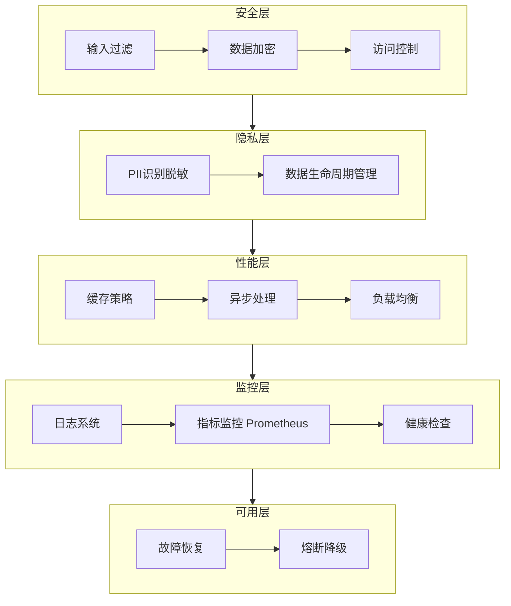
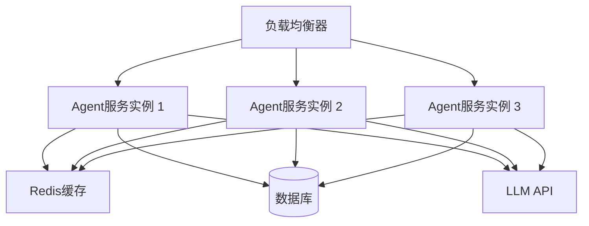

企业级最佳实践
================



## 一、安全合规

### 1.1 输入输出过滤

恶意输入可能导致Prompt注入攻击，需要建立严格的输入输出过滤机制。

```python
import re
from typing import Optional

def sanitize_input(input_text: str) -> str:
    patterns = [
        r'(?i)system\s*prompt',
        r'(?i)ignore.*previous',
        r'(?i)reset.*instructions',
        r'(?i)override.*settings',
    ]
    
    for pattern in patterns:
        input_text = re.sub(pattern, '[REDACTED]', input_text)
    
    return input_text[:4096]

def validate_output(output_text: str) -> Optional[str]:
    forbidden_patterns = [
        r'(?i)execute.*command',
        r'(?i)rm\s*-rf',
        r'(?i)curl.*http',
    ]
    
    for pattern in forbidden_patterns:
        if re.search(pattern, output_text):
            return None
    
    return output_text
```

### 1.2 数据加密与传输安全

```python
from cryptography.fernet import Fernet
from typing import Dict

class SecureDataManager:
    def __init__(self, key: bytes = None):
        self.key = key or Fernet.generate_key()
        self.cipher = Fernet(self.key)
    
    def encrypt_data(self, data: Dict) -> bytes:
        import json
        data_str = json.dumps(data)
        return self.cipher.encrypt(data_str.encode())
    
    def decrypt_data(self, encrypted_data: bytes) -> Dict:
        import json
        data_str = self.cipher.decrypt(encrypted_data).decode()
        return json.loads(data_str)
```

### 1.3 访问控制与权限管理

```python
from enum import Enum
from typing import Set

class Role(Enum):
    ADMIN = "admin"
    USER = "user"
    GUEST = "guest"

class PermissionManager:
    def __init__(self):
        self.permissions: Dict[Role, Set[str]] = {
            Role.ADMIN: {"read", "write", "delete", "configure"},
            Role.USER: {"read", "write"},
            Role.GUEST: {"read"}
        }
    
    def has_permission(self, role: Role, action: str) -> bool:
        return action in self.permissions.get(role, set())
```
（详见 [第10章 - 前沿研究](chapter10-frontier-research/chapter10-frontier-research.md)）

## 二、数据隐私保护

### 2.1 PII数据识别与脱敏

```python
import spacy
from typing import List

class PIIProcessor:
    def __init__(self):
        self.nlp = spacy.load("zh_core_web_sm")
    
    def identify_pii(self, text: str) -> List[Dict]:
        doc = self.nlp(text)
        pii_entities = []
        
        for ent in doc.ents:
            if ent.label_ in ["PERSON", "ORG", "GPE", "PHONE", "EMAIL"]:
                pii_entities.append({
                    "text": ent.text,
                    "label": ent.label_,
                    "start": ent.start_char,
                    "end": ent.end_char
                })
        
        return pii_entities
    
    def anonymize_text(self, text: str) -> str:
        pii_entities = self.identify_pii(text)
        result = text
        
        for entity in sorted(pii_entities, key=lambda x: x["start"], reverse=True):
            replacement = f"[{entity['label']}]"
            result = result[:entity["start"]] + replacement + result[entity["end"]:]
        
        return result
```

### 2.2 数据生命周期管理

```python
from datetime import datetime, timedelta
from typing import Dict, Any

class DataLifecycleManager:
    def __init__(self, retention_days: int = 90):
        self.retention_days = retention_days
    
    def is_expired(self, created_at: datetime) -> bool:
        return datetime.now() - created_at > timedelta(days=self.retention_days)
    
    def purge_expired_data(self, records: List[Dict[str, Any]]) -> List[Dict[str, Any]]:
        return [r for r in records if not self.is_expired(r.get("created_at"))]
```

### 2.3 GDPR与合规检查清单

- [ ] 数据最小化原则
- [ ] 用户同意机制
- [ ] 数据主体权利（访问、更正、删除）
- [ ] 数据保护影响评估（DPIA）
- [ ] 第三方处理器合同
- [ ] 跨境数据传输合规

## 三、成本优化策略

### 3.1 API调用成本监控

```python
from dataclasses import dataclass
from typing import Dict, List
from datetime import datetime

@dataclass
class APICallRecord:
    endpoint: str
    model: str
    tokens_used: int
    cost_usd: float
    timestamp: datetime

class CostMonitor:
    def __init__(self):
        self.records: List[APICallRecord] = []
        self.daily_budget: float = 100.0
    
    def add_record(self, record: APICallRecord):
        self.records.append(record)
    
    def get_daily_cost(self, date: datetime = None) -> float:
        target_date = date or datetime.now()
        day_start = target_date.replace(hour=0, minute=0, second=0)
        day_end = day_start + timedelta(days=1)
        
        return sum(
            r.cost_usd for r in self.records
            if day_start <= r.timestamp < day_end
        )
    
    def is_over_budget(self) -> bool:
        return self.get_daily_cost() >= self.daily_budget
```

### 3.2 模型选择策略

```python
from enum import Enum

class ModelTier(Enum):
    ECONOMY = "economy"
    STANDARD = "standard"
    PREMIUM = "premium"

class ModelSelector:
    def __init__(self):
        self.tier_config = {
            ModelTier.ECONOMY: {"model": "gpt-3.5-turbo", "cost_per_k": 0.0015},
            ModelTier.STANDARD: {"model": "gpt-4", "cost_per_k": 0.03},
            ModelTier.PREMIUM: {"model": "gpt-4-turbo", "cost_per_k": 0.01}
        }
    
    def select_model(self, task_complexity: str) -> str:
        if task_complexity == "simple":
            return self.tier_config[ModelTier.ECONOMY]["model"]
        elif task_complexity == "medium":
            return self.tier_config[ModelTier.STANDARD]["model"]
        else:
            return self.tier_config[ModelTier.PREMIUM]["model"]
```

### 3.3 缓存策略实现

```python
from functools import lru_cache
from typing import Any, Callable

def cached_llm_response(maxsize: int = 1024):
    def decorator(func: Callable) -> Callable:
        @lru_cache(maxsize=maxsize)
        def wrapper(*args, **kwargs):
            return func(*args, **kwargs)
        return wrapper
    return decorator

@cached_llm_response(maxsize=512)
def get_llm_response(prompt: str, model: str) -> str:
    pass
```

## 四、性能调优

### 4.1 请求批处理

```python
from typing import List, Dict, Any
import asyncio

async def batch_process_requests(
    requests: List[Dict[str, Any]],
    batch_size: int = 10
) -> List[Any]:
    results = []
    
    for i in range(0, len(requests), batch_size):
        batch = requests[i:i+batch_size]
        tasks = [process_request(req) for req in batch]
        batch_results = await asyncio.gather(*tasks)
        results.extend(batch_results)
    
    return results
```

### 4.2 异步处理模式

```python
import asyncio
from typing import Coroutine, List

class AsyncTaskManager:
    def __init__(self, max_concurrent: int = 5):
        self.semaphore = asyncio.Semaphore(max_concurrent)
    
    async def execute_with_limit(self, coro: Coroutine) -> Any:
        async with self.semaphore:
            return await coro
    
    async def execute_all(self, coros: List[Coroutine]) -> List[Any]:
        tasks = [self.execute_with_limit(c) for c in coros]
        return await asyncio.gather(*tasks)
```

### 4.3 负载均衡配置

```python
from random import random
from typing import List

class LoadBalancer:
    def __init__(self, endpoints: List[str]):
        self.endpoints = endpoints
        self.weights = [1.0 / len(endpoints)] * len(endpoints)
    
    def select_endpoint(self) -> str:
        r = random()
        cumulative = 0.0
        
        for i, weight in enumerate(self.weights):
            cumulative += weight
            if r < cumulative:
                return self.endpoints[i]
        
        return self.endpoints[-1]
```
（详见 [第6章 - 高级优化](chapter6-advanced-optimization/chapter6-advanced-optimization.md)）

## 五、监控与可观测性

### 5.1 日志系统设计

```python
import logging
from logging.handlers import RotatingFileHandler

def setup_logging():
    logger = logging.getLogger("agent_system")
    logger.setLevel(logging.INFO)
    
    handler = RotatingFileHandler(
        "agent.log",
        maxBytes=10*1024*1024,
        backupCount=5
    )
    
    formatter = logging.Formatter(
        "%(asctime)s - %(name)s - %(levelname)s - %(message)s"
    )
    handler.setFormatter(formatter)
    logger.addHandler(handler)
    
    return logger
```

### 5.2 指标监控

```python
from prometheus_client import Counter, Histogram, Gauge

class MetricsCollector:
    def __init__(self):
        self.requests_total = Counter(
            "agent_requests_total",
            "Total number of requests",
            ["endpoint", "status"]
        )
        
        self.request_duration = Histogram(
            "agent_request_duration_seconds",
            "Request duration in seconds"
        )
        
        self.active_tasks = Gauge(
            "agent_active_tasks",
            "Number of active tasks"
        )
    
    def record_request(self, endpoint: str, status: str, duration: float):
        self.requests_total.labels(endpoint=endpoint, status=status).inc()
        self.request_duration.observe(duration)
```



## 六、高可用性架构

### 6.1 故障恢复机制

```python
from tenacity import retry, stop_after_attempt, wait_exponential

class ResilientClient:
    @retry(
        stop=stop_after_attempt(3),
        wait=wait_exponential(multiplier=1, min=2, max=10)
    )
    async def make_request(self, url: str) -> Any:
        response = await self.http_client.get(url)
        response.raise_for_status()
        return response.json()
```

### 6.2 健康检查端点

```python
from fastapi import FastAPI, Response, status

app = FastAPI()

@app.get("/health")
async def health_check():
    checks = {
        "database": check_database(),
        "api_service": check_api_service(),
        "cache": check_cache()
    }
    
    if all(checks.values()):
        return {"status": "healthy", "checks": checks}
    else:
        return Response(
            status_code=status.HTTP_503_SERVICE_UNAVAILABLE,
            content={"status": "unhealthy", "checks": checks}
        )
```

### 6.3 灾难恢复与备份

Agent系统需要完善的数据备份策略来应对意外故障和数据丢失。以下实现涵盖了备份配置、备份创建、恢复验证和自动清理。

```python
from dataclasses import dataclass
from datetime import datetime, timedelta
from typing import List, Optional, Dict
import json
import os
import shutil

@dataclass
class BackupConfig:
    backup_dir: str = "./backups"
    frequency_hours: int = 24
    retention_days: int = 30
    max_backups: int = 10

class BackupManager:
    def __init__(self, config: BackupConfig):
        self.config = config
        os.makedirs(config.backup_dir, exist_ok=True)

    def create_backup(self, data: Dict) -> str:
        timestamp = datetime.now().strftime("%Y%m%d_%H%M%S")
        filename = f"backup_{timestamp}.json"
        filepath = os.path.join(self.config.backup_dir, filename)

        backup_data = {
            "timestamp": timestamp,
            "data": data
        }

        with open(filepath, "w") as f:
            json.dump(backup_data, f, indent=2)

        self._cleanup_old_backups()
        return filepath

    def restore_backup(self, filepath: str) -> Optional[Dict]:
        if not os.path.exists(filepath):
            return None
        with open(filepath) as f:
            backup_data = json.load(f)
        return backup_data.get("data")

    def list_backups(self) -> List[str]:
        return sorted([
            f for f in os.listdir(self.config.backup_dir)
            if f.startswith("backup_")
        ])

    def verify_backup_integrity(self, filepath: str) -> bool:
        try:
            with open(filepath) as f:
                data = json.load(f)
            return "timestamp" in data and "data" in data
        except (json.JSONDecodeError, FileNotFoundError):
            return False

    def _cleanup_old_backups(self):
        backups = self.list_backups()
        while len(backups) > self.config.max_backups:
            old_backup = backups.pop(0)
            os.remove(os.path.join(self.config.backup_dir, old_backup))
```

## 七、版本管理与发布策略

### 7.1 语义化版本管理

Agent系统需要清晰的版本号管理来追踪功能变更和修复。语义化版本通过 major.minor.patch 三位标识，配合 changelog 记录每次变更内容。

```python
from dataclasses import dataclass
from typing import List, Optional

@dataclass
class Version:
    major: int
    minor: int
    patch: int
    changelog: List[str]

    def __str__(self) -> str:
        return f"{self.major}.{self.minor}.{self.patch}"

    def bump_major(self, changes: List[str]) -> "Version":
        return Version(self.major + 1, 0, 0, changes)

    def bump_minor(self, changes: List[str]) -> "Version":
        return Version(self.major, self.minor + 1, 0, changes)

    def bump_patch(self, changes: List[str]) -> "Version":
        return Version(self.major, self.minor, self.patch + 1, changes)

class VersionTracker:
    def __init__(self):
        self.versions: List[Version] = []

    def add_version(self, version: Version):
        self.versions.append(version)

    def get_latest(self) -> Optional[Version]:
        return self.versions[-1] if self.versions else None

    def get_changelog(self, from_version: str, to_version: str) -> List[str]:
        logs = []
        capturing = False
        for v in self.versions:
            if str(v) == from_version:
                capturing = True
                continue
            if capturing:
                logs.extend(v.changelog)
            if str(v) == to_version:
                break
        return logs
```

### 7.2 灰度发布与回滚

灰度发布允许将新版本逐步开放给部分用户，降低发布风险。以下实现支持按流量比例分配、健康检查监控和自动回滚。

```python
from dataclasses import dataclass
from typing import Optional
import random

@dataclass
class CanaryConfig:
    canary_percentage: int = 10
    stable_percentage: int = 90
    health_check_interval: int = 60
    rollback_threshold: float = 0.05

class CanaryReleaseManager:
    def __init__(self, config: CanaryConfig):
        self.config = config
        self.canary_version: Optional[str] = None
        self.stable_version: Optional[str] = None
        self.canary_failures: int = 0
        self.canary_requests: int = 0

    def route_request(self) -> str:
        r = random.randint(1, 100)
        if r <= self.config.canary_percentage:
            return "canary"
        return "stable"

    def record_canary_result(self, success: bool):
        self.canary_requests += 1
        if not success:
            self.canary_failures += 1

    def should_rollback(self) -> bool:
        if self.canary_requests == 0:
            return False
        error_rate = self.canary_failures / self.canary_requests
        return error_rate > self.config.rollback_threshold

    def promote_to_stable(self):
        self.stable_version = self.canary_version
        self.canary_version = None
        self.canary_failures = 0
        self.canary_requests = 0

    def rollback(self):
        self.canary_version = None
        self.canary_failures = 0
        self.canary_requests = 0
        return self.stable_version
```

## 八、告警体系与值班响应

### 8.1 告警规则设计

建立分级告警体系，P0-P3 四个级别对应不同的响应时效和处理流程。每条告警规则包含指标名称、触发条件和持续时长。

```python
from dataclasses import dataclass
from enum import Enum
from typing import List

class AlertLevel(Enum):
    P0 = "critical"
    P1 = "high"
    P2 = "medium"
    P3 = "low"

@dataclass
class AlertRule:
    name: str
    level: AlertLevel
    metric: str
    condition: str
    threshold: float
    duration_seconds: int

class AlertRuleEngine:
    def __init__(self):
        self.rules: List[AlertRule] = []

    def add_rule(self, rule: AlertRule):
        self.rules.append(rule)

    def evaluate(self, metric_name: str, value: float) -> List[AlertRule]:
        triggered = []
        for rule in self.rules:
            if rule.metric == metric_name:
                if rule.condition == "gt" and value > rule.threshold:
                    triggered.append(rule)
                elif rule.condition == "lt" and value < rule.threshold:
                    triggered.append(rule)
                elif rule.condition == "eq" and value == rule.threshold:
                    triggered.append(rule)
        return triggered
```

### 8.2 告警通知与值班表

告警管理器支持多渠道通知（邮件、Webhook）和值班人员排班管理，确保告警能够及时触达到正确的响应人员。

```python
from dataclasses import dataclass
from typing import List, Dict, Optional
from datetime import datetime
import json

@dataclass
class OnCallPerson:
    name: str
    email: str
    phone: str

@dataclass
class OnCallSchedule:
    team: str
    current: OnCallPerson
    backup: OnCallPerson
    start_time: datetime
    end_time: datetime

class AlertManager:
    def __init__(self):
        self.channels: Dict[str, List[str]] = {}
        self.schedules: List[OnCallSchedule] = []

    def add_channel(self, name: str, endpoints: List[str]):
        self.channels[name] = endpoints

    def send_alert(self, level: AlertLevel, message: str, metric_value: float = 0.0):
        for channel_name, endpoints in self.channels.items():
            if channel_name == "email":
                self._send_email(endpoints, level, message, metric_value)
            elif channel_name == "webhook":
                self._send_webhook(endpoints, level, message, metric_value)

    def _send_email(self, endpoints: List[str], level: AlertLevel, message: str, value: float):
        for endpoint in endpoints:
            print(f"[EMAIL] To: {endpoint}, Level: {level.value}, Msg: {message}, Value: {value}")

    def _send_webhook(self, endpoints: List[str], level: AlertLevel, message: str, value: float):
        payload = {"level": level.value, "message": message, "value": value}
        for endpoint in endpoints:
            print(f"[WEBHOOK] POST {endpoint}, Payload: {json.dumps(payload)}")

    def add_schedule(self, schedule: OnCallSchedule):
        self.schedules.append(schedule)

    def get_current_oncall(self) -> Optional[OnCallPerson]:
        now = datetime.now()
        for schedule in self.schedules:
            if schedule.start_time <= now <= schedule.end_time:
                return schedule.current
        return None

    def escalate_if_unresolved(self, alert_id: str, timeout_minutes: int = 15):
        current = self.get_current_oncall()
        if current:
            print(f"[ESCALATION] Alert {alert_id} not resolved in {timeout_minutes} minutes")
```

## 九、多环境管理与CI/CD

### 9.1 多环境策略

合理的多环境管理是保障Agent服务稳定性的基础。开发、预发布和生产环境需要不同的资源配置和隔离策略。使用 Pydantic 模型实现配置的强类型验证。

```python
from pydantic import BaseModel
from typing import Dict, Optional
from enum import Enum

class EnvironmentType(str, Enum):
    DEV = "dev"
    STAGING = "staging"
    PRODUCTION = "production"

class DatabaseConfig(BaseModel):
    host: str
    port: int = 5432
    username: str
    password: str
    database: str
    pool_size: int = 10

class LLMConfig(BaseModel):
    provider: str
    model: str
    api_key: str
    max_tokens: int = 4096
    temperature: float = 0.7

class EnvironmentConfig(BaseModel):
    name: EnvironmentType
    debug: bool = False
    database: DatabaseConfig
    llm: LLMConfig
    log_level: str = "INFO"
    rate_limit: int = 100

class ConfigManager:
    def __init__(self):
        self.configs: Dict[EnvironmentType, EnvironmentConfig] = {}

    def register_environment(self, config: EnvironmentConfig):
        self.configs[config.name] = config

    def get_config(self, env: EnvironmentType) -> Optional[EnvironmentConfig]:
        return self.configs.get(env)

    def get_active_config(self, env_name: str) -> Optional[EnvironmentConfig]:
        for env_type in EnvironmentType:
            if env_type.value == env_name:
                return self.get_config(env_type)
        return None
```

### 9.2 CI/CD流水线

使用 GitHub Actions 实现自动化流水线，包含代码检查、测试、构建和部署阶段。不同分支触发不同环境的部署流程。

```yaml
name: Agent CI/CD Pipeline

on:
  push:
    branches: [main, develop]
  pull_request:
    branches: [main]

jobs:
  lint:
    runs-on: ubuntu-latest
    steps:
      - uses: actions/checkout@v4
      - name: Set up Python
        uses: actions/setup-python@v5
        with:
          python-version: "3.11"
      - name: Install dependencies
        run: pip install ruff
      - name: Lint with ruff
        run: ruff check .

  test:
    needs: lint
    runs-on: ubuntu-latest
    steps:
      - uses: actions/checkout@v4
      - name: Set up Python
        uses: actions/setup-python@v5
        with:
          python-version: "3.11"
      - name: Install test dependencies
        run: pip install pytest pytest-cov
      - name: Run tests
        run: pytest tests/ -v --cov=agent --cov-report=xml

  build:
    needs: test
    runs-on: ubuntu-latest
    steps:
      - uses: actions/checkout@v4
      - name: Log in to registry
        uses: docker/login-action@v3
        with:
          registry: registry.example.com
          username: ${{ secrets.REGISTRY_USER }}
          password: ${{ secrets.REGISTRY_PASS }}
      - name: Build and push Docker image
        uses: docker/build-push-action@v5
        with:
          push: true
          tags: registry.example.com/agent-service:${{ github.sha }}

  deploy_staging:
    needs: build
    runs-on: ubuntu-latest
    if: github.ref == 'refs/heads/develop'
    steps:
      - name: Deploy to staging
        run: |
          kubectl set image deployment/agent-service \
            agent-service=registry.example.com/agent-service:${{ github.sha }} \
            --namespace=staging

  deploy_production:
    needs: build
    runs-on: ubuntu-latest
    if: github.ref == 'refs/heads/main'
    steps:
      - name: Deploy to production
        run: |
          kubectl set image deployment/agent-service \
            agent-service=registry.example.com/agent-service:${{ github.sha }} \
            --namespace=production
```

## 十、SLA/SLO设计

### 10.1 SLA指标定义

SLA是对外承诺的服务质量标准，SLO是内部追求的量化目标。Agent系统需要关注可用性、延迟、准确率等核心指标。

```python
from dataclasses import dataclass
from typing import Dict, List, Optional
from datetime import datetime, timedelta

@dataclass
class SLOTarget:
    name: str
    target_percentage: float
    window_days: int

class SLOMonitor:
    def __init__(self):
        self.targets: List[SLOTarget] = []
        self.violations: List[Dict] = []

    def add_target(self, target: SLOTarget):
        self.targets.append(target)

    def check_slo(self, target_name: str, current_value: float) -> bool:
        for target in self.targets:
            if target.name == target_name:
                met = current_value >= target.target_percentage
                if not met:
                    self.violations.append({
                        "target": target_name,
                        "value": current_value,
                        "threshold": target.target_percentage,
                        "timestamp": datetime.now().isoformat()
                    })
                return met
        return False

    def get_violation_rate(self, days: int = 30) -> float:
        cutoff = datetime.now() - timedelta(days=days)
        recent = [v for v in self.violations if v["timestamp"] > cutoff.isoformat()]
        return len(recent) / max(len(self.violations), 1)

    def get_slo_report(self, days: int = 30) -> Dict:
        cutoff = datetime.now() - timedelta(days=days)
        recent_violations = [
            v for v in self.violations
            if v["timestamp"] > cutoff.isoformat()
        ]
        return {
            "period_days": days,
            "total_violations": len(recent_violations),
            "violations": recent_violations
        }
```

### 10.2 服务质量度量

通过滑动窗口计算服务质量指标，支持 P99 延迟、平均延迟和 SLO 达标率的实时计算。

```python
from collections import deque
from dataclasses import dataclass, field
from typing import Deque, Optional

@dataclass
class ServiceLevelIndicator:
    name: str
    window_size: int = 1000
    _samples: Deque[bool] = field(default_factory=lambda: deque(maxlen=1000))

    def record_success(self):
        self._samples.append(True)

    def record_failure(self):
        self._samples.append(False)

    def current_slo(self) -> float:
        if not self._samples:
            return 1.0
        successes = sum(1 for s in self._samples if s)
        return successes / len(self._samples)

    def is_breaching(self, threshold: float) -> bool:
        return self.current_slo() < threshold

class SlidingWindowCalculator:
    def __init__(self, window_minutes: int = 5):
        self.window: Deque[float] = deque(maxlen=window_minutes * 60)

    def add_datapoint(self, latency_ms: float):
        self.window.append(latency_ms)

    def p99_latency(self) -> Optional[float]:
        if not self.window:
            return None
        sorted_data = sorted(self.window)
        index = int(len(sorted_data) * 0.99)
        return sorted_data[index]

    def average_latency(self) -> Optional[float]:
        if not self.window:
            return None
        return sum(self.window) / len(self.window)

    def error_budget_remaining(self, slo_target: float) -> float:
        current = 1.0
        if self.window:
            successes = sum(1 for _ in range(len(self.window)))
            current = successes / len(self.window)
        return max(0.0, current - slo_target)
```

## 实践练习

1. 实现一个完整的安全输入过滤系统
2. 设计一个成本监控仪表盘
3. 搭建一个高可用性的Agent服务架构
4. 编写数据隐私合规检查工具
5. 实现请求缓存和批处理优化
6. 构建一个完整的灰度发布流程
7. 设计一套多级告警规则并实现通知机制
8. 为Agent服务配置CI/CD流水线
9. 实现基于滑动窗口的SLO监控