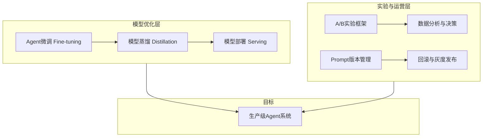
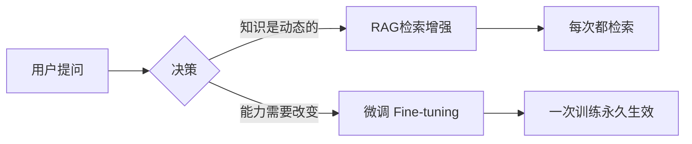
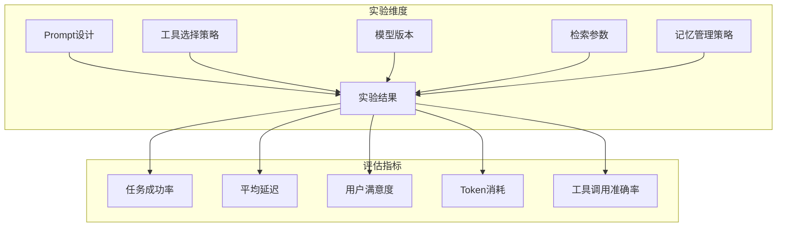
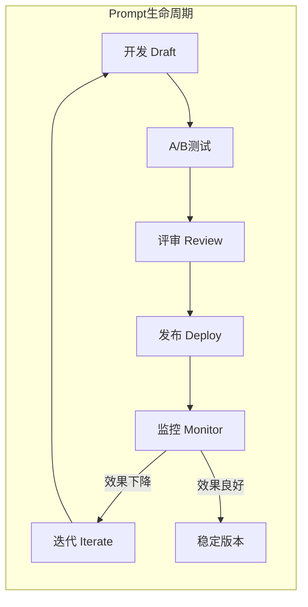

# 第十三章：高级技术补充

## 📖 章节概述

本章是对Agent开发课程的深度扩展，聚焦于将Agent从"能用"提升到"好用"所必需的高级工程技术。你将学习Agent微调、模型蒸馏、A/B实验框架和Prompt版本管理四大核心主题，掌握生产级Agent系统的精细化运营方法。

**学习时长**：2-3周
**难度等级**：⭐⭐⭐⭐⭐ 专家级
**核心技能**：模型微调、知识蒸馏、A/B实验设计、Prompt版本管理

---



---

## 一、Agent微调（Fine-tuning）

### 1.1 微调基础概念

微调（Fine-tuning）是指在预训练模型的基础上，使用特定领域的数据进行额外训练，使模型更好地适应特定任务。在Agent场景中，微调可以让模型理解特定的工具调用格式、遵循特定的行为规范、以及掌握领域专业知识。

**为什么需要微调：**

| 维度 | 不微调 | 微调后 |
|------|--------|--------|
| 工具调用准确率 | ~70% | ~95% |
| 输出格式一致性 | 不稳定 | 高度一致 |
| 领域知识深度 | 通用、表面 | 专业、深入 |
| Token消耗 | 高（需大量Prompt说明） | 低（已内化为模型知识） |
| 响应延迟 | 高 | 低 |

**微调 vs 预训练对比：**

```python
"""
┌──────────────────────────────────────────────────────────────┐
│                    训练阶段对比                                │
├──────────────┬───────────────────┬───────────────────────────┤
│    维度      │      预训练        │        微调               │
├──────────────┼───────────────────┼───────────────────────────┤
│  数据规模    │  数TB级语料        │  数千~数万条样本           │
│  计算资源    │  数千GPU·月        │  数GPU·小时               │
│  训练目标    │  语言建模          │  任务适配                  │
│  知识来源    │  互联网公开数据    │  领域专有数据              │
│  泛化能力    │  强（通用知识）    │  专（任务优化）            │
└──────────────┴───────────────────┴───────────────────────────┘
"""
```

**微调 vs RAG对比：**



| 维度 | 微调 Fine-tuning | RAG |
|------|------------------|-----|
| 适用场景 | 改变模型行为/风格/格式 | 注入外部动态知识 |
| 成本 | 一次性训练成本 | 每次推理的检索成本 |
| 更新频率 | 低频（数天~数周） | 实时 |
| 知识新鲜度 | 取决于训练数据 | 取决于知识库 |
| 可解释性 | 低（黑盒） | 高（可溯源） |
| 组合使用 | ✅ 微调+RAG是最佳实践 | ✅ |

### 1.2 微调数据准备

**对话格式数据：**

```python
def prepare_chat_format_data(dialogues: list) -> list:
    formatted_data = []
    
    for dialogue in dialogues:
        messages = []
        for turn in dialogue["conversation"]:
            messages.append({
                "role": turn["role"],
                "content": turn["content"]
            })
        formatted_data.append({"messages": messages})
    
    return formatted_data
```

**指令格式数据（适合Agent工具调用场景）：**

```python
def prepare_instruction_format_data(samples: list) -> list:
    formatted_data = []
    
    for sample in samples:
        formatted = {
            "messages": [
                {"role": "system", "content": sample["system_prompt"]},
                {"role": "user", "content": sample["user_input"]},
                {"role": "assistant", "content": sample["expected_output"]}
            ]
        }
        formatted_data.append(formatted)
    
    return formatted_data


agent_tool_calling_samples = [
    {
        "system_prompt": """你是一个智能助手，可以使用以下工具：
1. search_web(query: str) - 搜索互联网信息
2. calculator(expression: str) - 执行数学计算
3. get_weather(city: str) - 获取天气信息

当需要进行工具调用时，以以下格式输出：
<tool_calls>
<tool name="工具名">
<param name="参数名">参数值</param>
</tool>
</tool_calls>""",
        "user_input": "北京今天天气怎么样？",
        "expected_output": """<tool_calls>
<tool name="get_weather">
<param name="city">北京</param>
</tool>
</tool_calls>"""
    },
    {
        "system_prompt": "你是一个智能助手，可以使用search_web、calculator、get_weather工具。",
        "user_input": "帮我计算 156 * 23 等于多少",
        "expected_output": """<tool_calls>
<tool name="calculator">
<param name="expression">156 * 23</param>
</tool>
</tool_calls>"""
    },
]
```

**数据清洗与增强：**

```python
import re
from typing import List, Dict

class FineTuningDataProcessor:
    
    def __init__(self):
        self.quality_threshold = 0.7
    
    def clean_data(self, raw_data: List[Dict]) -> List[Dict]:
        cleaned = []
        
        for item in raw_data:
            item = self.remove_empty_messages(item)
            if item is None:
                continue
            
            item = self.normalize_whitespace(item)
            item = self.truncate_long_content(item, max_length=4096)
            item = self.remove_pii(item)
            item = self.validate_format(item)
            
            if item:
                cleaned.append(item)
        
        return cleaned
    
    def remove_empty_messages(self, item: Dict) -> Dict:
        if "messages" not in item:
            return None
        
        item["messages"] = [
            msg for msg in item["messages"]
            if msg.get("content", "").strip()
        ]
        
        return item if len(item["messages"]) >= 2 else None
    
    def normalize_whitespace(self, item: Dict) -> Dict:
        for msg in item.get("messages", []):
            if "content" in msg:
                msg["content"] = re.sub(r'\n{3,}', '\n\n', msg["content"])
                msg["content"] = msg["content"].strip()
        return item
    
    def truncate_long_content(self, item: Dict, max_length: int) -> Dict:
        for msg in item.get("messages", []):
            content = msg.get("content", "")
            if len(content) > max_length:
                msg["content"] = content[:max_length] + "..."
                msg["truncated"] = True
        return item
    
    def remove_pii(self, item: Dict) -> Dict:
        pii_patterns = {
            'email': r'[\w\.-]+@[\w\.-]+\.\w+',
            'phone': r'\b\d{3}[-.]?\d{4}[-.]?\d{4}\b',
            'id_card': r'\b\d{17}[\dXx]\b',
        }
        
        for msg in item.get("messages", []):
            content = msg.get("content", "")
            for pii_type, pattern in pii_patterns.items():
                content = re.sub(pattern, f'[REDACTED_{pii_type.upper()}]', content)
            msg["content"] = content
        
        return item
    
    def validate_format(self, item: Dict) -> Dict:
        messages = item.get("messages", [])
        
        if not messages:
            return None
        
        valid_roles = {"system", "user", "assistant", "tool", "function"}
        for msg in messages:
            if "role" not in msg or "content" not in msg:
                return None
            if msg["role"] not in valid_roles:
                return None
        
        if messages[-1]["role"] != "assistant":
            return None
        
        return item
```

### 1.3 使用OpenAI Fine-tuning API

```python
import os
import json
import time
from typing import Dict, Optional
from openai import OpenAI

class OpenAIFineTuner:
    
    def __init__(self, api_key: str = None):
        self.client = OpenAI(api_key=api_key or os.getenv("OPENAI_API_KEY"))
        self.job_statuses: Dict[str, str] = {}
    
    def upload_training_file(self, data: list, filename: str = "training_data.jsonl") -> str:
        jsonl_content = "\n".join(json.dumps(item, ensure_ascii=False) for item in data)
        
        temp_path = f"/tmp/{filename}"
        with open(temp_path, "w", encoding="utf-8") as f:
            f.write(jsonl_content)
        
        with open(temp_path, "rb") as f:
            response = self.client.files.create(
                file=f,
                purpose="fine-tune"
            )
        
        file_id = response.id
        print(f"文件已上传: {file_id}")
        print(f"总样本数: {len(data)}")
        
        return file_id
    
    def create_fine_tune_job(
        self,
        training_file_id: str,
        model: str = "gpt-4o-mini-2024-07-18",
        suffix: str = "agent-fine-tuned",
        n_epochs: int = 3,
        batch_size: int = 1,
        learning_rate_multiplier: float = 1.0,
        validation_file_id: Optional[str] = None
    ) -> str:
        
        hyperparameters = {
            "n_epochs": n_epochs,
            "batch_size": batch_size,
            "learning_rate_multiplier": learning_rate_multiplier,
        }
        
        kwargs = {
            "model": model,
            "training_file": training_file_id,
            "suffix": suffix,
            "hyperparameters": hyperparameters,
        }
        
        if validation_file_id:
            kwargs["validation_file"] = validation_file_id
        
        response = self.client.fine_tuning.jobs.create(**kwargs)
        
        job_id = response.id
        self.job_statuses[job_id] = response.status
        print(f"微调任务已创建: {job_id}")
        print(f"基础模型: {model}")
        print(f"状态: {response.status}")
        
        return job_id
    
    def monitor_job(self, job_id: str) -> Dict:
        
        while True:
            job = self.client.fine_tuning.jobs.retrieve(job_id)
            status = job.status
            self.job_statuses[job_id] = status
            
            metrics = {}
            if hasattr(job, 'result_files') and job.result_files:
                metrics["result_files"] = list(job.result_files)
            
            if hasattr(job, 'trained_tokens'):
                metrics["trained_tokens"] = job.trained_tokens
            
            print(f"\r状态: {status} | 训练Tokens: {metrics.get('trained_tokens', 'N/A')}", end="")
            
            if status in ["succeeded", "failed", "cancelled"]:
                print()
                
                if status == "succeeded":
                    model_name = job.fine_tuned_model
                    print(f"✅ 微调成功！模型: {model_name}")
                    
                    return {
                        "status": "succeeded",
                        "model_name": model_name,
                        "job_id": job_id,
                        "metrics": metrics
                    }
                else:
                    print(f"❌ 微调{status}: {getattr(job, 'error', 'Unknown error')}")
                    return {
                        "status": status,
                        "error": str(getattr(job, 'error', {})),
                        "job_id": job_id
                    }
            
            time.sleep(30)
    
    def list_jobs(self, limit: int = 10) -> list:
        jobs = self.client.fine_tuning.jobs.list(limit=limit)
        return [
            {
                "id": job.id,
                "model": job.model,
                "status": job.status,
                "fine_tuned_model": getattr(job, "fine_tuned_model", None),
                "created_at": job.created_at,
            }
            for job in jobs.data
        ]
    
    def test_fine_tuned_model(self, model_name: str, test_cases: list) -> Dict:
        results = {
            "model": model_name,
            "total": len(test_cases),
            "passed": 0,
            "failed": 0,
            "details": []
        }
        
        for i, case in enumerate(test_cases):
            try:
                response = self.client.chat.completions.create(
                    model=model_name,
                    messages=case["messages"],
                    max_tokens=case.get("max_tokens", 512),
                    temperature=case.get("temperature", 0.0)
                )
                
                actual = response.choices[0].message.content
                expected = case["expected_keywords"]
                
                passed = all(
                    keyword.lower() in actual.lower()
                    for keyword in expected
                )
                
                result = {
                    "case_id": i,
                    "passed": passed,
                    "actual": actual,
                    "expected_keywords": expected
                }
                
                if passed:
                    results["passed"] += 1
                else:
                    results["failed"] += 1
                
                results["details"].append(result)
                
            except Exception as e:
                results["details"].append({
                    "case_id": i,
                    "passed": False,
                    "error": str(e)
                })
                results["failed"] += 1
            
            time.sleep(0.5)
        
        results["accuracy"] = results["passed"] / max(results["total"], 1)
        return results


```

### 1.4 LoRA/QLoRA高效微调

LoRA（Low-Rank Adaptation）和QLoRA（Quantized LoRA）是高效微调方法，通过在冻结的原始权重旁添加低秩矩阵来适配模型，大幅降低显存和计算需求。

```python
# 需要安装: pip install transformers peft accelerate bitsandbytes datasets

from peft import (
    LoraConfig,
    get_peft_model,
    TaskType,
    prepare_model_for_kbit_training,
    PeftModel,
    PeftConfig
)
from transformers import (
    AutoModelForCausalLM,
    AutoTokenizer,
    TrainingArguments,
    Trainer,
    DataCollatorForLanguageModeling,
    BitsAndBytesConfig
)
from datasets import Dataset
import torch
from typing import Dict, List, Optional

class LoRATrainer:
    
    def __init__(
        self,
        base_model_name: str = "meta-llama/Llama-3-8B",
        use_qlora: bool = True,
        device_map: str = "auto"
    ):
        self.base_model_name = base_model_name
        self.use_qlora = use_qlora
        self.device_map = device_map
        self.model = None
        self.tokenizer = None
        self.peft_model = None
    
    def load_model_and_tokenizer(self):
        
        if self.use_qlora:
            bnb_config = BitsAndBytesConfig(
                load_in_4bit=True,
                bnb_4bit_quant_type="nf4",
                bnb_4bit_compute_dtype=torch.bfloat16,
                bnb_4bit_use_double_quant=True,
            )
            
            self.model = AutoModelForCausalLM.from_pretrained(
                self.base_model_name,
                quantization_config=bnb_config,
                device_map=self.device_map,
                trust_remote_code=True,
            )
            
            self.model = prepare_model_for_kbit_training(self.model)
        else:
            self.model = AutoModelForCausalLM.from_pretrained(
                self.base_model_name,
                torch_dtype=torch.bfloat16,
                device_map=self.device_map,
                trust_remote_code=True,
            )
        
        self.tokenizer = AutoTokenizer.from_pretrained(
            self.base_model_name,
            trust_remote_code=True,
        )
        
        if self.tokenizer.pad_token is None:
            self.tokenizer.pad_token = self.tokenizer.eos_token
        
        print(f"模型加载完成: {self.base_model_name}")
        print(f"QLoRA模式: {self.use_qlora}")
        print(f"设备: {self.model.device}")
    
    def configure_lora(self, lora_config: Optional[Dict] = None) -> LoraConfig:
        
        default_config = {
            "r": 16,
            "lora_alpha": 32,
            "target_modules": ["q_proj", "k_proj", "v_proj", "o_proj",
                              "gate_proj", "up_proj", "down_proj"],
            "lora_dropout": 0.05,
            "bias": "none",
            "task_type": TaskType.CAUSAL_LM,
        }
        
        if lora_config:
            default_config.update(lora_config)
        
        config = LoraConfig(**default_config)
        
        self.peft_model = get_peft_model(self.model, config)
        self.peft_model.print_trainable_parameters()
        
        return config
    
    def prepare_dataset(
        self,
        data: List[Dict],
        max_length: int = 2048,
        train_test_split: float = 0.9
    ) -> tuple:
        
        def format_example(example):
            messages = example["messages"]
            text = self.tokenizer.apply_chat_template(
                messages,
                tokenize=False,
                add_generation_prompt=False
            )
            return {"text": text}
        
        formatted_data = [format_example(d) for d in data]
        dataset = Dataset.from_list(formatted_data)
        
        def tokenize_function(examples):
            result = self.tokenizer(
                examples["text"],
                truncation=True,
                max_length=max_length,
                padding=False,
            )
            result["labels"] = result["input_ids"].copy()
            return result
        
        tokenized_dataset = dataset.map(
            tokenize_function,
            batched=True,
            remove_columns=dataset.column_names,
        )
        
        split_dataset = tokenized_dataset.train_test_split(
            test_size=1 - train_test_split
        )
        
        return split_dataset["train"], split_dataset["test"]
    
    def get_training_args(
        self,
        output_dir: str = "./lora_output",
        learning_rate: float = 2e-4,
        per_device_train_batch_size: int = 4,
        gradient_accumulation_steps: int = 4,
        num_train_epochs: int = 3,
        logging_steps: int = 10,
        save_steps: int = 100,
        eval_steps: int = 100,
        warmup_ratio: float = 0.03,
        lr_scheduler_type: str = "cosine",
        fp16: bool = True,
        **kwargs
    ) -> TrainingArguments:
        
        return TrainingArguments(
            output_dir=output_dir,
            per_device_train_batch_size=per_device_train_batch_size,
            per_device_eval_batch_size=per_device_train_batch_size,
            gradient_accumulation_steps=gradient_accumulation_steps,
            learning_rate=learning_rate,
            num_train_epochs=num_train_epochs,
            logging_steps=logging_steps,
            save_steps=save_steps,
            eval_steps=eval_steps,
            evaluation_strategy="steps",
            save_strategy="steps",
            load_best_model_at_end=True,
            metric_for_best_model="eval_loss",
            warmup_ratio=warmup_ratio,
            lr_scheduler_type=lr_scheduler_type,
            fp16=fp16,
            report_to="none",
            **kwargs
        )
    
    def train(
        self,
        train_dataset,
        eval_dataset,
        training_args: TrainingArguments
    ):
        
        data_collator = DataCollatorForLanguageModeling(
            tokenizer=self.tokenizer,
            mlm=False,
        )
        
        if self.peft_model is None:
            raise ValueError("请先调用 configure_lora() 配置LoRA")
        
        trainer = Trainer(
            model=self.peft_model,
            args=training_args,
            data_collator=data_collator,
            train_dataset=train_dataset,
            eval_dataset=eval_dataset,
        )
        
        print("开始LoRA微调训练...")
        trainer.train()
        
        return trainer
    
    def save_model(self, save_path: str, trainer: Trainer = None):
        if self.peft_model is None:
            raise ValueError("没有可保存的模型")
        
        self.peft_model.save_pretrained(save_path)
        self.tokenizer.save_pretrained(save_path)
        print(f"LoRA权重已保存至: {save_path}")
    
    def merge_and_save(self, save_path: str):
        merged_model = self.peft_model.merge_and_unload()
        merged_model.save_pretrained(save_path)
        self.tokenizer.save_pretrained(save_path)
        print(f"合并后的完整模型已保存至: {save_path}")
    
    @staticmethod
    def load_lora_model(base_model_name: str, lora_path: str, use_qlora: bool = True):
        
        if use_qlora:
            bnb_config = BitsAndBytesConfig(
                load_in_4bit=True,
                bnb_4bit_quant_type="nf4",
                bnb_4bit_compute_dtype=torch.bfloat16,
                bnb_4bit_use_double_quant=True,
            )
            base_model = AutoModelForCausalLM.from_pretrained(
                base_model_name,
                quantization_config=bnb_config,
                device_map="auto",
            )
        else:
            base_model = AutoModelForCausalLM.from_pretrained(
                base_model_name,
                torch_dtype=torch.bfloat16,
                device_map="auto",
            )
        
        model = PeftModel.from_pretrained(base_model, lora_path)
        tokenizer = AutoTokenizer.from_pretrained(lora_path)
        
        return model, tokenizer


print("LoRA/QLoRA微调框架就绪")
```
（详见 [第6章 - 高级优化](chapter6-advanced-optimization/chapter6-advanced-optimization.md)）

### 1.5 微调效果评估

```python
import numpy as np
from typing import Dict, List, Callable
from dataclasses import dataclass

@dataclass
class EvaluationMetrics:
    
    accuracy: float
    tool_call_precision: float
    tool_call_recall: float
    latency_ms: float
    token_efficiency: float

class FineTuningEvaluator:
    
    def __init__(self, base_model_func: Callable, fine_tuned_model_func: Callable):
        self.base_model = base_model_func
        self.fine_tuned_model = fine_tuned_model_func
    
    def evaluate_comprehensive(
        self,
        test_cases: List[Dict]
    ) -> Dict[str, EvaluationMetrics]:
        
        results = {}
        
        for model_name, model_func in [
            ("base", self.base_model),
            ("fine_tuned", self.fine_tuned_model)
        ]:
            metrics = self._evaluate_model(model_name, model_func, test_cases)
            results[model_name] = metrics
        
        improvement = self._calculate_improvement(results["base"], results["fine_tuned"])
        results["improvement"] = improvement
        
        return results
    
    def _evaluate_model(
        self,
        model_name: str,
        model_func: Callable,
        test_cases: List[Dict]
    ) -> EvaluationMetrics:
        
        correct = 0
        tool_precisions = []
        tool_recalls = []
        latencies = []
        token_counts = []
        
        for case in test_cases:
            result = model_func(case["messages"])
            
            if self._check_answer_correct(result["output"], case["expected"]):
                correct += 1
            
            if "expected_tools" in case:
                tp = self._count_tool_matches(result["output"], case["expected_tools"])
                precision = tp / max(len(self._extract_tools(result["output"])), 1)
                recall = tp / max(len(case["expected_tools"]), 1)
                tool_precisions.append(precision)
                tool_recalls.append(recall)
            
            latencies.append(result["latency_ms"])
            token_counts.append(result["tokens_used"])
        
        n = len(test_cases)
        
        return EvaluationMetrics(
            accuracy=correct / n,
            tool_call_precision=np.mean(tool_precisions) if tool_precisions else 0,
            tool_call_recall=np.mean(tool_recalls) if tool_recalls else 0,
            latency_ms=np.mean(latencies),
            token_efficiency=sum(token_counts) / n
        )
    
    def _check_answer_correct(self, output: str, expected_keywords: List[str]) -> bool:
        return all(kw.lower() in output.lower() for kw in expected_keywords)
    
    def _extract_tools(self, output: str) -> List[str]:
        return re.findall(r'<tool name="([^"]+)"', output)
    
    def _count_tool_matches(self, output: str, expected_tools: List[str]) -> int:
        extracted = set(self._extract_tools(output))
        return len(extracted & set(expected_tools))
    
    def _calculate_improvement(
        self,
        base: EvaluationMetrics,
        fine_tuned: EvaluationMetrics
    ) -> Dict[str, float]:
        def safe_diff(new, old):
            return (new - old) / max(abs(old), 1e-8) * 100
        
        return {
            "accuracy_improvement_pct": safe_diff(fine_tuned.accuracy, base.accuracy),
            "latency_reduction_pct": safe_diff(base.latency_ms, fine_tuned.latency_ms),
            "token_efficiency_improvement_pct": safe_diff(base.token_efficiency, fine_tuned.token_efficiency),
        }

print("微调效果评估框架就绪")
```

### 🎯 实践练习

1. 准备100条以上Agent工具调用格式的微调数据，确保覆盖不同的工具和场景
2. 使用OpenAI Fine-tuning API完成一个微调任务，对比微调前后模型在工具调用上的准确率差异
3. 在本地环境使用QLoRA对Qwen2-7B等开源模型进行Agent能力微调
4. 设计评估方案：从准确率、格式一致性、延迟、Token效率四个维度量化微调效果
5. 尝试微调+RAG联合使用：用微调塑造Agent行为，用RAG注入实时知识

---

## 二、模型蒸馏（Knowledge Distillation）

### 2.1 蒸馏概念

模型蒸馏（Knowledge Distillation）是Hinton于2015年提出的技术，核心思想是将大模型（教师模型）学到的"暗知识"迁移到小模型（学生模型）中。在Agent场景中，蒸馏可以让一个轻量级的Agent模型获得接近大模型的表现。

```mermaid
flowchart TB
    subgraph 教师模型 Teacher
        TD[大规模输入] --> TL[Transformer 70B+]
        TL --> TS[软标签 Soft Labels]
        TL --> TH[硬标签 Hard Labels]
    end
    subgraph 学生模型 Student
        SD[相同输入] --> SL[Transformer 7B]
        SL --> SO[学生输出]
    end
    TS -->|KL散度| KL[KL Divergence Loss]
    TH -->|交叉熵| CE[Cross Entropy Loss]
    KL --> TLOSS[总损失 = α·软损失 + (1-α)·硬损失]
    CE --> TLOSS
    TLOSS -->|反向传播| SL
```

**蒸馏的核心价值：**

| 维度 | 教师模型 (GPT-4) | 学生模型 (蒸馏后7B) |
|------|-----------------|-------------------|
| 模型大小 | ~1.7T参数 | ~7B参数 |
| 推理延迟 | ~2000ms | ~200ms |
| 部署成本 | $0.03/1K tokens | $0.0002/1K tokens |
| 离线部署 | ❌ 需要API | ✅ 本地运行 |
| Agent准确率 | 95% | 88% |

### 2.2 蒸馏方法分类

```python
"""
┌────────────────────────────────────────────────────────────┐
│                    蒸馏方法对比                              │
├──────────────┬──────────────────┬─────────────────────────┤
│   蒸馏类型    │    蒸馏目标       │       适用场景           │
├──────────────┼──────────────────┼─────────────────────────┤
│ 输出蒸馏      │ 最终输出概率分布   │ 文本生成、分类任务       │
│ 特征蒸馏      │ 中间层隐状态      │ 需要对齐内部表示的任务   │
│ 注意力蒸馏    │ 注意力权重矩阵    │ 需要保持推理过程一致性   │
│ 序贯蒸馏      │ 逐步迁移知识      │ 超大规模教师模型         │
└──────────────┴──────────────────┴─────────────────────────┘
"""
```

### 2.3 知识蒸馏完整实现

```python
import torch
import torch.nn as nn
import torch.nn.functional as F
from torch.utils.data import DataLoader, Dataset
from transformers import (
    AutoModelForCausalLM,
    AutoTokenizer,
    get_linear_schedule_with_warmup
)
import numpy as np
from typing import Dict, List, Optional, Tuple
from dataclasses import dataclass
import json
import math

class SimpleLMDataset(Dataset):
    
    def __init__(self, texts: List[str], tokenizer, max_length: int = 512):
        self.texts = texts
        self.tokenizer = tokenizer
        self.max_length = max_length
    
    def __len__(self):
        return len(self.texts)
    
    def __getitem__(self, idx):
        text = self.texts[idx]
        encoding = self.tokenizer(
            text,
            truncation=True,
            max_length=self.max_length,
            padding="max_length",
            return_tensors="pt"
        )
        
        return {
            "input_ids": encoding["input_ids"].squeeze(0),
            "attention_mask": encoding["attention_mask"].squeeze(0),
        }

@dataclass
class DistillationConfig:
    
    temperature: float = 3.0
    alpha: float = 0.7
    max_length: int = 512
    learning_rate: float = 5e-5
    num_epochs: int = 3
    batch_size: int = 4
    gradient_accumulation_steps: int = 4
    warmup_ratio: float = 0.1
    weight_decay: float = 0.01
    max_grad_norm: float = 1.0

class DistillationTrainer:
    
    def __init__(
        self,
        teacher_model_name: str,
        student_model_name: str,
        config: DistillationConfig = None
    ):
        self.config = config or DistillationConfig()
        self.device = torch.device("cuda" if torch.cuda.is_available() else "cpu")
        
        print(f"加载教师模型: {teacher_model_name}")
        self.teacher = AutoModelForCausalLM.from_pretrained(
            teacher_model_name,
            torch_dtype=torch.float16 if torch.cuda.is_available() else torch.float32,
            device_map="auto" if torch.cuda.is_available() else None,
        )
        self.teacher.eval()
        for param in self.teacher.parameters():
            param.requires_grad = False
        
        print(f"加载学生模型: {student_model_name}")
        self.student = AutoModelForCausalLM.from_pretrained(
            student_model_name,
            torch_dtype=torch.float16 if torch.cuda.is_available() else torch.float32,
        )
        self.student.to(self.device)
        
        self.tokenizer = AutoTokenizer.from_pretrained(student_model_name)
        if self.tokenizer.pad_token is None:
            self.tokenizer.pad_token = self.tokenizer.eos_token
    
    def compute_logits(self, model, input_ids, attention_mask):
        with torch.set_grad_enabled(model.training):
            outputs = model(
                input_ids=input_ids,
                attention_mask=attention_mask,
                output_hidden_states=False,
            )
        return outputs.logits
    
    def distillation_loss(
        self,
        student_logits: torch.Tensor,
        teacher_logits: torch.Tensor,
        labels: torch.Tensor,
        attention_mask: torch.Tensor
    ) -> Tuple[torch.Tensor, Dict[str, float]]:
        
        temperature = self.config.temperature
        alpha = self.config.alpha
        
        shift_student = student_logits[..., :-1, :].contiguous()
        shift_teacher = teacher_logits[..., :-1, :].contiguous()
        shift_labels = labels[..., 1:].contiguous()
        shift_mask = attention_mask[..., 1:].contiguous()
        
        vocab_size = shift_student.size(-1)
        
        active_mask = shift_mask.view(-1) == 1
        active_student = shift_student.view(-1, vocab_size)[active_mask]
        active_teacher = shift_teacher.view(-1, vocab_size)[active_mask]
        active_labels = shift_labels.view(-1)[active_mask]
        
        soft_student = F.log_softmax(active_student / temperature, dim=-1)
        soft_teacher = F.softmax(active_teacher / temperature, dim=-1)
        
        soft_loss = F.kl_div(
            soft_student,
            soft_teacher,
            reduction="batchmean",
            log_target=False
        ) * (temperature ** 2)
        
        hard_loss = F.cross_entropy(
            active_student,
            active_labels,
            reduction="mean"
        )
        
        total_loss = alpha * soft_loss + (1 - alpha) * hard_loss
        
        loss_components = {
            "total_loss": total_loss.item(),
            "soft_loss": soft_loss.item(),
            "hard_loss": hard_loss.item(),
        }
        
        return total_loss, loss_components
    
    def train(
        self,
        train_texts: List[str],
        eval_texts: Optional[List[str]] = None,
        output_dir: str = "./distilled_model"
    ):
        
        train_dataset = SimpleLMDataset(
            train_texts, self.tokenizer, self.config.max_length
        )
        train_loader = DataLoader(
            train_dataset,
            batch_size=self.config.batch_size,
            shuffle=True,
            num_workers=0,
        )
        
        eval_loader = None
        if eval_texts:
            eval_dataset = SimpleLMDataset(
                eval_texts, self.tokenizer, self.config.max_length
            )
            eval_loader = DataLoader(
                eval_dataset,
                batch_size=self.config.batch_size,
                shuffle=False,
            )
        
        optimizer = torch.optim.AdamW(
            self.student.parameters(),
            lr=self.config.learning_rate,
            weight_decay=self.config.weight_decay,
        )
        
        total_steps = (
            len(train_loader)
            // self.config.gradient_accumulation_steps
            * self.config.num_epochs
        )
        warmup_steps = int(total_steps * self.config.warmup_ratio)
        
        scheduler = get_linear_schedule_with_warmup(
            optimizer,
            num_warmup_steps=warmup_steps,
            num_training_steps=total_steps,
        )
        
        print(f"开始蒸馏训练...")
        print(f"  温度: {self.config.temperature}")
        print(f"  软损失权重(α): {self.config.alpha}")
        print(f"  训练轮数: {self.config.num_epochs}")
        print(f"  批量大小: {self.config.batch_size}")
        print(f"  总步数: {total_steps}")
        print(f"  设备: {self.device}")
        
        global_step = 0
        best_eval_loss = float("inf")
        
        for epoch in range(self.config.num_epochs):
            self.student.train()
            epoch_loss = 0.0
            epoch_soft_loss = 0.0
            epoch_hard_loss = 0.0
            
            for step, batch in enumerate(train_loader):
                input_ids = batch["input_ids"].to(self.device)
                attention_mask = batch["attention_mask"].to(self.device)
                labels = input_ids.clone()
                
                with torch.no_grad():
                    teacher_logits = self.compute_logits(
                        self.teacher, input_ids, attention_mask
                    )
                
                student_logits = self.compute_logits(
                    self.student, input_ids, attention_mask
                )
                
                loss, components = self.distillation_loss(
                    student_logits, teacher_logits, labels, attention_mask
                )
                
                loss = loss / self.config.gradient_accumulation_steps
                loss.backward()
                
                epoch_loss += components["total_loss"]
                epoch_soft_loss += components["soft_loss"]
                epoch_hard_loss += components["hard_loss"]
                
                if (step + 1) % self.config.gradient_accumulation_steps == 0:
                    torch.nn.utils.clip_grad_norm_(
                        self.student.parameters(),
                        self.config.max_grad_norm
                    )
                    optimizer.step()
                    scheduler.step()
                    optimizer.zero_grad()
                    global_step += 1
                
                if global_step > 0 and global_step % 50 == 0:
                    avg_loss = epoch_loss / (step + 1)
                    print(
                        f"  Epoch {epoch+1} | Step {global_step}/{total_steps} "
                        f"| Avg Loss: {avg_loss:.4f} "
                        f"| Soft: {components['soft_loss']:.4f} "
                        f"| Hard: {components['hard_loss']:.4f}"
                    )
            
            avg_epoch_loss = epoch_loss / len(train_loader)
            print(f"Epoch {epoch+1} 完成 | 平均损失: {avg_epoch_loss:.4f}")
            
            if eval_loader:
                eval_loss = self.evaluate(eval_loader)
                print(f"  验证损失: {eval_loss:.4f}")
                
                if eval_loss < best_eval_loss:
                    best_eval_loss = eval_loss
                    self.save_model(f"{output_dir}/best")
        
        self.save_model(output_dir)
        print(f"蒸馏完成！模型已保存至: {output_dir}")
        
        return self.student
    
    def evaluate(self, eval_loader: DataLoader) -> float:
        self.student.eval()
        total_loss = 0.0
        
        with torch.no_grad():
            for batch in eval_loader:
                input_ids = batch["input_ids"].to(self.device)
                attention_mask = batch["attention_mask"].to(self.device)
                labels = input_ids.clone()
                
                teacher_logits = self.compute_logits(
                    self.teacher, input_ids, attention_mask
                )
                student_logits = self.compute_logits(
                    self.student, input_ids, attention_mask
                )
                
                loss, _ = self.distillation_loss(
                    student_logits, teacher_logits, labels, attention_mask
                )
                total_loss += loss.item()
        
        return total_loss / len(eval_loader)
    
    def save_model(self, output_dir: str):
        self.student.save_pretrained(output_dir)
        self.tokenizer.save_pretrained(output_dir)

print("知识蒸馏框架就绪")
```

### 2.4 蒸馏实战：GPT-4 → 小模型

```python
"""
蒸馏实战流程：将GPT-4的知识迁移到Qwen2-7B

步骤:
1. 使用GPT-4 API生成高质量训练数据（Agent对话、工具调用等）
2. 用生成的数据对学生模型（如Qwen2-7B）进行有监督微调作为初始化
3. 运行知识蒸馏训练：同时加载教师模型（GPT-4）和学生模型，使用KL散度迁移暗知识
4. 评估蒸馏效果：对比教师模型、蒸馏前后学生模型的输出质量和推理速度
"""

# 核心流程示例
def run_distillation_pipeline():
    # 1. 收集GPT-4生成的训练数据
    # gpt4_data = collect_from_gpt4_api(task_descriptions, samples_per_task=100)
    
    # 2. 创建蒸馏训练器
    trainer = DistillationTrainer(
        teacher_model_name="Qwen/Qwen2-72B-Instruct",  # 或通过API调用的GPT-4
        student_model_name="Qwen/Qwen2-7B",
        config=DistillationConfig(temperature=3.0, alpha=0.7)
    )
    
    # 3. 执行蒸馏
    # trainer.train(train_texts=gpt4_data, output_dir="./distilled_agent_model")
    
    print("蒸馏流程定义完成")

print("GPT-4蒸馏实战框架就绪")
```

### 🎯 实践练习

1. 收集至少500条Agent对话数据，使用OpenAI API调用GPT-4生成高质量回复作为教师输出
2. 实现完整的蒸馏训练流程，调整温度参数（1.0, 2.0, 3.0, 5.0）观察对蒸馏效果的影响
3. 对比纯微调与蒸馏+微调的组合效果，从输出质量、推理速度、资源消耗三个维度评估
4. 尝试实现特征蒸馏：在学生模型中添加投影层，对齐教师模型中间层的隐藏状态
5. 设计降级策略：当小模型置信度低时回退到大模型，在质量与成本之间寻找最优平衡点

---

## 三、A/B实验框架

### 3.1 A/B测试在Agent系统中的重要性

Agent系统中的A/B测试不仅验证效果差异，更需要关注：



### 3.2 实验设计原则

```python
"""
┌─────────────────────────────────────────────────────────────┐
│                   A/B实验设计原则                             │
├──────────────┬──────────────────────────────────────────────┤
│   原则        │          说明                                │
├──────────────┼──────────────────────────────────────────────┤
│ 随机化分配    │ 用户应被随机分配到对照组或实验组               │
│ 一致性哈希    │ 同一用户始终分配到同一组以保持体验一致性        │
│ 统计显著性    │ 至少需要达到95%置信水平(p<0.05)               │
│ 最小样本量    │ 预先计算所需的最小样本量                      │
│ 同时运行      │ 对照组和实验组必须在相同时间段运行            │
│ 单变量控制    │ 每次实验只改变一个变量                        │
│ 防护机制      │ 设置自动停止规则防止严重负面效果              │
└──────────────┴──────────────────────────────────────────────┘
"""
```

### 3.3 完整A/B实验框架实现

```python
import hashlib
import json
import time
import random
from datetime import datetime
from typing import Dict, List, Optional, Any, Tuple
from dataclasses import dataclass, field
from collections import defaultdict
import numpy as np
from scipy import stats
import warnings
warnings.filterwarnings('ignore')

@dataclass
class ExperimentConfig:
    
    name: str
    description: str
    control_config: Dict[str, Any]
    treatment_configs: List[Dict[str, Any]]
    traffic_split: Dict[str, float]
    metrics: List[str]
    min_sample_size: int = 1000
    max_duration_hours: int = 168
    significance_level: float = 0.05
    min_effect_size: float = 0.02
    
    def __post_init__(self):
        total = sum(self.traffic_split.values())
        if abs(total - 1.0) > 0.01:
            raise ValueError(f"流量分配总和应为1.0，当前为{total}")

@dataclass
class ExperimentRecord:
    
    user_id: str
    variant: str
    metrics: Dict[str, float]
    timestamp: float = field(default_factory=time.time)
    metadata: Dict[str, Any] = field(default_factory=dict)

class ABTestFramework:
    
    def __init__(self):
        self.active_experiments: Dict[str, ExperimentConfig] = {}
        self.results_storage: Dict[str, List[ExperimentRecord]] = defaultdict(list)
        self.stopped_experiments: Dict[str, Dict] = {}
    
    def create_experiment(self, config: ExperimentConfig) -> str:
        
        experiment_id = self._generate_experiment_id(config.name)
        
        config_dict = {
            "name": config.name,
            "description": config.description,
            "control_config": config.control_config,
            "treatment_configs": config.treatment_configs,
            "traffic_split": config.traffic_split,
            "metrics": config.metrics,
            "min_sample_size": config.min_sample_size,
            "max_duration_hours": config.max_duration_hours,
            "significance_level": config.significance_level,
            "min_effect_size": config.min_effect_size,
            "created_at": datetime.now().isoformat(),
        }
        
        self.active_experiments[experiment_id] = config
        self.results_storage[experiment_id] = []
        
        print(f"实验已创建: {experiment_id}")
        print(f"  名称: {config.name}")
        print(f"  流量分配: {config.traffic_split}")
        print(f"  目标样本量: {config.min_sample_size}")
        
        return experiment_id
    
    def _generate_experiment_id(self, name: str) -> str:
        timestamp = datetime.now().strftime("%Y%m%d%H%M%S")
        hash_suffix = hashlib.md5(f"{name}{timestamp}{random.random()}".encode()).hexdigest()[:8]
        return f"exp_{timestamp}_{hash_suffix}"
    
    def assign_variant(self, experiment_id: str, user_id: str) -> Tuple[str, Dict[str, Any]]:
        
        if experiment_id not in self.active_experiments:
            return "control", {}
        
        config = self.active_experiments[experiment_id]
        
        seed = f"{experiment_id}_{user_id}"
        hash_value = int(hashlib.md5(seed.encode()).hexdigest(), 16)
        bucket = (hash_value % 10000) / 10000.0
        
        cumulative = 0.0
        for variant, ratio in config.traffic_split.items():
            cumulative += ratio
            if bucket <= cumulative:
                variant_config = config.control_config if variant == "control" else \
                    config.treatment_configs[int(variant.split("_")[1]) - 1]
                return variant, variant_config
        
        return "control", config.control_config
    
    def record_result(
        self,
        experiment_id: str,
        user_id: str,
        variant: str,
        metrics: Dict[str, float],
        metadata: Optional[Dict[str, Any]] = None
    ):
        if experiment_id not in self.active_experiments:
            raise ValueError(f"实验不存在: {experiment_id}")
        
        record = ExperimentRecord(
            user_id=user_id,
            variant=variant,
            metrics=metrics,
            metadata=metadata or {}
        )
        
        self.results_storage[experiment_id].append(record)
    
    def analyze(self, experiment_id: str) -> Dict:
        if experiment_id not in self.active_experiments:
            if experiment_id in self.stopped_experiments:
                return self.stopped_experiments[experiment_id]["analysis"]
            return {"error": "实验不存在"}
        
        config = self.active_experiments[experiment_id]
        records = self.results_storage[experiment_id]
        
        if len(records) == 0:
            return {"status": "no_data", "message": "尚无实验数据"}
        
        by_variant = defaultdict(list)
        for record in records:
            by_variant[record.variant].append(record)
        
        analysis = {
            "experiment_id": experiment_id,
            "name": config.name,
            "total_records": len(records),
            "variant_counts": {
                variant: len(variant_records)
                for variant, variant_records in by_variant.items()
            },
            "metrics": {},
            "summary": {},
            "duration_hours": 0,
        }
        
        if records:
            first_ts = min(r.timestamp for r in records)
            last_ts = max(r.timestamp for r in records)
            analysis["duration_hours"] = (last_ts - first_ts) / 3600
        
        control_records = by_variant.get("control", [])
        if not control_records:
            return {"status": "no_control", "message": "对照组无数据"}
        
        control_metrics = defaultdict(list)
        for record in control_records:
            for metric_name, value in record.metrics.items():
                control_metrics[metric_name].append(value)
        
        for metric_name in config.metrics:
            control_values = control_metrics.get(metric_name, [])
            if not control_values:
                continue
            
            metric_analysis = {
                "control_mean": np.mean(control_values),
                "control_std": np.std(control_values),
                "control_n": len(control_values),
                "treatments": {}
            }
            
            for variant_name in by_variant:
                if variant_name == "control":
                    continue
                
                variant_records = by_variant[variant_name]
                variant_values = []
                for record in variant_records:
                    if metric_name in record.metrics:
                        variant_values.append(record.metrics[metric_name])
                
                if not variant_values:
                    continue
                
                if len(control_values) < 2 or len(variant_values) < 2:
                    continue
                
                t_stat, p_value = stats.ttest_ind(control_values, variant_values)
                
                variant_mean = np.mean(variant_values)
                relative_improvement = (
                    (variant_mean - metric_analysis["control_mean"])
                    / max(abs(metric_analysis["control_mean"]), 1e-8)
                )
                
                is_significant = p_value < config.significance_level
                is_meaningful = abs(relative_improvement) >= config.min_effect_size
                
                treatment_analysis = {
                    "mean": variant_mean,
                    "std": np.std(variant_values),
                    "n": len(variant_values),
                    "t_statistic": float(t_stat),
                    "p_value": float(p_value),
                    "relative_improvement": float(relative_improvement),
                    "is_significant": bool(is_significant),
                    "is_meaningful": bool(is_meaningful),
                }
                
                metric_analysis["treatments"][variant_name] = treatment_analysis
            
            analysis["metrics"][metric_name] = metric_analysis
        
        return analysis
    
    def stop_experiment(self, experiment_id: str):
        if experiment_id not in self.active_experiments:
            return
        
        config = self.active_experiments[experiment_id]
        analysis = self.analyze(experiment_id)
        
        self.stopped_experiments[experiment_id] = {
            "config": config,
            "analysis": analysis,
            "records": self.results_storage[experiment_id],
            "stopped_at": datetime.now().isoformat(),
        }
        
        del self.active_experiments[experiment_id]
        
        print(f"实验 {experiment_id} 已停止")
        
        return self.stopped_experiments[experiment_id]
    
    def list_experiments(self) -> Dict[str, List[str]]:
        return {
            "active": list(self.active_experiments.keys()),
            "stopped": list(self.stopped_experiments.keys()),
        }


print("A/B实验框架就绪")
```

### 3.4 实验结果可视化

```python
import matplotlib
matplotlib.use('Agg')
import matplotlib.pyplot as plt
from matplotlib.ticker import PercentFormatter

class ExperimentVisualizer:
    
    def __init__(self, experiment_id: str, ab_framework: ABTestFramework):
        self.experiment_id = experiment_id
        self.ab = ab_framework
        self.analysis = ab_framework.analyze(experiment_id)
    
    def plot_metric_comparison(self, metric_name: str, save_path: str = None):
        records = self.ab.results_storage[self.experiment_id]
        
        by_variant = defaultdict(list)
        for record in records:
            if metric_name in record.metrics:
                by_variant[record.variant].append(record.metrics[metric_name])
        
        fig, axes = plt.subplots(1, 2, figsize=(14, 5))
        
        variants = list(by_variant.keys())
        values = [by_variant[v] for v in variants]
        
        axes[0].boxplot(values, labels=variants)
        axes[0].set_title(f'{metric_name} - 箱线图对比')
        axes[0].set_ylabel(metric_name)
        axes[0].grid(True, alpha=0.3)
        
        means = [np.mean(v) for v in values]
        stds = [np.std(v) for v in values]
        colors = ['#4472C4', '#ED7D31', '#A5A5A5', '#FFC000', '#5B9BD5']
        
        bars = axes[1].bar(range(len(variants)), means, yerr=stds,
                          capsize=10, color=colors[:len(variants)])
        axes[1].set_xticks(range(len(variants)))
        axes[1].set_xticklabels(variants)
        axes[1].set_title(f'{metric_name} - 均值对比')
        axes[1].set_ylabel(metric_name)
        
        for bar, mean_val in zip(bars, means):
            axes[1].text(
                bar.get_x() + bar.get_width() / 2,
                bar.get_height() + max(stds) * 0.1,
                f'{mean_val:.3f}',
                ha='center', va='bottom', fontweight='bold'
            )
        
        plt.tight_layout()
        
        if save_path:
            plt.savefig(save_path, dpi=150, bbox_inches='tight')
            print(f"图表已保存至: {save_path}")
        
        plt.close()


print("实验结果可视化模块就绪")
```

### 🎯 实践练习

1. 实现一个A/B实验框架，至少支持2个实验组并行运行
2. 设计Agent场景下的核心评估指标体系（任务成功率、延迟、Token消耗、用户满意度）
3. 使用合成数据运行完整的A/B实验流程：创建实验→分配流量→记录结果→分析→生成报告
4. 实现自动停止机制：当某一组指标显著劣于对照组时自动暂停该组流量
5. 模拟一个真实场景：测试不同RAG检索参数（top_k=3 vs top_k=10）对Agent回答质量的影响

---

## 四、Prompt版本管理

### 4.1 Prompt迭代管理的必要性

在Agent系统中，Prompt是核心资产之一。随着系统迭代，Prompt的版本管理变得至关重要：



### 4.2 Prompt版本控制策略

```python
"""
┌─────────────────────────────────────────────────────────────┐
│                 Prompt版本管理策略                            │
├──────────────┬──────────────────────────────────────────────┤
│   策略        │          说明                                │
├──────────────┼──────────────────────────────────────────────┤
│ 语义化版本    │ 主版本.次版本.修订号 (MAJOR.MINOR.PATCH)      │
│ Git式分支     │ main/develop/feature/hotfix 分支管理         │
│ 灰度发布      │ 新版本先发给5%用户，逐步扩大到100%            │
│ 快速回滚      │ 发现问题后一键回滚到任意历史版本              │
│ Diff对比      │ 可视化对比不同版本之间的差异                   │
│ 元数据追踪     │ 记录每版本的使用效果、创建者、变更原因        │
└──────────────┴──────────────────────────────────────────────┘
"""
```

### 4.3 完整Prompt版本管理系统实现

```python
import json
import os
import hashlib
import difflib
import shutil
from datetime import datetime
from typing import Dict, List, Optional, Any, Generator
from dataclasses import dataclass, field
from enum import Enum

class ReleaseStrategy(Enum):
    
    IMMEDIATE = "immediate"
    CANARY_5 = "canary_5_percent"
    CANARY_10 = "canary_10_percent"
    CANARY_25 = "canary_25_percent"
    CANARY_50 = "canary_50_percent"
    BLUE_GREEN = "blue_green"
    ROLLING = "rolling"

@dataclass
class PromptVersion:
    
    version: str
    name: str
    prompt: str
    variables: List[str]
    metadata: Dict[str, Any]
    created_at: str
    updated_at: str
    status: str = "draft"
    parent_version: Optional[str] = None
    performance_metrics: Dict[str, float] = field(default_factory=dict)
    hash: str = ""

class PromptVersionManager:
    
    def __init__(self, storage_path: str):
        self.storage_path = storage_path
        self.versions_file = os.path.join(storage_path, "versions.json")
        self.prompts_dir = os.path.join(storage_path, "prompts")
        self.branches: Dict[str, str] = {"main": ""}
        self.active_version = None
        self.canary_config: Dict[str, Any] = {}
        
        os.makedirs(self.prompts_dir, exist_ok=True)
        self._load()
    
    def _load(self):
        
        if os.path.exists(self.versions_file):
            with open(self.versions_file, "r", encoding="utf-8") as f:
                data = json.load(f)
                self.branches = data.get("branches", {"main": ""})
                self.active_version = data.get("active_version")
                self.canary_config = data.get("canary_config", {})
    
    def _save(self):
        
        data = {
            "branches": self.branches,
            "active_version": self.active_version,
            "canary_config": self.canary_config,
        }
        with open(self.versions_file, "w", encoding="utf-8") as f:
            json.dump(data, f, ensure_ascii=False, indent=2)
    
    def _compute_hash(self, prompt: str) -> str:
        return hashlib.sha256(prompt.encode("utf-8")).hexdigest()[:12]
    
    def _extract_variables(self, prompt: str) -> List[str]:
        pattern = r'\{(\w+)\}'
        return sorted(set(__import__('re').findall(pattern, prompt)))
    
    def _parse_semver(self, version: str) -> tuple:
        parts = version.lstrip("v").split(".")
        return tuple(int(p) if p.isdigit() else p for p in parts)
    
    def _increment_version(self, base_version: str, level: str) -> str:
        current = self._parse_semver(base_version)
        
        if level == "major":
            return f"v{current[0] + 1}.0.0"
        elif level == "minor":
            return f"v{current[0]}.{current[1] + 1}.0"
        elif level == "patch":
            return f"v{current[0]}.{current[1]}.{current[2] + 1}"
        else:
            raise ValueError(f"未知的版本级别: {level}")
    
    def save_version(
        self,
        name: str,
        prompt: str,
        metadata: Optional[Dict] = None,
        version_level: str = "minor",
        branch: str = "main"
    ) -> PromptVersion:
        
        if branch not in self.branches:
            self.branches[branch] = ""
        
        parent = self.branches[branch]
        
        if parent:
            new_version = self._increment_version(parent, version_level)
        else:
            new_version = "v1.0.0"
        
        now = datetime.now().isoformat()
        
        version_obj = PromptVersion(
            version=new_version,
            name=name,
            prompt=prompt,
            variables=self._extract_variables(prompt),
            metadata=metadata or {},
            created_at=now,
            updated_at=now,
            status="draft",
            parent_version=parent if parent else None,
            hash=self._compute_hash(prompt),
        )
        
        prompt_path = os.path.join(
            self.prompts_dir, f"{new_version}_{name}.json"
        )
        with open(prompt_path, "w", encoding="utf-8") as f:
            json.dump(version_obj.__dict__, f, ensure_ascii=False, indent=2)
        
        self.branches[branch] = new_version
        self._save()
        
        print(f"版本已保存: {new_version}")
        print(f"  名称: {name}")
        print(f"  变量: {version_obj.variables}")
        print(f"  分支: {branch}")
        print(f"  Hash: {version_obj.hash}")
        
        return version_obj
    
    def get_version(self, version: str) -> Optional[PromptVersion]:
        
        for filename in os.listdir(self.prompts_dir):
            if filename.startswith(version):
                filepath = os.path.join(self.prompts_dir, filename)
                with open(filepath, "r", encoding="utf-8") as f:
                    data = json.load(f)
                    return PromptVersion(**data)
        return None
    
    def get_active(self) -> Optional[PromptVersion]:
        
        if self.active_version:
            return self.get_version(self.active_version)
        return None
    
    def list_versions(self, branch: str = "main") -> List[Dict]:
        versions = []
        
        for filename in os.listdir(self.prompts_dir):
            filepath = os.path.join(self.prompts_dir, filename)
            with open(filepath, "r", encoding="utf-8") as f:
                data = json.load(f)
                versions.append({
                    "version": data["version"],
                    "name": data["name"],
                    "status": data["status"],
                    "created_at": data["created_at"],
                    "hash": data.get("hash", ""),
                    "branch": branch if data["version"] == self.branches.get(branch) else "",
                })
        
        versions.sort(key=lambda v: self._parse_semver(v["version"]), reverse=True)
        
        return versions
    
    def publish(
        self,
        version: str,
        strategy: ReleaseStrategy = ReleaseStrategy.IMMEDIATE
    ) -> Dict:
        version_obj = self.get_version(version)
        
        if version_obj is None:
            raise ValueError(f"版本不存在: {version}")
        
        if strategy == ReleaseStrategy.IMMEDIATE:
            version_obj.status = "active"
            self.active_version = version
            print(f"版本 {version} 已全量发布")
        
        elif strategy in [
            ReleaseStrategy.CANARY_5,
            ReleaseStrategy.CANARY_10,
            ReleaseStrategy.CANARY_25,
            ReleaseStrategy.CANARY_50,
        ]:
            percentage_map = {
                ReleaseStrategy.CANARY_5: 5,
                ReleaseStrategy.CANARY_10: 10,
                ReleaseStrategy.CANARY_25: 25,
                ReleaseStrategy.CANARY_50: 50,
            }
            percentage = percentage_map[strategy]
            
            version_obj.status = "canary"
            
            self.canary_config = {
                "version": version,
                "percentage": percentage,
                "started_at": datetime.now().isoformat(),
                "strategy": strategy.value,
            }
            
            print(f"版本 {version} 已灰度发布 ({percentage}% 流量)")
        
        elif strategy == ReleaseStrategy.BLUE_GREEN:
            version_obj.status = "staging"
            self.canary_config = {
                "version": version,
                "strategy": "blue_green",
                "started_at": datetime.now().isoformat(),
                "stage": "green_pending",
            }
            print(f"版本 {version} 已部署到Green环境，等待切换")
        
        prompt_path = os.path.join(
            self.prompts_dir, f"{version}_{version_obj.name}.json"
        )
        with open(prompt_path, "w", encoding="utf-8") as f:
            json.dump(version_obj.__dict__, f, ensure_ascii=False, indent=2)
        
        self._save()
        
        return {
            "version": version,
            "strategy": strategy.value,
            "status": version_obj.status,
        }
    
    def rollback(self, target_version: str) -> Dict:
        target = self.get_version(target_version)
        
        if target is None:
            raise ValueError(f"目标版本不存在: {target_version}")
        
        previous_active = self.active_version
        
        target.status = "active"
        prompt_path = os.path.join(
            self.prompts_dir, f"{target_version}_{target.name}.json"
        )
        with open(prompt_path, "w", encoding="utf-8") as f:
            json.dump(target.__dict__, f, ensure_ascii=False, indent=2)
        
        self.active_version = target_version
        self.canary_config = {}
        
        self._save()
        
        print(f"已回滚到版本 {target_version}")
        print(f"  之前版本: {previous_active}")
        print(f"  当前版本: {target_version}")
        
        return {
            "rolled_back_to": target_version,
            "previous_version": previous_active,
            "timestamp": datetime.now().isoformat(),
        }
    
    def compare(self, v1: str, v2: str, context_lines: int = 3) -> str:
        version1 = self.get_version(v1)
        version2 = self.get_version(v2)
        
        if not version1 or not version2:
            return "无法对比：版本不存在"
        
        diff = difflib.unified_diff(
            version1.prompt.splitlines(keepends=True),
            version2.prompt.splitlines(keepends=True),
            fromfile=f"版本 {v1} ({version1.name})",
            tofile=f"版本 {v2} ({version2.name})",
            n=context_lines,
        )
        
        diff_text = "".join(diff)
        
        meta_diff = []
        v1_meta = version1.metadata
        v2_meta = version2.metadata
        
        all_keys = set(v1_meta.keys()) | set(v2_meta.keys())
        for key in sorted(all_keys):
            old_val = v1_meta.get(key, "(无)")
            new_val = v2_meta.get(key, "(无)")
            if old_val != new_val:
                meta_diff.append(f"  元数据 [{key}]: {old_val} → {new_val}")
        
        result_parts = []
        result_parts.append(f"对比: {v1} → {v2}")
        result_parts.append("-" * 60)
        
        if v1 != v2:
            result_parts.append(f"变量变化: {version1.variables} → {version2.variables}")
        
        if meta_diff:
            result_parts.append("元数据变化:")
            result_parts.extend(meta_diff)
        
        result_parts.append("")
        result_parts.append("Diff:")
        result_parts.append(diff_text if diff_text.strip() else "（无文本变更）")
        
        return "\n".join(result_parts)
    
    def should_use_canary(self, user_id: str) -> bool:
        if not self.canary_config:
            return False
        
        if self.canary_config.get("strategy") == "blue_green":
            return self.canary_config.get("stage") == "green_active"
        
        seed = f"canary_{self.canary_config['version']}_{user_id}"
        hash_value = int(hashlib.md5(seed.encode()).hexdigest(), 16)
        bucket = (hash_value % 10000) / 100.0
        
        return bucket < self.canary_config["percentage"]
    
    def render_prompt(self, user_id: str, variables: Optional[Dict[str, str]] = None) -> str:
        version_to_use = self.active_version
        
        if self.should_use_canary(user_id):
            version_to_use = self.canary_config["version"]
        
        version_obj = self.get_version(version_to_use)
        
        if version_obj is None:
            return ""
        
        prompt = version_obj.prompt
        
        if variables:
            prompt = prompt.format(**variables)
        
        return prompt
    
    def add_performance_metrics(
        self,
        version: str,
        metrics: Dict[str, float]
    ):
        version_obj = self.get_version(version)
        
        if version_obj is None:
            return
        
        version_obj.performance_metrics.update(metrics)
        
        prompt_path = os.path.join(
            self.prompts_dir, f"{version}_{version_obj.name}.json"
        )
        with open(prompt_path, "w", encoding="utf-8") as f:
            json.dump(version_obj.__dict__, f, ensure_ascii=False, indent=2)
    
    print("Prompt版本管理系统就绪")
```

### 4.4 A/B测试不同Prompt版本

```python
class PromptABTester:
    
    def __init__(
        self,
        prompt_manager: PromptVersionManager,
        ab_framework: ABTestFramework,
        llm_client,
    ):
        self.prompt_mgr = prompt_manager
        self.ab_framework = ab_framework
        self.llm = llm_client
    
    def create_prompt_experiment(
        self,
        experiment_name: str,
        control_version: str,
        treatment_versions: List[str],
        test_queries: List[str],
    ) -> str:
        
        control = self.prompt_mgr.get_version(control_version)
        treatments = [
            self.prompt_mgr.get_version(tv) for tv in treatment_versions
        ]
        
        if control is None:
            raise ValueError(f"对照组版本不存在: {control_version}")
        for i, t in enumerate(treatments):
            if t is None:
                raise ValueError(f"实验组版本不存在: {treatment_versions[i]}")
        
        n_treatments = len(treatments)
        base_split = 1.0 / (n_treatments + 1)
        
        config = ExperimentConfig(
            name=experiment_name,
            description="Prompt版本A/B测试",
            control_config={"version": control_version, "prompt": control.prompt},
            treatment_configs=[
                {"version": tv, "prompt": t.prompt}
                for tv, t in zip(treatment_versions, treatments)
            ],
            traffic_split={
                "control": base_split,
                **{
                    f"treatment_{i+1}": base_split
                    for i in range(n_treatments)
                }
            },
            metrics=[
                "response_quality",
                "tool_call_accuracy",
                "user_satisfaction",
                "response_length",
                "latency_ms",
            ],
            min_sample_size=max(len(test_queries), 100),
        )
        
        experiment_id = self.ab_framework.create_experiment(config)
        
        for i, query in enumerate(test_queries):
            user_id = f"prompt_test_user_{i}"
            variant, variant_config = self.ab_framework.assign_variant(
                experiment_id, user_id
            )
            
            prompt = variant_config["prompt"]
            
            start = time.time()
            response = self._call_llm(prompt, query)
            latency = (time.time() - start) * 1000
            
            quality_score = self._evaluate_quality(query, response)
            tool_accuracy = self._evaluate_tool_usage(response)
            satisfaction = self._estimate_satisfaction(response)
            
            metrics = {
                "response_quality": quality_score,
                "tool_call_accuracy": tool_accuracy,
                "user_satisfaction": satisfaction,
                "response_length": float(len(response) if response else 0),
                "latency_ms": latency,
            }
            
            self.ab_framework.record_result(
                experiment_id, user_id, variant, metrics,
                metadata={
                    "query": query,
                    "prompt_version": variant_config["version"],
                }
            )
        
        return experiment_id
```

### 4.5 最佳实践建议

```python
"""
┌─────────────────────────────────────────────────────────────┐
│                  Prompt版本管理最佳实践                       │
├─────────────────────────────────────────────────────────────┤
│                                                              │
│  1. 每个版本都记录变更原因和预期效果                          │
│     metadata = {                                            │
│         "reason": "新增退款处理场景",                        │
│         "expected_impact": "降低退款处理时间30%",            │
│         "author": "张三",                                    │
│         "reviewers": ["李四", "王五"]                        │
│     }                                                        │
│                                                              │
│  2. 使用语义化版本号                                         │
│     - 主版本(MAJOR): Prompt结构或角色发生根本性变化           │
│     - 次版本(MINOR): 新增工具或调整行为规范                   │
│     - 修订号(PATCH): 措辞优化或格式修正                       │
│                                                              │
│  3. 灰度发布 + 监控 = 安全迭代                               │
│     - 新版本 → 5%流量 → 观察24h → 扩大 → 全量               │
│     - 监控指标：错误率、延迟、用户满意度                      │
│     - 异常阈值：任一指标恶化超过10%自动回滚                   │
│                                                              │
│  4. 建立Prompt评审机制                                        │
│     - 至少一人Review才能发布                                 │
│     - 关键Prompt需要两人Review                                │
│     - 使用compare工具辅助评审                                 │
│                                                              │
│  5. Prompt即代码（Prompt as Code）                            │
│     - Prompt存储在版本控制系统中                              │
│     - 与代码一起进行CI/CD                                    │
│     - 自动化测试验证Prompt效果                                │
│                                                              │
│  6. 定期审视和清理                                            │
│     - 每月回顾所有活跃Prompt版本                              │
│     - 废弃超过30天未使用的实验版本                            │
│     - 为每个分支保留最新3个版本即可                           │
│                                                              │
└─────────────────────────────────────────────────────────────┘
"""

print("Prompt最佳实践工具就绪")
```

### 🎯 实践练习

1. 搭建完整的Prompt版本管理系统，支持版本的增删改查、Diff对比和回滚
2. 为Agent系统设计3个版本的System Prompt，分别优化不同场景
3. 实现金丝雀发布流程：v1.1.0 → 5%流量 → 观察 → v1.1.0 → 100%流量
4. 将Prompt版本管理与A/B实验框架集成，自动评估各版本效果并推荐最佳版本
5. 设计Prompt变更的CI/CD流水线：提交→自动检查→人工Review→金丝雀发布→全量发布

---

## ✅ 章节总结

### 核心要点

1. **Agent微调**：通过微调将通用模型适配为专用Agent，提升工具调用准确率和输出格式一致性。LoRA/QLoRA让微调在消费级GPU上也可行。

2. **模型蒸馏**：将大模型的"暗知识"迁移到小模型，在保持较高精度的同时大幅降低推理成本。温度参数和软/硬损失权重是调优的关键。

3. **A/B实验框架**：科学的实验设计和统计分析是Agent系统迭代的基础。一致性哈希分配、统计显著性检验、自动停止机制是核心组件。

4. **Prompt版本管理**：Prompt是Agent的核心资产，需要像代码一样进行版本管理。语义化版本、分支管理、金丝雀发布构成完整的版本管理体系。

### 能力进阶

- ✅ 掌握Agent模型的微调方法，能针对特定场景优化模型表现
- ✅ 理解知识蒸馏原理，能将大模型能力迁移到轻量级模型
- ✅ 能够设计和实施科学的A/B实验，数据驱动Agent系统优化
- ✅ 建立Prompt版本管理体系，实现安全可控的Prompt迭代

### 下一步建议

1. 在实际项目中应用微调+蒸馏组合策略，构建高效的Agent推理链路
2. 建立持续优化的A/B实验文化，每个Agent决策都经过实验验证
3. 将Prompt版本管理融入团队的开发工作流，提升协作效率
4. 探索Agent系统的可观测性建设，为A/B实验提供更丰富的数据支撑

---

[← 返回课程目录](../course-overview.md)

**祝你在Agent高级技术领域不断精进！🚀**
（详见 [第10章 - 前沿研究](chapter10-frontier-research/chapter10-frontier-research.md)）