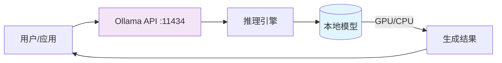

# 第15章：Ollama本地部署与调用

## 章节概述

在之前的章节中，我们主要学习了如何调用云端的大模型API，如OpenAI、Claude、通义千问等。但在某些场景下，我们需要在本地或企业内网中运行大模型，以满足数据隐私、离线使用或成本控制的需求。

Ollama是一个非常优秀的工具，它可以帮助我们在本地快速部署和运行开源大模型，如Llama、Qwen、Mistral等。

**本章学习目标：**
- 理解Ollama的定义和解决的问题
- 掌握Ollama的安装与配置
- 掌握Ollama的常用命令
- 掌握Ollama的API端点和生成参数
- 学会在LangChain中集成Ollama
- 实现基于本地模型的完整应用（含RAG）
- 掌握Ollama进阶用法（Agent、多模型路由）
- 了解性能优化与监控方法

**学习建议：** 建议先安装Ollama，然后跟着例子一步步运行，理解本地模型和云端模型的调用方式是一样的，只是端点不同。本地模型速度可能不如云端，但更加灵活和私密。

---

## 一、Ollama简介



### 1.1 什么是Ollama

Ollama是一个专门用于在本地运行开源大模型的工具，它把模型下载、管理、加载、运行、暴露API这几个环节都封装得非常简单，用户只需几个命令就能跑起来。

一句话总结：**Ollama = 让你用很少的命令，在自己电脑上把开源大模型跑起来。**

### 1.2 Ollama解决的问题

当我们使用云端API时，虽然简单、稳定、开箱即用，但同时也有明显局限：
- 必须联网
- 需要API Key
- 会产生调用费用
- 数据可能敏感场景数据不能离开本地

Ollama对应的正是另一条路：**把模型放到你自己的电脑上跑！**

### 1.3 Ollama vs 云端API区别

| 维度 | 云端API | Ollama |
|---|---|---|
| 模型位置 | 厂商服务器上 | 你自己的电脑上 |
| 是否需要Key | 通常需要 | 本地通常不需要 |
| 是否依赖网络 | 是 | 本地调用不依赖，但首次拉取模型通常需要 |
| 成本 | 按调用计费 | 模型本地推理不计费，但会消耗机器算力、内存、磁盘 |
| 适用场景 | 快速接入、稳定服务、不需要本地硬件负担 | 本地开发、隐私敏感场景、离线测试、学习开源模型 |

### 1.4 使用场景

从项目角度给出一个比较稳的建议：
- **本地开发/课程练习**：非常适合用Ollama
- **企业内网原型/隐私敏感验证**：也适合
- **对性能、稳定性、并发要求高的正式推理服务**：需根据业务再评估是否继续用Ollama，还是切向更专业的推理部署方案

### 1.5 优势与局限

学习时，最好同时看到它的优点和边界。

**优势：**
- 安装和使用门槛低
- 命令简单，适合入门
- 模型管理方便，`pull/run/list/rm`一套命令就够用
- 本地调用通常不需要API Key
- 与LangChain的`ChatOllama`集成成熟

**局限：**
- 是否跑不跑得动，强烈依赖你的机器配置
- 模型体积大，会占内存和磁盘
- 本地模型能力通常取决于能跑多大的模型
- 高并发、企业级推理服务场景，不一定优先选Ollama

---

## 二、安装与配置

### 2.1 安装前先知道两件事

在真正安装之前，最容易忽略两件事：
1. Ollama程序本身不大，真正占空间的是**模型**
2. 你未来可能会下载多个模型，因此**模型目录最好一开始就想清楚**

### 2.2 下载方式

你可以从Ollama官网下载对应平台版本：
- **下载总入口**：https://ollama.com/download
- **Windows下载页**：https://ollama.com/download/windows
- **macOS下载页**：https://ollama.com/download/mac
- **Linux下载页**：https://ollama.com/download/linux

Linux下载页也提供非常常见的一键安装方式：
```bash
curl -fsSL https://ollama.com/install.sh | sh
```

### 2.3 运行环境与硬件要求

这一节特别重要，因为"能不能运行"不只是软件安装问题，更是硬件问题。

Ollama跑得是否顺畅，主要受三件事影响：
- **模型大小**
- **系统内存/显存**
- **是否有可用GPU加速**

你可以先记一个粗略但实用的结论：
- 模型越大，占用的内存/显存越高
- 小模型更适合本地学习
- 不是所有电脑都适合一开始就跑14B、32B、70B级模型

从经验上看，更适合先从体量较小的模型开始，例如：
- qwen:4b
- 类似7B/8B量级模型

### 2.4 自定义安装路径与模型目录

如果你希望把Ollama或模型文件安装到非默认路径，例如D盘、大容量盘或专门的数据盘，那么建议尽早规划模型目录。

### 2.5 修改模型存储目录

如果你要改路径，官方同样建议用`OLLAMA_MODELS`环境变量。

---

## 三、常用命令

### 3.1 最常用的一组命令

| 命令 | 说明 |
|---|---|
| ollama pull model-name | 下载指定模型 |
| ollama run model-name | 运行模型并进入交互对话 |
| ollama list | 查看本机已下载模型 |
| ollama rm model-name | 删除模型 |
| ollama show model-name | 查看模型详情 |
| ollama ps | 查看当前加载中的模型 |
| ollama stop model-name | 停止正在运行的模型 |
| ollama serve | 启动Ollama本地服务 |

### 3.2 ollama ps命令说明

这条命令在真实项目里非常实用，因为它不只是告诉你"模型有没有运行"，还经常能帮助判断：模型是否真的加载了，是在CPU还是GPU上运行，当前有哪些模型驻留在内存中。

---

## 四、安装与验证模型

### 4.1 验证Ollama是否安装成功

建议安装完成后，先做两个最基础的验证：
1. 命令是否可用
2. 本地服务是否真的在监听

#### 4.1.1 看版本号

```bash
ollama --version
```

如果命令可用，会输出版本号。这至少说明两件事：
- Ollama已经安装
- 终端里能找到ollama命令

#### 4.1.2 看默认端口是否监听

Ollama本地API默认端口是 **11434**。如果服务正常启动，通常会在这个端口监听。

Windows下常见验证方式：
```bash
netstat -ano | findstr 11434
```

### 4.2 模型从哪里找

如果你想知道Ollama里有哪些模型，最直接的方式是去官方模型库：
https://ollama.com/search

### 4.3 以通义千问为例运行模型

执行`ollama run qwen:4b`时，**如果本地还没有该模型，Ollama会先自动拉取再启动对话**，无需先单独执行`ollama pull`；如果已拉取过则直接进入交互模式。下载完成后会进入交互式对话。

常见示例命令：
```bash
ollama run qwen:4b
ollama run qwen3:8b
```

---

## 五、Ollama API 与参数详解

### 5.1 API端点

Ollama启动后提供三个核心API端点，均监听于 `http://localhost:11434`。

#### /api/generate

```python
import requests

response = requests.post("http://localhost:11434/api/generate", json={
    "model": "qwen:4b",
    "prompt": "量子计算是什么",
    "stream": False
})
print(response.json()["response"])
```

#### /api/chat

```python
import requests

response = requests.post("http://localhost:11434/api/chat", json={
    "model": "qwen:4b",
    "messages": [
        {"role": "system", "content": "你是一个有用的AI助手"},
        {"role": "user", "content": "你好，请介绍一下你自己"}
    ],
    "stream": False
})
print(response.json()["message"]["content"])
```

#### /api/embeddings

```python
import requests

response = requests.post("http://localhost:11434/api/embeddings", json={
    "model": "qwen:4b",
    "prompt": "深度学习是一种机器学习方法"
})
embedding = response.json()["embedding"]
print(f"向量维度: {len(embedding)}")
```

### 5.2 生成参数

Ollama的API支持多种生成参数来控制模型输出行为。下面是一个完整的参数配置示例：

```python
params = {
    "temperature": 0.7,        # 0.0=确定  ~2.0=随机，控制创造性
    "top_p": 0.9,              # 0.0~1.0，核采样累积概率阈值
    "top_k": 40,               # 只从概率最高的k个token中采样
    "repeat_penalty": 1.1,     # >1.0惩罚重复，减少重复输出
    "num_ctx": 2048,           # 上下文窗口大小(token数)
    "num_predict": 512,        # 最大生成token数
    "seed": 42,                # 随机种子，固定后可复现
    "stop": ["\n\n", "用户："], # 停止词
    "stream": False            # 是否流式输出
}
```

**temperature**控制输出创造性：确定性任务（代码生成）设0.1~0.3，创意内容（写作）设0.8~1.2。

**top_p**和**top_k**是采样策略参数，通常调temperature即可，需要精细控制时配合使用。

**num_ctx**影响模型能处理的文本长度，增大值需更多显存。

**repeat_penalty**设为1.1~1.2可有效减少模型重复输出。

---

## 六、LangChain整合Ollama

### 6.1 为什么学会Ollama命令后还要学LangChain接入

因为只会在终端里`ollama run`，还不等于能把它接到自己的项目中。真正的开发目标是在Python代码里调用本地模型，让它也能接Prompt、Parser、LCEL、Agent，进入统一的LangChain生态。

### 6.2 ChatOllama是什么

`ChatOllama`是LangChain中用于连接本地Ollama聊天模型的类，即**本地模型版本的Chat Model客户端**。它和`ChatOpenAI`、`ChatAnthropic`一样支持`invoke()`、返回`AIMessage`，能接Prompt、LCEL、Agent，区别只在于连接的是本机Ollama服务而非云端。

### 6.3 最小用法：直接传字符串

最直接的写法可以这样：
```python
from langchain_ollama import ChatOllama

model = ChatOllama(
    model="qwen:4b",
    temperature=0.7,
    base_url="http://localhost:11434"
)

response = model.invoke("你好，请介绍一下你自己")
print(response.content)
```

---

## 七、完整代码示例

### 7.1 基础用法一：基础对话

下面是一个完整可运行的示例，展示了如何在LangChain中调用本地Ollama：

```python
from langchain_ollama import ChatOllama
from langchain_core.prompts import ChatPromptTemplate
from langchain_core.output_parsers import StrOutputParser


def basic_ollama_demo():
    model = ChatOllama(model="qwen:4b", temperature=0.7, base_url="http://localhost:11434")
    prompt = ChatPromptTemplate.from_messages([
        ("system", "你是一个乐于助人的AI助手，回复简洁明了，使用中文。"),
        ("user", "{input}")
    ])
    chain = prompt | model | StrOutputParser()
    response = chain.invoke({"input": "你好，请介绍一下大模型是什么"})
    print(response)


if __name__ == "__main__":
    basic_ollama_demo()
```

### 7.2 进阶用法：带记忆的对话

下面是一个带记忆的完整对话示例：

```python
from langchain_ollama import ChatOllama
from langchain_core.prompts import ChatPromptTemplate, MessagesPlaceholder
from langchain_core.output_parsers import StrOutputParser
from langchain_core.chat_history import BaseChatMessageHistory, InMemoryChatMessageHistory
from langchain_core.runnables.history import RunnableWithMessageHistory


def ollama_chat_with_memory():
    model = ChatOllama(model="qwen:4b", temperature=0.7, base_url="http://localhost:11434")
    store = {}
    
    def get_session_history(session_id: str) -> BaseChatMessageHistory:
        if session_id not in store:
            store[session_id] = InMemoryChatMessageHistory()
        return store[session_id]
    
    prompt = ChatPromptTemplate.from_messages([
        ("system", "你是一个有用的AI助手，回复简洁。"),
        MessagesPlaceholder(variable_name="chat_history"),
        ("user", "{input}")
    ])
    
    chain = prompt | model | StrOutputParser()
    with_message_history = RunnableWithMessageHistory(
        chain, get_session_history,
        input_messages_key="input",
        history_messages_key="chat_history"
    )
    
    print("开始与本地大模型对话（输入'quit'退出）：")
    session_id = "user_123"
    
    while True:
        user_input = input("用户: ")
        if user_input.lower() in ["quit", "退出", "exit"]:
            print("再见！")
            break
        
        response = with_message_history.invoke(
            {"input": user_input},
            config={"configurable": {"session_id": session_id}}
        )
        print(f"AI: {response}")


if __name__ == "__main__":
    ollama_chat_with_memory()
```
（详见 [第5章 - 框架实践](chapter5-framework-practice/chapter5-framework-practice.md)）

---

## 八、Ollama + RAG 本地知识库

### 8.1 构建思路

RAG（检索增强生成）是让大模型基于本地文档回答问题的经典方案。结合Ollama可在完全离线环境下搭建本地知识库。

基本流程：
```
本地文档 → 文档加载 → 文本分块 → 向量化(Ollama Embeddings) → 存入向量数据库
用户提问 → 问题向量化 → 向量数据库检索 → 拼接Prompt → 本地模型生成回答
```

核心组件：**文档加载器**（支持PDF/TXT/Markdown）、**文本分割器**（将长文档切块）、**OllamaEmbeddings**（生成向量）、**向量数据库Chroma**（存储检索）、**ChatOllama**（生成回答）。LangChain提供完整RAG流水线支持。

### 8.2 完整实现

下面是一个完整的本地RAG实现：

```python
from langchain_ollama import ChatOllama, OllamaEmbeddings
from langchain_core.output_parsers import StrOutputParser
from langchain_core.prompts import ChatPromptTemplate
from langchain_core.runnables import RunnablePassthrough
from langchain_community.document_loaders import TextLoader
from langchain_community.vectorstores import Chroma
from langchain_text_splitters import RecursiveCharacterTextSplitter


def build_local_rag():
    loader = TextLoader("./knowledge_base/sample.txt", encoding="utf-8")
    documents = loader.load()
    
    text_splitter = RecursiveCharacterTextSplitter(
        chunk_size=500, chunk_overlap=50,
        separators=["\n\n", "\n", "。", "，", " ", ""]
    )
    docs = text_splitter.split_documents(documents)
    
    embeddings = OllamaEmbeddings(model="qwen:4b", base_url="http://localhost:11434")
    
    vectorstore = Chroma.from_documents(
        documents=docs, embedding=embeddings,
        persist_directory="./chroma_db"
    )
    retriever = vectorstore.as_retriever(search_kwargs={"k": 3})
    
    template = """基于以下上下文回答问题。如果你不知道答案，就说不知道，不要编造。

上下文：
{context}

问题：{question}

回答："""
    prompt = ChatPromptTemplate.from_template(template)
    
    model = ChatOllama(model="qwen:4b", temperature=0.3, base_url="http://localhost:11434")
    
    def format_docs(docs):
        return "\n\n".join([doc.page_content for doc in docs])
    
    rag_chain = (
        {"context": retriever | format_docs, "question": RunnablePassthrough()}
        | prompt | model | StrOutputParser()
    )
    
    response = rag_chain.invoke("这篇文档主要讲了什么内容？")
    print(response)


if __name__ == "__main__":
    build_local_rag()
```
（详见 [第7章 - RAG与知识增强](chapter7-rag-knowledge/chapter7-rag-knowledge.md)）

代码说明：**OllamaEmbeddings**使用本地模型生成向量，**Chroma**是轻量级向量数据库，`search_kwargs={"k": 3}`检索3个最相关块，**temperature设低**（0.3）让模型基于事实回答。

---

## 九、进阶应用

### 9.1 Ollama + LangChain Agent

LangChain Agent允许模型自主决定使用哪些工具来完成任务。下面用ChatOllama作为LLM后端，搭配计算器和搜索工具：

```python
from langchain_ollama import ChatOllama
from langchain.agents import create_react_agent, AgentExecutor
from langchain.tools import Tool
from langchain_core.prompts import PromptTemplate
import requests


def calculator(expression: str) -> str:
    try:
        result = eval(expression, {"__builtins__": {}}, {})
        return f"计算结果：{result}"
    except Exception as e:
        return f"计算错误：{e}"


def web_search(query: str) -> str:
    try:
        url = f"https://api.duckduckgo.com/?q={query}&format=json"
        resp = requests.get(url, timeout=5)
        data = resp.json()
        if data.get("AbstractText"):
            return data["AbstractText"]
        return f"未找到关于「{query}」的相关信息"
    except Exception as e:
        return f"搜索失败：{e}"


tools = [
    Tool(name="calculator", func=calculator,
         description="用于执行数学计算。输入应为数学表达式，如 '2+3*4'"),
    Tool(name="web_search", func=web_search,
         description="用于搜索网络信息。输入应为搜索关键词")
]


def ollama_agent_demo():
    model = ChatOllama(
        model="qwen:4b", temperature=0.3,
        base_url="http://localhost:11434"
    )
    
    prompt = PromptTemplate.from_template(
        """你是一个智能助手，可以使用工具来回答问题。

可用工具：{tools}
工具名称：{tool_names}

请按以下格式回复：
思考：分析问题并决定使用哪个工具
行动：工具名称
行动输入：工具的输入参数
观察：工具返回的结果
...（可重复多次）
思考：我现在可以回答用户了
最终回答：对用户的最终回答

问题：{input}

{agent_scratchpad}"""
    )
    
    agent = create_react_agent(model, tools, prompt)
    agent_executor = AgentExecutor(
        agent=agent, tools=tools,
        verbose=True, handle_parsing_errors=True
    )
    
    result = agent_executor.invoke({"input": "计算 1234 * 5678 等于多少"})
    print(f"\n最终结果：{result['output']}")


if __name__ == "__main__":
    ollama_agent_demo()
```

Agent的工作流程：用户提问 → LLM决定是否用工具 → 输出工具和参数 → 执行工具返回结果 → LLM继续推理给出最终答案。

注意：本地小模型（4B）的Agent能力有限，建议在Agent场景下使用7B以上模型。

### 9.2 多模型管理与路由

在实际项目中，不同任务适合不同模型。例如简单问答用小模型（速度快），复杂推理用大模型（效果好）。下面实现一个ModelRouter根据任务类型自动选择模型：

```python
from langchain_ollama import ChatOllama
from langchain_core.prompts import ChatPromptTemplate
from langchain_core.output_parsers import StrOutputParser


class ModelRouter:
    def __init__(self):
        self.models = {
            "fast": ChatOllama(model="qwen:4b", temperature=0.3, base_url="http://localhost:11434", num_predict=256),
            "balanced": ChatOllama(model="qwen3:8b", temperature=0.5, base_url="http://localhost:11434", num_predict=512),
            "powerful": ChatOllama(model="qwen:14b", temperature=0.7, base_url="http://localhost:11434", num_predict=1024)
        }
        self.default_model = "balanced"
    
    def add_model(self, name: str, model: ChatOllama):
        self.models[name] = model
    
    def route(self, task_type: str) -> ChatOllama:
        task_type = task_type.lower()
        if task_type in ["翻译", "翻译任务", "简单问答", "关键词提取"]:
            return self.models.get("fast", self.models[self.default_model])
        elif task_type in ["摘要", "代码生成", "文本分类", "信息提取"]:
            return self.models.get("balanced", self.models[self.default_model])
        elif task_type in ["复杂推理", "创意写作", "代码审查", "深度分析"]:
            return self.models.get("powerful", self.models[self.default_model])
        else:
            return self.models[self.default_model]
    
    def invoke(self, task_type: str, prompt_text: str) -> str:
        model = self.route(task_type)
        prompt = ChatPromptTemplate.from_messages([
            ("system", f"你是一个专门处理{task_type}的AI助手。"),
            ("user", "{input}")
        ])
        chain = prompt | model | StrOutputParser()
        return chain.invoke({"input": prompt_text})


def model_router_demo():
    router = ModelRouter()
    tasks = [
        ("简单问答", "中国的首都是哪里？"),
        ("翻译任务", "Hello, how are you? 翻译成中文"),
        ("代码生成", "用Python写一个计算斐波那契数列的函数"),
        ("复杂推理", "假设有3个盒子，所有标签都贴错了，如何确定所有盒子的内容？")
    ]
    for task_type, question in tasks:
        chosen = router.route(task_type)
        print(f"[{chosen.model}] {task_type}: {question}")
        response = router.invoke(task_type, question)
        print(f"回答：{response[:100]}...\n")


if __name__ == "__main__":
    model_router_demo()
```

ModelRouter的设计思路：**按任务分级**，fast/balanced/powerful三级；**灵活扩展**，通过`add_model`注册新模型；**优雅降级**，模型不可用时自动回退到默认模型。实际部署时建议先在小模型上测试流程，确认无误后再切换到大模型生产使用。

---

## 十、性能优化与监控

### 10.1 GPU/CPU切换

Ollama默认使用GPU加速。通过环境变量可切换运行方式：

```bash
# Windows PowerShell - 强制使用CPU
$env:OLLAMA_GPU="0"
ollama serve

# 指定特定GPU（多卡场景）
$env:CUDA_VISIBLE_DEVICES="0"
ollama serve
```

**检查GPU使用：** 执行`ollama ps`查看模型是否加载在GPU上；Windows下运行`nvidia-smi`查看显存占用。如果始终在CPU上运行，检查NVIDIA GPU和CUDA驱动是否正确安装。

### 10.2 并发与批处理

Ollama本身支持一定程度的并发请求，但在高并发场景下需要合理控制。下面展示如何用`concurrent.futures`实现并发请求：

```python
from langchain_ollama import ChatOllama
from langchain_core.prompts import ChatPromptTemplate
from langchain_core.output_parsers import StrOutputParser
from concurrent.futures import ThreadPoolExecutor, as_completed
import time


def single_query(question: str) -> str:
    model = ChatOllama(
        model="qwen:4b", temperature=0.3,
        base_url="http://localhost:11434", num_predict=128
    )
    prompt = ChatPromptTemplate.from_messages([
        ("system", "你是一个AI助手，请简洁回答。"),
        ("user", "{input}")
    ])
    chain = prompt | model | StrOutputParser()
    return chain.invoke({"input": question})


def batch_query(questions: list, max_workers: int = 3) -> list:
    results = []
    with ThreadPoolExecutor(max_workers=max_workers) as executor:
        future_to_question = {
            executor.submit(single_query, q): q for q in questions
        }
        for future in as_completed(future_to_question):
            question = future_to_question[future]
            try:
                results.append((question, future.result()))
            except Exception as e:
                results.append((question, f"错误：{e}"))
    return results


def concurrent_demo():
    questions = [
        "什么是机器学习？", "Python的列表和元组有什么区别？",
        "TCP和UDP的区别是什么？", "解释一下什么是数据库索引",
        "什么是RESTful API？"
    ]
    
    start = time.time()
    for q in questions:
        single_query(q)
    serial_time = time.time() - start
    print(f"串行耗时：{serial_time:.2f}秒")
    
    start = time.time()
    results = batch_query(questions, max_workers=3)
    concurrent_time = time.time() - start
    print(f"并发耗时：{concurrent_time:.2f}秒，加速比：{serial_time / concurrent_time:.2f}x")


if __name__ == "__main__":
    concurrent_demo()
```

**并发注意事项：** Ollama是算力密集型服务，`max_workers`建议2~4个，过多会导致显存不足。合理设置`num_predict`缩短生成长度可提高并发能力。建议持续监控显存使用，响应变慢时降低并发数。低延迟场景可使用`stream=True`配合流式输出。

---

## 十一、章节练习

### 11.1 练习题1：安装Ollama并运行本地模型

**目标：** 在你的电脑上安装Ollama，拉取一个小模型（如qwen:4b），在终端运行并测试对话。

### 11.2 练习题2：本地模型的LangChain调用

**目标：** 在Python中使用LangChain的ChatOllama调用本地模型，实现一个简单的问答系统。

### 11.3 练习题3：构建本地RAG问答系统

**目标：** 准备一份本地文档（如README或TXT文件），使用OllamaEmbeddings + Chroma构建RAG流水线。

### 11.4 练习题4：多模型路由实践

**目标：** 修改ModelRouter类，注册至少3个不同尺寸的本地模型，根据输入问题的长度和关键词自动选择最合适的模型。

---

## 总结

在本章中，我们学习了：
1. Ollama是什么以及它解决的问题
2. Ollama的安装与配置
3. Ollama常用命令
4. 使用Ollama的API端点直接调用模型
5. 理解并配置生成参数（temperature、top_p等）
6. 如何在LangChain中集成Ollama（ChatOllama）
7. 构建基于本地模型的完整RAG应用
8. 使用Ollama构建LangChain Agent
9. 多模型管理与路由策略
10. 性能优化、GPU/CPU切换及并发处理

Ollama为我们提供了在本地运行大模型的能力，特别适合开发、测试和隐私敏感场景。结合LangChain生态，我们可以用Ollama构建从简单对话到RAG知识库、Agent等各类应用，实现完全离线的AI能力！