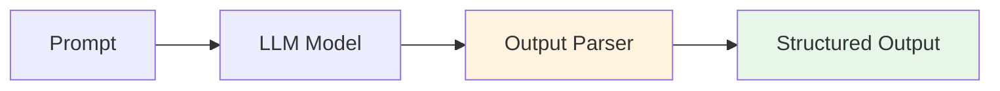

# 第16章：输出解析器与LCEL

## 📖 章节概述

本章将深入学习LangChain的输出解析器（Output Parsers）和LangChain Expression Language（LCEL）。输出解析器帮助我们将LLM的非结构化文本输出转换为结构化数据，而LCEL则提供了一种优雅、声明式的方式来构建和组合LangChain组件。

**学习时长**：2-3周  
**难度等级**：⭐⭐ 中级  
**核心技能**：输出解析、结构化数据、LCEL组合

---



## 16.1 输出解析器简介

### 16.1.1 什么是输出解析器

输出解析器是LangChain中负责将LLM生成的文本输出转换为结构化数据的组件。它们充当了LLM与应用程序之间的翻译层，让我们能够以编程方式可靠地处理模型输出。

```
输出解析器工作流程：

┌─────────────────────────────────────────────┐
│              输出解析流程                     │
├─────────────────────────────────────────────┤
│                                             │
│  ┌──────────┐    ┌──────────┐    ┌───────┐ │
│  │  Prompt  │───▶│   LLM    │───▶│ Parser│ │
│  │  (带格式)│    │  (文本)  │    │(结构化)│ │
│  └──────────┘    └──────────┘    └───────┘ │
│                                             │
│  输出：JSON / Pydantic / CSV / 自定义格式     │
│                                             │
└─────────────────────────────────────────────┘
```

### 16.1.2 为什么需要输出解析器

LLM的输出通常是自由文本，虽然对人类友好，但对程序处理来说不够可靠。输出解析器的主要价值包括：

1. **结构化数据提取**：将非结构化文本转换为字典、对象等结构化格式
2. **类型安全**：确保输出符合预期的数据类型和结构
3. **错误处理**：提供格式化指导和自动修复能力
4. **无缝集成**：让LLM输出能够直接用于数据库操作、API调用等

### 16.1.3 常见输出解析器分类

| 解析器类型 | 用途 | 适用场景 |
|-----------|------|---------|
| `StrOutputParser` | 简单字符串解析 | 基础文本生成 |
| `JsonOutputParser` | JSON格式解析 | 通用结构化数据 |
| `PydanticOutputParser` | Pydantic模型解析 | 强类型验证 |
| `CommaSeparatedListOutputParser` | CSV列表解析 | 列表数据 |
| `DatetimeOutputParser` | 日期时间解析 | 时间处理 |
| `EnumOutputParser` | 枚举解析 | 有限选项 |
| `XMLOutputParser` | XML格式解析 | XML数据 |

---

## 16.2 输出解析器常用方法

### 16.2.1 核心方法概览

所有输出解析器都实现了两个核心方法：

```python
from langchain_core.output_parsers import BaseOutputParser
from typing import Any

# 1. parse() - 解析文本输出
# 2. get_format_instructions() - 获取格式指令
```

### 16.2.2 基础使用示例

```python
# 输出解析器基础使用
from langchain_openai import ChatOpenAI
from langchain_core.prompts import PromptTemplate
from langchain_core.output_parsers import JsonOutputParser
from pydantic import BaseModel, Field
from typing import List

# 初始化LLM
llm = ChatOpenAI(
    model="gpt-4-turbo",
    temperature=0,
    openai_api_key="your-api-key"
)

# 示例1: 使用JsonOutputParser
class MovieReview(BaseModel):
    movie_title: str = Field(description="电影标题")
    rating: float = Field(description="评分，0-10分")
    sentiment: str = Field(description="情感：positive/negative/neutral")
    key_points: List[str] = Field(description="关键要点列表")

# 创建解析器
parser = JsonOutputParser(pydantic_object=MovieReview)

# 创建Prompt模板
prompt = PromptTemplate(
    template="请对以下电影评论进行分析。\n{format_instructions}\n评论内容：{review}\n",
    input_variables=["review"],
    partial_variables={"format_instructions": parser.get_format_instructions()}
)

# 创建Chain
chain = prompt | llm | parser

# 执行
review_text = """
《星际穿越》是一部令人震撼的科幻电影。诺兰导演的叙事手法非常精妙，
汉斯·季默的配乐更是锦上添花。虽然有些科学概念可能需要观众具备一定
的物理知识，但整体剧情依然引人入胜。演员表演出色，视觉效果惊人。
我给这部电影打9.5分！
"""

result = chain.invoke({"review": review_text})
print("解析结果：")
print(result)
print(f"电影标题: {result['movie_title']}")
print(f"评分: {result['rating']}")
```

### 16.2.3 get_format_instructions() 详解

这个方法生成提示词，告诉LLM应该如何格式化输出：

```python
# 查看格式指令
format_instructions = parser.get_format_instructions()
print("格式指令：")
print(format_instructions)

# 输出类似：
# The output should be formatted as a JSON instance that conforms to the JSON schema below.
# 
# Here is the output schema:
# {
#   "type": "object",
#   "properties": {
#     "movie_title": { "description": "电影标题", "type": "string" },
#     "rating": { "description": "评分，0-10分", "type": "number" },
#     "sentiment": { "description": "情感：positive/negative/neutral", "type": "string" },
#     "key_points": { "description": "关键要点列表", "type": "array", "items": { "type": "string" } }
#   },
#   "required": ["movie_title", "rating", "sentiment", "key_points"]
# }
```
（详见 [第3章 - Prompt工程与Agent设计](chapter3-prompt-agent-design/chapter3-prompt-agent-design.md)）

---

## 16.3 常见解析器用法

### 16.3.1 StrOutputParser - 简单字符串解析

```python
# StrOutputParser 示例
from langchain_core.output_parsers import StrOutputParser

# 创建简单的文本生成Chain
prompt = PromptTemplate.from_template("写一首关于{topic}的短诗")
chain = prompt | llm | StrOutputParser()

poem = chain.invoke({"topic": "秋天"})
print("生成的诗歌：")
print(poem)
```

### 16.3.2 JsonOutputParser - JSON格式解析

```python
# JsonOutputParser 高级示例
from langchain_core.output_parsers import JsonOutputParser
from typing import Optional

# 定义复杂的数据结构
class ProductInfo(BaseModel):
    product_name: str = Field(description="产品名称")
    price: float = Field(description="价格")
    category: str = Field(description="产品分类")
    in_stock: bool = Field(description="是否有库存")
    features: List[str] = Field(description="产品特性")
    specifications: Optional[dict] = Field(description="规格参数")

parser = JsonOutputParser(pydantic_object=ProductInfo)

prompt = PromptTemplate(
    template="根据以下产品描述，提取结构化信息。\n{format_instructions}\n产品描述：{description}\n",
    input_variables=["description"],
    partial_variables={"format_instructions": parser.get_format_instructions()}
)

chain = prompt | llm | parser

product_desc = """
MacBook Pro 14英寸：售价14999元，属于笔记本电脑分类。目前有库存。
产品特性包括：M3 Pro芯片、Liquid Retina XDR显示屏、18小时续航、
背光魔法键盘、Touch ID。规格参数：内存16GB，存储512GB SSD，
屏幕分辨率3024x1964，重量1.6kg。
"""

result = chain.invoke({"description": product_desc})
print("产品信息：")
print(f"名称: {result['product_name']}")
print(f"价格: ¥{result['price']}")
print(f"库存: {'有货' if result['in_stock'] else '无货'}")
print(f"特性数: {len(result['features'])}")
```

### 16.3.3 PydanticOutputParser - 强类型验证

```python
# PydanticOutputParser 示例
from langchain.output_parsers import PydanticOutputParser
from pydantic import field_validator
from datetime import datetime

# 定义带有验证的Pydantic模型
class BookingRequest(BaseModel):
    customer_name: str = Field(description="客户姓名")
    booking_date: datetime = Field(description="预订日期")
    num_guests: int = Field(description="客人数量")
    room_type: str = Field(description="房型：standard/deluxe/suite")
    special_requests: Optional[str] = Field(description="特殊要求")

    @field_validator('num_guests')
    @classmethod
    def validate_guests(cls, v):
        if v < 1 or v > 10:
            raise ValueError('客人数量必须在1-10之间')
        return v

    @field_validator('room_type')
    @classmethod
    def validate_room_type(cls, v):
        valid_types = ['standard', 'deluxe', 'suite']
        if v not in valid_types:
            raise ValueError(f'房型必须是以下之一: {valid_types}')
        return v

parser = PydanticOutputParser(pydantic_object=BookingRequest)

prompt = PromptTemplate(
    template="根据以下预订请求，提取结构化信息。\n{format_instructions}\n预订请求：{request}\n",
    input_variables=["request"],
    partial_variables={"format_instructions": parser.get_format_instructions()}
)

chain = prompt | llm | parser

booking_request = """
我是张三，想预订2024年12月25日的酒店房间。一共4位客人，
想要一间豪华套房。如果可能的话，请安排高层房间，谢谢！
"""

result = chain.invoke({"request": booking_request})
print("预订信息：")
print(f"客户: {result.customer_name}")
print(f"日期: {result.booking_date.strftime('%Y-%m-%d')}")
print(f"客人: {result.num_guests}位")
print(f"房型: {result.room_type}")
```

### 16.3.4 其他常用解析器

```python
# 更多解析器示例
from langchain.output_parsers import (
    CommaSeparatedListOutputParser,
    DatetimeOutputParser,
    EnumOutputParser
)
from enum import Enum

# 1. 逗号分隔列表解析器
list_parser = CommaSeparatedListOutputParser()
list_prompt = PromptTemplate(
    template="列出5种{category}。\n{format_instructions}",
    input_variables=["category"],
    partial_variables={"format_instructions": list_parser.get_format_instructions()}
)
list_chain = list_prompt | llm | list_parser
fruits = list_chain.invoke({"category": "水果"})
print("水果列表:", fruits)

# 2. 日期时间解析器
datetime_parser = DatetimeOutputParser()
datetime_prompt = PromptTemplate(
    template="将以下日期描述转换为标准格式。\n{format_instructions}\n日期：{date_text}",
    input_variables=["date_text"],
    partial_variables={"format_instructions": datetime_parser.get_format_instructions()}
)
datetime_chain = datetime_prompt | llm | datetime_parser
parsed_date = datetime_chain.invoke({"date_text": "明年春节前一周的周五"})
print("解析的日期:", parsed_date)

# 3. 枚举解析器
class Priority(Enum):
    LOW = "low"
    MEDIUM = "medium"
    HIGH = "high"
    URGENT = "urgent"

enum_parser = EnumOutputParser(enum=Priority)
enum_prompt = PromptTemplate(
    template="评估以下任务的优先级。\n{format_instructions}\n任务：{task}",
    input_variables=["task"],
    partial_variables={"format_instructions": enum_parser.get_format_instructions()}
)
enum_chain = enum_prompt | llm | enum_parser
priority = enum_chain.invoke({"task": "服务器宕机，需要立即修复"})
print("优先级:", priority)
```

---

## 16.4 结构化输出

### 16.4.1 使用TypedDict

```python
# TypedDict 结构化输出
from typing import TypedDict, Literal

# 定义TypedDict
class CustomerData(TypedDict):
    name: str
    age: int
    gender: Literal["male", "female", "other"]
    email: str
    interests: list[str]
    address: dict[str, str]

# 使用JsonOutputParser配合TypedDict
parser = JsonOutputParser()

prompt = PromptTemplate(
    template="根据以下信息生成客户资料JSON。\n格式要求：\n- name: 字符串\n- age: 整数\n- gender: 'male'或'female'或'other'\n- email: 字符串\n- interests: 字符串数组\n- address: 包含street和city的对象\n\n客户信息：{info}\n",
    input_variables=["info"]
)

chain = prompt | llm | parser

customer_info = """
李四，28岁，男性，邮箱lisi@email.com。喜欢篮球、摄影和旅行。
住在北京市朝阳区建国路88号。
"""

result: CustomerData = chain.invoke({"info": customer_info})
print("客户数据：")
print(f"姓名: {result['name']}")
print(f"年龄: {result['age']}")
print(f"兴趣: {', '.join(result['interests'])}")
```

### 16.4.2 使用Pydantic模型

```python
# Pydantic 高级用法
from pydantic import BaseModel, Field, EmailStr, HttpUrl
from typing import Optional
from datetime import date

class Address(BaseModel):
    street: str = Field(description="街道地址")
    city: str = Field(description="城市")
    province: str = Field(description="省份")
    postal_code: str = Field(description="邮政编码")

class Person(BaseModel):
    name: str = Field(description="姓名", min_length=2, max_length=50)
    age: int = Field(description="年龄", ge=0, le=120)
    email: EmailStr = Field(description="电子邮箱")
    website: Optional[HttpUrl] = Field(description="个人网站")
    birthday: Optional[date] = Field(description="生日")
    address: Address = Field(description="地址信息")
    hobbies: list[str] = Field(description="爱好列表", max_length=10)

parser = PydanticOutputParser(pydantic_object=Person)

prompt = PromptTemplate(
    template="根据以下信息生成个人资料。\n{format_instructions}\n信息：{info}\n",
    input_variables=["info"],
    partial_variables={"format_instructions": parser.get_format_instructions()}
)

chain = prompt | llm | parser

person_info = """
王五，35岁，邮箱wangwu@company.com，个人网站https://wangwu.dev。
生日是1989年5月15日。住在上海市浦东新区张江高科技园区博云路2号，
邮编201203。爱好有编程、阅读、徒步和咖啡。
"""

result = chain.invoke({"info": person_info})
print("个人资料：")
print(f"姓名: {result.name}")
print(f"邮箱: {result.email}")
print(f"网站: {result.website}")
print(f"城市: {result.address.city}")
print(f"爱好数: {len(result.hobbies)}")
```

### 16.4.3 使用JSON Schema

```python
# JSON Schema 定义
json_schema = {
    "type": "object",
    "properties": {
        "order_id": {
            "type": "string",
            "description": "订单编号"
        },
        "items": {
            "type": "array",
            "items": {
                "type": "object",
                "properties": {
                    "product_name": {"type": "string"},
                    "quantity": {"type": "integer", "minimum": 1},
                    "price": {"type": "number", "minimum": 0}
                },
                "required": ["product_name", "quantity", "price"]
            }
        },
        "total_amount": {
            "type": "number",
            "description": "订单总金额"
        },
        "customer": {
            "type": "object",
            "properties": {
                "name": {"type": "string"},
                "phone": {"type": "string"}
            },
            "required": ["name", "phone"]
        },
        "status": {
            "type": "string",
            "enum": ["pending", "paid", "shipped", "delivered"],
            "description": "订单状态"
        }
    },
    "required": ["order_id", "items", "total_amount", "customer", "status"]
}

# 使用JSON Schema
parser = JsonOutputParser()

prompt = PromptTemplate(
    template="根据以下订单信息生成JSON，严格遵循此Schema：\n{schema}\n\n订单信息：{order_info}\n",
    input_variables=["order_info"],
    partial_variables={"schema": json_schema}
)

chain = prompt | llm | parser

order_info = """
订单号：ORD-2024-12345。客户赵六，电话13800138000。
购买了以下商品：
- iPhone 15 Pro，2台，每台8999元
- AirPods Pro，1副，1899元
订单总金额19897元，已支付。
"""

result = chain.invoke({"order_info": order_info})
print("订单信息：")
print(f"订单号: {result['order_id']}")
print(f"商品数: {len(result['items'])}")
print(f"总金额: ¥{result['total_amount']}")
print(f"状态: {result['status']}")
```

---

## 16.5 LCEL简介

### 16.5.1 什么是LCEL

LCEL (LangChain Expression Language) 是LangChain的声明式组合语言，使用管道符（`|`）来连接各种组件，形成可执行的处理链。

```
LCEL 管道示例：

PromptTemplate → ChatOpenAI → OutputParser
     ↓              ↓             ↓
  (模板)       (模型调用)      (解析输出)

写成代码：
chain = prompt | llm | parser
```

### 16.5.2 Runnable接口

所有LCEL组件都实现了`Runnable`接口，提供统一的调用方式：

```python
# Runnable 核心方法
from langchain_core.runnables import Runnable

# 1. invoke() - 单次调用
# 2. batch() - 批量调用
# 3. stream() - 流式输出
# 4. ainvoke() - 异步调用
# 5. abatch() - 异步批量调用
# 6. astream() - 异步流式输出
```

### 16.5.3 第一个LCEL管道

```python
# LCEL 基础示例
from langchain_core.prompts import ChatPromptTemplate
from langchain_core.output_parsers import StrOutputParser

# 1. 创建组件
prompt = ChatPromptTemplate.from_template("用{language}解释{concept}")
llm = ChatOpenAI(model="gpt-4-turbo", temperature=0)
parser = StrOutputParser()

# 2. 组合成Chain
chain = prompt | llm | parser

# 3. 调用
result = chain.invoke({
    "language": "中文",
    "concept": "机器学习"
})
print("解释：")
print(result)

# 4. 批量调用
inputs = [
    {"language": "中文", "concept": "深度学习"},
    {"language": "中文", "concept": "强化学习"},
    {"language": "中文", "concept": "迁移学习"}
]
results = chain.batch(inputs)
print("\n批量结果：")
for i, res in enumerate(results, 1):
    print(f"\n{i}. {res[:100]}...")

# 5. 流式调用
print("\n流式输出：")
for chunk in chain.stream({"language": "中文", "concept": "神经网络"}):
    print(chunk, end="", flush=True)
```

---

## 16.6 LCEL组合方式

### 16.6.1 RunnableSequence - 顺序执行

```python
# RunnableSequence 示例
from langchain_core.runnables import RunnableSequence, RunnableLambda

# 方式1: 使用 | 操作符
chain1 = prompt | llm | parser

# 方式2: 使用RunnableSequence显式创建
chain2 = RunnableSequence(
    prompt,
    llm,
    parser
)

# 方式3: 逐步添加
chain3 = RunnableSequence(prompt)
chain3 = chain3.pipe(llm)
chain3 = chain3.pipe(parser)

# 三者等价
result1 = chain1.invoke({"topic": "AI"})
result2 = chain2.invoke({"topic": "AI"})
result3 = chain3.invoke({"topic": "AI"})
```

### 16.6.2 RunnableParallel - 并行执行

```python
# RunnableParallel 示例
from langchain_core.runnables import RunnableParallel

# 创建并行处理
chain = RunnableParallel({
    "summary": (lambda x: x["text"]) | prompt | llm | StrOutputParser(),
    "keywords": (lambda x: x["text"]) | keyword_prompt | llm | list_parser,
    "sentiment": (lambda x: x["text"]) | sentiment_prompt | llm | parser
})

# 执行
result = chain.invoke({
    "text": "LangChain是一个强大的AI应用开发框架，支持多种LLM和工具集成。"
})

print("摘要:", result["summary"])
print("关键词:", result["keywords"])
print("情感:", result["sentiment"])

# 另一种写法：使用RunnableParallel.assign
base_chain = prompt | llm | parser
enhanced_chain = base_chain.assign(
    metadata=lambda x: {"timestamp": "now", "length": len(str(x))}
)
```

### 16.6.3 RunnableBranch - 条件分支

```python
# RunnableBranch 示例
from langchain_core.runnables import RunnableBranch

# 定义分支逻辑
branch = RunnableBranch(
    (lambda x: x["topic"] == "math", math_chain),
    (lambda x: x["topic"] == "code", code_chain),
    (lambda x: x["topic"] == "writing", writing_chain),
    default_chain  # 默认分支
)

# 定义不同的处理链
math_prompt = ChatPromptTemplate.from_template("解决这个数学问题：{question}")
math_chain = math_prompt | llm | StrOutputParser()

code_prompt = ChatPromptTemplate.from_template("编写Python代码：{question}")
code_chain = code_prompt | llm | StrOutputParser()

writing_prompt = ChatPromptTemplate.from_template("写一篇关于：{question}")
writing_chain = writing_prompt | llm | StrOutputParser()

default_prompt = ChatPromptTemplate.from_template("回答这个问题：{question}")
default_chain = default_prompt | llm | StrOutputParser()

# 使用分支
result = branch.invoke({
    "topic": "math",
    "question": "25 * 67 + 89 = ?"
})
print("数学问题答案:", result)
```

### 16.6.4 RunnableLambda - 自定义函数

```python
# RunnableLambda 示例
from langchain_core.runnables import RunnableLambda

# 定义自定义处理函数
def preprocess_text(text: str) -> str:
    """文本预处理"""
    text = text.strip()
    text = text.lower()
    text = text.replace("\n", " ")
    return text

def extract_keywords(text: str) -> list:
    """简单关键词提取（示例）"""
    words = text.split()
    keywords = [w for w in words if len(w) > 2]
    return keywords[:5]

# 包装为Runnable
preprocess_runnable = RunnableLambda(preprocess_text)
keyword_runnable = RunnableLambda(extract_keywords)

# 组合成Chain
chain = (
    RunnableLambda(lambda x: x["input_text"])
    | preprocess_runnable
    | keyword_runnable
)

result = chain.invoke({
    "input_text": "  LangChain 提供了强大的组件来构建 AI 应用程序。  \n  它支持多种 LLM 集成。  "
})
print("提取的关键词:", result)

# 异步函数支持
import asyncio

async def async_process(text: str) -> str:
    await asyncio.sleep(0.1)
    return text.upper()

async_runnable = RunnableLambda(async_process)

# 也可以使用装饰器
@RunnableLambda
def format_output(text: str) -> str:
    return f"[结果] {text}"
```

### 16.6.5 复杂组合示例

```python
# 复杂组合：并行 + 分支 + 自定义函数
from langchain_core.runnables import RunnablePassthrough

# 构建复杂处理管道
complex_chain = (
    RunnablePassthrough.assign(
        # 预处理
        cleaned_text=lambda x: preprocess_text(x["text"]),
        # 并行分析
        analysis=RunnableParallel({
            "sentiment": (lambda x: x["cleaned_text"]) | sentiment_prompt | llm | parser,
            "topics": (lambda x: x["cleaned_text"]) | topic_prompt | llm | list_parser,
            "entities": (lambda x: x["cleaned_text"]) | entity_prompt | llm | parser
        })
    )
    # 条件后处理
    | RunnableBranch(
        (lambda x: x["analysis"]["sentiment"] == "negative", 
         lambda x: {**x, "action": "escalate"}),
        (lambda x: x["analysis"]["sentiment"] == "positive",
         lambda x: {**x, "action": "reward"}),
        lambda x: {**x, "action": "monitor"}
    )
)

# 执行
result = complex_chain.invoke({
    "text": "你们的产品太棒了！使用体验非常好，客服也很热情。"
})

print("分析结果：")
print(f"情感: {result['analysis']['sentiment']}")
print(f"主题: {result['analysis']['topics']}")
print(f"行动: {result['action']}")
```
（详见 [第5章 - 框架实践](chapter5-framework-practice/chapter5-framework-practice.md)）

---

## 16.7 完整可运行的代码示例

### 16.7.1 示例1：智能问答系统

```python
# 智能问答系统 - 完整示例
from langchain_openai import ChatOpenAI, OpenAIEmbeddings
from langchain_community.vectorstores import Chroma
from langchain_core.prompts import ChatPromptTemplate, PromptTemplate
from langchain_core.output_parsers import StrOutputParser, JsonOutputParser
from langchain_core.runnables import RunnablePassthrough, RunnableParallel
from pydantic import BaseModel, Field
from typing import List, Optional
import os

# 1. 配置
os.environ["OPENAI_API_KEY"] = "your-api-key"
llm = ChatOpenAI(model="gpt-4-turbo", temperature=0)
embeddings = OpenAIEmbeddings()

# 2. 数据模型
class Answer(BaseModel):
    question: str = Field(description="原始问题")
    answer: str = Field(description="回答内容")
    confidence: float = Field(description="置信度，0-1")
    sources: List[str] = Field(description="参考来源")
    follow_up_questions: Optional[List[str]] = Field(description="推荐的后续问题")

# 3. 创建向量存储（示例数据）
documents = [
    "LangChain是一个用于构建LLM应用的框架，支持多种LLM集成。",
    "LCEL是LangChain Expression Language，用于组合LangChain组件。",
    "输出解析器用于将LLM输出转换为结构化数据。",
    "Runnable是LCEL的核心接口，所有组件都实现了这个接口。",
    "LangChain支持向量数据库集成，用于RAG应用。"
]

vectorstore = Chroma.from_texts(documents, embeddings)
retriever = vectorstore.as_retriever(k=2)

# 4. 构建RAG Chain
template = """根据以下上下文回答问题：
上下文：{context}
问题：{question}

请以JSON格式回答，包含：
- question: 原始问题
- answer: 详细回答
- confidence: 置信度（0-1）
- sources: 参考来源列表
- follow_up_questions: 3个相关后续问题
"""

prompt = ChatPromptTemplate.from_template(template)
parser = JsonOutputParser(pydantic_object=Answer)

def format_docs(docs):
    return "\n".join([d.page_content for d in docs])

rag_chain = (
    RunnableParallel({
        "context": retriever | format_docs,
        "question": RunnablePassthrough()
    })
    | prompt
    | llm
    | parser
)

# 5. 使用
result = rag_chain.invoke("什么是LCEL？")
print("问答结果：")
print(f"问题: {result['question']}")
print(f"回答: {result['answer']}")
print(f"置信度: {result['confidence']}")
print(f"来源: {result['sources']}")
print(f"后续问题: {result['follow_up_questions']}")
```

### 16.7.2 示例2：多步骤处理管道

```python
# 多步骤处理管道 - 完整示例
from langchain_core.runnables import RunnableLambda, RunnableParallel
from langchain_core.prompts import ChatPromptTemplate
from langchain_core.output_parsers import PydanticOutputParser
from pydantic import BaseModel, Field
from typing import List

# 1. 数据模型
class Step1Result(BaseModel):
    original_text: str
    cleaned_text: str
    word_count: int

class Step2Result(BaseModel):
    summary: str
    key_points: List[str]
    topics: List[str]

class FinalResult(BaseModel):
    step1: Step1Result
    step2: Step2Result
    final_analysis: str

# 2. 步骤1：文本清洗
def clean_text(input_data: dict) -> Step1Result:
    text = input_data["text"]
    cleaned = text.strip().replace("\n", " ")
    word_count = len(cleaned.split())
    return Step1Result(
        original_text=text,
        cleaned_text=cleaned,
        word_count=word_count
    )

# 3. 步骤2：内容分析
summary_prompt = ChatPromptTemplate.from_template("总结以下文本：{text}")
summary_chain = summary_prompt | llm | StrOutputParser()

key_points_prompt = ChatPromptTemplate.from_template("提取文本的关键要点（3-5条）：{text}")
key_points_chain = key_points_prompt | llm | CommaSeparatedListOutputParser()

topics_prompt = ChatPromptTemplate.from_template("识别文本的主题（2-3个）：{text}")
topics_chain = topics_prompt | llm | CommaSeparatedListOutputParser()

# 4. 组合成完整管道
pipeline = (
    # 步骤1
    RunnableLambda(clean_text)
    # 步骤2：并行分析
    | RunnableParallel({
        "step1": RunnablePassthrough(),
        "step2": RunnableParallel({
            "summary": lambda x: summary_chain.invoke({"text": x.cleaned_text}),
            "key_points": lambda x: key_points_chain.invoke({"text": x.cleaned_text}),
            "topics": lambda x: topics_chain.invoke({"text": x.cleaned_text})
        })
    })
    # 步骤3：最终分析
    | RunnableLambda(lambda x: FinalResult(
        step1=x["step1"],
        step2=Step2Result(**x["step2"]),
        final_analysis=f"文本包含{x['step1'].word_count}个词，主题包括{', '.join(x['step2']['topics'])}"
    ))
)

# 5. 使用
sample_text = """
LangChain为开发者提供了丰富的工具来构建基于LLM的应用程序。
其核心组件包括模型I/O、链式调用、代理系统和记忆管理等。
通过LCEL，开发者可以用声明式的方式组合这些组件，构建复杂的工作流。
输出解析器则确保了LLM的输出能够被程序可靠地处理。
"""

result = pipeline.invoke({"text": sample_text})
print("处理结果：")
print(f"词数: {result.step1.word_count}")
print(f"摘要: {result.step2.summary}")
print(f"要点: {result.step2.key_points}")
print(f"主题: {result.step2.topics}")
print(f"最终分析: {result.final_analysis}")
```

### 16.7.3 示例3：API数据处理

```python
# API数据处理 - 完整示例
from langchain_core.runnables import RunnableLambda, RunnableParallel
from pydantic import BaseModel, Field
from typing import List, Dict, Any
import requests
import json

# 1. 数据模型
class WeatherData(BaseModel):
    city: str
    temperature: float
    condition: str
    humidity: int
    wind_speed: float

class TravelRecommendation(BaseModel):
    destination: str
    weather: WeatherData
    activities: List[str]
    tips: List[str]
    overall_score: float

# 2. API调用函数
def get_weather(city: str) -> WeatherData:
    """获取天气数据（示例）"""
    # 实际项目中调用真实API
    return WeatherData(
        city=city,
        temperature=22.5,
        condition="晴朗",
        humidity=65,
        wind_speed=12.3
    )

# 3. 推荐生成
recommendation_prompt = ChatPromptTemplate.from_template("""
根据以下天气信息，为{city}生成旅行推荐：
天气：{weather}

请提供：
- 推荐的活动列表（3-5个）
- 旅行小贴士（2-3条）
- 总体评分（0-10）

以JSON格式输出。
""")

# 4. 构建处理链
travel_chain = (
    RunnableParallel({
        "city": lambda x: x["city"],
        "weather": lambda x: get_weather(x["city"])
    })
    | RunnableLambda(lambda x: {
        **x,
        "weather_str": json.dumps(x["weather"].dict(), ensure_ascii=False)
    })
    | recommendation_prompt.partial(city=lambda x: x["city"])
    | llm
    | JsonOutputParser(pydantic_object=TravelRecommendation)
)

# 5. 使用
result = travel_chain.invoke({"city": "杭州"})
print("旅行推荐：")
print(f"目的地: {result.destination}")
print(f"天气: {result.weather.condition}，{result.weather.temperature}°C")
print(f"活动: {result.activities}")
print(f"贴士: {result.tips}")
print(f"评分: {result.overall_score}/10")
```

---

## 16.8 章节练习

### 🎯 练习一：构建数据提取器

```python
# 练习：构建简历数据提取器
from langchain_core.prompts import PromptTemplate
from langchain_core.output_parsers import PydanticOutputParser
from pydantic import BaseModel, Field
from typing import List, Optional

# 任务：根据简历文本提取结构化信息

class Education(BaseModel):
    school: str = Field(description="学校名称")
    degree: str = Field(description="学位")
    major: str = Field(description="专业")
    start_year: int = Field(description="入学年份")
    end_year: int = Field(description="毕业年份")

class Experience(BaseModel):
    company: str = Field(description="公司名称")
    position: str = Field(description="职位")
    start_date: str = Field(description="开始日期")
    end_date: Optional[str] = Field(description="结束日期")
    responsibilities: List[str] = Field(description="职责描述")

class Resume(BaseModel):
    name: str = Field(description="姓名")
    email: str = Field(description="邮箱")
    phone: str = Field(description="电话")
    education: List[Education] = Field(description="教育经历")
    experience: List[Experience] = Field(description="工作经历")
    skills: List[str] = Field(description="技能列表")

# 请完成：
# 1. 创建PydanticOutputParser
# 2. 创建Prompt模板
# 3. 构建Chain
# 4. 测试以下简历文本

sample_resume = """
张三
邮箱: zhangsan@email.com
电话: 13900139000

教育经历：
- 清华大学，计算机科学与技术，硕士，2018-2021
- 北京大学，软件工程，学士，2014-2018

工作经历：
- 阿里巴巴，高级工程师，2021-至今
  职责：负责后端系统架构设计、带领5人团队、优化系统性能
- 字节跳动，工程师，2019-2021
  职责：参与推荐系统开发、编写技术文档

技能：Python, Java, Go, 机器学习, 分布式系统
"""

# 你的代码：
# parser = ...
# prompt = ...
# chain = ...
# result = chain.invoke({"resume": sample_resume})
```

### 🎯 练习二：构建多分支对话系统

```python
# 练习：构建客服对话系统
from langchain_core.runnables import RunnableBranch, RunnablePassthrough
from langchain_core.prompts import ChatPromptTemplate

# 任务：根据用户问题类型，路由到不同的处理分支

# 请完成：
# 1. 定义分类Prompt，识别用户问题类型（技术问题/账单问题/投诉/其他）
# 2. 为每种类型创建专门的回答Prompt
# 3. 使用RunnableBranch构建分支逻辑
# 4. 组合成完整系统

# 问题分类
classify_prompt = ChatPromptTemplate.from_template("""
分析以下用户问题，判断属于哪一类：
- technical: 技术问题
- billing: 账单问题
- complaint: 投诉
- other: 其他

用户问题：{question}

只返回类别名称。
""")

# 各分支Prompt
technical_prompt = ChatPromptTemplate.from_template("""
你是技术支持专家。请回答以下技术问题：
{question}
""")

billing_prompt = ChatPromptTemplate.from_template("""
你是账单客服。请处理以下账单问题：
{question}
""")

complaint_prompt = ChatPromptTemplate.from_template("""
你是客户关系经理。请处理以下投诉：
{question}
""")

default_prompt = ChatPromptTemplate.from_template("""
请回答以下问题：{question}
""")

# 你的代码：
# classify_chain = ...
# branch = ...
# full_chain = ...
# 测试问题：
# "我的账户被扣了两次费用"
# "如何重置密码？"
# "你们的服务太差了！"
```

---

## 📚 延伸阅读

### 官方文档

1. [LangChain Output Parsers](https://python.langchain.com/docs/modules/model_io/output_parsers/)
2. [LangChain Expression Language (LCEL)](https://python.langchain.com/docs/expression_language/)
3. [Runnable Interface](https://python.langchain.com/docs/expression_language/interface/)

### 社区资源

1. [LangChain GitHub](https://github.com/langchain-ai/langchain)
2. [LCEL Cookbook](https://python.langchain.com/docs/expression_language/cookbook/)

---

## ✅ 章节总结

### 核心要点回顾

1. **输出解析器**：将LLM文本输出转换为结构化数据（JSON、Pydantic、CSV等）
2. **常用解析器**：`StrOutputParser`、`JsonOutputParser`、`PydanticOutputParser`
3. **结构化输出**：使用TypedDict、Pydantic模型、JSON Schema定义数据结构
4. **LCEL**：LangChain Expression Language，使用管道符`|`组合组件
5. **Runnable接口**：统一的调用方式（invoke、batch、stream等）
6. **组合方式**：`RunnableSequence`（顺序）、`RunnableParallel`（并行）、`RunnableBranch`（分支）、`RunnableLambda`（自定义）

### 下章预告

在下一章中，我们将学习**高级RAG技术**，包括：
- 向量数据库进阶使用
- 检索策略优化
- 多模态RAG
- 混合检索与重排序

---

**掌握输出解析和LCEL后，你可以构建更加健壮、可维护的LangChain应用！🚀**

[← 返回课程目录](../course-overview.md)
