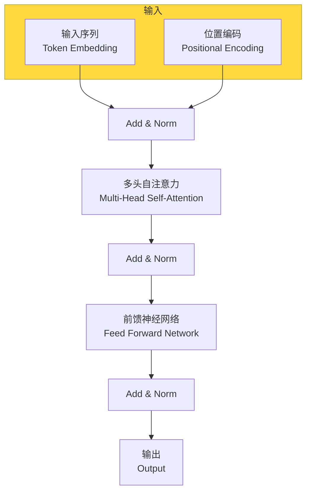
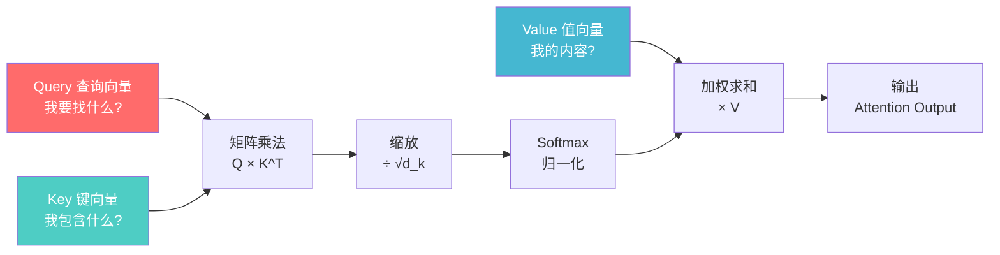
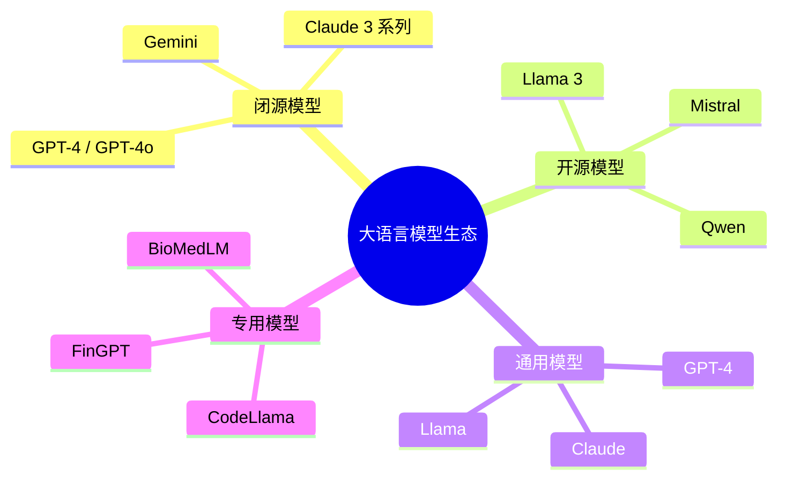

# 第二章：大语言模型基础

## 📖 章节概述

本章将深入探讨支撑现代Agent系统运转的核心技术——大语言模型（Large Language Model, LLM）。我们将学习Transformer架构的工作原理、主流LLM的特点对比、LLM的核心能力与局限性，以及如何在Agent系统中选择和使用合适的LLM。

**学习时长**：2-3周  
**难度等级**：⭐⭐ 基础  
**核心技能**：理解LLM原理、选择合适模型、API调用

---

## 2.1 Transformer架构原理

### 2.1.1 从RNN到Transformer

#### 传统序列模型的局限性

在Transformer出现之前，循环神经网络（RNN）及其变体（LSTM、GRU）是处理序列数据的主流方法，但它们存在根本性的问题：

```
RNN 序列处理流程：

输入: "我 喜 欢 机 器 学 习"
       ↓  ↓  ↓  ↓  ↓  ↓  ↓
      ┌──┬──┬──┬──┬──┬──┐
      │h0│h1│h2│h3│h4│h5│h6│  ← 隐藏状态
      └──┴──┴──┴──┴──┴──┘
        ↓  ↓  ↓  ↓  ↓  ↓
       x0  x1  x2  x3  x4  x5  x6  ← 输出

问题：
1. 顺序计算，无法并行
2. 长距离依赖问题（梯度消失/爆炸）
3. 训练效率低
```

#### Transformer的革命性创新

2017年，Google在论文《Attention Is All You Need》中提出了Transformer架构，彻底改变了序列建模的方式：

```
Transformer 并行处理：

输入: "我 喜 欢 机 器 学 习"
       ↓  ↓  ↓  ↓  ↓  ↓  ↓
      ┌────────────────────┐
      │   Self-Attention   │  ← 全局并行注意力
      └────────────────────┘
       ↓  ↓  ↓  ↓  ↓  ↓  ↓
      ┌────────────────────┐
      │   Feed Forward     │  ← 前馈网络
      └────────────────────┘

优势：
1. 完全并行处理 ✅
2. 直接建模任意距离依赖 ✅
3. 训练效率大幅提升 ✅
```



### 2.1.2 位置编码（Positional Encoding）

由于Transformer没有循环结构，无法直接获取序列位置信息，因此需要添加位置编码：

```python
import numpy as np
import torch
import torch.nn as nn

class PositionalEncoding(nn.Module):
    """位置编码实现"""
    
    def __init__(self, d_model, max_len=5000, dropout=0.1):
        super().__init__()
        self.dropout = nn.Dropout(p=dropout)
        
        # 创建位置编码矩阵
        pe = torch.zeros(max_len, d_model)
        position = torch.arange(0, max_len, dtype=torch.float).unsqueeze(1)
        
        # 计算频率
        div_term = torch.exp(
            torch.arange(0, d_model, 2).float() * 
            (-np.log(10000.0) / d_model)
        )
        
        # 偶数位置使用sin
        pe[:, 0::2] = torch.sin(position * div_term)
        # 奇数位置使用cos
        pe[:, 1::2] = torch.cos(position * div_term)
        
        pe = pe.unsqueeze(0)  # 添加batch维度
        self.register_buffer('pe', pe)
    
    def forward(self, x):
        """添加位置编码"""
        x = x + self.pe[:, :x.size(1), :]
        return self.dropout(x)

# 示例使用
d_model = 512
seq_length = 100
batch_size = 32

pos_encoder = PositionalEncoding(d_model)
x = torch.randn(batch_size, seq_length, d_model)
x_encoded = pos_encoder(x)

print(f"输入形状: {x.shape}")
print(f"位置编码形状: {pos_encoder.pe.shape}")
print(f"编码后形状: {x_encoded.shape}")
```

### 2.1.3 自注意力机制（Self-Attention）

自注意力是Transformer的核心，它允许序列中的每个位置关注序列中的所有其他位置：

#### 注意力机制的核心公式

```
Attention(Q, K, V) = softmax(QK^T / √d_k) × V

其中：
Q (Query): 查询向量 - "我在找什么"
K (Key): 键向量 - "我包含什么信息"
V (Value): 值向量 - "我代表什么内容"
√d_k: 缩放因子，防止点积过大
```



#### 完整实现

```python
import torch
import torch.nn as nn
import torch.nn.functional as F
import math

class SelfAttention(nn.Module):
    """缩放点积注意力机制"""
    
    def __init__(self, d_model, num_heads=8, dropout=0.1):
        super().__init__()
        
        assert d_model % num_heads == 0, \
            "d_model必须能被num_heads整除"
        
        self.d_model = d_model
        self.num_heads = num_heads
        self.d_k = d_model // num_heads
        
        # 线性变换层
        self.W_q = nn.Linear(d_model, d_model)
        self.W_k = nn.Linear(d_model, d_model)
        self.W_v = nn.Linear(d_model, d_model)
        self.W_o = nn.Linear(d_model, d_model)
        
        self.dropout = nn.Dropout(dropout)
    
    def forward(self, x, mask=None):
        """
        x: [batch_size, seq_length, d_model]
        mask: [batch_size, seq_length, seq_length] 可选
        """
        batch_size, seq_length, _ = x.shape
        
        # 1. 线性变换得到Q, K, V
        Q = self.W_q(x)  # [batch, seq, d_model]
        K = self.W_k(x)
        V = self.W_v(x)
        
        # 2. 分割成多个头
        Q = Q.view(batch_size, seq_length, 
                   self.num_heads, self.d_k).transpose(1, 2)
        K = K.view(batch_size, seq_length, 
                   self.num_heads, self.d_k).transpose(1, 2)
        V = V.view(batch_size, seq_length, 
                   self.num_heads, self.d_k).transpose(1, 2)
        
        # 3. 计算注意力分数
        scores = torch.matmul(Q, K.transpose(-2, -1)) 
        scores = scores / math.sqrt(self.d_k)  # 缩放
        
        # 4. 应用mask（如果提供）
        if mask is not None:
            scores = scores.masked_fill(mask == 0, 
                                        float('-inf'))
        
        # 5. softmax得到注意力权重
        attention_weights = F.softmax(scores, dim=-1)
        attention_weights = self.dropout(attention_weights)
        
        # 6. 加权求和
        context = torch.matmul(attention_weights, V)
        
        # 7. 合并多头
        context = context.transpose(1, 2).contiguous()
        context = context.view(batch_size, seq_length, 
                              self.d_model)
        
        # 8. 最终线性变换
        output = self.W_o(context)
        
        return output, attention_weights

# 演示
d_model = 256
num_heads = 8
seq_length = 50
batch_size = 4

attention = SelfAttention(d_model, num_heads)
x = torch.randn(batch_size, seq_length, d_model)

output, weights = attention(x)

print(f"输入形状: {x.shape}")
print(f"输出形状: {output.shape}")
print(f"注意力权重形状: {weights.shape}")
print(f"每个头的维度: {d_model // num_heads}")
```

### 2.1.4 多头注意力（Multi-Head Attention）

多头注意力允许模型同时关注不同位置的不同表示子空间：

```python
class MultiHeadAttention(nn.Module):
    """完整的多头注意力实现"""
    
    def __init__(self, d_model, num_heads, dropout=0.1):
        super().__init__()
        self.attention = SelfAttention(d_model, num_heads, dropout)
        self.layer_norm = nn.LayerNorm(d_model)
        
    def forward(self, x, return_attention=False):
        # 自注意力
        attn_output, attention_weights = self.attention(x)
        
        # 残差连接和层归一化
        output = self.layer_norm(x + attn_output)
        
        if return_attention:
            return output, attention_weights
        return output

# 多头注意力的优势可视化
"""
假设输入序列: "机器学习是人工智能的分支"

单头注意力：
  只能学到一种关注模式
  "机器" --关注--> "学习"
  
多头注意力（8头）：
  头1: 语法关系 "机器" --关注--> "学习"
  头2: 语义关系 "人工智能" --关注--> "机器学习"
  头3: 实体关系 "AI" --关注--> "人工智能"
  头4: 指代关系 "它" --关注--> "机器学习"
  ...（8种不同的关注模式）
  
通过多头，模型可以同时学习多种类型的关系！
"""
```

### 2.1.5 前馈神经网络（Feed Forward Network）

每个Transformer层还包含一个前馈网络：

```python
class FeedForward(nn.Module):
    """前馈神经网络"""
    
    def __init__(self, d_model, d_ff=2048, dropout=0.1):
        super().__init__()
        self.linear1 = nn.Linear(d_model, d_ff)
        self.linear2 = nn.Linear(d_ff, d_model)
        self.dropout = nn.Dropout(dropout)
        self.activation = nn.GELU()  # 或ReLU
        
    def forward(self, x):
        x = self.linear1(x)
        x = self.activation(x)
        x = self.dropout(x)
        x = self.linear2(x)
        return x
```

### 2.1.6 完整的Transformer Encoder

```python
class TransformerEncoderLayer(nn.Module):
    """Transformer编码器层"""
    
    def __init__(self, d_model, num_heads, d_ff, dropout=0.1):
        super().__init__()
        
        # 自注意力层
        self.self_attn = MultiHeadAttention(d_model, num_heads, dropout)
        
        # 前馈网络
        self.feed_forward = FeedForward(d_model, d_ff, dropout)
        
        # 层归一化
        self.norm1 = nn.LayerNorm(d_model)
        self.norm2 = nn.LayerNorm(d_model)
        
        self.dropout = nn.Dropout(dropout)
    
    def forward(self, x, mask=None):
        # 自注意力 + 残差
        attn_output, _ = self.self_attn(x, return_attention=True)
        x = x + self.dropout(attn_output)
        x = self.norm1(x)
        
        # 前馈网络 + 残差
        ff_output = self.feed_forward(x)
        x = x + ff_output
        x = self.norm2(x)
        
        return x

class TransformerEncoder(nn.Module):
    """完整的Transformer编码器"""
    
    def __init__(self, num_layers, d_model, num_heads, 
                 d_ff, dropout=0.1):
        super().__init__()
        
        self.layers = nn.ModuleList([
            TransformerEncoderLayer(d_model, num_heads, 
                                  d_ff, dropout)
            for _ in range(num_layers)
        ])
        
        self.norm = nn.LayerNorm(d_model)
    
    def forward(self, x, mask=None):
        for layer in self.layers:
            x = layer(x, mask)
        return self.norm(x)

# 使用示例
encoder = TransformerEncoder(
    num_layers=6,
    d_model=512,
    num_heads=8,
    d_ff=2048
)

x = torch.randn(32, 100, 512)  # batch_size=32, seq_len=100
output = encoder(x)

print(f"编码器输入: {x.shape}")
print(f"编码器输出: {output.shape}")
```

---

## 2.2 主流大语言模型对比

### 2.2.1 模型分类概览

```
┌─────────────────────────────────────────────────┐
│              大语言模型生态                      │
├─────────────────────────────────────────────────┤
│                                                 │
│  ┌─────────────┐   ┌─────────────┐              │
│  │  闭源模型   │   │  开源模型   │              │
│  ├─────────────┤   ├─────────────┤              │
│  │ GPT-4       │   │ Llama 2/3  │              │
│  │ Claude      │   │ Mistral    │              │
│  │ Gemini      │   │ Qwen       │              │
│  │ PaLM        │   │ Baichuan   │              │
│  └─────────────┘   └─────────────┘              │
│                                                 │
│  ┌─────────────┐   ┌─────────────┐              │
│  │  通用模型   │   │  专用模型   │              │
│  ├─────────────┤   ├─────────────┤              │
│  │ GPT-4       │   │ CodeLlama  │              │
│  │ Claude      │   │ BioMedLM   │              │
│  │ Llama       │   │ FinGPT     │              │
│  └─────────────┘   └─────────────┘              │
│                                                 │
└─────────────────────────────────────────────────┘
```



### 2.2.2 主流模型详细对比

#### GPT系列（OpenAI）

```python
class GPTModelComparison:
    """GPT系列模型对比"""
    
    MODELS = {
        "gpt-4": {
            "provider": "OpenAI",
            "context_window": 128000,
            "capabilities": [
                "高级推理",
                "复杂问题解决",
                "代码生成",
                "创意写作",
                "多语言支持"
            ],
            "best_for": [
                "复杂任务",
                "高精度需求",
                "需要深度理解的任务"
            ],
            "limitations": [
                "成本较高",
                "响应时间较长",
                "速率限制"
            ]
        },
        
        "gpt-4-turbo": {
            "provider": "OpenAI",
            "context_window": 128000,
            "capabilities": [
                "快速响应",
                "高上下文窗口",
                "函数调用优化"
            ],
            "best_for": [
                "Agent应用",
                "需要快速响应的场景",
                "长文档处理"
            ],
            "limitations": [
                "智力略低于GPT-4",
                "成本中等"
            ]
        },
        
        "gpt-3.5-turbo": {
            "provider": "OpenAI",
            "context_window": 16385,
            "capabilities": [
                "快速响应",
                "成本效益高",
                "良好的对话能力"
            ],
            "best_for": [
                "简单任务",
                "大规模应用",
                "聊天机器人"
            ],
            "limitations": [
                "复杂推理能力有限",
                "上下文窗口较小"
            ]
        }
    }

# GPT模型API调用示例
from openai import OpenAI

client = OpenAI(api_key="your-api-key")

def call_gpt(prompt, model="gpt-4-turbo"):
    """调用GPT模型"""
    response = client.chat.completions.create(
        model=model,
        messages=[
            {"role": "system", 
             "content": "你是一个有帮助的AI助手"},
            {"role": "user", "content": prompt}
        ],
        temperature=0.7,
        max_tokens=1000
    )
    
    return response.choices[0].message.content

# 使用示例
result = call_gpt("解释什么是Transformer架构")
print(result)
```

#### Claude系列（Anthropic）

```python
class ClaudeModelComparison:
    """Claude系列模型对比"""
    
    MODELS = {
        "claude-3-opus": {
            "provider": "Anthropic",
            "context_window": 200000,
            "capabilities": [
                "卓越的推理能力",
                "深度分析",
                "复杂任务处理",
                "长文档理解"
            ],
            "best_for": [
                "需要深度思考的任务",
                "研究和分析",
                "复杂代码编写"
            ],
            "pricing_tier": "high"
        },
        
        "claude-3-sonnet": {
            "provider": "Anthropic",
            "context_window": 200000,
            "capabilities": [
                "平衡的性能和速度",
                "优秀的编程能力",
                "长上下文处理"
            ],
            "best_for": [
                "日常开发任务",
                "文档处理",
                "通用对话"
            ],
            "pricing_tier": "medium"
        },
        
        "claude-3-haiku": {
            "provider": "Anthropic",
            "context_window": 200000,
            "capabilities": [
                "快速响应",
                "低延迟",
                "成本效益高"
            ],
            "best_for": [
                "简单任务",
                "需要快速响应的场景",
                "高频率调用"
            ],
            "pricing_tier": "low"
        }
    }

# Claude API调用示例
from anthropic import Anthropic

client = Anthropic(api_key="your-api-key")

def call_claude(prompt, model="claude-3-sonnet"):
    """调用Claude模型"""
    response = client.messages.create(
        model=model,
        max_tokens=1024,
        messages=[
            {
                "role": "user",
                "content": prompt
            }
        ]
    )
    
    return response.content[0].text

# 使用示例
result = call_claude("请解释自注意力机制")
print(result)
```

#### 开源模型

```python
class OpenSourceModelComparison:
    """开源LLM模型对比"""
    
    MODELS = {
        "llama-3-70b": {
            "provider": "Meta",
            "context_window": 8192,
            "training_data": "15T tokens",
            "capabilities": [
                "强大的推理能力",
                "优秀的编程能力",
                "多语言支持"
            ],
            "deployment_options": [
                "云端API",
                "本地部署",
                "量化部署"
            ],
            "hardware_requirements": {
                "fp16": "140GB+ GPU内存",
                "int8": "70GB+ GPU内存",
                "int4": "35GB+ GPU内存"
            }
        },
        
        "mistral-7b": {
            "provider": "Mistral AI",
            "context_window": 8192,
            "capabilities": [
                "高效的推理",
                "优秀的性能",
                "开源可商用"
            ],
            "highlights": [
                "分组查询注意力(GQA)",
                "滑动窗口注意力",
                "更好的长序列处理"
            ]
        },
        
        "qwen-72b": {
            "provider": "Alibaba",
            "context_window": 32768,
            "capabilities": [
                "优秀的中文能力",
                "强大的代码能力",
                "多模态支持"
            ],
            "best_for": [
                "中文应用",
                "需要本地部署的场景",
                "商业应用"
            ]
        }
    }

# 本地模型使用示例（使用transformers库）
from transformers import AutoModelForCausalLM, AutoTokenizer
import torch

def load_local_model(model_name="mistralai/Mistral-7B-v0.1"):
    """加载本地开源模型"""
    tokenizer = AutoTokenizer.from_pretrained(model_name)
    
    model = AutoModelForCausalLM.from_pretrained(
        model_name,
        torch_dtype=torch.float16,
        device_map="auto",
        load_in_4bit=True  # 4bit量化，降低显存需求
    )
    
    return model, tokenizer

def generate_with_local_model(model, tokenizer, prompt):
    """使用本地模型生成"""
    inputs = tokenizer(prompt, return_tensors="pt").to(model.device)
    
    outputs = model.generate(
        **inputs,
        max_new_tokens=512,
        temperature=0.7,
        do_sample=True
    )
    
    response = tokenizer.decode(
        outputs[0], 
        skip_special_tokens=True
    )
    
    return response

# 使用示例
# model, tokenizer = load_local_model("mistralai/Mistral-7B-v0.1")
# result = generate_with_local_model(model, tokenizer, "什么是机器学习？")
```

### 2.2.3 模型选择指南

```python
class ModelSelector:
    """LLM模型选择指南"""
    
    SELECTION_CRITERIA = {
        "task_complexity": {
            "simple": ["gpt-3.5-turbo", "claude-3-haiku", "llama-3-8b"],
            "moderate": ["gpt-4-turbo", "claude-3-sonnet", "llama-3-70b"],
            "complex": ["gpt-4", "claude-3-opus", "gpt-4o"]
        },
        
        "response_speed": {
            "fast": ["gpt-3.5-turbo", "claude-3-haiku", "mistral-7b"],
            "medium": ["gpt-4-turbo", "claude-3-sonnet", "llama-3-70b"],
            "slow": ["gpt-4", "claude-3-opus"]
        },
        
        "cost_efficiency": {
            "high": ["open-source models", "gpt-3.5-turbo"],
            "medium": ["claude-3-sonnet", "gpt-4-turbo"],
            "low": ["claude-3-opus", "gpt-4"]
        },
        
        "context_length": {
            "short_16k": ["gpt-3.5-turbo"],
            "medium_32k": ["llama-3-70b", "mistral-7b"],
            "long_128k": ["gpt-4-turbo", "gpt-4o"],
            "very_long_200k": ["claude-3系列"]
        }
    }
    
    @staticmethod
    def recommend_model(task: str, 
                       priority: str = "balanced") -> dict:
        """
        根据任务推荐合适的模型
        
        参数:
            task: 任务描述
            priority: 优先级 (speed/cost/quality/balanced)
        """
        
        # 任务类型分析
        task_keywords = {
            "code": ["代码", "编程", "code", "programming"],
            "analysis": ["分析", "research", "分析"],
            "creative": ["创意", "写作", "creative", "writing"],
            "conversation": ["对话", "聊天", "chat", "conversation"],
            "reasoning": ["推理", "reasoning", "数学", "math"]
        }
        
        # 根据优先级选择
        recommendations = {
            "speed": {
                "primary": "gpt-3.5-turbo",
                "alternative": "claude-3-haiku",
                "local": "mistral-7b-instruct"
            },
            "cost": {
                "primary": "llama-3-70b-instruct",
                "alternative": "mistral-7b-instruct",
                "local": "qwen-14b"
            },
            "quality": {
                "primary": "gpt-4o",
                "alternative": "claude-3-opus",
                "local": "llama-3-70b-instruct"
            },
            "balanced": {
                "primary": "gpt-4-turbo",
                "alternative": "claude-3-sonnet",
                "local": "llama-3-70b-instruct"
            }
        }
        
        return recommendations.get(priority, 
                                  recommendations["balanced"])

# 使用示例
selector = ModelSelector()

# 根据不同需求推荐
code_task = selector.recommend_model(
    "编写复杂的Python代码", 
    priority="quality"
)
print(f"代码任务推荐: {code_task}")

analysis_task = selector.recommend_model(
    "分析长篇研究论文", 
    priority="quality"
)
print(f"分析任务推荐: {analysis_task}")

chatbot = selector.recommend_model(
    "构建客服聊天机器人", 
    priority="balanced"
)
print(f"聊天机器人推荐: {chatbot}")
```

---

## 2.3 LLM的能力与局限性

### 2.3.1 LLM的核心能力

```python
class LLMCapabilities:
    """LLM核心能力分析"""
    
    CAPABILITIES = {
        "natural_language_understanding": {
            "description": "自然语言理解",
            "examples": [
                "情感分析",
                "意图识别",
                "实体提取",
                "语义相似度判断"
            ],
            "example_code": """
# 情感分析示例
response = client.chat.completions.create(
    model="gpt-4",
    messages=[{
        "role": "user",
        "content": "分析以下文本的情感: '今天天气真好，心情特别愉快！'"
    }]
)
"""
        },
        
        "knowledge_reasoning": {
            "description": "知识推理",
            "examples": [
                "回答常识问题",
                "逻辑推理",
                "数学计算",
                "因果分析"
            ],
            "example_code": """
# 逻辑推理示例
response = client.chat.completions.create(
    model="gpt-4",
    messages=[{
        "role": "user", 
        "content": """
        小明比小红高，小红比小华高。
        小华身高150cm。
        请问谁最高？小明和小红相差多少厘米？
        """
    }]
)
"""
        },
        
        "code_generation": {
            "description": "代码生成与理解",
            "examples": [
                "代码补全",
                "代码翻译",
                "Bug修复",
                "代码审查"
            ],
            "example_code": """
# 代码生成示例
def generate_code(task: str, language: str = "python") -> str:
    prompt = f"""
    任务: {task}
    编程语言: {language}
    
    请生成完整可运行的代码。
    """
    
    response = client.chat.completions.create(
        model="gpt-4",
        messages=[{"role": "user", "content": prompt}]
    )
    
    return response.choices[0].message.content
"""
        },
        
        "creative_generation": {
            "description": "创意内容生成",
            "examples": [
                "文章写作",
                "故事创作",
                "营销文案",
                "诗歌创作"
            ],
            "example_code": """
# 创意写作示例
def write_creative_content(topic: str, 
                           style: str = "professional") -> str:
    prompt = f"""
    主题: {topic}
    风格: {style}
    
    请创作一篇有创意的文章。
    """
    
    response = client.chat.completions.create(
        model="gpt-4",
        messages=[{"role": "user", "content": prompt}]
    )
    
    return response.choices[0].message.content
"""
        },
        
        "instruction_following": {
            "description": "指令跟随",
            "examples": [
                "按格式输出",
                "遵循复杂约束",
                "多步骤任务执行"
            ],
            "example_code": """
# 复杂指令示例
response = client.chat.completions.create(
    model="gpt-4",
    messages=[{
        "role": "user",
        "content": """
        请完成以下任务：
        1. 解释什么是机器学习
        2. 列举3个应用场景
        3. 用表格格式呈现
        
        格式要求：
        - 每个概念解释不超过50字
        - 表格使用Markdown格式
        """
    }]
)
"""
        }
    }
```

### 2.3.2 LLM的局限性

```python
class LLMlimitations:
    """LLM局限性分析"""
    
    LIMITATIONS = {
        "hallucination": {
            "name": "幻觉问题",
            "description": "生成看似合理但实际错误的内容",
            "severity": "high",
            "examples": [
                "编造不存在的参考文献",
                "提供虚假的统计数据",
                "声称掌握不存在的技术细节"
            ],
            "mitigation_strategies": [
                "事实核查",
                "引用可靠来源",
                "添加不确定标识",
                "多次验证关键信息"
            ],
            "example": """
# 幻觉示例
response = client.chat.completions.create(
    model="gpt-4",
    messages=[{
        "role": "user",
        "content": "谁在2025年获得了诺贝尔物理学奖？"
        # 模型可能会编造一个看似合理的答案
    }]
)
# 安全做法：添加验证步骤
if "uncertain" not in response.lower():
    verify_with_search(response)
"""
        },
        
        "knowledge_cutoff": {
            "name": "知识截止日期",
            "description": "训练数据有时间限制，无法获取最新信息",
            "severity": "medium",
            "mitigation_strategies": [
                "实时搜索工具",
                "RAG检索增强",
                "定期微调更新"
            ]
        },
        
        "reasoning_errors": {
            "name": "推理错误",
            "description": "复杂推理过程中可能出现逻辑错误",
            "severity": "medium",
            "examples": [
                "数学计算错误",
                "多步推理失误",
                "因果关系混淆"
            ],
            "mitigation_strategies": [
                "链式思考提示",
                "外部工具辅助",
                "多次采样验证"
            ]
        },
        
        "context_window": {
            "name": "上下文窗口限制",
            "description": "无法处理超过token限制的长文本",
            "severity": "medium",
            "mitigation_strategies": [
                "文本分块处理",
                "摘要压缩",
                "选择性上下文"
            ]
        },
        
        "safety_concerns": {
            "name": "安全性问题",
            "description": "可能生成有害或不当内容",
            "severity": "high",
            "mitigation_strategies": [
                "内容过滤",
                "安全约束",
                "人工审核"
            ]
        },
        
        "cost_and_latency": {
            "name": "成本和延迟",
            "description": "API调用有成本，高质量模型响应较慢",
            "severity": "low",
            "mitigation_strategies": [
                "模型蒸馏",
                "缓存机制",
                "异步处理"
            ]
        }
    }

# 局限性应对策略示例
class LLMWithSafetyRails:
    """带安全防护的LLM封装"""
    
    def __init__(self, llm_client, safety_checker):
        self.llm = llm_client
        self.safety = safety_checker
    
    def safe_generate(self, prompt: str, 
                     context: dict = None) -> str:
        """安全生成响应"""
        
        # 1. 检查输入安全性
        if not self.safety.check_input(prompt):
            return "抱歉，我无法处理这个请求。"
        
        # 2. 生成响应
        response = self.llm.generate(prompt, context)
        
        # 3. 检查输出安全性
        if not self.safety.check_output(response):
            return "抱歉，我无法提供这个信息。"
        
        # 4. 添加不确定性标识（如果需要）
        if self.contains_uncertain_information(response):
            response += "\n\n⚠️ 注意：以上信息可能不完全准确，请自行验证。"
        
        return response
    
    def safe_with_citation(self, prompt: str) -> dict:
        """带引用验证的生成"""
        response = self.llm.generate(prompt)
        
        # 提取可能的声明
        claims = self.extract_factual_claims(response)
        
        # 验证每个声明
        verified_claims = []
        for claim in claims:
            verified = self.verify_claim(claim)
            verified_claims.append({
                "claim": claim,
                "verified": verified
            })
        
        return {
            "response": response,
            "verification": verified_claims
        }
```

---

## 2.4 API调用实践

### 2.4.1 OpenAI API完整使用

```python
import os
from openai import OpenAI
from typing import List, Dict, Optional
import json

class OpenAIClient:
    """OpenAI API封装"""
    
    def __init__(self, api_key: Optional[str] = None):
        self.client = OpenAI(
            api_key=api_key or os.getenv("OPENAI_API_KEY")
        )
        self.default_model = "gpt-4-turbo"
        self.conversation_history = []
    
    def chat(
        self,
        message: str,
        system_prompt: str = "你是一个有帮助的AI助手。",
        model: Optional[str] = None,
        temperature: float = 0.7,
        max_tokens: int = 1000,
        stream: bool = False
    ) -> str:
        """
        发送对话请求
        
        参数:
            message: 用户消息
            system_prompt: 系统提示
            model: 使用的模型
            temperature: 创造性程度（0-1）
            max_tokens: 最大生成token数
            stream: 是否流式输出
        """
        
        messages = [{"role": "system", 
                     "content": system_prompt}]
        messages.extend(self.conversation_history)
        messages.append({"role": "user", "content": message})
        
        response = self.client.chat.completions.create(
            model=model or self.default_model,
            messages=messages,
            temperature=temperature,
            max_tokens=max_tokens,
            stream=stream
        )
        
        if stream:
            return self._handle_stream(response)
        
        content = response.choices[0].message.content
        
        # 保存对话历史
        self.conversation_history.append(
            {"role": "user", "content": message}
        )
        self.conversation_history.append(
            {"role": "assistant", "content": content}
        )
        
        return content
    
    def chat_with_functions(
        self,
        message: str,
        functions: List[Dict],
        system_prompt: str = "你是一个有帮助的AI助手。"
    ) -> Dict:
        """
        支持函数调用的对话
        
        参数:
            message: 用户消息
            functions: 可用函数定义
            system_prompt: 系统提示
        """
        
        messages = [
            {"role": "system", "content": system_prompt},
            {"role": "user", "content": message}
        ]
        
        response = self.client.chat.completions.create(
            model=self.default_model,
            messages=messages,
            tools=functions,
            tool_choice="auto"
        )
        
        response_message = response.choices[0].message
        
        # 检查是否需要调用函数
        if response_message.tool_calls:
            tool_call = response_message.tool_calls[0]
            return {
                "needs_function_call": True,
                "function_name": tool_call.function.name,
                "arguments": json.loads(
                    tool_call.function.arguments
                )
            }
        
        return {
            "needs_function_call": False,
            "content": response_message.content
        }
    
    def stream_chat(self, message: str, 
                   system_prompt: str = "你是一个有帮助的AI助手。") -> str:
        """流式对话"""
        return self.chat(
            message, 
            system_prompt, 
            stream=True
        )
    
    def _handle_stream(self, response):
        """处理流式响应"""
        full_content = ""
        for chunk in response:
            if chunk.choices[0].delta.content:
                content = chunk.choices[0].delta.content
                print(content, end="", flush=True)
                full_content += content
        print()  # 换行
        return full_content
    
    def clear_history(self):
        """清除对话历史"""
        self.conversation_history = []
    
    def get_cost(self, usage: Dict) -> float:
        """计算API调用成本"""
        pricing = {
            "gpt-4": {
                "input": 0.03,  # $/1K tokens
                "output": 0.06
            },
            "gpt-4-turbo": {
                "input": 0.01,
                "output": 0.03
            },
            "gpt-3.5-turbo": {
                "input": 0.0005,
                "output": 0.0015
            }
        }
        
        model_pricing = pricing.get(
            self.default_model, 
            pricing["gpt-4-turbo"]
        )
        
        cost = (
            usage.prompt_tokens * model_pricing["input"] +
            usage.completion_tokens * model_pricing["output"]
        ) / 1000
        
        return cost

# 使用示例
def main():
    # 初始化客户端
    client = OpenAIClient()
    
    # 简单对话
    response = client.chat("什么是大语言模型？")
    print(f"响应: {response}\n")
    
    # 带系统提示的对话
    response = client.chat(
        "解释一下Transformer架构",
        system_prompt="你是一位深度学习专家，用通俗易懂的语言解释技术概念。"
    )
    print(f"响应: {response}\n")
    
    # 流式对话
    print("流式响应:")
    client.stream_chat("给我讲一个关于AI的短故事")
    
    # 函数调用示例
    functions = [
        {
            "type": "function",
            "function": {
                "name": "get_weather",
                "description": "获取指定城市的天气",
                "parameters": {
                    "type": "object",
                    "properties": {
                        "city": {
                            "type": "string",
                            "description": "城市名称"
                        }
                    },
                    "required": ["city"]
                }
            }
        }
    ]
    
    result = client.chat_with_functions(
        "北京今天天气怎么样？",
        functions
    )
    
    if result["needs_function_call"]:
        print(f"需要调用函数: {result['function_name']}")
        print(f"参数: {result['arguments']}")

if __name__ == "__main__":
    main()
```

### 2.4.2 Anthropic Claude API使用

```python
from anthropic import Anthropic
from typing import List, Dict, Optional

class ClaudeClient:
    """Anthropic Claude API封装"""
    
    def __init__(self, api_key: Optional[str] = None):
        import os
        self.client = Anthropic(
            api_key=api_key or os.getenv("ANTHROPIC_API_KEY")
        )
        self.default_model = "claude-3-sonnet-20240229"
    
    def chat(
        self,
        message: str,
        system_prompt: Optional[str] = None,
        model: Optional[str] = None,
        temperature: float = 1.0,
        max_tokens: int = 1024
    ) -> str:
        """
        发送对话请求
        
        Claude的独特之处：
        - 使用system参数而不是system message
        - 支持更大的上下文窗口
        - 独特的对话风格
        """
        
        messages = [{"role": "user", "content": message}]
        
        kwargs = {
            "model": model or self.default_model,
            "messages": messages,
            "temperature": temperature,
            "max_tokens": max_tokens
        }
        
        if system_prompt:
            kwargs["system"] = system_prompt
        
        response = self.client.messages.create(**kwargs)
        
        return response.content[0].text
    
    def chat_with_tools(
        self,
        message: str,
        tools: List[Dict],
        system_prompt: Optional[str] = None
    ) -> Dict:
        """
        使用工具的对话（Claude 3.5+支持）
        """
        
        messages = [{"role": "user", "content": message}]
        
        kwargs = {
            "model": self.default_model,
            "messages": messages,
            "tools": tools,
            "max_tokens": 1024
        }
        
        if system_prompt:
            kwargs["system"] = system_prompt
        
        response = self.client.messages.create(**kwargs)
        
        stop_reason = response.stop_reason
        
        if stop_reason == "tool_use":
            # 需要使用工具
            tool_use = response.content[0]
            return {
                "needs_tools": True,
                "tools": tool_use.tools,
                "content": None
            }
        
        return {
            "needs_tools": False,
            "content": response.content[0].text,
            "usage": {
                "input_tokens": response.usage.input_tokens,
                "output_tokens": response.usage.output_tokens
            }
        }
    
    def long_context_chat(
        self,
        document: str,
        question: str,
        system_prompt: Optional[str] = None
    ) -> str:
        """
        长文档问答（Claude支持200K上下文）
        """
        
        user_message = f"""请阅读以下文档，然后回答问题。

文档内容：
{document}

问题：{question}
"""
        
        return self.chat(user_message, system_prompt)

# 使用示例
def main():
    client = ClaudeClient()
    
    # 基础对话
    response = client.chat(
        "解释什么是检索增强生成(RAG)",
        system_prompt="你是一位AI专家，用专业但易懂的方式解释概念。"
    )
    print(f"响应: {response}\n")
    
    # 长文档问答
    long_doc = "..."  # 你的长文档
    response = client.long_context_chat(
        document=long_doc,
        question="文档的主要观点是什么？"
    )
    print(f"文档分析: {response}")

if __name__ == "__main__":
    main()
```
（详见 [第3章 - Prompt工程与Agent设计](chapter3-prompt-agent-design/chapter3-prompt-agent-design.md)）

---

## 2.5 章节练习

### 🎯 练习一：实现注意力机制可视化

**目标**：实现一个注意力权重可视化工具

**要求**：
1. 实现完整的自注意力计算
2. 可视化注意力权重矩阵
3. 分析不同头学到的不

```python
import torch
import matplotlib.pyplot as plt
import seaborn as sns

def visualize_attention(attention_weights, tokens):
    """
    可视化注意力权重
    
    attention_weights: [num_heads, seq_len, seq_len]
    tokens: 分词后的token列表
    """
    num_heads = attention_weights.shape[0]
    
    fig, axes = plt.subplots(2, 4, figsize=(16, 8))
    axes = axes.flatten()
    
    for i in range(min(num_heads, 8)):
        ax = axes[i]
        sns.heatmap(
            attention_weights[i].cpu().detach().numpy(),
            ax=ax,
            xticklabels=tokens,
            yticklabels=tokens,
            cmap='viridis'
        )
        ax.set_title(f'Head {i+1}')
        ax.set_xlabel('Key')
        ax.set_ylabel('Query')
    
    plt.tight_layout()
    plt.savefig('attention_weights.png')
    plt.show()

# 测试
attention = SelfAttention(d_model=64, num_heads=8)
x = torch.randn(1, 10, 64)
output, weights = attention(x)
visualize_attention(weights[0], 
                   ['Token' + str(i) for i in range(10)])
```

### 🎯 练习二：构建多模型调用系统

**目标**：构建一个支持多模型切换的LLM调用系统

**要求**：
1. 支持OpenAI和Claude
2. 实现模型自动选择
3. 包含成本追踪

```python
class MultiModelLLMSystem:
    def __init__(self):
        self.models = {
            "openai": OpenAIClient(),
            "claude": ClaudeClient()
        }
        self.usage_stats = {
            "openai": {"requests": 0, "tokens": 0, "cost": 0},
            "claude": {"requests": 0, "tokens": 0, "cost": 0}
        }
    
    def select_model(self, task: str) -> str:
        """根据任务选择最合适的模型"""
        if "长文档" in task or len(task) > 5000:
            return "claude"  # Claude有更大的上下文窗口
        elif "代码" in task:
            return "openai"  # GPT-4代码能力更强
        else:
            return "openai"  # 默认使用OpenAI
    
    def chat(self, message: str, 
            model: str = None) -> str:
        """统一的聊天接口"""
        model = model or self.select_model(message)
        
        if model == "openai":
            response = self.models["openai"].chat(message)
        else:
            response = self.models["claude"].chat(message)
        
        self.usage_stats[model]["requests"] += 1
        
        return response
    
    def get_cost_report(self) -> Dict:
        """生成成本报告"""
        total_cost = sum(
            stats["cost"] 
            for stats in self.usage_stats.values()
        )
        
        return {
            "total_cost": total_cost,
            "by_provider": self.usage_stats
        }
```

### 🎯 练习三：评估LLM能力

**目标**：设计一个LLM能力评估框架

**要求**：
1. 测试不同类型的能力
2. 生成评估报告
3. 比较不同模型

```python
class LLMEvaluator:
    """LLM能力评估器"""
    
    def __init__(self, llm_client):
        self.llm = llm_client
        self.evaluation_results = {}
    
    def evaluate_reasoning(self, 
                          test_cases: List[Dict]) -> float:
        """评估推理能力"""
        correct = 0
        
        for case in test_cases:
            response = self.llm.chat(case["question"])
            
            if self.check_answer(response, case["expected"]):
                correct += 1
        
        accuracy = correct / len(test_cases) * 100
        
        self.evaluation_results["reasoning"] = accuracy
        
        return accuracy
    
    def evaluate_code_generation(
        self, 
        test_cases: List[Dict]
    ) -> Dict:
        """评估代码生成能力"""
        results = []
        
        for case in test_cases:
            code = self.llm.chat(
                f"用{case['language']}实现：{case['task']}"
            )
            
            # 简化的语法检查
            is_valid = self.validate_syntax(
                code, 
                case['language']
            )
            
            results.append({
                "task": case["task"],
                "generated_code": code,
                "syntax_valid": is_valid
            })
        
        success_rate = sum(
            1 for r in results if r["syntax_valid"]
        ) / len(results) * 100
        
        self.evaluation_results["code_generation"] = success_rate
        
        return results
    
    def generate_report(self) -> str:
        """生成评估报告"""
        report = "=" * 50 + "\n"
        report += "LLM 能力评估报告\n"
        report += "=" * 50 + "\n\n"
        
        for capability, score in self.evaluation_results.items():
            report += f"{capability}: {score:.2f}%\n"
        
        report += "\n" + "=" * 50
        
        return report
```

---

## 📚 延伸阅读

### 推荐论文

1. **"Attention Is All You Need"** (2017) - Transformer原始论文
2. **"BERT: Pre-training of Deep Bidirectional Transformers"** - BERT模型
3. **"Language Models are Few-Shot Learners"** (GPT-3) - 少样本学习
4. **"Scaling Laws for Neural Language Models"** - 模型缩放定律

### 实践资源

1. [OpenAI API Documentation](https://platform.openai.com/docs)
2. [Anthropic Claude Documentation](https://docs.anthropic.com/)
3. [Hugging Face Transformers](https://huggingface.co/docs/transformers/)
4. [LLM University by Cohere](https://cohere.com/llm-u)

### 工具和库

1. **LangChain** - LLM应用开发框架
2. **LlamaIndex** - 知识检索增强框架
3. **Semantic Kernel** - 微软的AI编排框架
4. **Guidance** - 结构化输出控制

---

## ✅ 章节总结

### 核心要点回顾

1. **Transformer架构**：基于自注意力机制的革命性架构
2. **核心组件**：位置编码、多头注意力、前馈网络
3. **主流模型**：GPT、Claude、开源模型各有所长
4. **能力与局限**：强大的语言能力但存在幻觉等问题
5. **API使用**：掌握OpenAI和Claude等API调用

### 关键术语

| 术语 | 解释 |
|------|------|
| Transformer | 革命性的序列建模架构 |
| Self-Attention | 自注意力，让每个位置关注所有其他位置 |
| Multi-Head Attention | 多头注意力，同时学习多种关系模式 |
| Positional Encoding | 位置编码，注入序列位置信息 |
| Context Window | 上下文窗口，能处理的token数量 |
| Hallucination | 幻觉，生成错误但看似合理的内容 |

### 下章预告

在下一章中，我们将学习**Prompt工程与Agent设计**，包括：
- 提示词设计原则和技巧
- Chain-of-Thought、ReAct等高级提示技术
- Agent核心设计模式和架构
- 实际Agent应用开发

---

**掌握了大语言模型基础后，你已经具备了理解Agent系统的核心技术！🚀**

[← 返回课程目录](../course-overview.md) | [→ 进入第三章：Prompt工程与Agent设计](../chapter3-prompt-agent-design/chapter3-prompt-agent-design.md)
