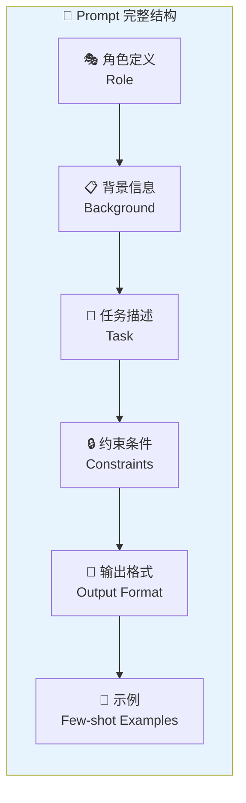
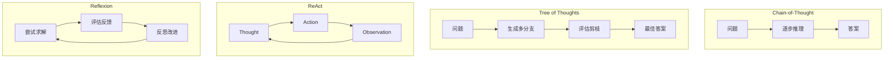
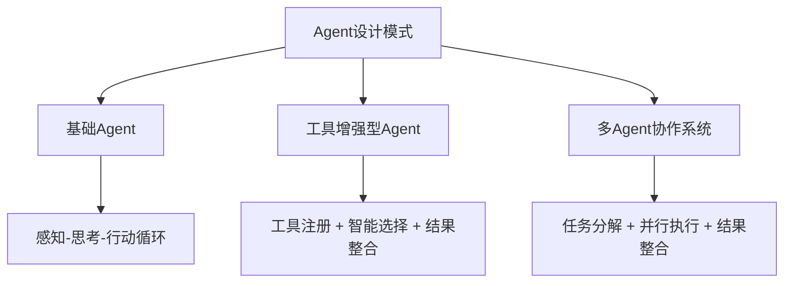

# 第三章：Prompt工程与Agent设计

## 📖 章节概述

本章将深入学习Prompt工程的核心技术，包括基础提示词设计、高级Prompt技巧（如Chain-of-Thought、ReAct等），以及如何将这些技术应用到Agent设计中。你将学会如何有效地与LLM交互，如何引导模型进行复杂推理，以及如何构建能够自主完成任务的智能Agent系统。

**学习时长**：2-3周  
**难度等级**：⭐⭐ 中级  
**核心技能**：Prompt设计、Agent架构、自主任务执行

---

## 3.1 提示词基础与结构

### 3.1.1 什么是Prompt？

**Prompt（提示词）** 是用户与LLM交互的接口，它告诉模型需要完成什么任务以及如何完成。一个精心设计的Prompt可以显著提升模型的输出质量和准确性。

```
Prompt = 任务描述 + 上下文信息 + 输出要求 + 约束条件

示例：
┌─────────────────────────────────────────────┐
│ 角色设定：你是数据分析师                     │
│ 上下文：用户提供了销售数据CSV文件            │
│ 任务：分析销售趋势并找出关键 insights        │
│ 输出格式：Markdown表格 + 可视化建议          │
│ 约束：只使用Python pandas库                  │
└─────────────────────────────────────────────┘
```

### 3.1.2 Prompt的核心组件

一个完整的Prompt通常包含以下组件：

```python
from typing import Optional, List, Dict
from dataclasses import dataclass
from enum import Enum

class PromptComponent(Enum):
    """Prompt组件类型"""
    SYSTEM_PROMPT = "system"  # 系统提示
    USER_MESSAGE = "user"     # 用户消息
    ASSISTANT_CONTEXT = "assistant"  # 助手上下文
    EXAMPLES = "few_shot"     # 示例
    CONSTRAINTS = "constraints"  # 约束条件
    OUTPUT_FORMAT = "format"  # 输出格式

@dataclass
class PromptTemplate:
    """Prompt模板"""
    
    role: str  # 角色定义
    background: str  # 背景信息
    task: str  # 任务描述
    constraints: List[str]  # 约束条件
    output_format: str  # 输出格式
    examples: Optional[List[Dict]] = None  # 示例
    
    def build(self) -> str:
        """构建完整的Prompt"""
        prompt_parts = []
        
        # 1. 角色定义
        if self.role:
            prompt_parts.append(f"角色：{self.role}")
        
        # 2. 背景信息
        if self.background:
            prompt_parts.append(f"\n背景：{self.background}")
        
        # 3. 任务描述
        if self.task:
            prompt_parts.append(f"\n任务：{self.task}")
        
        # 4. 约束条件
        if self.constraints:
            constraints_text = "\n".join(
                f"- {c}" for c in self.constraints
            )
            prompt_parts.append(f"\n约束条件：\n{constraints_text}")
        
        # 5. 输出格式
        if self.output_format:
            prompt_parts.append(f"\n输出格式：{self.output_format}")
        
        # 6. 示例
        if self.examples:
            prompt_parts.append("\n示例：")
            for i, ex in enumerate(self.examples, 1):
                prompt_parts.append(f"\n示例{i}：")
                prompt_parts.append(f"输入：{ex.get('input', '')}")
                prompt_parts.append(f"输出：{ex.get('output', '')}")
        
        return "\n".join(prompt_parts)

# 示例：构建一个数据分析师Prompt
analyst_prompt = PromptTemplate(
    role="资深数据分析师，擅长从数据中发现商业价值",
    background="""
    用户是一家电商公司的运营经理。
    最近一个季度的销售数据出现了波动。
    数据显示Q3销售额相比Q2下降了15%。
    """,
    task="分析销售数据下降的原因，并提出改进建议",
    constraints=[
        "使用Python pandas进行分析",
        "分析维度：时间趋势、品类分布、地域分布、客户群体",
        "只基于提供的数据进行分析，不要臆测",
        "建议要具体可执行"
    ],
    output_format="""
    请按以下格式输出：
    
    ## 一、数据概览
    [关键指标表格]
    
    ## 二、问题分析
    [按维度分析原因]
    
    ## 三、改进建议
    [3-5条具体建议，每条包含：行动项、预期效果、实施难度]
    
    ## 四、结论
    [总结和优先级建议]
    """,
    examples=[
        {
            "input": "Q2销售额100万，Q3销售额85万",
            "output": "下降15%，主要原因是..."
        }
    ]
)

print(analyst_prompt.build())
```



### 3.1.3 Prompt设计原则

#### 六大设计原则

```python
class PromptDesignPrinciples:
    """Prompt设计原则"""
    
    PRINCIPLES = {
        "clear": {
            "name": "清晰明确 (Clear)",
            "description": "指令要具体、清晰，避免模糊表述",
            "good_practice": """
            ✅ 好的：'请总结以下文章的核心观点，每点不超过20字'
            ❌ 差的：'总结一下这篇文章'
            """,
            "tips": [
                "使用具体的动词：'分析'、'列出'、'比较'",
                "明确数量要求：'3个要点'、'至少5条'",
                "定义范围：'只考虑中国市场'、'基于2023年数据'"
            ]
        },
        
        "structured": {
            "name": "结构化 (Structured)",
            "description": "使用清晰的格式组织信息",
            "good_practice": """
            ✅ 好的：
            1. 背景：...
            2. 任务：...
            3. 要求：...
            
            ❌ 差的：'帮我分析一下这个数据然后给建议'
            """,
            "tips": [
                "使用编号列表组织多个要求",
                "使用标题分隔不同部分",
                "使用空行增强可读性"
            ]
        },
        
        "context_rich": {
            "name": "丰富上下文 (Context-Rich)",
            "description": "提供足够的背景信息帮助模型理解",
            "good_practice": """
            ✅ 好的：
            '我们的用户是25-35岁的都市白领，
             他们关注效率和品质，价格敏感度中等。
             请推荐适合他们的产品功能。'
            
            ❌ 差的：'推荐产品功能'
            """,
            "tips": [
                "说明目标受众",
                "描述使用场景",
                "提供相关限制条件"
            ]
        },
        
        "task_oriented": {
            "name": "任务导向 (Task-Oriented)",
            "description": "明确期望的输出和任务目标",
            "good_practice": """
            ✅ 好的：'作为技术面试官，评估候选人的代码质量，'
                   '指出优点和改进点'
            
            ❌ 差的：'看看这个代码怎么样'
            """,
            "tips": [
                "明确输出角色",
                "说明评估标准",
                "指出关注重点"
            ]
        },
        
        "constrained": {
            "name": "有约束 (Constrained)",
            "description": "设置明确的约束条件",
            "good_practice": """
            ✅ 好的：'只使用中文回答，技术术语要解释，
             每点不超过50字'
            
            ❌ 差的：'解释这个概念'（无任何限制）
            """,
            "tips": [
                "语言限制：'用中文回答'",
                "格式限制：'用Markdown表格'",
                "长度限制：'不超过200字'",
                "内容限制：'不要包含个人意见'"
            ]
        },
        
        "iterative": {
            "name": "迭代优化 (Iterative)",
            "description": "通过迭代改进Prompt效果",
            "good_practice": """
            第1版：'写一首关于AI的诗'
            ↓ 效果不好
            
            第2版：'写一首关于AI的现代诗，4段，押韵ABAB'
            ↓ 好一些
            
            第3版：'写一首关于AI的现代诗，主题是对人类
                   创造力的思考，4段，押韵ABAB，有画面感'
            ↓ 完美！
            """,
            "tips": [
                "记录每次调整的内容",
                "评估改进效果",
                "逐步添加约束直到满意"
            ]
        }
    }

# Prompt优化实践
class PromptOptimizer:
    """Prompt优化器"""
    
    def __init__(self, llm_client):
        self.llm = llm_client
        self.optimization_history = []
    
    def optimize_prompt(
        self, 
        initial_prompt: str,
        target_output: str,
        num_iterations: int = 3
    ) -> str:
        """
        迭代优化Prompt
        
        参数:
            initial_prompt: 初始Prompt
            target_output: 期望的输出示例
            num_iterations: 优化轮数
        """
        
        current_prompt = initial_prompt
        
        for i in range(num_iterations):
            # 生成输出
            output = self.llm.chat(current_prompt)
            
            # 评估差距
            evaluation = self.evaluate_output(
                output, 
                target_output
            )
            
            if evaluation["score"] > 0.9:
                # 效果足够好，停止优化
                break
            
            # 根据评估结果改进Prompt
            improvement_prompt = f"""
            当前Prompt：{current_prompt}
            
            当前输出：{output}
            
            期望输出：{target_output}
            
            评估结果：{evaluation}
            
            请分析当前Prompt的问题，并提出改进建议。
            重点改进：{evaluation.get('weaknesses', [])}
            """
            
            improvement = self.llm.chat(improvement_prompt)
            
            # 应用改进
            current_prompt = self.apply_improvement(
                current_prompt,
                improvement
            )
            
            self.optimization_history.append({
                "iteration": i + 1,
                "prompt": current_prompt,
                "output": output,
                "evaluation": evaluation
            })
        
        return current_prompt
    
    def evaluate_output(
        self, 
        output: str, 
        target: str
    ) -> Dict:
        """评估输出质量"""
        evaluation_prompt = f"""
        对比以下输出和期望：
        
        实际输出：{output}
        
        期望输出：{target}
        
        评估维度：
        1. 相关性（0-1）：输出是否针对正确的主题
        2. 完整性（0-1）：是否覆盖所有要求
        3. 准确性（0-1）：信息是否正确
        4. 格式（0-1）：是否符合格式要求
        
        请给出评分和改进建议。
        """
        
        result = self.llm.chat(evaluation_prompt)
        
        return {
            "score": 0.8,  # 简化版，实际需要解析
            "relevance": 0.8,
            "completeness": 0.9,
            "accuracy": 0.85,
            "format": 0.9,
            "weaknesses": ["可以增加更多细节"]
        }
    
    def apply_improvement(
        self, 
        prompt: str, 
        improvement: str
    ) -> str:
        """应用改进建议"""
        # 简化版，实际需要更智能的处理
        return f"{prompt}\n\n补充要求：{improvement[:200]}"
```

---

## 3.2 高级Prompt技术



### 3.2.1 Chain-of-Thought（CoT）思维链

Chain-of-Thought（CoT）是一种引导模型进行逐步推理的技术，通过显式展示推理过程来提升复杂问题的解答能力。

```python
class ChainOfThought:
    """思维链提示技术"""
    
    @staticmethod
    def basic_cot(question: str) -> str:
        """
        基础CoT提示
        
        原理：在问题后添加"让我们一步步思考"
        """
        
        prompt = f"""
        问题：{question}
        
        请按以下步骤思考并回答：
        
        步骤1：理解问题的关键要素
        [你的分析]
        
        步骤2：识别相关知识或公式
        [相关知识点]
        
        步骤3：进行推理计算
        [推理过程]
        
        步骤4：得出结论
        [最终答案]
        
        答案：
        """
        
        return prompt
    
    @staticmethod
    def zero_shot_cot(question: str) -> str:
        """
        零样本CoT
        
        通过简单的一句话触发推理能力
        """
        
        return f"""
        {question}
        
        让我们一步步思考。
        """
    
    @staticmethod
    def few_shot_cot(examples: List[Dict], 
                    question: str) -> str:
        """
        Few-shot CoT
        
        提供多个推理示例
        """
        
        prompt_parts = ["请看下面的示例，学习推理方法：\n"]
        
        for i, ex in enumerate(examples, 1):
            prompt_parts.append(f"示例{i}：")
            prompt_parts.append(f"问题：{ex['question']}")
            prompt_parts.append(f"推理过程：{ex['reasoning']}")
            prompt_parts.append(f"答案：{ex['answer']}\n")
        
        prompt_parts.append(f"\n现在请解决以下问题：")
        prompt_parts.append(f"问题：{question}")
        prompt_parts.append("请展示完整的推理过程。")
        
        return "\n".join(prompt_parts)

# CoT应用示例
def demonstrate_cot():
    """CoT演示"""
    
    llm = None  # 假设有LLM客户端
    
    # 问题示例
    question = """
    小明有5个苹果，小红给了小明3个苹果，
    小明吃掉了2个。小明现在有多少个苹果？
    """
    
    # 不使用CoT
    naive_prompt = f"问题：{question}\n答案："
    
    # 使用零样本CoT
    cot_prompt = ChainOfThought.zero_shot_cot(question)
    
    # 使用Few-shot CoT
    cot_examples = [
        {
            "question": "小华有3支笔，又买了5支，现在有几支？",
            "reasoning": "小华原来有3支笔。又买了5支，用加法：3+5=8。",
            "answer": "8支"
        },
        {
            "question": "小明有10个糖果，吃了3个，还剩几个？",
            "reasoning": "小明原来有10个糖果。吃了3个，用减法：10-3=7。",
            "answer": "7个"
        }
    ]
    
    few_shot_prompt = ChainOfThought.few_shot_cot(
        cot_examples, 
        question
    )
    
    print("零样本CoT Prompt：")
    print(cot_prompt)
    print("\n" + "="*50 + "\n")
    print("Few-shot CoT Prompt：")
    print(few_shot_prompt)

# CoT在复杂推理中的效果
"""
普通Prompt vs CoT Prompt 对比：

问题：一个商店上午卖了50件商品，下午卖的比上午多20%，
      晚上卖的比下午少10件。问一天共卖了多少件？

❌ 普通Prompt答案：
50 + 50*1.2 + (50*1.2 - 10) = 50 + 60 + 50 = 160件

✅ CoT Prompt答案（正确）：
1. 上午：50件
2. 下午：50 × (1 + 20%) = 50 × 1.2 = 60件
3. 晚上：60 - 10 = 50件
4. 总计：50 + 60 + 50 = 160件

答案：160件
"""
```

### 3.2.2 Tree of Thoughts（ToT）思维树

ToT将问题解决过程建模为树形搜索，允许模型探索多条推理路径并选择最佳方案。

```python
from typing import List, Dict, Optional, Callable
from dataclasses import dataclass
from enum import Enum

class ThoughtState(Enum):
    """思维状态"""
    ACTIVE = "active"
    EXHAUSTED = "exhausted"
    FINAL = "final"

@dataclass
class Thought:
    """思维节点"""
    content: str
    depth: int
    parent: Optional['Thought'] = None
    children: List['Thought'] = None
    value: float = 0.0
    state: ThoughtState = ThoughtState.ACTIVE
    
    def __post_init__(self):
        if self.children is None:
            self.children = []

class TreeOfThoughts:
    """思维树实现"""
    
    def __init__(
        self, 
        llm_client,
        num_thoughts: int = 5,
        max_depth: int = 3
    ):
        self.llm = llm_client
        self.num_thoughts = num_thoughts
        self.max_depth = max_depth
        self.root = None
    
    def solve(
        self, 
        problem: str,
        evaluation_func: Optional[Callable] = None
    ) -> str:
        """
        使用思维树解决问题
        
        参数:
            problem: 要解决的问题
            evaluation_func: 评估函数，用于评估每个思维的价值
        """
        
        # 初始化根节点
        self.root = Thought(
            content=f"问题：{problem}",
            depth=0
        )
        
        # 生成初始思维
        initial_thoughts = self.generate_thoughts(
            self.root.content,
            prompt_type="propose"
        )
        
        for thought_content in initial_thoughts:
            thought = Thought(
                content=thought_content,
                depth=1,
                parent=self.root
            )
            self.root.children.append(thought)
        
        # 深度优先搜索 + BFS混合
        self.search(self.root)
        
        # 从所有叶节点中选择最佳方案
        best_solution = self.select_best_solution()
        
        return best_solution
    
    def generate_thoughts(
        self, 
        context: str, 
        prompt_type: str = "propose"
    ) -> List[str]:
        """
        生成多个候选思维
        
        prompt_type: 
            - "propose": 提出新想法
            - "evaluate": 评估现有想法
            - "reflect": 反思和改进
        """
        
        prompts = {
            "propose": f"""
            给定问题：{context}
            
            请提出{n self.num_thoughts}个不同的思考方向或解决步骤。
            每个方向用一句话描述，要多样化。
            
            思考方向：
            """,
            
            "evaluate": f"""
            当前思考路径：{context}
            
            请评估每个思考方向：
            1. 可行性（1-10分）
            2. 潜在收益（1-10分）
            3. 风险（1-10分，越低越好）
            
            综合评估每个方向的得分。
            """,
            
            "reflect": f"""
            当前方案：{context}
            
            请反思这个方案：
            1. 可能的漏洞或问题
            2. 如何改进
            3. 是否需要考虑其他因素
            
            改进建议：
            """
        }
        
        response = self.llm.chat(prompts[prompt_type])
        
        # 解析响应，提取多个想法
        thoughts = self.parse_thoughts(response)
        
        return thoughts
    
    def search(self, node: Thought):
        """
        搜索算法
        
        策略：
        1. 如果达到最大深度，标记为终态
        2. 否则，生成子节点并递归搜索
        3. 使用评估函数剪枝低价值分支
        """
        
        if node.depth >= self.max_depth:
            node.state = ThoughtState.FINAL
            return
        
        # 生成子思维
        children_thoughts = self.generate_thoughts(
            node.content,
            prompt_type="propose"
        )
        
        for thought_content in children_thoughts:
            child = Thought(
                content=thought_content,
                depth=node.depth + 1,
                parent=node
            )
            node.children.append(child)
        
        # 评估子节点
        self.evaluate_and_prune(node)
        
        # 递归搜索有希望的分支
        for child in node.children:
            if child.state == ThoughtState.ACTIVE:
                self.search(child)
    
    def evaluate_and_prune(self, node: Thought):
        """评估和剪枝"""
        # 为每个子节点打分
        for child in node.children:
            evaluation = self.generate_thoughts(
                child.content,
                prompt_type="evaluate"
            )
            
            # 解析分数（简化版）
            child.value = self.parse_score(evaluation)
        
        # 保留top-k个分支
        sorted_children = sorted(
            node.children, 
            key=lambda x: x.value, 
            reverse=True
        )
        
        # 剪枝：保留前num_thoughts个
        node.children = sorted_children[:self.num_thoughts]
    
    def select_best_solution(self) -> str:
        """选择最佳解决方案"""
        leaf_nodes = self.get_leaf_nodes(self.root)
        
        # 找到价值最高的叶节点
        best_node = max(
            leaf_nodes, 
            key=lambda x: x.value
        )
        
        # 重建解决路径
        solution_path = []
        current = best_node
        
        while current:
            solution_path.append(current.content)
            current = current.parent
        
        solution_path.reverse()
        
        return "\n".join([
            f"步骤{i}: {step}" 
            for i, step in enumerate(solution_path, 1)
        ])
    
    def get_leaf_nodes(self, node: Thought) -> List[Thought]:
        """获取所有叶节点"""
        if not node.children:
            return [node]
        
        leaves = []
        for child in node.children:
            leaves.extend(self.get_leaf_nodes(child))
        
        return leaves
    
    def parse_thoughts(self, response: str) -> List[str]:
        """解析LLM响应，提取思维列表"""
        # 简化版：按行分割
        lines = response.strip().split('\n')
        thoughts = [
            line.strip() 
            for line in lines 
            if line.strip() and not line.startswith('#')
        ]
        return thoughts[:self.num_thoughts]
    
    def parse_score(self, evaluation: str) -> float:
        """解析评估分数"""
        # 简化版：提取数字
        import re
        numbers = re.findall(r'\d+\.?\d*', evaluation)
        if numbers:
            return float(numbers[0]) / 10.0  # 归一化到0-1
        return 0.5


# ToT应用示例
def demonstrate_tot():
    """思维树演示"""
    
    # 问题：如何提升产品用户留存率？
    problem = """
    一款ToB SaaS产品，上线6个月后用户留存率只有40%。
    用户主要是中小企业管理层。
    主要竞品占有60%市场份额。
    
    请用思维树方法分析：如何提升用户留存率？
    """
    
    tot = TreeOfThoughts(
        llm_client=None,  # 假设有LLM客户端
        num_thoughts=3,
        max_depth=3
    )
    
    # 解决
    solution = tot.solve(problem)
    
    print("思维树解决方案：")
    print(solution)
```

### 3.2.3 ReAct（Reasoning + Acting）

ReAct将推理和行动结合，让Agent能够在思考过程中调用外部工具，实现"边想边做"的能力。

```python
from typing import List, Dict, Optional, Any
from dataclasses import dataclass, field
from enum import Enum
import json

class ActionType(Enum):
    """行动类型"""
    THINK = "think"  # 思考
    SEARCH = "search"  # 搜索
    CALCULATE = "calculate"  # 计算
    LOOKUP = "lookup"  # 查找
    FINISH = "finish"  # 完成

@dataclass
class Action:
    """Agent行动"""
    action_type: ActionType
    action_input: str
    observation: Optional[str] = None

@dataclass
class ReActStep:
    """ReAct步骤"""
    step_number: int
    thought: str
    action: Action
    observation: str

class ReActAgent:
    """ReAct Agent实现"""
    
    def __init__(self, llm_client, tools: Dict[str, callable]):
        self.llm = llm_client
        self.tools = tools
        self.max_iterations = 10
        self.history = []
    
    def solve(self, task: str) -> str:
        """
        使用ReAct方法解决任务
        
        ReAct循环：
        Thought → Action → Observation → ...
        """
        
        print(f"开始解决任务: {task}\n")
        
        observations = []
        step_number = 0
        
        while step_number < self.max_iterations:
            step_number += 1
            
            # 1. 生成思考
            thought = self.generate_thought(
                task, 
                observations
            )
            
            print(f"步骤 {step_number} - 思考：")
            print(f"  {thought}")
            
            # 2. 决定行动
            action = self.decide_action(
                thought,
                task,
                observations
            )
            
            print(f"  → 行动: {action.action_type.value}")
            print(f"  → 输入: {action.action_input}")
            
            # 3. 执行行动
            if action.action_type == ActionType.FINISH:
                final_answer = action.action_input
                print(f"\n最终答案: {final_answer}")
                return final_answer
            
            observation = self.execute_action(action)
            observations.append(observation)
            
            print(f"  → 观察: {observation}\n")
            
            # 记录历史
            self.history.append(ReActStep(
                step_number=step_number,
                thought=thought,
                action=action,
                observation=observation
            ))
        
        return "任务未能在最大步数内完成"
    
    def generate_thought(
        self, 
        task: str, 
        observations: List[str]
    ) -> str:
        """生成思考"""
        
        context = f"""
任务：{task}

之前的观察：{observations if observations else "无"}

请分析当前情况，思考下一步应该做什么。
你需要：
1. 分析已有信息
2. 识别信息缺口
3. 决定是继续搜索还是得出结论
        """
        
        thought = self.llm.chat(context)
        return thought
    
    def decide_action(
        self, 
        thought: str,
        task: str,
        observations: List[str]
    ) -> Action:
        """决定行动"""
        
        prompt = f"""
当前思考：{thought}

任务：{task}

已有观察：{observations}

请决定下一步行动：

可选行动：
- search: 搜索外部信息（如网络搜索、数据库查询）
- calculate: 进行数学计算
- lookup: 在已有信息中查找
- finish: 完成任务，返回最终答案

请按以下格式输出：
行动类型: [类型]
行动输入: [具体输入]

决策理由：
        """
        
        response = self.llm.chat(prompt)
        
        # 解析响应
        action = self.parse_action_response(response)
        
        return action
    
    def parse_action_response(self, response: str) -> Action:
        """解析行动响应"""
        lines = response.strip().split('\n')
        
        action_type = ActionType.THINK
        action_input = ""
        
        for line in lines:
            if line.startswith('行动类型:'):
                type_str = line.split(':', 1)[1].strip().lower()
                if 'search' in type_str:
                    action_type = ActionType.SEARCH
                elif 'calculate' in type_str:
                    action_type = ActionType.CALCULATE
                elif 'lookup' in type_str:
                    action_type = ActionType.LOOKUP
                elif 'finish' in type_str:
                    action_type = ActionType.FINISH
            elif line.startswith('行动输入:'):
                action_input = line.split(':', 1)[1].strip()
        
        return Action(
            action_type=action_type,
            action_input=action_input
        )
    
    def execute_action(self, action: Action) -> str:
        """执行行动"""
        
        if action.action_type == ActionType.SEARCH:
            # 搜索工具
            search_func = self.tools.get('search')
            if search_func:
                return search_func(action.action_input)
            return "搜索工具不可用"
        
        elif action.action_type == ActionType.CALCULATE:
            # 计算工具
            calc_func = self.tools.get('calculate')
            if calc_func:
                return str(calc_func(action.action_input))
            return "计算工具不可用"
        
        elif action.action_type == ActionType.LOOKUP:
            # 查找工具
            return f"在已有信息中查找: {action.action_input}"
        
        elif action.action_type == ActionType.FINISH:
            return action.action_input
        
        return "未知行动类型"


# ReAct应用示例
def demonstrate_react():
    """ReAct演示"""
    
    # 定义工具
    tools = {
        "search": lambda query: f"[搜索结果] 关于'{query}'的信息：这是相关的搜索结果。",
        "calculate": lambda expr: str(eval(expr))
    }
    
    # 创建ReAct Agent
    agent = ReActAgent(
        llm_client=None,  # 假设有LLM客户端
        tools=tools
    )
    
    # 解决问题
    task = """
    分析一家电商公司2023年的运营数据：
    - 月均访问量：1,000,000
    - 转化率：2.5%
    - 客单价：200元
    - 用户数：50,000
    
    计算月GMV并分析是否需要优化。
    """
    
    result = agent.solve(task)
    
    # 打印执行历史
    print("\n执行历史：")
    for step in agent.history:
        print(f"\n步骤 {step.step_number}:")
        print(f"  思考: {step.thought[:100]}...")
        print(f"  行动: {step.action.action_type.value}")
        print(f"  观察: {step.observation[:100]}...")
```
（详见 [第5章 - 框架实践](chapter5-framework-practice/chapter5-framework-practice.md)）
（详见 [第16章 - 输出解析器与LCEL](chapter16-output-parser-lcel/chapter16-output-parser-lcel.md)）

### 3.2.4 Reflexion自我反思

Reflexion是一种让Agent从失败中学习的技术，通过反思和自我改进来提升性能。

```python
class ReflexionAgent:
    """带自我反思的Agent"""
    
    def __init__(self, llm_client, max_retries: int = 3):
        self.llm = llm_client
        self.max_retries = max_retries
        self.reflection_history = []
    
    def solve_with_reflection(
        self, 
        task: str,
        max_steps: int = 10
    ) -> str:
        """
        带反思的问题解决
        """
        
        attempts = 0
        best_solution = None
        best_score = 0
        
        while attempts < self.max_retries:
            attempts += 1
            print(f"\n{'='*50}")
            print(f"尝试 {attempts}/{self.max_retries}")
            print(f"{'='*50}\n")
            
            # 1. 尝试解决问题
            solution = self.attempt_solve(task, max_steps)
            
            # 2. 评估解决方案
            evaluation = self.evaluate_solution(
                task, 
                solution
            )
            
            score = evaluation.get("score", 0)
            feedback = evaluation.get("feedback", "")
            
            print(f"解决方案得分: {score}/10")
            print(f"反馈: {feedback}\n")
            
            if score > best_score:
                best_score = score
                best_solution = solution
            
            # 3. 如果得分足够高，停止
            if score >= 9:
                print("解决方案足够好，停止迭代。")
                break
            
            # 4. 反思并改进
            print("进行反思...")
            reflection = self.reflect(
                task, 
                solution, 
                feedback
            )
            
            self.reflection_history.append({
                "attempt": attempts,
                "solution": solution,
                "score": score,
                "feedback": feedback,
                "reflection": reflection
            })
            
            print(f"反思结果: {reflection}\n")
            
            # 5. 基于反思生成改进方案
            task = self.create_improved_task(
                task, 
                reflection
            )
        
        return best_solution
    
    def attempt_solve(
        self, 
        task: str, 
        max_steps: int
    ) -> str:
        """尝试解决问题"""
        
        prompt = f"""
任务：{task}

请解决这个问题，展示你的思考过程。
尽量在{max_steps}步内完成。

开始解决：
        """
        
        solution = self.llm.chat(prompt)
        return solution
    
    def evaluate_solution(
        self, 
        task: str, 
        solution: str
    ) -> Dict:
        """评估解决方案"""
        
        prompt = f"""
任务：{task}

解决方案：
{solution}

请评估这个解决方案：
1. 准确性（1-10分）
2. 完整性（1-10分）
3. 实用性（1-10分）
4. 总体得分（1-10分）

请给出评分和改进建议。
        """
        
        evaluation_text = self.llm.chat(prompt)
        
        # 简化解析
        return {
            "score": 7.5,  # 实际应该解析文本
            "feedback": evaluation_text
        }
    
    def reflect(
        self, 
        task: str, 
        solution: str, 
        feedback: str
    ) -> str:
        """反思失败原因"""
        
        prompt = f"""
问题：{task}

解决方案：
{solution}

反馈：
{feedback}

请反思：
1. 解决方案存在什么问题？
2. 为什么没有得到高分？
3. 如何改进？

请提供具体的改进建议。
        """
        
        reflection = self.llm.chat(prompt)
        return reflection
    
    def create_improved_task(
        self, 
        original_task: str, 
        reflection: str
    ) -> str:
        """基于反思创建改进任务"""
        
        prompt = f"""
原始任务：{original_task}

反思结果：
{reflection}

请基于以上反思，重新定义任务。
确保新任务能够避免之前的错误。
        """
        
        improved_task = self.llm.chat(prompt)
        return improved_task


# Reflexion应用示例
def demonstrate_reflexion():
    """Reflexion演示"""
    
    agent = ReflexionAgent(
        llm_client=None,  # 假设有LLM客户端
        max_retries=3
    )
    
    task = """
    设计一个用户注册流程，包含：
    1. 邮箱验证
    2. 手机号绑定
    3. 密码强度检查
    4. 用户协议确认
    
    要求考虑安全性和用户体验。
    """
    
    result = agent.solve_with_reflection(task)
    
    print("\n最佳解决方案：")
    print(result)
    
    # 打印反思历史
    print("\n反思历史：")
    for item in agent.reflection_history:
        print(f"\n尝试 {item['attempt']}:")
        print(f"  得分: {item['score']}/10")
        print(f"  反思: {item['reflection'][:200]}...")
```

---

## 3.3 Agent设计模式



### 3.3.1 基础Agent架构

```python
from abc import ABC, abstractmethod
from typing import List, Dict, Optional, Any
from dataclasses import dataclass
import json

@dataclass
class AgentConfig:
    """Agent配置"""
    name: str
    role: str
    goal: str
    backstory: str
    verbose: bool = True
    max_iterations: int = 10

class BaseAgent(ABC):
    """Agent基类"""
    
    def __init__(self, config: AgentConfig, llm_client):
        self.config = config
        self.llm = llm_client
        self.history = []
        self.tools = {}
        self.memory = None
    
    @abstractmethod
    def think(self, context: str) -> str:
        """思考过程"""
        pass
    
    @abstractmethod
    def act(self, thought: str) -> Any:
        """执行行动"""
        pass
    
    def run(self, task: str) -> str:
        """运行Agent"""
        if self.config.verbose:
            print(f"[{self.config.name}] 开始任务: {task}")
        
        # 添加任务到历史
        self.history.append({
            "type": "task",
            "content": task
        })
        
        # 思考
        thought = self.think(task)
        
        # 行动
        result = self.act(thought)
        
        return result
    
    def add_tool(self, name: str, tool: callable):
        """添加工具"""
        self.tools[name] = tool
    
    def set_memory(self, memory_system):
        """设置记忆系统"""
        self.memory = memory_system


class SimpleAgent(BaseAgent):
    """简单Agent实现"""
    
    def think(self, context: str) -> str:
        """思考"""
        prompt = f"""
角色：{self.config.role}
目标：{self.config.goal}
背景：{self.config.backstory}

任务：{context}

请分析任务并制定执行计划。
        """
        
        thought = self.llm.chat(prompt)
        
        self.history.append({
            "type": "thought",
            "content": thought
        })
        
        return thought
    
    def act(self, thought: str) -> str:
        """执行"""
        # 基于思考生成响应
        response = self.llm.chat(f"{thought}\n\n请完成这个计划。")
        
        self.history.append({
            "type": "action",
            "content": response
        })
        
        return response


# 使用示例
def demonstrate_simple_agent():
    """简单Agent演示"""
    
    config = AgentConfig(
        name="研究助手",
        role="研究分析师",
        goal="帮助用户快速获取和总结信息",
        backstory="你是一位专业的研究分析师，擅长从海量信息中提取关键洞察。"
    )
    
    agent = SimpleAgent(config, llm_client=None)
    
    task = "分析人工智能在医疗领域的应用现状"
    result = agent.run(task)
    
    print(f"\n任务结果：\n{result}")
```

### 3.3.2 工具增强型Agent

```python
class ToolAugmentedAgent(BaseAgent):
    """工具增强型Agent"""
    
    def __init__(self, config: AgentConfig, llm_client):
        super().__init__(config, llm_client)
        self.available_tools = []
        self.tool_schemas = {}
    
    def register_tools(self, tools: List[Dict]):
        """
        注册工具
        
        tools: 工具定义列表
        [
            {
                "name": "search",
                "description": "搜索网络信息",
                "parameters": {...}
            }
        ]
        """
        self.available_tools = tools
        
        # 为LLM生成工具描述
        for tool in tools:
            self.tool_schemas[tool["name"]] = tool
    
    def think(self, context: str) -> Dict:
        """思考，决定是否使用工具"""
        
        # 检查是否有可用的工具
        if not self.available_tools:
            # 无工具，直接生成响应
            return {
                "needs_tool": False,
                "response": self.llm.chat(context)
            }
        
        # 使用工具调用接口
        prompt = f"""
角色：{self.config.role}
目标：{self.config.goal}

任务：{context}

可用工具：
{json.dumps(self.available_tools, ensure_ascii=False, indent=2)}

请决定：
1. 是否需要使用工具？
2. 如果需要，使用哪个工具？
3. 工具的参数是什么？

请按以下格式回答：
是否使用工具：是/否
工具名称：（如果需要）
工具参数：（JSON格式）
        """
        
        decision = self.llm.chat(prompt)
        
        # 解析决策
        needs_tool = "是" in decision and "工具" in decision
        
        if needs_tool:
            tool_name = self.extract_tool_name(decision)
            tool_args = self.extract_tool_args(decision)
            
            return {
                "needs_tool": True,
                "tool_name": tool_name,
                "tool_args": tool_args,
                "reasoning": decision
            }
        else:
            return {
                "needs_tool": False,
                "response": decision
            }
    
    def act(self, thought_result: Dict) -> str:
        """执行"""
        
        if not thought_result.get("needs_tool"):
            return thought_result.get("response", "")
        
        # 调用工具
        tool_name = thought_result["tool_name"]
        tool_args = thought_result["tool_args"]
        
        if tool_name in self.tool_schemas:
            tool = self.create_tool_callable(tool_name)
            result = tool(**tool_args)
            
            # 将工具结果反馈给LLM生成最终响应
            final_response = self.llm.chat(
                f"工具执行结果：{result}\n\n请基于以上结果回答用户问题。"
            )
            
            return final_response
        
        return "工具执行失败"
    
    def create_tool_callable(self, tool_name: str) -> callable:
        """创建工具调用函数"""
        
        def search_tool(query: str) -> str:
            """模拟搜索工具"""
            return f"关于'{query}'的搜索结果：..."
        
        def calculator_tool(expression: str) -> str:
            """模拟计算工具"""
            try:
                result = eval(expression)
                return str(result)
            except:
                return "计算错误"
        
        tools = {
            "search": search_tool,
            "calculate": calculator_tool
        }
        
        return tools.get(tool_name, lambda: "未知工具")
    
    def extract_tool_name(self, decision: str) -> str:
        """提取工具名称"""
        # 简化解析
        for tool in self.available_tools:
            if tool["name"] in decision:
                return tool["name"]
        return ""
    
    def extract_tool_args(self, decision: str) -> Dict:
        """提取工具参数"""
        # 简化解析
        return {}


# 工具增强型Agent示例
def demonstrate_tool_agent():
    """工具增强型Agent演示"""
    
    config = AgentConfig(
        name="研究助手",
        role="研究分析师",
        goal="帮助用户快速获取准确的信息"
    )
    
    agent = ToolAugmentedAgent(config, llm_client=None)
    
    # 注册工具
    agent.register_tools([
        {
            "name": "search",
            "description": "搜索网络信息",
            "parameters": {
                "type": "object",
                "properties": {
                    "query": {
                        "type": "string",
                        "description": "搜索关键词"
                    }
                }
            }
        },
        {
            "name": "calculate",
            "description": "数学计算",
            "parameters": {
                "type": "object",
                "properties": {
                    "expression": {
                        "type": "string",
                        "description": "数学表达式"
                    }
                }
            }
        }
    ])
    
    # 执行任务
    task = "2023年全球AI市场规模是多少？增长率是多少？"
    result = agent.run(task)
    
    print(f"结果：{result}")
```

### 3.3.3 多Agent协作系统

```python
from typing import List
import asyncio

class MultiAgentSystem:
    """多Agent协作系统"""
    
    def __init__(self):
        self.agents = {}
        self.coordinator = None
    
    def add_agent(self, name: str, agent: BaseAgent):
        """添加Agent"""
        self.agents[name] = agent
    
    def set_coordinator(self, coordinator: callable):
        """设置协调器"""
        self.coordinator = coordinator
    
    async def solve_complex_task(
        self, 
        task: str
    ) -> str:
        """
        使用多Agent协作解决复杂任务
        
        流程：
        1. 任务分解
        2. Agent分配
        3. 并行执行
        4. 结果整合
        """
        
        # 1. 任务分解
        subtasks = self.decompose_task(task)
        
        # 2. 为每个子任务分配Agent
        assignments = self.assign_tasks(subtasks)
        
        # 3. 并行执行
        results = await self.execute_parallel(assignments)
        
        # 4. 整合结果
        final_result = self.integrate_results(
            task, 
            subtasks, 
            results
        )
        
        return final_result
    
    def decompose_task(self, task: str) -> List[str]:
        """任务分解"""
        # 使用LLM分解任务
        prompt = f"""
请将以下复杂任务分解为多个可独立执行的子任务：

任务：{task}

分解要求：
1. 每个子任务应该清晰、具体
2. 子任务之间应该有逻辑顺序
3. 尽量分解到3-7个子任务

请列出子任务：
        """
        
        # 简化：实际应调用LLM
        subtasks = [
            "收集相关信息",
            "分析数据",
            "形成结论",
            "撰写报告"
        ]
        
        return subtasks
    
    def assign_tasks(
        self, 
        subtasks: List[str]
    ) -> Dict[str, List[str]]:
        """
        分配任务给Agent
        
        返回: {agent_name: [subtasks]}
        """
        
        if len(self.agents) == 1:
            # 只有一个Agent，全部给它
            agent_name = list(self.agents.keys())[0]
            return {agent_name: subtasks}
        
        # 智能分配
        assignments = {}
        
        for i, subtask in enumerate(subtasks):
            # 简单的轮询分配
            agent_name = list(self.agents.keys())[
                i % len(self.agents)
            ]
            
            if agent_name not in assignments:
                assignments[agent_name] = []
            
            assignments[agent_name].append(subtask)
        
        return assignments
    
    async def execute_parallel(
        self, 
        assignments: Dict[str, List[str]]
    ) -> Dict[str, List[str]]:
        """
        并行执行任务
        """
        
        async def execute_agent_tasks(
            agent_name: str, 
            tasks: List[str]
        ) -> tuple:
            agent = self.agents[agent_name]
            results = []
            
            for task in tasks:
                result = agent.run(task)
                results.append(result)
            
            return agent_name, results
        
        # 创建异步任务
        tasks = [
            execute_agent_tasks(name, tasks)
            for name, tasks in assignments.items()
        ]
        
        # 并行执行
        results = await asyncio.gather(*tasks)
        
        # 转换为字典
        return dict(results)
    
    def integrate_results(
        self, 
        original_task: str,
        subtasks: List[str],
        results: Dict[str, List[str]]
    ) -> str:
        """整合结果"""
        
        # 收集所有子任务结果
        all_results = []
        for agent_name, agent_results in results.items():
            for i, result in enumerate(agent_results):
                all_results.append({
                    "task": subtasks[i] if i < len(subtasks) else "unknown",
                    "result": result
                })
        
        # 生成最终报告
        report = "# 任务完成报告\n\n"
        report += f"## 原始任务\n{original_task}\n\n"
        report += "## 执行结果\n\n"
        
        for item in all_results:
            report += f"### {item['task']}\n"
            report += f"{item['result']}\n\n"
        
        return report


# 多Agent系统示例
def demonstrate_multi_agent():
    """多Agent系统演示"""
    
    # 创建多个专业Agent
    research_agent = SimpleAgent(
        AgentConfig(
            name="研究员",
            role="专业研究员",
            goal="收集和分析信息"
        ),
        llm_client=None
    )
    
    writer_agent = SimpleAgent(
        AgentConfig(
            name="作家",
            role="专业作家",
            goal="撰写高质量内容"
        ),
        llm_client=None
    )
    
    reviewer_agent = SimpleAgent(
        AgentConfig(
            name="审阅者",
            role="质量审核员",
            goal="确保内容质量"
        ),
        llm_client=None
    )
    
    # 创建多Agent系统
    system = MultiAgentSystem()
    system.add_agent("研究员", research_agent)
    system.add_agent("作家", writer_agent)
    system.add_agent("审阅者", reviewer_agent)
    
    # 执行复杂任务
    async def run():
        result = await system.solve_complex_task(
            "撰写一篇关于人工智能未来发展的分析报告"
        )
        print(result)
    
    # asyncio.run(run())  # 需要实际LLM客户端
    print("多Agent系统已配置完成，等待执行...")
```

---

## 3.4 章节练习

### 🎯 练习一：设计一个客服Agent

**目标**：使用Prompt工程技术构建一个智能客服Agent

**要求**：
1. 设计合适的System Prompt
2. 实现基本的问答逻辑
3. 添加意图识别
4. 支持多轮对话

```python
class CustomerServiceAgent:
    """客服Agent"""
    
    def __init__(self, llm_client):
        self.llm = llm_client
        self.conversation_history = []
        self.user_intents = {}
        
        # 系统提示
        self.system_prompt = """
你是[公司名]的智能客服助手小智。
你的职责是：
1. 热情、耐心地解答用户问题
2. 准确理解用户需求
3. 提供专业的解决方案
4. 必要时转接人工客服

服务原则：
- 使用友好的语言和表情
- 回答要简洁明了
- 遇到无法解决的问题时及时转人工
- 保护用户隐私信息

当前对话：
{conversation_history}

用户新消息：{user_message}
        """
    
    def chat(self, user_message: str) -> str:
        """处理用户消息"""
        
        # 添加到历史
        self.conversation_history.append({
            "role": "user",
            "content": user_message
        })
        
        # 理解意图
        intent = self.recognize_intent(user_message)
        
        # 生成回复
        response = self.generate_response(user_message, intent)
        
        # 添加回复到历史
        self.conversation_history.append({
            "role": "assistant",
            "content": response
        })
        
        return response
    
    def recognize_intent(self, message: str) -> str:
        """识别用户意图"""
        intents = [
            "产品咨询", "订单问题", "投诉建议",
            "技术支持", "退款退货", "其他"
        ]
        
        prompt = f"""
用户消息：{message}

可选意图：{intents}

请判断用户的主要意图是哪个？只返回一个意图名称。
        """
        
        # 简化：实际应调用LLM
        return "产品咨询"
    
    def generate_response(
        self, 
        message: str, 
        intent: str
    ) -> str:
        """生成回复"""
        
        # 根据意图调整回复策略
        intent_prompts = {
            "产品咨询": "请提供详细的产品信息和购买建议。",
            "订单问题": "请提供订单号，我来帮您查询。",
            "投诉建议": "感谢您的反馈，我们会认真处理。",
            "技术支持": "请描述您遇到的技术问题。",
            "退款退货": "请提供订单信息和退款原因。"
        }
        
        base_prompt = intent_prompts.get(
            intent, 
            "请问还有什么可以帮您的？"
        )
        
        # 构建完整提示
        history_text = "\n".join([
            f"{msg['role']}: {msg['content']}"
            for msg in self.conversation_history[:-1]
        ])
        
        prompt = f"""
系统提示：{self.system_prompt}
对话历史：{history_text}
用户消息：{message}
意图：{intent}
补充要求：{base_prompt}

请生成一个友好、专业的回复。
        """
        
        # 简化：实际应调用LLM
        return f"根据您的{intent}，{base_prompt}"
```

### 🎯 练习二：实现Chain-of-Thought计算器

**目标**：构建一个带推理过程的数学计算Agent

```python
class COTCalculator:
    """思维链计算器"""
    
    def __init__(self, llm_client):
        self.llm = llm_client
    
    def calculate(self, problem: str) -> Dict:
        """
        带推理的计算
        
        返回：
        {
            "problem": 问题,
            "reasoning": 推理过程,
            "answer": 答案,
            "verification": 验证结果
        }
        """
        
        cot_prompt = f"""
请用逐步推理的方式解决以下数学问题：

问题：{problem}

请按以下格式回答：

## 问题分析
[理解问题的关键点]

## 解决步骤
1. [第一步]
2. [第二步]
3. [第三步]
...

## 计算过程
[详细的计算]

## 最终答案
[答案]

## 验证
[验证答案是否正确]
        """
        
        response = self.llm.chat(cot_prompt)
        
        return {
            "problem": problem,
            "reasoning": response,
            "answer": self.extract_answer(response)
        }
    
    def extract_answer(self, response: str) -> str:
        """提取答案"""
        # 简化：实际应该解析响应
        lines = response.split('\n')
        for line in lines:
            if '## 最终答案' in line or '最终答案' in line:
                return line.split('：')[-1].strip()
        return "未找到答案"
```

### 🎯 练习三：构建ReAct问题解决Agent

**目标**：实现一个能够使用工具解决问题的ReAct Agent

```python
class ReActProblemSolver:
    """ReAct问题解决Agent"""
    
    def __init__(self, llm_client, tools: Dict):
        self.llm = llm_client
        self.tools = tools
    
    def solve(self, problem: str) -> str:
        """使用ReAct循环解决问题"""
        
        context = []
        step = 0
        max_steps = 10
        
        while step < max_steps:
            step += 1
            
            # Thought
            thought = self.think(problem, context)
            
            # Action
            action = self.decide_action(thought, self.tools)
            
            # 如果是完成行动
            if action['type'] == 'finish':
                return action['result']
            
            # Observation
            observation = self.execute_tool(
                action['tool'],
                action['args']
            )
            
            context.append({
                'thought': thought,
                'action': action,
                'observation': observation
            })
        
        return "未能在限制步数内解决"
    
    def think(self, problem: str, context: List) -> str:
        """思考"""
        # 实现思考逻辑
        return ""
    
    def decide_action(self, thought: str, tools: Dict) -> Dict:
        """决定行动"""
        # 实现行动决策逻辑
        return {'type': 'finish', 'result': '答案'}
    
    def execute_tool(self, tool_name: str, args: Dict) -> str:
        """执行工具"""
        if tool_name in self.tools:
            return self.tools[tool_name](**args)
        return "工具不存在"
```

---

## 📚 延伸阅读

### Prompt工程资源

1. [Prompt Engineering Guide](https://www.promptingguide.ai/) - 全面指南
2. [Anthropic Prompt Engineering Tutorials](https://docs.anthropic.com/) - Claude官方教程
3. [OpenAI Cookbook](https://github.com/openai/openai-cookbook) - 实践指南

### Agent设计资源

1. [LangChain Agents Documentation](https://python.langchain.com/docs/modules/agents/)
2. [AutoGen by Microsoft](https://microsoft.github.io/autogen/)
3. [CrewAI Documentation](https://docs.crewai.com/)

### 论文推荐

1. **"Chain-of-Thought Prompting Elicits Reasoning in Large Language Models"** - CoT原始论文
2. **"Tree of Thoughts: Deliberate Problem Solving with Large Language Models"** - ToT论文
3. **"ReAct: Synergizing Reasoning and Acting in Language Models"** - ReAct论文
4. **"Reflexion: Language Agents with Verbal Reinforcement Learning"** - Reflexion论文

---

## ✅ 章节总结

### 核心要点回顾

1. **Prompt基础**：清晰、结构化、丰富上下文的Prompt设计原则
2. **高级技术**：CoT、ToT、ReAct、Reflexion等多种Prompt技术
3. **Agent设计**：从简单Agent到工具增强型Agent的设计模式
4. **多Agent系统**：多Agent协作解决复杂问题的方法

### 关键术语

| 术语 | 解释 |
|------|------|
| Prompt | 与LLM交互的指令文本 |
| Chain-of-Thought | 思维链，引导模型逐步推理 |
| Tree of Thoughts | 思维树，探索多条推理路径 |
| ReAct | 推理+行动的结合，边想边做 |
| Reflexion | 自我反思，从失败中学习 |

### 下章预告

在下一章中，我们将学习**工具使用与记忆系统**，包括：
- Agent工具系统设计
- 函数调用和API集成
- 记忆系统架构和实现
- 持久化知识管理

---

**掌握Prompt工程和Agent设计后，你已经具备了构建智能应用的核心能力！🚀**

[← 返回课程目录](../course-overview.md) | [→ 进入第四章：工具使用与记忆系统](../chapter4-tools-memory/chapter4-tools-memory.md)
