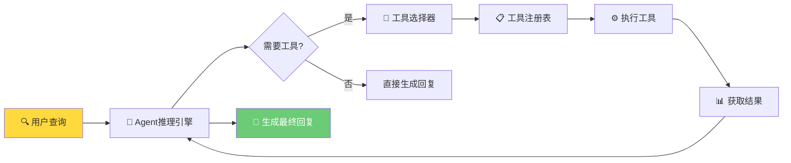
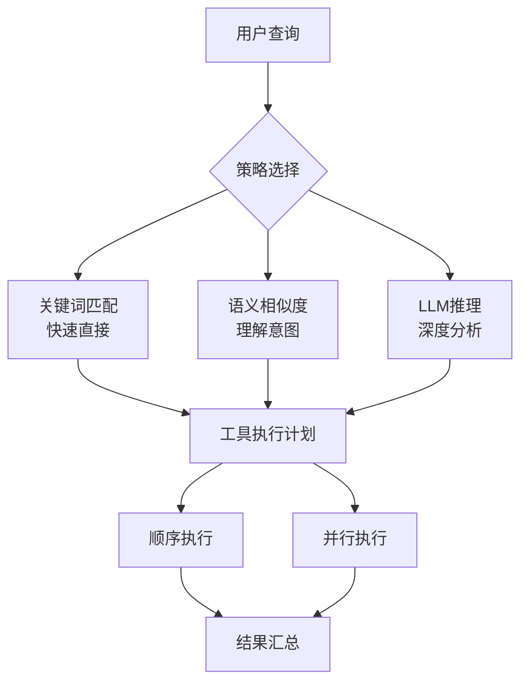
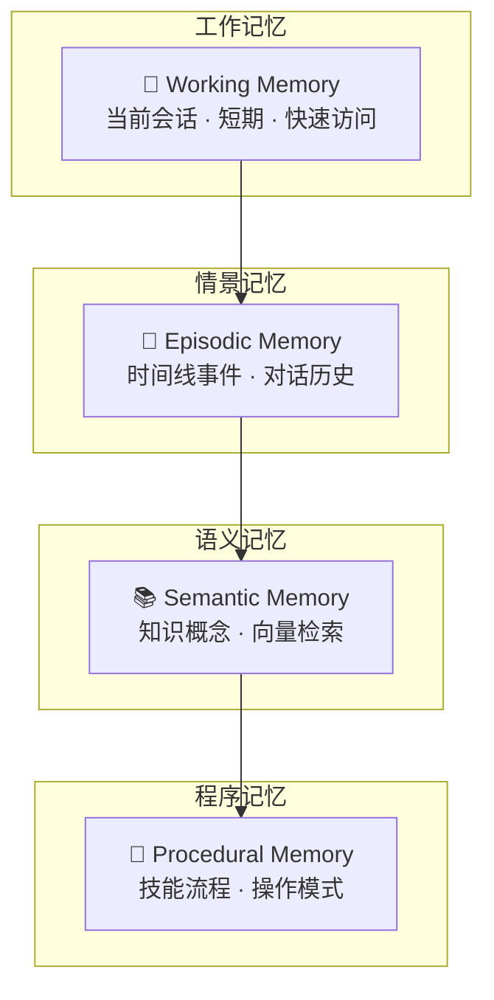

# 第四章：工具使用与记忆系统

## 📖 章节概述

本章将深入学习Agent的两大核心能力：工具使用和记忆系统。你将学会如何设计和使用工具来扩展Agent的能力边界，以及如何构建有效的记忆系统来实现持久化和上下文理解。这两个组件是现代Agent系统不可或缺的组成部分。

**学习时长**：2-3周  
**难度等级**：⭐⭐⭐ 中高级  
**核心技能**：工具注册、函数调用、记忆架构、向量检索

---

## 4.1 Agent工具系统设计

### 4.1.1 工具系统的核心概念

工具系统是Agent与外部世界交互的桥梁，它让Agent能够执行超越纯文本生成的实际操作：

```
┌─────────────────────────────────────────────────────┐
│                  Agent 核心                         │
├─────────────────────────────────────────────────────┤
│                                                     │
│   ┌─────────────┐                                  │
│   │  推理引擎   │                                  │
│   └──────┬──────┘                                  │
│          │                                          │
│          ▼                                          │
│   ┌─────────────┐     ┌─────────────────────────┐   │
│   │  工具选择   │────▶│     工具系统            │   │
│   └─────────────┘     ├─────────────────────────┤   │
│                       │  搜索工具              │   │
│                       │  计算工具              │   │
│                       │  API调用工具           │   │
│                       │  数据库查询工具         │   │
│                       │  文件操作工具          │   │
│                       └─────────────────────────┘   │
└─────────────────────────────────────────────────────┘
```



### 4.1.2 工具定义与注册

```python
from typing import Dict, List, Optional, Callable, Any
from dataclasses import dataclass, field
from enum import Enum
import json
from datetime import datetime

class ToolType(Enum):
    """工具类型"""
    SEARCH = "search"          # 搜索工具
    CALCULATOR = "calculator"  # 计算工具
    API_CALL = "api_call"      # API调用
    DATABASE = "database"       # 数据库查询
    FILE_SYSTEM = "file"        # 文件操作
    CODE_EXECUTION = "code"    # 代码执行

@dataclass
class ToolParameter:
    """工具参数定义"""
    name: str
    type: str  # "string", "integer", "number", "boolean", "array", "object"
    description: str
    required: bool = True
    default: Any = None
    enum_values: Optional[List[Any]] = None

@dataclass
class Tool:
    """工具定义"""
    name: str
    description: str
    parameters: List[ToolParameter]
    tool_type: ToolType
    handler: Optional[Callable] = None
    metadata: Dict[str, Any] = field(default_factory=dict)
    
    def to_openai_schema(self) -> Dict:
        """转换为OpenAI函数调用格式"""
        properties = {}
        required_params = []
        
        for param in self.parameters:
            param_dict = {
                "type": param.type,
                "description": param.description
            }
            
            if param.enum_values:
                param_dict["enum"] = param.enum_values
            
            properties[param.name] = param_dict
            
            if param.required:
                required_params.append(param.name)
        
        return {
            "type": "function",
            "function": {
                "name": self.name,
                "description": self.description,
                "parameters": {
                    "type": "object",
                    "properties": properties,
                    "required": required_params
                }
            }
        }

class ToolRegistry:
    """工具注册表"""
    
    def __init__(self):
        self.tools: Dict[str, Tool] = {}
        self.tool_handlers: Dict[str, Callable] = {}
    
    def register(self, tool: Tool) -> None:
        """注册工具"""
        if tool.name in self.tools:
            raise ValueError(f"工具 {tool.name} 已存在")
        
        self.tools[tool.name] = tool
        if tool.handler:
            self.tool_handlers[tool.name] = tool.handler
    
    def register_handler(
        self, 
        name: str, 
        handler: Callable,
        description: str = "",
        parameters: Optional[List[ToolParameter]] = None
    ) -> None:
        """注册工具处理器"""
        
        tool = Tool(
            name=name,
            description=description,
            parameters=parameters or [],
            tool_type=ToolType.API_CALL,
            handler=handler
        )
        
        self.register(tool)
    
    def get_tool(self, name: str) -> Optional[Tool]:
        """获取工具"""
        return self.tools.get(name)
    
    def get_all_tools(self) -> List[Tool]:
        """获取所有工具"""
        return list(self.tools.values())
    
    def get_tools_schema(self) -> List[Dict]:
        """获取所有工具的OpenAI格式"""
        return [tool.to_openai_schema() 
                for tool in self.tools.values()]
    
    def execute_tool(
        self, 
        name: str, 
        arguments: Dict[str, Any]
    ) -> Any:
        """执行工具"""
        
        if name not in self.tool_handlers:
            raise ValueError(f"工具 {name} 未注册处理器")
        
        handler = self.tool_handlers[name]
        
        try:
            result = handler(**arguments)
            
            return {
                "success": True,
                "result": result,
                "tool": name,
                "timestamp": datetime.now().isoformat()
            }
        except Exception as e:
            return {
                "success": False,
                "error": str(e),
                "tool": name,
                "timestamp": datetime.now().isoformat()
            }
    
    def list_tools(self) -> List[Dict]:
        """列出所有工具"""
        return [
            {
                "name": tool.name,
                "description": tool.description,
                "type": tool.tool_type.value,
                "parameters": len(tool.parameters)
            }
            for tool in self.tools.values()
        ]


# 工具注册示例
def setup_tools():
    """设置工具系统"""
    
    registry = ToolRegistry()
    
    # 注册搜索工具
    def search_handler(query: str, limit: int = 5) -> List[Dict]:
        """模拟搜索功能"""
        return [
            {
                "title": f"结果 {i+1}",
                "url": f"https://example.com/{i}",
                "snippet": f"关于 '{query}' 的搜索结果..."
            }
            for i in range(limit)
        ]
    
    registry.register_handler(
        name="search",
        handler=search_handler,
        description="搜索互联网获取最新信息",
        parameters=[
            ToolParameter(
                name="query",
                type="string",
                description="搜索关键词",
                required=True
            ),
            ToolParameter(
                name="limit",
                type="integer",
                description="返回结果数量",
                required=False,
                default=5
            )
        ]
    )
    
    # 注册计算器工具
    def calculator_handler(expression: str) -> str:
        """数学计算"""
        try:
            result = eval(expression)
            return str(result)
        except Exception as e:
            return f"计算错误: {str(e)}"
    
    registry.register_handler(
        name="calculate",
        handler=calculator_handler,
        description="执行数学计算",
        parameters=[
            ToolParameter(
                name="expression",
                type="string",
                description="数学表达式",
                required=True
            )
        ]
    )
    
    # 注册天气查询工具
    def weather_handler(city: str, country: str = "China") -> Dict:
        """查询天气（模拟）"""
        return {
            "city": city,
            "country": country,
            "temperature": 25,
            "condition": "晴朗",
            "humidity": 60,
            "timestamp": datetime.now().isoformat()
        }
    
    registry.register_handler(
        name="get_weather",
        handler=weather_handler,
        description="获取指定城市的天气信息",
        parameters=[
            ToolParameter(
                name="city",
                type="string",
                description="城市名称",
                required=True
            ),
            ToolParameter(
                name="country",
                type="string",
                description="国家名称",
                required=False,
                default="China"
            )
        ]
    )
    
    return registry


# 使用示例
registry = setup_tools()
print("已注册工具:")
for tool in registry.list_tools():
    print(f"  - {tool['name']}: {tool['description']}")
```

### 4.1.3 工具选择与执行策略

```python
from typing import Optional, List, Dict, Any
import re

class ToolSelector:
    """工具选择器"""
    
    def __init__(self, llm_client, registry: ToolRegistry):
        self.llm = llm_client
        self.registry = registry
    
    def select_tools(
        self, 
        query: str, 
        max_tools: int = 3
    ) -> List[Tool]:
        """
        根据查询选择合适的工具
        
        策略：
        1. 关键词匹配
        2. 语义相似度
        3. LLM推理
        """
        
        # 策略1：关键词匹配
        keyword_tools = self.keyword_match(query)
        
        if keyword_tools:
            return keyword_tools[:max_tools]
        
        # 策略2：LLM选择
        llm_tools = self.llm_select_tools(query, max_tools)
        
        return llm_tools
    
    def keyword_match(self, query: str) -> List[Tool]:
        """关键词匹配工具"""
        keywords = {
            "search": ["搜索", "查找", "查询", "寻找"],
            "calculate": ["计算", "数学", "运算", "+", "-", "*", "/"],
            "get_weather": ["天气", "温度", "气候", "下雨"]
        }
        
        matched_tools = []
        
        for tool in self.registry.get_all_tools():
            for keyword_list in keywords.values():
                if any(kw in query.lower() 
                       for kw in keyword_list):
                    matched_tools.append(tool)
                    break
        
        return matched_tools
    
    def llm_select_tools(
        self, 
        query: str, 
        max_tools: int
    ) -> List[Tool]:
        """使用LLM选择工具"""
        
        available_tools = self.registry.get_tools_schema()
        tools_json = json.dumps(available_tools, 
                                ensure_ascii=False, 
                                indent=2)
        
        prompt = f"""
用户查询：{query}

可用工具：
{tools_json}

请分析用户查询，选择最合适的工具（最多{max_tools}个）。
如果不需要工具，请返回空列表。

选择标准：
1. 工具是否能帮助回答用户问题
2. 工具的参数是否可以从查询中获取
3. 选择最直接、最有效的工具

请按以下JSON格式返回：
{{"selected_tools": ["tool_name1", "tool_name2"]}}
        """
        
        response = self.llm.chat(prompt)
        
        # 解析响应
        try:
            result = json.loads(response)
            selected_names = result.get("selected_tools", [])
            
            selected_tools = [
                self.registry.get_tool(name)
                for name in selected_names
                if self.registry.get_tool(name)
            ]
            
            return selected_tools
        except:
            return []
    
    def plan_tool_usage(
        self, 
        query: str
    ) -> List[Dict[str, Any]]:
        """
        规划工具使用顺序
        
        返回工具使用计划
        """
        
        selected_tools = self.select_tools(query)
        
        if not selected_tools:
            return []
        
        plan = []
        
        for tool in selected_tools:
            plan.append({
                "tool": tool.name,
                "reasoning": self.get_tool_reasoning(
                    query, 
                    tool
                ),
                "parameters": self.extract_parameters(
                    query, 
                    tool
                )
            })
        
        return plan
    
    def get_tool_reasoning(
        self, 
        query: str, 
        tool: Tool
    ) -> str:
        """获取工具使用推理"""
        
        prompt = f"""
用户查询：{query}

选择的工具：{tool.name}
工具描述：{tool.description}

请解释为什么这个工具能帮助回答用户查询。
        """
        
        reasoning = self.llm.chat(prompt)
        return reasoning
    
    def extract_parameters(
        self, 
        query: str, 
        tool: Tool
    ) -> Dict[str, Any]:
        """从查询中提取工具参数"""
        
        parameters = {}
        
        for param in tool.parameters:
            param_value = self.extract_single_parameter(
                query, 
                param
            )
            
            if param_value is not None:
                parameters[param.name] = param_value
        
        return parameters
    
    def extract_single_parameter(
        self, 
        query: str, 
        param: ToolParameter
    ) -> Any:
        """提取单个参数"""
        
        param_info = {
            "name": param.name,
            "type": param.type,
            "description": param.description,
            "required": param.required,
            "enum_values": param.enum_values
        }
        
        prompt = f"""
用户查询：{query}

参数定义：
{json.dumps(param_info, ensure_ascii=False, indent=2)}

请从查询中提取该参数的值。
如果查询中不包含该参数，请返回null。
如果参数是字符串类型，直接返回字符串。
如果参数是整数或数字类型，返回数字。
如果参数是布尔类型，返回true或false。

只返回参数值，不要其他内容。
        """
        
        response = self.llm.chat(prompt).strip()
        
        if response.lower() == "null" or not response:
            return param.default
        
        # 类型转换
        if param.type == "integer":
            try:
                return int(response)
            except:
                return None
        elif param.type == "number":
            try:
                return float(response)
            except:
                return None
        elif param.type == "boolean":
            return "true" in response.lower()
        
        return response


class ToolExecutor:
    """工具执行器"""
    
    def __init__(self, registry: ToolRegistry):
        self.registry = registry
        self.execution_history = []
    
    def execute_plan(
        self, 
        plan: List[Dict[str, Any]]
    ) -> List[Dict[str, Any]]:
        """执行工具使用计划"""
        
        results = []
        
        for step in plan:
            tool_name = step["tool"]
            parameters = step.get("parameters", {})
            
            result = self.execute_single(
                tool_name, 
                parameters
            )
            
            results.append({
                "step": len(results) + 1,
                "tool": tool_name,
                "parameters": parameters,
                "result": result
            })
            
            self.execution_history.append({
                "tool": tool_name,
                "parameters": parameters,
                "result": result,
                "timestamp": datetime.now().isoformat()
            })
        
        return results
    
    def execute_single(
        self, 
        tool_name: str, 
        parameters: Dict[str, Any]
    ) -> Any:
        """执行单个工具"""
        
        try:
            result = self.registry.execute_tool(
                tool_name, 
                parameters
            )
            
            return result
        except Exception as e:
            return {
                "success": False,
                "error": str(e)
            }
    
    def get_execution_history(
        self, 
        limit: int = 10
    ) -> List[Dict]:
        """获取执行历史"""
        return self.execution_history[-limit:]


# 综合使用示例
def demonstrate_tool_system():
    """工具系统演示"""
    
    # 设置工具
    registry = setup_tools()
    
    # 创建选择器和执行器
    selector = ToolSelector(llm_client=None, registry=registry)
    executor = ToolExecutor(registry)
    
    # 用户查询
    query = "北京今天的天气怎么样？顺便帮我计算一下 25 * 68 + 135"
    
    # 规划工具使用
    plan = selector.plan_tool_usage(query)
    
    print("工具使用计划：")
    for i, step in enumerate(plan, 1):
        print(f"\n步骤 {i}:")
        print(f"  工具: {step['tool']}")
        print(f"  推理: {step['reasoning']}")
        print(f"  参数: {step['parameters']}")
    
    # 执行计划
    results = executor.execute_plan(plan)
    
    print("\n执行结果：")
    for result in results:
        print(f"\n步骤 {result['step']} - {result['tool']}:")
        print(f"  结果: {result['result']}")
```


（详见 [第14章 - MCP协议](chapter14-mcp-protocol/chapter14-mcp-protocol.md)）

---

## 4.2 函数调用与API集成

### 4.2.1 OpenAI Function Calling

```python
from openai import OpenAI
from typing import List, Dict, Optional, Any
import json

class FunctionCallingAgent:
    """使用Function Calling的Agent"""
    
    def __init__(self, api_key: str, model: str = "gpt-4-turbo"):
        self.client = OpenAI(api_key=api_key)
        self.model = model
        self.tools = []
        self.conversation_history = []
    
    def set_tools(self, tools: List[Dict]):
        """设置工具定义"""
        self.tools = tools
    
    def chat(
        self, 
        message: str,
        system_prompt: Optional[str] = None
    ) -> Dict[str, Any]:
        """
        发送消息并处理函数调用
        """
        
        # 构建消息
        messages = []
        
        if system_prompt:
            messages.append({
                "role": "system",
                "content": system_prompt
            })
        
        messages.extend(self.conversation_history)
        messages.append({
            "role": "user", 
            "content": message
        })
        
        # 调用API
        response = self.client.chat.completions.create(
            model=self.model,
            messages=messages,
            tools=self.tools if self.tools else None,
            tool_choice="auto"
        )
        
        response_message = response.choices[0].message
        
        # 检查是否有函数调用
        if response_message.tool_calls:
            return {
                "type": "function_call",
                "message": response_message,
                "tool_calls": [
                    {
                        "id": tc.id,
                        "name": tc.function.name,
                        "arguments": json.loads(tc.function.arguments)
                    }
                    for tc in response_message.tool_calls
                ]
            }
        
        # 普通回复
        return {
            "type": "message",
            "content": response_message.content
        }
    
    def execute_function(
        self, 
        function_name: str, 
        arguments: Dict[str, Any],
        function_handlers: Dict[str, callable]
    ) -> str:
        """执行函数"""
        
        if function_name not in function_handlers:
            return f"错误：函数 {function_name} 未定义"
        
        try:
            handler = function_handlers[function_name]
            result = handler(**arguments)
            
            return json.dumps(result, ensure_ascii=False)
        except Exception as e:
            return f"错误：{str(e)}"
    
    def chat_with_tools(
        self,
        message: str,
        function_handlers: Dict[str, callable],
        system_prompt: Optional[str] = None,
        max_turns: int = 5
    ) -> str:
        """
        带工具调用的对话
        """
        
        # 初始响应
        response = self.chat(message, system_prompt)
        
        turns = 0
        
        while response["type"] == "function_call" and turns < max_turns:
            turns += 1
            
            # 执行函数调用
            for tool_call in response["tool_calls"]:
                function_result = self.execute_function(
                    tool_call["name"],
                    tool_call["arguments"],
                    function_handlers
                )
                
                # 添加函数结果到对话
                self.conversation_history.append({
                    "role": "assistant",
                    "content": None,
                    "tool_calls": [
                        {
                            "id": tool_call["id"],
                            "type": "function",
                            "function": {
                                "name": tool_call["name"],
                                "arguments": json.dumps(
                                    tool_call["arguments"]
                                )
                            }
                        }
                    ]
                })
                
                self.conversation_history.append({
                    "role": "tool",
                    "tool_call_id": tool_call["id"],
                    "content": function_result
                })
            
            # 继续对话，获取最终响应
            response = self.continue_chat()
        
        if response["type"] == "message":
            return response["content"]
        
        return "对话未能在限制次数内完成"
    
    def continue_chat(self) -> Dict[str, Any]:
        """继续对话"""
        
        response = self.client.chat.completions.create(
            model=self.model,
            messages=self.conversation_history,
            tools=self.tools if self.tools else None
        )
        
        response_message = response.choices[0].message
        
        if response_message.tool_calls:
            return {
                "type": "function_call",
                "message": response_message,
                "tool_calls": [
                    {
                        "id": tc.id,
                        "name": tc.function.name,
                        "arguments": json.loads(tc.function.arguments)
                    }
                    for tc in response_message.tool_calls
                ]
            }
        
        return {
            "type": "message",
            "content": response_message.content
        }


# 函数调用示例
def demonstrate_function_calling():
    """函数调用演示"""
    
    # 初始化Agent
    agent = FunctionCallingAgent(api_key="your-api-key")
    
    # 定义工具
    tools = [
        {
            "type": "function",
            "function": {
                "name": "get_current_weather",
                "description": "获取指定城市的当前天气",
                "parameters": {
                    "type": "object",
                    "properties": {
                        "location": {
                            "type": "string",
                            "description": "城市名称，例如：北京、上海"
                        },
                        "unit": {
                            "type": "string",
                            "enum": ["celsius", "fahrenheit"],
                            "description": "温度单位"
                        }
                    },
                    "required": ["location"]
                }
            }
        },
        {
            "type": "function",
            "function": {
                "name": "get_clothing_recommendation",
                "description": "根据天气推荐穿着",
                "parameters": {
                    "type": "object",
                    "properties": {
                        "temperature": {
                            "type": "number",
                            "description": "温度（摄氏度）"
                        },
                        "condition": {
                            "type": "string",
                            "description": "天气状况"
                        }
                    },
                    "required": ["temperature"]
                }
            }
        }
    ]
    
    agent.set_tools(tools)
    
    # 定义函数处理器
    def get_current_weather(location: str, 
                          unit: str = "celsius") -> Dict:
        """获取天气（模拟）"""
        return {
            "location": location,
            "temperature": 22,
            "unit": unit,
            "condition": "多云",
            "humidity": 65
        }
    
    def get_clothing_recommendation(
        temperature: float, 
        condition: str = "未知"
    ) -> Dict:
        """推荐穿着"""
        if temperature < 10:
            recommendation = "建议穿羽绒服或厚外套"
        elif temperature < 20:
            recommendation = "建议穿外套或薄毛衣"
        else:
            recommendation = "建议穿轻薄的衣服"
        
        if "雨" in condition:
            recommendation += "，并带把伞"
        
        return {
            "temperature": temperature,
            "condition": condition,
            "recommendation": recommendation
        }
    
    function_handlers = {
        "get_current_weather": get_current_weather,
        "get_clothing_recommendation": get_clothing_recommendation
    }
    
    # 对话
    user_message = "我想去上海，天气怎么样？我应该穿什么？"
    
    response = agent.chat_with_tools(
        message=user_message,
        function_handlers=function_handlers,
        system_prompt="你是一个天气助手，可以查询天气并给出建议。"
    )
    
    print(f"用户：{user_message}")
    print(f"\n助手：{response}")
```

### 4.2.2 API集成模式

```python
import requests
from typing import Dict, Optional, Any
from dataclasses import dataclass

@dataclass
class APIConfig:
    """API配置"""
    base_url: str
    headers: Dict[str, str]
    timeout: int = 30

class APIClient:
    """通用API客户端"""
    
    def __init__(self, config: APIConfig):
        self.config = config
        self.session = requests.Session()
        self.session.headers.update(config.headers)
    
    def get(self, endpoint: str, 
            params: Optional[Dict] = None) -> Dict:
        """GET请求"""
        url = f"{self.config.base_url}{endpoint}"
        
        response = self.session.get(
            url, 
            params=params, 
            timeout=self.config.timeout
        )
        
        response.raise_for_status()
        
        return response.json()
    
    def post(self, endpoint: str, 
             data: Optional[Dict] = None) -> Dict:
        """POST请求"""
        url = f"{self.config.base_url}{endpoint}"
        
        response = self.session.post(
            url, 
            json=data, 
            timeout=self.config.timeout
        )
        
        response.raise_for_status()
        
        return response.json()
    
    def put(self, endpoint: str, 
            data: Optional[Dict] = None) -> Dict:
        """PUT请求"""
        url = f"{self.config.base_url}{endpoint}"
        
        response = self.session.put(
            url, 
            json=data, 
            timeout=self.config.timeout
        )
        
        response.raise_for_status()
        
        return response.json()
    
    def delete(self, endpoint: str) -> Dict:
        """DELETE请求"""
        url = f"{self.config.base_url}{endpoint}"
        
        response = self.session.delete(
            url, 
            timeout=self.config.timeout
        )
        
        response.raise_for_status()
        
        return response.json()


class WebSearchAPI(APIClient):
    """网络搜索API"""
    
    def __init__(self, api_key: str):
        super().__init__(
            config=APIConfig(
                base_url="https://api.search.example.com",
                headers={
                    "Authorization": f"Bearer {api_key}",
                    "Content-Type": "application/json"
                }
            )
        )
        self.api_key = api_key
    
    def search(self, query: str, 
               limit: int = 10) -> List[Dict]:
        """
        搜索网络
        
        返回搜索结果列表
        """
        
        results = self.post(
            "/search",
            data={
                "query": query,
                "limit": limit,
                "include_highlights": True
            }
        )
        
        return results.get("results", [])
    
    def search_news(self, query: str, 
                   days: int = 7) -> List[Dict]:
        """搜索新闻"""
        
        results = self.post(
            "/news",
            data={
                "query": query,
                "days": days
            }
        )
        
        return results.get("articles", [])


class DatabaseAPI(APIClient):
    """数据库API"""
    
    def __init__(self, base_url: str, api_key: str):
        super().__init__(
            config=APIConfig(
                base_url=base_url,
                headers={
                    "X-API-Key": api_key
                }
            )
        )
    
    def query(self, sql: str) -> List[Dict]:
        """执行查询"""
        
        result = self.post(
            "/query",
            data={"sql": sql}
        )
        
        return result.get("rows", [])
    
    def insert(self, table: str, 
               data: Dict) -> Dict:
        """插入数据"""
        
        result = self.post(
            f"/tables/{table}",
            data=data
        )
        
        return result
    
    def update(self, table: str, 
               record_id: str, 
               data: Dict) -> Dict:
        """更新数据"""
        
        result = self.put(
            f"/tables/{table}/{record_id}",
            data=data
        )
        
        return result


# API工具包装器
class APIToolWrapper:
    """将API包装为Agent工具"""
    
    def __init__(self, api_client: APIClient):
        self.api = api_client
    
    def create_tool(self, name: str, 
                   description: str,
                   method: str,
                   endpoint: str,
                   parameters: List[Dict]) -> Tool:
        """创建API工具"""
        
        def handler(**kwargs) -> Any:
            if method.upper() == "GET":
                return self.api.get(endpoint, kwargs)
            elif method.upper() == "POST":
                return self.api.post(endpoint, kwargs)
            elif method.upper() == "PUT":
                return self.api.put(endpoint, kwargs)
            elif method.upper() == "DELETE":
                return self.api.delete(endpoint)
            else:
                raise ValueError(f"不支持的方法: {method}")
        
        tool_params = [
            ToolParameter(
                name=p["name"],
                type=p["type"],
                description=p.get("description", ""),
                required=p.get("required", True)
            )
            for p in parameters
        ]
        
        return Tool(
            name=name,
            description=description,
            parameters=tool_params,
            tool_type=ToolType.API_CALL,
            handler=handler
        )
```

---

## 4.3 记忆系统架构

### 4.3.1 记忆系统概述

记忆系统是Agent存储和检索信息的关键组件，它让Agent能够保持上下文一致性和学习能力：

```
┌─────────────────────────────────────────────────────┐
│                  记忆系统架构                        │
├─────────────────────────────────────────────────────┤
│                                                     │
│  ┌───────────────┐                                 │
│  │  工作记忆     │ ← 当前会话，短期存储              │
│  │ Working Memory│  快速访问，有限容量              │
│  └───────┬───────┘                                 │
│          │                                          │
│          ▼                                          │
│  ┌───────────────┐                                 │
│  │  情景记忆     │ ← 历史事件，情节记忆             │
│  │ Episodic     │  时间顺序，事件序列               │
│  └───────┬───────┘                                 │
│          │                                          │
│          ▼                                          │
│  ┌───────────────┐                                 │
│  │  语义记忆     │ ← 知识概念，事实存储             │
│  │ Semantic      │  结构化知识，向量表示             │
│  └───────┬───────┘                                 │
│          │                                          │
│          ▼                                          │
│  ┌───────────────┐                                 │
│  │  程序记忆     │ ← 技能流程，操作序列             │
│  │ Procedural   │  行为模式，执行策略               │
│  └───────────────┘                                 │
│                                                     │
└─────────────────────────────────────────────────────┘
```



### 4.3.2 工作记忆实现

```python
from typing import List, Dict, Any, Optional
from dataclasses import dataclass, field
from datetime import datetime
import json

@dataclass
class MemoryItem:
    """记忆项"""
    content: Any
    timestamp: datetime
    importance: float  # 0-1，重要性评分
    type: str  # "observation", "thought", "action", "result"
    metadata: Dict[str, Any] = field(default_factory=dict)

class WorkingMemory:
    """工作记忆（短期记忆）"""
    
    def __init__(self, max_capacity: int = 10):
        self.max_capacity = max_capacity
        self.items: List[MemoryItem] = []
        self.access_history: List[int] = []  # 访问频率
    
    def add(self, content: Any, 
            importance: float = 0.5,
            memory_type: str = "observation",
            metadata: Optional[Dict] = None) -> None:
        """
        添加记忆项
        """
        
        item = MemoryItem(
            content=content,
            timestamp=datetime.now(),
            importance=importance,
            type=memory_type,
            metadata=metadata or {}
        )
        
        self.items.append(item)
        
        # 如果超出容量，执行遗忘
        if len(self.items) > self.max_capacity:
            self.forget()
    
    def get_recent(self, n: int = 5) -> List[MemoryItem]:
        """获取最近的N条记忆"""
        return self.items[-n:]
    
    def get_all(self) -> List[MemoryItem]:
        """获取所有记忆"""
        return self.items.copy()
    
    def get_by_type(self, memory_type: str) -> List[MemoryItem]:
        """按类型获取记忆"""
        return [
            item for item in self.items 
            if item.type == memory_type
        ]
    
    def search(self, query: str) -> List[MemoryItem]:
        """
        简单搜索（实际应用中应使用向量检索）
        """
        query_lower = query.lower()
        
        results = []
        for item in self.items:
            content_str = str(item.content).lower()
            if query_lower in content_str:
                results.append(item)
        
        return results
    
    def forget(self) -> None:
        """
        遗忘策略
        """
        if not self.items:
            return
        
        # 计算综合分数：重要性和时间的加权和
        now = datetime.now()
        
        scored_items = []
        for i, item in enumerate(self.items):
            # 时间衰减
            age = (now - item.timestamp).total_seconds()
            time_decay = max(0.1, 1.0 - age / 3600)  # 1小时衰减
            
            # 综合分数
            score = item.importance * 0.7 + time_decay * 0.3
            scored_items.append((i, score, item))
        
        # 按分数排序，保留最高分
        scored_items.sort(key=lambda x: x[1], reverse=True)
        
        # 保留前max_capacity个
        self.items = [item for _, _, item in scored_items[:self.max_capacity]]
    
    def clear(self) -> None:
        """清空工作记忆"""
        self.items.clear()
        self.access_history.clear()
    
    def get_context(self, max_items: int = 5) -> str:
        """
        获取上下文摘要
        """
        recent = self.get_recent(max_items)
        
        context_parts = []
        for item in recent:
            context_parts.append(
                f"[{item.type}] {item.content}"
            )
        
        return "\n".join(context_parts)
    
    def to_dict(self) -> Dict:
        """序列化"""
        return {
            "items": [
                {
                    "content": str(item.content),
                    "timestamp": item.timestamp.isoformat(),
                    "importance": item.importance,
                    "type": item.type,
                    "metadata": item.metadata
                }
                for item in self.items
            ],
            "max_capacity": self.max_capacity
        }
    
    @classmethod
    def from_dict(cls, data: Dict) -> 'WorkingMemory':
        """反序列化"""
        memory = cls(max_capacity=data["max_capacity"])
        
        for item_data in data["items"]:
            item = MemoryItem(
                content=item_data["content"],
                timestamp=datetime.fromisoformat(
                    item_data["timestamp"]
                ),
                importance=item_data["importance"],
                type=item_data["type"],
                metadata=item_data.get("metadata", {})
            )
            memory.items.append(item)
        
        return memory


# 使用示例
def demonstrate_working_memory():
    """工作记忆演示"""
    
    memory = WorkingMemory(max_capacity=5)
    
    # 添加记忆
    memory.add("用户询问天气", importance=0.6, 
               memory_type="observation")
    memory.add("查询北京天气", importance=0.8,
               memory_type="action")
    memory.add("北京今天多云，25度", importance=0.9,
               memory_type="result")
    memory.add("用户表示感谢", importance=0.3,
               memory_type="observation")
    
    print("当前工作记忆：")
    for item in memory.get_all():
        print(f"  [{item.type}] {item.content}")
    
    print(f"\n最近3条：")
    for item in memory.get_recent(3):
        print(f"  {item.content}")
    
    print(f"\n上下文摘要：")
    print(memory.get_context(3))
```

### 4.3.3 长期记忆系统

```python
from typing import List, Dict, Any, Optional
import sqlite3
import json
from datetime import datetime
import hashlib

class LongTermMemory:
    """长期记忆系统"""
    
    def __init__(self, db_path: str = ":memory:"):
        self.db_path = db_path
        self.conn = sqlite3.connect(db_path, check_same_thread=False)
        self.init_database()
    
    def init_database(self):
        """初始化数据库"""
        
        cursor = self.conn.cursor()
        
        # 情景记忆表
        cursor.execute("""
            CREATE TABLE IF NOT EXISTS episodic_memory (
                id INTEGER PRIMARY KEY AUTOINCREMENT,
                content TEXT NOT NULL,
                timestamp TEXT NOT NULL,
                context TEXT,
                emotion TEXT,
                importance REAL DEFAULT 0.5,
                embedding TEXT,
                created_at TEXT DEFAULT CURRENT_TIMESTAMP
            )
        """)
        
        # 语义记忆表
        cursor.execute("""
            CREATE TABLE IF NOT EXISTS semantic_memory (
                id INTEGER PRIMARY KEY AUTOINCREMENT,
                concept TEXT NOT NULL,
                definition TEXT,
                attributes TEXT,
                relations TEXT,
                embedding TEXT,
                confidence REAL DEFAULT 0.5,
                source TEXT,
                created_at TEXT DEFAULT CURRENT_TIMESTAMP,
                updated_at TEXT DEFAULT CURRENT_TIMESTAMP
            )
        """)
        
        # 程序记忆表
        cursor.execute("""
            CREATE TABLE IF NOT EXISTS procedural_memory (
                id INTEGER PRIMARY KEY AUTOINCREMENT,
                skill_name TEXT NOT NULL UNIQUE,
                description TEXT,
                steps TEXT,
                conditions TEXT,
                success_rate REAL DEFAULT 0.0,
                usage_count INTEGER DEFAULT 0,
                last_used TEXT,
                created_at TEXT DEFAULT CURRENT_TIMESTAMP
            )
        """)
        
        # 索引
        cursor.execute("""
            CREATE INDEX IF NOT EXISTS idx_episodic_timestamp 
            ON episodic_memory(timestamp)
        """)
        
        cursor.execute("""
            CREATE INDEX IF NOT EXISTS idx_semantic_concept 
            ON semantic_memory(concept)
        """)
        
        self.conn.commit()
    
    # 情景记忆操作
    def add_episode(
        self, 
        content: str, 
        context: Optional[str] = None,
        emotion: Optional[str] = None,
        importance: float = 0.5,
        embedding: Optional[List[float]] = None
    ) -> int:
        """添加情景记忆"""
        
        cursor = self.conn.cursor()
        
        embedding_json = json.dumps(embedding) if embedding else None
        
        cursor.execute("""
            INSERT INTO episodic_memory 
            (content, timestamp, context, emotion, importance, embedding)
            VALUES (?, ?, ?, ?, ?, ?)
        """, (
            content,
            datetime.now().isoformat(),
            context,
            emotion,
            importance,
            embedding_json
        ))
        
        self.conn.commit()
        
        return cursor.lastrowid
    
    def retrieve_episodes(
        self,
        query: Optional[str] = None,
        start_time: Optional[datetime] = None,
        end_time: Optional[datetime] = None,
        limit: int = 10
    ) -> List[Dict]:
        """检索情景记忆"""
        
        cursor = self.conn.cursor()
        
        sql = "SELECT * FROM episodic_memory WHERE 1=1"
        params = []
        
        if query:
            sql += " AND content LIKE ?"
            params.append(f"%{query}%")
        
        if start_time:
            sql += " AND timestamp >= ?"
            params.append(start_time.isoformat())
        
        if end_time:
            sql += " AND timestamp <= ?"
            params.append(end_time.isoformat())
        
        sql += " ORDER BY timestamp DESC LIMIT ?"
        params.append(limit)
        
        cursor.execute(sql, params)
        
        results = []
        for row in cursor.fetchall():
            results.append({
                "id": row[0],
                "content": row[1],
                "timestamp": row[2],
                "context": row[3],
                "emotion": row[4],
                "importance": row[5],
                "embedding": json.loads(row[6]) if row[6] else None
            })
        
        return results
    
    # 语义记忆操作
    def add_concept(
        self,
        concept: str,
        definition: str,
        attributes: Optional[Dict] = None,
        relations: Optional[Dict] = None,
        embedding: Optional[List[float]] = None,
        confidence: float = 0.5,
        source: Optional[str] = None
    ) -> int:
        """添加语义记忆"""
        
        cursor = self.conn.cursor()
        
        attributes_json = json.dumps(attributes) if attributes else None
        relations_json = json.dumps(relations) if relations else None
        embedding_json = json.dumps(embedding) if embedding else None
        
        cursor.execute("""
            INSERT INTO semantic_memory 
            (concept, definition, attributes, relations, embedding, confidence, source)
            VALUES (?, ?, ?, ?, ?, ?, ?)
        """, (
            concept,
            definition,
            attributes_json,
            relations_json,
            embedding_json,
            confidence,
            source
        ))
        
        self.conn.commit()
        
        return cursor.lastrowid
    
    def retrieve_concepts(
        self,
        query: Optional[str] = None,
        limit: int = 10
    ) -> List[Dict]:
        """检索语义记忆"""
        
        cursor = self.conn.cursor()
        
        if query:
            cursor.execute("""
                SELECT * FROM semantic_memory 
                WHERE concept LIKE ? OR definition LIKE ?
                ORDER BY confidence DESC, updated_at DESC
                LIMIT ?
            """, (f"%{query}%", f"%{query}%", limit))
        else:
            cursor.execute("""
                SELECT * FROM semantic_memory 
                ORDER BY confidence DESC, updated_at DESC
                LIMIT ?
            """, (limit,))
        
        results = []
        for row in cursor.fetchall():
            results.append({
                "id": row[0],
                "concept": row[1],
                "definition": row[2],
                "attributes": json.loads(row[3]) if row[3] else {},
                "relations": json.loads(row[4]) if row[4] else {},
                "confidence": row[6],
                "source": row[7]
            })
        
        return results
    
    def update_concept(
        self, 
        concept_id: int, 
        updates: Dict
    ) -> bool:
        """更新语义记忆"""
        
        cursor = self.conn.cursor()
        
        set_clauses = ["updated_at = ?"]
        params = [datetime.now().isoformat()]
        
        for key, value in updates.items():
            if key in ["definition", "attributes", "relations", "confidence"]:
                set_clauses.append(f"{key} = ?")
                if key in ["attributes", "relations"]:
                    params.append(json.dumps(value))
                else:
                    params.append(value)
        
        params.append(concept_id)
        
        sql = f"""
            UPDATE semantic_memory 
            SET {', '.join(set_clauses)}
            WHERE id = ?
        """
        
        cursor.execute(sql, params)
        self.conn.commit()
        
        return cursor.rowcount > 0
    
    # 程序记忆操作
    def add_skill(
        self,
        skill_name: str,
        description: str,
        steps: List[Dict],
        conditions: Optional[Dict] = None
    ) -> int:
        """添加程序记忆（技能）"""
        
        cursor = self.conn.cursor()
        
        steps_json = json.dumps(steps)
        conditions_json = json.dumps(conditions) if conditions else None
        
        cursor.execute("""
            INSERT INTO procedural_memory 
            (skill_name, description, steps, conditions)
            VALUES (?, ?, ?, ?)
        """, (
            skill_name,
            description,
            steps_json,
            conditions_json
        ))
        
        self.conn.commit()
        
        return cursor.lastrowid
    
    def retrieve_skill(self, skill_name: str) -> Optional[Dict]:
        """检索技能"""
        
        cursor = self.conn.cursor()
        
        cursor.execute("""
            SELECT * FROM procedural_memory 
            WHERE skill_name = ?
        """, (skill_name,))
        
        row = cursor.fetchone()
        
        if not row:
            return None
        
        # 更新使用统计
        cursor.execute("""
            UPDATE procedural_memory 
            SET usage_count = usage_count + 1,
                last_used = ?
            WHERE skill_name = ?
        """, (datetime.now().isoformat(), skill_name))
        
        self.conn.commit()
        
        return {
            "id": row[0],
            "skill_name": row[1],
            "description": row[2],
            "steps": json.loads(row[3]),
            "conditions": json.loads(row[4]) if row[4] else {},
            "success_rate": row[5],
            "usage_count": row[6] + 1
        }
    
    def close(self):
        """关闭连接"""
        self.conn.close()


# 向量记忆系统（基于向量相似度）
class VectorMemory:
    """向量记忆系统"""
    
    def __init__(self, embedding_dim: int = 1536):
        self.embedding_dim = embedding_dim
        self.memory_items: List[Dict] = []
        self.embeddings: List[List[float]] = []
    
    def add(
        self, 
        content: str, 
        embedding: List[float],
        metadata: Optional[Dict] = None
    ) -> None:
        """添加记忆"""
        
        if len(embedding) != self.embedding_dim:
            raise ValueError(
                f"Embedding维度必须是{self.embedding_dim}"
            )
        
        self.memory_items.append({
            "content": content,
            "metadata": metadata or {},
            "timestamp": datetime.now().isoformat()
        })
        
        self.embeddings.append(embedding)
    
    def search(
        self, 
        query_embedding: List[float],
        top_k: int = 5,
        threshold: float = 0.7
    ) -> List[Dict]:
        """向量相似度搜索"""
        
        if len(query_embedding) != self.embedding_dim:
            raise ValueError(
                f"Query embedding维度必须是{self.embedding_dim}"
            )
        
        similarities = [
            self.cosine_similarity(query_embedding, emb)
            for emb in self.embeddings
        ]
        
        # 排序并获取top_k
        indexed_sims = list(enumerate(similarities))
        indexed_sims.sort(key=lambda x: x[1], reverse=True)
        
        results = []
        for idx, sim in indexed_sims[:top_k]:
            if sim >= threshold:
                result = self.memory_items[idx].copy()
                result["similarity"] = sim
                results.append(result)
        
        return results
    
    @staticmethod
    def cosine_similarity(a: List[float], 
                        b: List[float]) -> float:
        """计算余弦相似度"""
        
        dot_product = sum(x * y for x, y in zip(a, b))
        
        norm_a = sum(x * x for x in a) ** 0.5
        norm_b = sum(x * x for x in b) ** 0.5
        
        if norm_a == 0 or norm_b == 0:
            return 0.0
        
        return dot_product / (norm_a * norm_b)
    
    def get_all(self) -> List[Dict]:
        """获取所有记忆"""
        return self.memory_items.copy()
    
    def clear(self) -> None:
        """清空记忆"""
        self.memory_items.clear()
        self.embeddings.clear()
```
（详见 [第7章 - RAG与知识增强](chapter7-rag-knowledge/chapter7-rag-knowledge.md)）

### 4.3.4 记忆系统集成

```python
class UnifiedMemorySystem:
    """统一记忆系统"""
    
    def __init__(self, embedding_dim: int = 1536):
        # 工作记忆
        self.working_memory = WorkingMemory(max_capacity=10)
        
        # 长期记忆
        self.long_term_memory = LongTermMemory()
        
        # 向量记忆
        self.vector_memory = VectorMemory(embedding_dim)
    
    def remember(
        self,
        content: Any,
        memory_type: str = "observation",
        importance: float = 0.5,
        store_long_term: bool = False,
        embedding: Optional[List[float]] = None
    ) -> None:
        """
        存储记忆
        
        参数:
            content: 记忆内容
            memory_type: 记忆类型
            importance: 重要性
            store_long_term: 是否存储到长期记忆
            embedding: 向量表示
        """
        
        # 1. 存入工作记忆
        self.working_memory.add(
            content=content,
            importance=importance,
            memory_type=memory_type
        )
        
        # 2. 如果重要，存入长期记忆
        if store_long_term or importance > 0.7:
            self.long_term_memory.add_episode(
                content=str(content),
                importance=importance
            )
        
        # 3. 如果有embedding，存入向量记忆
        if embedding:
            self.vector_memory.add(
                content=str(content),
                embedding=embedding
            )
    
    def recall(
        self,
        query: str,
        embedding: Optional[List[float]] = None,
        search_vector: bool = True
    ) -> Dict[str, List]:
        """
        回忆（检索记忆）
        
        返回多种记忆源的检索结果
        """
        
        results = {
            "working_memory": self.working_memory.search(query),
            "long_term": [],
            "vector": []
        }
        
        # 长期记忆检索
        results["long_term"] = self.long_term_memory.retrieve_episodes(
            query=query
        )
        
        # 向量检索
        if embedding and search_vector:
            results["vector"] = self.vector_memory.search(
                query_embedding=embedding
            )
        
        return results
    
    def get_context(self, max_items: int = 5) -> str:
        """
        获取当前上下文
        """
        
        context_parts = []
        
        # 工作记忆
        working = self.working_memory.get_context(max_items)
        if working:
            context_parts.append(f"当前情况：\n{working}")
        
        # 最近的长期记忆
        recent = self.long_term_memory.retrieve_episodes(limit=3)
        if recent:
            recent_str = "\n".join([
                f"- {ep['content']}" 
                for ep in recent
            ])
            context_parts.append(f"近期记忆：\n{recent_str}")
        
        return "\n\n".join(context_parts)
    
    def clear_working(self) -> None:
        """清空工作记忆"""
        self.working_memory.clear()
    
    def save_state(self, filepath: str) -> None:
        """保存记忆状态"""
        
        state = {
            "working_memory": self.working_memory.to_dict(),
            "timestamp": datetime.now().isoformat()
        }
        
        with open(filepath, 'w') as f:
            json.dump(state, f, indent=2)
    
    def load_state(self, filepath: str) -> None:
        """加载记忆状态"""
        
        with open(filepath, 'r') as f:
            state = json.load(f)
        
        self.working_memory = WorkingMemory.from_dict(
            state["working_memory"]
        )


# 综合演示
def demonstrate_memory_system():
    """记忆系统演示"""
    
    # 创建统一记忆系统
    memory = UnifiedMemorySystem(embedding_dim=3)
    
    # 存储记忆
    memory.remember(
        content="用户询问天气",
        memory_type="observation",
        importance=0.6
    )
    
    memory.remember(
        content="查询北京天气结果：25度，多云",
        memory_type="result",
        importance=0.8
    )
    
    memory.remember(
        content="用户表示满意",
        memory_type="observation",
        importance=0.4
    )
    
    # 检索记忆
    print("检索'天气'相关记忆：")
    results = memory.recall("天气")
    
    print("\n工作记忆：")
    for item in results["working_memory"]:
        print(f"  {item.content}")
    
    print("\n长期记忆：")
    for item in results["long_term"]:
        print(f"  {item['content']}")
    
    print("\n当前上下文：")
    print(memory.get_context())
```

---

## 4.4 章节练习

### 🎯 练习一：构建天气查询Agent

**目标**：使用工具系统构建一个天气查询Agent

```python
class WeatherAgent:
    """天气查询Agent"""
    
    def __init__(self, llm_client):
        self.llm = llm_client
        self.registry = ToolRegistry()
        self.setup_weather_tools()
    
    def setup_weather_tools(self):
        """设置天气工具"""
        
        def get_weather(city: str, country: str = "China") -> Dict:
            """获取天气（模拟）"""
            return {
                "city": city,
                "country": country,
                "temperature": 25,
                "condition": "多云",
                "humidity": 60,
                "wind_speed": 10,
                "air_quality": "良好"
            }
        
        def get_forecast(city: str, days: int = 7) -> List[Dict]:
            """获取天气预报"""
            return [
                {
                    "day": i + 1,
                    "condition": "多云" if i % 2 == 0 else "晴",
                    "temperature_high": 25 + i,
                    "temperature_low": 18 + i
                }
                for i in range(days)
            ]
        
        self.registry.register_handler(
            name="get_weather",
            handler=get_weather,
            description="获取当前天气信息",
            parameters=[
                ToolParameter("city", "string", "城市名称", True),
                ToolParameter("country", "string", "国家", False, "China")
            ]
        )
        
        self.registry.register_handler(
            name="get_forecast",
            handler=get_forecast,
            description="获取天气预报",
            parameters=[
                ToolParameter("city", "string", "城市名称", True),
                ToolParameter("days", "integer", "天数", False, 7)
            ]
        )
    
    def query(self, question: str) -> str:
        """查询天气"""
        
        # 解析问题，提取城市
        city = self.extract_city(question)
        
        if not city:
            return "请告诉我您想查询哪个城市的天气？"
        
        # 获取天气
        result = self.registry.execute_tool(
            "get_weather",
            {"city": city}
        )
        
        if result["success"]:
            weather = result["result"]
            return f"{weather['city']}今天天气{weather['condition']}，"
                   f"温度{weather['temperature']}度，"
                   f"湿度{weather['humidity']}%。"
        
        return "查询天气失败，请稍后重试。"
    
    def extract_city(self, text: str) -> Optional[str]:
        """提取城市名"""
        cities = ["北京", "上海", "广州", "深圳", "杭州", 
                  "成都", "武汉", "西安", "南京", "重庆"]
        
        for city in cities:
            if city in text:
                return city
        
        return None
```

### 🎯 练习二：实现对话记忆功能

**目标**：构建一个支持多轮对话的Agent

```python
class ConversationalAgent:
    """对话Agent"""
    
    def __init__(self, llm_client):
        self.llm = llm_client
        self.memory = UnifiedMemorySystem()
        self.conversation_turns = 0
    
    def chat(self, message: str) -> str:
        """处理对话"""
        
        self.conversation_turns += 1
        
        # 1. 获取上下文
        context = self.memory.get_context()
        
        # 2. 构建Prompt
        prompt = f"""
当前上下文：
{context}

用户消息：{message}

请基于上下文回复用户。
如果你需要更多信息来回答，可以提问。
        """
        
        # 3. 生成回复
        response = self.llm.chat(prompt)
        
        # 4. 存储记忆
        self.memory.remember(
            content=f"用户：{message}",
            memory_type="user_message",
            importance=0.5
        )
        
        self.memory.remember(
            content=f"助手：{response}",
            memory_type="assistant_message",
            importance=0.5
        )
        
        return response
    
    def reset(self):
        """重置对话"""
        self.memory.clear_working()
        self.conversation_turns = 0
```

---

## 📚 延伸阅读

### 工具系统资源

1. [OpenAI Function Calling](https://platform.openai.com/docs/guides/function-calling)
2. [Anthropic Tool Use](https://docs.anthropic.com/claude/docs/tool-use)
3. [LangChain Tools](https://python.langchain.com/docs/modules/tools/)

### 记忆系统资源

1. [向量数据库比较](https://weaviate.io/blog/vector-database-comparison)
2. [Chroma向量数据库](https://docs.trychroma.com/)
3. [Pinecone向量数据库](https://docs.pinecone.io/)

---

## ✅ 章节总结

### 核心要点回顾

1. **工具系统**：工具注册、选择、执行的核心流程
2. **Function Calling**：OpenAI原生函数调用机制
3. **API集成**：通用API客户端和工具包装器
4. **记忆系统**：工作记忆、长期记忆、向量记忆的实现
5. **统一记忆**：多种记忆源的统一管理和检索

### 下章预告

在下一章中，我们将学习**Agent框架实践**，包括：
- LangChain核心概念和使用
- AutoGen多Agent开发
- CrewAI框架实践
- 实际项目开发

---

**掌握工具使用和记忆系统后，你的Agent将具备强大的外部交互和知识管理能力！🚀**

[← 返回课程目录](../course-overview.md) | [→ 进入第五章：Agent框架实践](../chapter5-framework-practice/chapter5-framework-practice.md)
