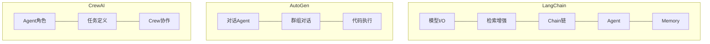

# 第五章：Agent框架实践

## 📖 章节概述

本章将深入学习当前最流行的Agent开发框架，包括LangChain、AutoGen和CrewAI。通过实际项目案例，你将学会如何使用这些框架快速构建功能强大的Agent应用，掌握多Agent协作开发的最佳实践。

**学习时长**：2-3周  
**难度等级**：⭐⭐⭐ 高级  
**核心技能**：框架使用、项目开发、多Agent协作

---

## 5.1 LangChain核心概念

### 5.1.1 LangChain简介

LangChain是一个用于构建LLM应用的强大框架，它提供了丰富的组件和工具，让我们能够轻松地：

- 链接多个LLM调用
- 集成各种工具和数据源
- 构建复杂的Agent系统
- 管理对话上下文和记忆

```
LangChain 核心组件：

┌────────────────────────────────────────────┐
│              LangChain 架构                 │
├────────────────────────────────────────────┤
│                                            │
│  ┌──────────┐  ┌──────────┐  ┌─────────┐│
│  │ Model I/O│  │Retrieval │  │Chains   ││
│  └────┬─────┘  └────┬─────┘  └────┬────┘│
│       │              │              │     │
│       └──────────────┴──────────────┘     │
│                    │                      │
│              ┌─────┴─────┐               │
│              │  Agents   │               │
│              └─────┬─────┘               │
│                    │                      │
│              ┌─────┴─────┐               │
│              │  Memory   │               │
│              └───────────┘               │
│                                            │
└────────────────────────────────────────────┘
```



### 5.1.2 Model I/O组件

```python
# LangChain Model I/O 示例
from langchain_openai import ChatOpenAI
from langchain.schema import HumanMessage, SystemMessage, AIMessage
from langchain.prompts import PromptTemplate, ChatPromptTemplate
from langchain.output_parsers import JsonOutputParser

# 初始化LLM
llm = ChatOpenAI(
    model="gpt-4-turbo",
    temperature=0.7,
    max_tokens=1000,
    openai_api_key="your-api-key"
)

# 简单对话
response = llm.invoke([
    SystemMessage(content="你是一个友好的AI助手。"),
    HumanMessage(content="什么是LangChain？")
])

print(f"响应: {response.content}")

# 使用Prompt模板
prompt = ChatPromptTemplate.from_messages([
    ("system", "你是一个{role}专家，擅长{domain}领域。"),
    ("human", "{question}")
])

formatted_prompt = prompt.format_messages(
    role="数据科学",
    domain="机器学习",
    question="解释一下什么是监督学习"
)

response = llm.invoke(formatted_prompt)
print(f"响应: {response.content}")

# 结构化输出
parser = JsonOutputParser()

prompt_with_format = PromptTemplate(
    template="请提供一个关于{topic}的简要介绍。\n{format_instructions}",
    input_variables=["topic"],
    partial_variables={
        "format_instructions": parser.get_format_instructions()
    }
)

chain = prompt_with_format | llm | parser

result = chain.invoke({"topic": "人工智能"})
print(f"结构化输出: {result}")
```

### 5.1.3 Chains组件

```python
# LangChain Chains 示例
from langchain.chains import LLMChain, SimpleSequentialChain
from langchain.chains import ConversationalRetrievalChain
from langchain.chains.summarize import load_summarize_chain
from langchain.docstore.document import Document

# 基础LLM Chain
basic_chain = LLMChain(
    llm=llm,
    prompt=PromptTemplate.from_template(
        "请用一句话解释{concept}："
    )
)

result = basic_chain.run("量子计算")
print(f"基础Chain: {result}")

# 顺序Chain
chain1 = LLMChain(
    llm=llm,
    prompt=PromptTemplate.from_template(
        "将以下文本翻译成英文：{text}"
    )
)

chain2 = LLMChain(
    llm=llm,
    prompt=PromptTemplate.from_template(
        "请总结这段英文文本的要点：{text}"
    )
)

# 组合成顺序Chain
sequential_chain = SimpleSequentialChain(
    chains=[chain1, chain2],
    verbose=True
)

result = sequential_chain.run("LangChain是一个强大的AI应用框架。")
print(f"顺序Chain结果: {result}")

# 总结Chain
docs = [
    Document(page_content="文档内容1..."),
    Document(page_content="文档内容2..."),
    Document(page_content="文档内容3...")
]

summarize_chain = load_summarize_chain(
    llm=llm,
    chain_type="map_reduce"  # 或 "stuff"
)

summary = summarize_chain.invoke(docs)
print(f"总结结果: {summary['output_text']}")
```

### 5.1.4 Agents组件

```python
# LangChain Agents 示例
from langchain.agents import load_tools, initialize_agent, AgentType
from langchain.agents import Tool
from langchain.tools import WikipediaQueryRun, WolframAlphaQueryRun
from langchain.utilities import WikipediaAPIWrapper, WolframAlphaAPIWrapper

# 创建工具
def get_weather(city: str) -> str:
    """获取天气信息"""
    return f"{city}今天天气晴朗，温度25度。"

def calculate(expression: str) -> str:
    """执行计算"""
    try:
        result = eval(expression)
        return str(result)
    except:
        return "计算错误"

# 注册工具
tools = [
    Tool(
        name="Weather",
        func=get_weather,
        description="用于查询天气信息。输入应该是城市名称。"
    ),
    Tool(
        name="Calculator",
        func=calculate,
        description="用于数学计算。输入应该是数学表达式。"
    ),
    Tool(
        name="Wikipedia",
        func=WikipediaQueryRun(api_wrapper=WikipediaAPIWrapper()).run,
        description="搜索Wikipedia百科全书获取信息。"
    )
]

# 加载更多内置工具
loaded_tools = load_tools(
    ["serpapi", "llm-math"], 
    llm=llm
)

all_tools = tools + loaded_tools

# 初始化Agent
agent = initialize_agent(
    tools=all_tools,
    llm=llm,
    agent=AgentType.ZERO_SHOT_REACT_DESCRIPTION,
    verbose=True,
    handle_parsing_errors=True
)

# 运行Agent
result = agent.run(
    "北京今天的天气怎么样？另外帮我计算一下 25 * 68 + 135 等于多少？"
)

print(f"Agent结果: {result}")
```

### 5.1.5 Memory组件

```python
# LangChain Memory 示例
from langchain.memory import ConversationBufferMemory
from langchain.memory import ConversationSummaryMemory
from langchain.memory import ConversationKGMemory
from langchain.chains import ConversationChain

# 基础缓冲记忆
memory = ConversationBufferMemory(
    memory_key="history",
    return_messages=True
)

conversation = ConversationChain(
    llm=llm,
    memory=memory,
    verbose=True
)

# 对话
conversation.predict(input="我叫小明，我是一名软件工程师。")
conversation.predict(input="我喜欢机器学习和人工智能。")
conversation.predict(input="根据我的介绍，你觉得我适合什么类型的工作？")

# 查看记忆内容
print("记忆内容:")
print(memory.chat_memory.messages)

# 总结记忆（适合长对话）
summary_memory = ConversationSummaryMemory(
    llm=llm,
    memory_key="summary",
    return_messages=True
)

summary_conversation = ConversationChain(
    llm=llm,
    memory=summary_memory
)

# 知识图谱记忆
kg_memory = ConversationKGMemory(
    llm=llm,
    memory_key="kg",
    return_messages=True
)

kg_memory.add_entity_with_summary(
    "小明",
    "软件工程师，专注于机器学习"
)

kg_memory.add_triple(
    subject="小明",
    predicate="工作",
    object_="软件工程师"
)

# 检索相关记忆
relevant_info = kg_memory.search("小明")
print(f"关于小明的记忆: {relevant_info}")
```

---

## 5.2 LangGraph进阶应用

### 5.2.1 LangGraph简介

LangGraph是LangChain的一个扩展，专门用于构建有状态、多步骤的工作流，特别适合构建复杂的Agent系统：

```python
# LangGraph 基础示例
from langgraph.graph import StateGraph, END
from typing import TypedDict, Annotated
import operator

# 定义状态
class AgentState(TypedDict):
    messages: list
    next_action: str
    result: str

# 创建图
workflow = StateGraph(AgentState)

# 定义节点
def process_node(state):
    """处理节点"""
    messages = state["messages"]
    last_message = messages[-1]
    
    return {
        "messages": messages + [f"处理中: {last_message}"],
        "next_action": "analyze",
        "result": ""
    }

def analyze_node(state):
    """分析节点"""
    messages = state["messages"]
    
    return {
        "messages": messages + ["分析完成"],
        "next_action": "respond",
        "result": ""
    }

def respond_node(state):
    """响应节点"""
    return {
        "messages": state["messages"] + ["响应已生成"],
        "next_action": "end",
        "result": "任务完成"
    }

# 添加节点
workflow.add_node("process", process_node)
workflow.add_node("analyze", analyze_node)
workflow.add_node("respond", respond_node)

# 定义边
workflow.set_entry_point("process")
workflow.add_edge("process", "analyze")
workflow.add_edge("analyze", "respond")
workflow.add_edge("respond", END)

# 编译图
graph = workflow.compile()

# 执行
result = graph.invoke({
    "messages": ["用户输入"],
    "next_action": "start",
    "result": ""
})

print(f"执行结果: {result}")
```

### 5.2.2 ReAct Agent实现

```python
# LangGraph ReAct Agent
from langgraph.graph import StateGraph, END
from typing import TypedDict, Annotated
import json

class ReActState(TypedDict):
    input: str
    agent_outcome: str
    steps: list
    observations: list

def reasoning_node(state):
    """推理节点"""
    input_text = state["input"]
    steps = state.get("steps", [])
    observations = state.get("observations", [])
    
    # LLM生成思考
    thought_prompt = f"""
当前任务：{input_text}
    
已执行步骤：{steps}
观察结果：{observations}

请分析当前情况，思考下一步应该做什么。
决定是否需要：
1. 使用工具（search, calculate, lookup）
2. 给出最终答案

请按以下格式输出：
思考：[你的分析]
行动：[工具名或finish]
参数：[工具参数或答案]
    """
    
    # 这里应该调用LLM
    response = {
        "thought": "我需要搜索相关信息",
        "action": "search",
        "parameters": {"query": "相关信息"}
    }
    
    return {
        "steps": steps + [f"思考: {response['thought']}"]
    }

def action_node(state):
    """行动节点"""
    # 执行工具
    # 返回观察结果
    return {
        "observations": state.get("observations", []) + ["搜索结果..."]
    }

def should_continue(state):
    """判断是否继续"""
    # 检查是否应该结束
    return "continue"

# 构建图
graph = StateGraph(ReActState)
graph.add_node("reasoning", reasoning_node)
graph.add_node("action", action_node)

graph.set_entry_point("reasoning")
graph.add_conditional_edges(
    "reasoning",
    should_continue,
    {
        "continue": "action",
        "end": END
    }
)
graph.add_edge("action", "reasoning")

react_graph = graph.compile()
```
（详见 [第16章 - 输出解析器与LCEL](chapter16-output-parser-lcel/chapter16-output-parser-lcel.md)）

---

## 5.3 AutoGen多Agent开发

### 5.3.1 AutoGen简介

AutoGen是微软开发的多Agent协作框架，它允许创建能够相互对话和协作的Agent群体：

```
AutoGen 多Agent架构：

┌─────────────────────────────────────────────────┐
│              AutoGen 系统                       │
├─────────────────────────────────────────────────┤
│                                                  │
│  ┌──────────┐  ┌──────────┐  ┌──────────┐     │
│  │ User    │  │Assistant │  │Expert    │     │
│  │ Proxy   │──│  Agent   │──│  Agent   │     │
│  └──────────┘  └────┬─────┘  └──────────┘     │
│                      │                           │
│                      ▼                           │
│               ┌──────────┐                      │
│               │  Group   │                      │
│               │  Chat    │                      │
│               └──────────┘                      │
│                                                  │
└─────────────────────────────────────────────────┘
```

### 5.3.2 基本Agent创建

```python
# AutoGen 基本示例
import autogen

# 配置LLM
config_list = autogen.config_list_from_json(
    "OAI_CONFIG_LIST",
    filter_dict={
        "model": ["gpt-4", "gpt-3.5-turbo"]
    }
)

llm_config = {
    "config_list": config_list,
    "temperature": 0.7,
    "timeout": 300,
}

# 创建Assistant Agent
assistant = autogen.AssistantAgent(
    name="assistant",
    llm_config=llm_config,
    system_message="你是一个有帮助的AI助手。"
)

# 创建User Proxy Agent
user_proxy = autogen.UserProxyAgent(
    name="user_proxy",
    human_input_mode="NEVER",  # 或 "ALWAYS" / "TERMINATE"
    max_consecutive_auto_reply=10,
    code_execution_config={
        "work_dir": "coding",
        "use_docker": False
    }
)

# 启动对话
user_proxy.initiate_chat(
    assistant,
    message="帮我写一个快速排序算法，用Python实现。"
)
```

### 5.3.3 多Agent协作

```python
# AutoGen 多Agent协作
import autogen

# LLM配置
config_list = autogen.config_list_from_json("OAI_CONFIG_LIST")
llm_config = {
    "config_list": config_list,
    "temperature": 0.7,
}

# 创建多个专业Agent
coder = autogen.AssistantAgent(
    name="coder",
    llm_config=llm_config,
    system_message="""你是一名Python程序员，擅长编写高质量代码。
    你会仔细理解需求，编写清晰、高效的代码，并添加必要的注释。"""
)

reviewer = autogen.AssistantAgent(
    name="reviewer",
    llm_config=llm_config,
    system_message="""你是一名代码审查专家。
    你会检查代码的质量、可读性、安全性和性能问题，
    并提供具体的改进建议。"""
)

writer = autogen.AssistantAgent(
    name="writer",
    llm_config=llm_config,
    system_message="""你是一名技术文档撰写专家。
    你会为代码编写清晰、准确的文档和使用说明。"""
)

# 创建用户代理
user_proxy = autogen.UserProxyAgent(
    name="user_proxy",
    human_input_mode="NEVER",
    max_consecutive_auto_reply=10
)

# 定义协作流程
def coding_task_with_review():
    """完整的编码任务流程"""
    
    # 1. 编写代码
    print("=== 步骤1: 编写代码 ===")
    user_proxy.initiate_chat(
        coder,
        message="实现一个LRU缓存类，要求支持get和put操作，时间复杂度为O(1)。"
    )
    
    # 获取代码
    code = coder.last_message()["content"]
    
    # 2. 代码审查
    print("\n=== 步骤2: 代码审查 ===")
    user_proxy.initiate_chat(
        reviewer,
        message=f"请审查以下代码：\n\n{code}"
    )
    
    review = reviewer.last_message()["content"]
    
    # 3. 根据审查意见修改
    print("\n=== 步骤3: 修改代码 ===")
    user_proxy.initiate_chat(
        coder,
        message=f"请根据以下审查意见修改代码：\n\n{review}"
    )
    
    updated_code = coder.last_message()["content"]
    
    # 4. 编写文档
    print("\n=== 步骤4: 编写文档 ===")
    user_proxy.initiate_chat(
        writer,
        message=f"请为以下代码编写文档：\n\n{updated_code}"
    )
    
    return {
        "code": updated_code,
        "review": review,
        "documentation": writer.last_message()["content"]
    }

# 执行协作任务
result = coding_task_with_review()
print("\n=== 最终结果 ===")
print(f"代码：\n{result['code']}")
```

### 5.3.4 Group Chat

```python
# AutoGen Group Chat
import autogen

# 配置
config_list = autogen.config_list_from_json("OAI_CONFIG_LIST")
llm_config = {"config_list": config_list, "temperature": 0.7}

# 创建群组成员
product_manager = autogen.AssistantAgent(
    name="product_manager",
    llm_config=llm_config,
    system_message="你是产品经理，负责定义产品需求和功能。"
)

engineer = autogen.AssistantAgent(
    name="engineer",
    llm_config=llm_config,
    system_message="你是工程师，负责技术实现和架构设计。"
)

designer = autogen.AssistantAgent(
    name="designer",
    llm_config=llm_config,
    system_message="你是UI/UX设计师，负责用户体验和界面设计。"
)

qa = autogen.AssistantAgent(
    name="qa",
    llm_config=llm_config,
    system_message="你是测试工程师，负责质量保证和测试策略。"
)

# 创建群聊
group_chat = autogen.GroupChat(
    agents=[product_manager, engineer, designer, qa],
    messages=[],
    max_round=10
)

# 创建群聊管理器
manager = autogen.GroupChatManager(
    groupchat=group_chat,
    llm_config=llm_config
)

# 启动群聊
user_proxy = autogen.UserProxyAgent(
    name="user_proxy",
    human_input_mode="NEVER"
)

# 启动关于产品设计的讨论
user_proxy.initiate_chat(
    manager,
    message="我们需要设计一个新的电商移动应用。请各位从自己的专业角度发表意见。"
)
```

---

## 5.4 CrewAI框架实践

### 5.4.1 CrewAI简介

CrewAI是一个专注于角色扮演Agent的框架，它通过定义Agent角色、任务和流程来构建AI团队：

```
CrewAI 架构：

┌─────────────────────────────────────────────┐
│              CrewAI 工作流程                │
├─────────────────────────────────────────────┤
│                                              │
│  Crew（团队）                                │
│    ├── Agent 1 (角色A) ──┐                   │
│    ├── Agent 2 (角色B) ──┼──▶ Task（任务）   │
│    └── Agent 3 (角色C) ──┘                   │
│                                              │
│  Process（流程）                             │
│    ├── Sequential（顺序）                    │
│    ├── Hierarchical（层级）                  │
│    └── Parallel（并行）                      │
│                                              │
└─────────────────────────────────────────────┘
```

### 5.4.2 CrewAI基础使用

```python
# CrewAI 基础示例
from crewai import Agent, Task, Crew, Process
from langchain_openai import ChatOpenAI

# 初始化LLM
llm = ChatOpenAI(
    model="gpt-4-turbo",
    openai_api_key="your-api-key"
)

# 创建Agent
researcher = Agent(
    role="市场研究员",
    goal="深入分析目标市场的趋势和竞争态势",
    backstory="""你是一名经验丰富的市场研究员，
    专注于科技行业的市场分析和竞争情报收集。
    你擅长使用各种分析工具和方法来获取洞察。""",
    allow_delegation=False,
    verbose=True
)

writer = Agent(
    role="内容撰写专家",
    goal="将复杂的市场分析转化为清晰、有说服力的报告",
    backstory="""你是一名资深的内容创作者，
    擅长将技术信息转化为易于理解的商业洞察。
    你的报告经常被高管层采纳。""",
    allow_delegation=False,
    verbose=True
)

analyst = Agent(
    role="数据分析师",
    goal="从数据中提取有价值的洞察",
    backstory="""你是一名数据驱动的问题解决者，
    精通各种数据分析技术和可视化方法。
    你相信数据是决策的基础。""",
    allow_delegation=False,
    verbose=True
)

# 创建任务
research_task = Task(
    description="""研究2024年AI应用市场的现状和趋势：
    1. 主要玩家和市场份额
    2. 技术发展趋势
    3. 用户需求变化
    4. 监管环境
    请提供详细的分析报告。""",
    agent=researcher,
    expected_output="一份详细的市场分析报告"
)

analysis_task = Task(
    description="""基于研究员提供的市场分析：
    1. 识别关键机会和威胁
    2. 进行SWOT分析
    3. 提出数据支撑的洞察
    请提供结构化的分析结果。""",
    agent=analyst,
    expected_output="结构化的分析报告，包含SWOT和关键洞察"
)

writing_task = Task(
    description="""基于研究和分析结果：
    1. 撰写执行摘要
    2. 详细阐述发现和建议
    3. 提供可操作的建议
    4. 添加图表和可视化建议
    最终输出一份专业的市场报告。""",
    agent=writer,
    expected_output="一份专业的市场报告"
)

# 创建Crew
crew = Crew(
    agents=[researcher, analyst, writer],
    tasks=[research_task, analysis_task, writing_task],
    process=Process.sequential,  # 或 Process.hierarchical
    verbose=True
)

# 启动任务
result = crew.kickoff(
    inputs={
        "topic": "AI应用市场2024",
        "company": "某科技公司"
    }
)

print(f"任务完成！结果：\n{result}")
```

### 5.4.3 Hierarchical流程

```python
# CrewAI 层级流程
from crewai import Agent, Task, Crew, Process
from langchain_openai import ChatOpenAI

llm = ChatOpenAI(model="gpt-4-turbo", openai_api_key="your-api-key")

# 创建执行Agent
coder = Agent(
    role="高级工程师",
    goal="编写高质量的产品代码",
    backstory="你是Stripe的高级工程师，10年+经验。",
    llm=llm
)

tester = Agent(
    role="测试工程师",
    goal="确保产品质量",
    backstory="你是Netflix的QA专家。",
    llm=llm
)

# 创建管理Agent
manager = Agent(
    role="技术总监",
    goal="协调团队完成项目目标",
    backstory="你是FANG公司的技术总监。",
    llm=llm,
    is_manager=True  # 标记为管理Agent
)

# 创建任务
coding_task = Task(
    description="实现一个支付网关模块",
    agent=coder
)

testing_task = Task(
    description="编写全面的测试用例",
    agent=tester
)

# 层级Crew
hierarchy_crew = Crew(
    agents=[manager, coder, tester],
    tasks=[coding_task, testing_task],
    process=Process.hierarchical,
    manager_agent=manager,
    verbose=True
)

result = hierarchy_crew.kickoff()
```

---

## 5.5 实际项目案例

### 5.5.1 项目一：智能研究助手

```python
# 智能研究助手项目
from crewai import Agent, Task, Crew, Process
from langchain_openai import ChatOpenAI
import json

class ResearchAssistant:
    """智能研究助手"""
    
    def __init__(self, api_key: str):
        self.llm = ChatOpenAI(
            model="gpt-4-turbo",
            openai_api_key=api_key
        )
        self.crew = self._create_crew()
    
    def _create_crew(self) -> Crew:
        """创建研究团队"""
        
        # 文献搜索员
        searcher = Agent(
            role="文献搜索专家",
            goal="找到与研究主题相关的最新文献和信息",
            backstory="你是一名学术图书馆员，精通各种学术数据库。",
            llm=self.llm,
            verbose=True
        )
        
        # 分析师
        analyst = Agent(
            role="研究分析师",
            goal="深度分析文献，提取关键洞察",
            backstory="你是MIT的研究员，擅长批判性分析。",
            llm=self.llm,
            verbose=True
        )
        
        # 作家
        writer = Agent(
            role="学术作家",
            goal="撰写清晰、专业的学术报告",
            backstory="你是Nature期刊的编辑。",
            llm=self.llm,
            verbose=True
        )
        
        # 定义任务
        search_task = Task(
            description="搜索关于{topic}的最新研究和论文",
            agent=searcher,
            expected_output="文献列表和摘要"
        )
        
        analysis_task = Task(
            description="分析找到的文献，提取关键发现",
            agent=analyst,
            expected_output="深度分析报告"
        )
        
        writing_task = Task(
            description="撰写完整的研究报告",
            agent=writer,
            expected_output="专业的研究报告"
        )
        
        return Crew(
            agents=[searcher, analyst, writer],
            tasks=[search_task, analysis_task, writing_task],
            process=Process.sequential,
            verbose=True
        )
    
    def research(self, topic: str) -> str:
        """执行研究"""
        result = self.crew.kickoff(
            inputs={"topic": topic}
        )
        return result


# 使用示例
def demo_research_assistant():
    """演示研究助手"""
    
    assistant = ResearchAssistant(api_key="your-api-key")
    
    result = assistant.research(
        topic="大语言模型在医疗诊断中的应用"
    )
    
    print("研究报告：")
    print(result)
```

### 5.5.2 项目二：代码审查Agent团队

```python
# 代码审查Agent团队
import autogen
from typing import Dict, List

class CodeReviewTeam:
    """代码审查团队"""
    
    def __init__(self, config_list: List[Dict]):
        llm_config = {
            "config_list": config_list,
            "temperature": 0.3
        }
        
        # 审查Agent
        self.reviewer = autogen.AssistantAgent(
            name="code_reviewer",
            llm_config=llm_config,
            system_message="""你是一名高级代码审查专家。
            职责：
            1. 检查代码质量和最佳实践
            2. 识别潜在bug和安全问题
            3. 评估代码可读性和可维护性
            4. 提供具体的改进建议"""
        )
        
        # 安全专家
        self.security_expert = autogen.AssistantAgent(
            name="security_expert",
            llm_config=llm_config,
            system_message="""你是一名网络安全专家。
            专注于：
            1. 识别安全漏洞
            2. 检查输入验证
            3. 评估加密和认证
            4. 提供安全建议"""
        )
        
        # 性能专家
        self.performance_expert = autogen.AssistantAgent(
            name="performance_expert",
            llm_config=llm_config,
            system_message="""你是一名性能优化专家。
            关注点：
            1. 算法复杂度
            2. 数据库查询优化
            3. 缓存策略
            4. 资源使用"""
        )
        
        self.user_proxy = autogen.UserProxyAgent(
            name="user_proxy",
            human_input_mode="NEVER"
        )
    
    def review_code(self, code: str, 
                   focus_areas: List[str] = None) -> Dict:
        """
        全面代码审查
        
        Args:
            code: 要审查的代码
            focus_areas: 重点审查领域
        """
        
        if focus_areas is None:
            focus_areas = ["quality", "security", "performance"]
        
        results = {}
        
        # 基础代码审查
        if "quality" in focus_areas:
            self.user_proxy.initiate_chat(
                self.reviewer,
                message=f"请审查以下代码的质量：\n\n{code}"
            )
            results["quality"] = self.reviewer.last_message()["content"]
        
        # 安全审查
        if "security" in focus_areas:
            self.user_proxy.initiate_chat(
                self.security_expert,
                message=f"请进行安全审查：\n\n{code}"
            )
            results["security"] = self.security_expert.last_message()["content"]
        
        # 性能审查
        if "performance" in focus_areas:
            self.user_proxy.initiate_chat(
                self.performance_expert,
                message=f"请分析性能：\n\n{code}"
            )
            results["performance"] = self.performance_expert.last_message()["content"]
        
        return results
    
    def review_with_suggestions(self, code: str) -> str:
        """审查并生成改进建议"""
        
        combined_prompt = f"""请全面审查以下代码，并提供具体的改进建议：

{code}

请包括：
1. 问题列表（分严重程度）
2. 具体改进建议
3. 优化后的代码示例
        """
        
        self.user_proxy.initiate_chat(
            self.reviewer,
            message=combined_prompt
        )
        
        return self.reviewer.last_message()["content"]


# 使用示例
def demo_code_review():
    """演示代码审查"""
    
    config_list = autogen.config_list_from_json("OAI_CONFIG_LIST")
    
    team = CodeReviewTeam(config_list)
    
    sample_code = """
def login(username, password):
    query = f"SELECT * FROM users WHERE username = '{username}'"
    result = db.execute(query)
    
    if result.password == password:
        return True
    return False
    """
    
    results = team.review_code(
        sample_code,
        focus_areas=["quality", "security"]
    )
    
    print("审查结果：")
    for area, report in results.items():
        print(f"\n=== {area.upper()} ===")
        print(report)
```

---

## 5.6 Semantic Kernel实践

### 简介
Microsoft的AI编排框架，支持C#/Python/Java，核心概念包括Plugins、Kernel、Planner等。

### 核心代码示例

```python
import semantic_kernel as sk
from semantic_kernel.connectors.ai.open_ai import OpenAIChatCompletion
from semantic_kernel.functions import kernel_function

# 1. 创建Kernel
kernel = sk.Kernel()
kernel.add_service(OpenAIChatCompletion(
    service_id="gpt-4",
    api_key="your-key"
))

# 2. 定义Plugin
class TimePlugin:
    @kernel_function(
        description="获取当前时间",
        name="get_current_time"
    )
    def get_current_time(self) -> str:
        from datetime import datetime
        return datetime.now().strftime("%Y-%m-%d %H:%M:%S")

# 3. 注册Plugin
kernel.add_plugin(TimePlugin(), plugin_name="time")

# 4. 创建Planner执行复杂任务
from semantic_kernel.planners import SequentialPlanner
planner = SequentialPlanner(kernel)
plan = await planner.create_plan("查询今天日期并生成报告")
result = await plan.invoke(kernel)

# 5. 函数调用
result = await kernel.invoke(
    function_name="get_current_time",
    plugin_name="time"
)
```

### Semantic Kernel vs LangChain对比
| 特性 | Semantic Kernel | LangChain |
|------|----------------|-----------|
| 语言支持 | C#/Python/Java | Python/JS |
| 插件系统 | 原生Plugin | Tool/LangChain Expression |
| Planner | 内置Sequential/Stepwise | Agent Executor |
| 企业集成 | 深度Azure/AAD | 生态丰富 |
| 学习曲线 | 中等 | 较陡 |

## 5.7 Dify低代码Agent平台

### 简介
Dify是开源LLM应用开发平台，支持可视化工作流编排、RAG管道配置、Agent策略设置。

### 核心概念
1. **应用类型**：对话型、文本生成型、Agent型、工作流型
2. **知识库**：文档上传→分段→向量化→检索
3. **工具集成**：内置Google搜索、Wikipedia、DALL-E等
4. **工作流编排**：拖拽式可视化编排

### 工作流示例代码
```python
# Dify API调用示例
import requests

class DifyClient:
    def __init__(self, api_key: str, base_url: str):
        self.api_key = api_key
        self.base_url = base_url
    
    def chat(self, query: str, user: str = "user-1"):
        response = requests.post(
            f"{self.base_url}/chat-messages",
            headers={"Authorization": f"Bearer {self.api_key}"},
            json={
                "inputs": {},
                "query": query,
                "user": user,
                "response_mode": "streaming"
            }
        )
        return response.json()

# 使用
client = DifyClient(api_key="app-xxx", 
                    base_url="https://api.dify.ai/v1")
result = client.chat("帮我分析这个数据集")
```

### Dify特点
- 低代码/无代码操作
- 可视化Prompt编排
- 内置RAG管道
- 支持多种LLM模型切换
- 对话日志与分析
- 适合快速原型和业务团队使用

---

## 5.8 LlamaIndex框架

### 简介

LlamaIndex是一个专为LLM应用设计的数据框架，核心聚焦于数据索引与检索。它充当LLM与外部数据之间的桥梁，提供了一套高效的数据接入、索引构建和检索查询的完整解决方案。作为一个专门化的索引/RAG框架，LlamaIndex在结构化/非结构化数据处理、多类型索引策略和精细化检索方面具有显著优势，特别适合构建基于私有数据或领域知识的问答系统。

### 核心概念

1. **Document / Node**：Document是数据源载入后的原始文档对象，Node是Document经分割后的最小语义单元。LlamaIndex将Document解析为Node列表，便于后续索引与检索。
2. **Index类型**：
   - **VectorStoreIndex**：将Node转换为向量嵌入并存入向量数据库，支持语义相似度搜索，是最常用的索引类型。
   - **SummaryIndex**：以Node原文为索引，适合对每个节点进行独立总结或关键字匹配。
   - **KeywordTableIndex**：从每个Node提取关键字构建映射表，适用于基于关键字的精确匹配场景。
3. **QueryEngine**：查询引擎，将用户问题路由到索引并执行检索，支持自定义检索策略和后处理（如节点过滤、结果排序）。
4. **Retriever**：检索器，负责从索引中获取与查询最相关的Node列表，可配合QueryEngine使用或独立调用。

### 代码示例

以下是一个简单的RAG管道示例，展示如何使用LlamaIndex加载文档、构建向量索引并执行查询：

```python
from llama_index.core import VectorStoreIndex, SimpleDirectoryReader
from llama_index.llms.openai import OpenAI

# 加载指定目录下的所有文档
documents = SimpleDirectoryReader("./data").load_data()

# 从文档创建向量索引（自动完成文本分割、向量化）
index = VectorStoreIndex.from_documents(documents)

# 基于索引构建查询引擎
query_engine = index.as_query_engine()

# 执行查询
response = query_engine.query("your question here")
```

上述代码会自动完成文档加载、文本分割、向量嵌入生成和索引构建，最终通过`query_engine.query()`返回基于文档内容的回答。

### LlamaIndex vs LangChain对比

| 特性 | LlamaIndex | LangChain |
|------|------------|-----------|
| **核心定位** | 数据索引与检索（data-centric） | 通用LLM应用编排（general-purpose） |
| **索引能力** | 内置多种专用索引策略（向量/摘要/关键字） | 依赖第三方向量存储，无专用索引层 |
| **检索策略** | 提供检索器模式、路由查询、后处理管道 | 通过Retriever接口对接，灵活性不如LlamaIndex |
| **数据连接器** | 丰富的Data Loaders（数据库/API/文件等130+） | 通过Document Loaders接入，生态广泛 |
| **查询引擎** | 原生QueryEngine，支持复合查询与自定义检索 | 通过Chain组合实现，功能更通用 |
| **学习曲线** | 较低，专注于数据索引场景 | 较陡，组件多但功能全面 |
| **适用场景** | 文档问答、知识库构建、数据密集型RAG | 复杂Agent、多步骤工作流、通用应用开发 |

## 5.9 章节练习

### 🎯 练习一：使用LangChain构建问答系统

```python
# LangChain 问答系统
from langchain_openai import ChatOpenAI
from langchain.chains import RetrievalQA
from langchain_community.vectorstores import Chroma
from langchain_openai import OpenAIEmbeddings
from langchain_community.document_loaders import TextLoader
from langchain_text_splitters import CharacterTextSplitter

class QASystem:
    """基于文档的问答系统"""
    
    def __init__(self, api_key: str, documents_path: str):
        self.llm = ChatOpenAI(
            model="gpt-4-turbo",
            openai_api_key=api_key
        )
        
        # 加载文档
        loader = TextLoader(documents_path)
        documents = loader.load()
        
        # 分割文档
        splitter = CharacterTextSplitter(
            chunk_size=1000,
            chunk_overlap=200
        )
        texts = splitter.split_documents(documents)
        
        # 创建向量存储
        embeddings = OpenAIEmbeddings(
            openai_api_key=api_key
        )
        self.vectorstore = Chroma.from_documents(
            texts, 
            embeddings
        )
        
        # 创建QA链
        self.qa_chain = RetrievalQA.from_chain_type(
            llm=self.llm,
            chain_type="stuff",
            retriever=self.vectorstore.as_retriever(),
            return_source_documents=True
        )
    
    def ask(self, question: str) -> dict:
        """问答"""
        result = self.qa_chain({"query": question})
        
        return {
            "answer": result["result"],
            "sources": [
                doc.page_content[:200] + "..."
                for doc in result["source_documents"]
            ]
        }
```

### 🎯 练习二：AutoGen多角色对话系统

```python
# AutoGen 多角色对话
import autogen

def create_panel_discussion(
    topic: str,
    participants: list,
    config_list: list
) -> autogen.GroupChat:
    """创建圆桌讨论"""
    
    llm_config = {"config_list": config_list, "temperature": 0.7}
    
    # 创建参与者
    agents = []
    for participant in participants:
        agent = autogen.AssistantAgent(
            name=participant["name"],
            llm_config=llm_config,
            system_message=participant["persona"]
        )
        agents.append(agent)
    
    # 创建群聊
    group_chat = autogen.GroupChat(
        agents=agents,
        messages=[],
        max_round=5
    )
    
    manager = autogen.GroupChatManager(
        groupchat=group_chat,
        llm_config=llm_config
    )
    
    return agents, manager
```

---

## 📚 延伸阅读

### 官方文档

1. [LangChain Documentation](https://python.langchain.com/)
2. [LangGraph Documentation](https://langchain-ai.github.io/langgraph/)
3. [AutoGen Documentation](https://microsoft.github.io/autogen/)
4. [CrewAI Documentation](https://docs.crewai.com/)

### 社区资源

1. [LangChain GitHub](https://github.com/langchain-ai/langchain)
2. [AutoGen GitHub](https://github.com/microsoft/autogen)
3. [CrewAI GitHub](https://github.com/joaomdmoura/crewai)

---

## ✅ 章节总结

### 核心要点回顾

1. **LangChain**：Model I/O、Chains、Agents、Memory核心组件
2. **LangGraph**：构建有状态工作流，实现复杂Agent逻辑
3. **AutoGen**：微软多Agent框架，支持Agent间对话协作
4. **CrewAI**：角色驱动的Agent团队，强调流程编排

### 下章预告

在最后一章中，我们将学习**高级主题与优化**，包括：
- 规划与推理能力提升
- 安全性与可靠性保障
- 性能优化策略
- 实际应用部署

---

**掌握框架使用后，你已经具备构建复杂Agent系统的能力！🚀**
（详见 [第14章 - MCP协议](chapter14-mcp-protocol/chapter14-mcp-protocol.md)）

[← 返回课程目录](../course-overview.md) | [→ 进入第六章：高级主题与优化](../chapter6-advanced-optimization/chapter6-advanced-optimization.md)
