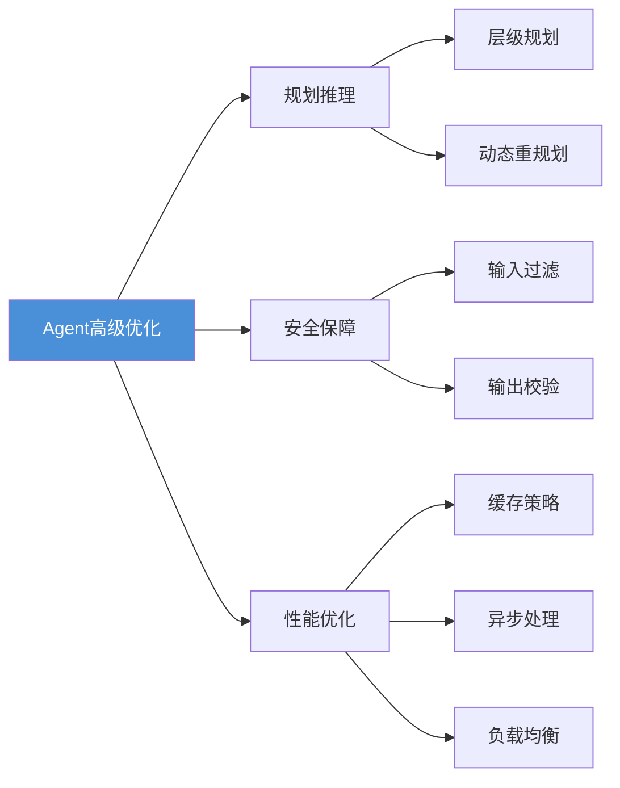

# 第六章：高级主题与优化

## 📖 章节概述

本章将深入探讨Agent系统的高级主题，包括规划与推理能力的提升、安全性与可靠性保障、性能优化策略，以及实际应用部署的最佳实践。通过本章学习，你将掌握构建生产级别Agent系统的关键技术和方法。

**学习时长**：2-3周  
**难度等级**：⭐⭐⭐⭐ 进阶  
**核心技能**：高级规划、安全防护、性能优化、部署运维

---



## 6.1 规划与推理能力

### 6.1.1 高级规划策略

```python
from typing import List, Dict, Optional, Any, Tuple
from dataclasses import dataclass, field
from enum import Enum
import heapq

class TaskStatus(Enum):
    """任务状态"""
    PENDING = "pending"
    IN_PROGRESS = "in_progress"
    COMPLETED = "completed"
    FAILED = "failed"
    BLOCKED = "blocked"

@dataclass
class Task:
    """任务定义"""
    id: str
    description: str
    subtasks: List['Task'] = field(default_factory=list)
    dependencies: List[str] = field(default_factory=list)
    status: TaskStatus = TaskStatus.PENDING
    result: Any = None
    priority: int = 0
    estimated_duration: float = 1.0

class HierarchicalPlanner:
    """
    层级规划器
    
    将复杂任务分解为层级结构
    """
    
    def __init__(self, llm_client):
        self.llm = llm_client
    
    def create_plan(self, task: str) -> Task:
        """创建任务计划"""
        
        # 第一层：分解主任务
        main_subtasks = self.decompose_task(task, depth=1)
        
        # 第二层：进一步分解每个子任务
        root_task = Task(
            id="root",
            description=task,
            subtasks=main_subtasks
        )
        
        # 递归分解
        self._expand_subtasks(root_task, max_depth=3)
        
        return root_task
    
    def decompose_task(self, task: str, 
                      depth: int) -> List[Task]:
        """分解任务"""
        
        prompt = f"""
请将以下任务分解为3-7个具体的子任务：

任务：{task}

分解要求：
1. 每个子任务应该清晰、可执行
2. 子任务之间尽量独立
3. 考虑执行顺序

请列出子任务及其依赖关系。
        """
        
        response = self.llm.chat(prompt)
        
        # 解析响应，创建Task对象
        subtasks = self.parse_subtasks(response)
        
        return subtasks
    
    def _expand_subtasks(self, task: Task, 
                        max_depth: int, 
                        current_depth: int = 1):
        """递归展开子任务"""
        
        if current_depth >= max_depth:
            return
        
        for subtask in task.subtasks:
            # 检查是否需要进一步分解
            if self.should_decompose(subtask):
                children = self.decompose_task(
                    subtask.description,
                    depth=current_depth + 1
                )
                subtask.subtasks = children
                
                # 递归展开
                self._expand_subtasks(
                    subtask, 
                    max_depth, 
                    current_depth + 1
                )
    
    def should_decompose(self, task: Task) -> bool:
        """判断是否需要进一步分解"""
        # 简单的启发式判断
        complexity_indicators = [
            "分析", "设计", "实现", "开发", "研究"
        ]
        
        return any(
            ind in task.description 
            for ind in complexity_indicators
        )
    
    def parse_subtasks(self, response: str) -> List[Task]:
        """解析子任务"""
        # 简化解析
        lines = response.strip().split('\n')
        tasks = []
        
        for i, line in enumerate(lines):
            if line.strip() and not line.startswith('#'):
                task = Task(
                    id=f"task_{i}",
                    description=line.strip()
                )
                tasks.append(task)
        
        return tasks

class ParallelPlanner:
    """
    并行规划器
    
    识别可并行执行的任务
    """
    
    def __init__(self):
        self.task_graph = {}
        self.execution_order = []
    
    def analyze_dependencies(
        self, 
        tasks: List[Task]
    ) -> Tuple[List[str], Dict[str, List[str]]]:
        """
        分析任务依赖关系
        
        返回：
        - 执行顺序
        - 可并行的任务组
        """
        
        # 构建依赖图
        graph = {task.id: task.dependencies for task in tasks}
        
        # 计算入度
        in_degree = {task.id: 0 for task in tasks}
        for task in tasks:
            for dep in task.dependencies:
                if dep in in_degree:
                    in_degree[task.id] += 1
        
        # Kahn算法拓扑排序
        queue = [
            task_id for task_id, degree in in_degree.items()
            if degree == 0
        ]
        heapq.heapify(queue)
        
        execution_order = []
        parallel_groups = []
        current_group = []
        
        while queue:
            # 收集当前可执行的任务
            current_group = []
            for _ in range(len(queue)):
                if queue:
                    task_id = heapq.heappop(queue)
                    current_group.append(task_id)
                    execution_order.append(task_id)
            
            if current_group:
                parallel_groups.append(current_group)
            
            # 更新入度，添加新入度为0的任务
            for task_id in current_group:
                for next_task, deps in graph.items():
                    if task_id in deps:
                        in_degree[next_task] -= 1
                        if in_degree[next_task] == 0:
                            heapq.heappush(queue, next_task)
        
        return execution_order, parallel_groups
    
    def execute_parallel(
        self,
        tasks: List[Task],
        executor: callable,
        max_parallel: int = 3
    ) -> Dict[str, Any]:
        """并行执行任务"""
        
        _, parallel_groups = self.analyze_dependencies(tasks)
        
        results = {}
        
        for group in parallel_groups:
            # 并行执行组内任务
            group_tasks = [
                task for task in tasks 
                if task.id in group
            ][:max_parallel]
            
            # 这里应该使用asyncio或线程池
            for task in group_tasks:
                result = executor(task)
                results[task.id] = result
        
        return results
```

### 6.1.2 推理能力增强

```python
class ReasoningEnhancer:
    """推理能力增强器"""
    
    def __init__(self, llm_client):
        self.llm = llm_client
    
    def step_by_step_reasoning(
        self, 
        problem: str,
        include_verification: bool = True
    ) -> Dict[str, Any]:
        """
        逐步推理
        
        1. 理解问题
        2. 制定计划
        3. 执行步骤
        4. 验证结果
        """
        
        steps = []
        
        # 步骤1：理解问题
        understanding = self.understand_problem(problem)
        steps.append({
            "step": "理解问题",
            "content": understanding
        })
        
        # 步骤2：制定计划
        plan = self.create_plan(understanding)
        steps.append({
            "step": "制定计划",
            "content": plan
        })
        
        # 步骤3：执行推理
        execution = self.execute_plan(plan)
        steps.append({
            "step": "执行推理",
            "content": execution
        })
        
        # 步骤4：验证（可选）
        if include_verification:
            verification = self.verify_result(execution)
            steps.append({
                "step": "验证结果",
                "content": verification
            })
        
        return {
            "problem": problem,
            "steps": steps,
            "final_answer": execution.get("answer", "")
        }
    
    def understand_problem(self, problem: str) -> str:
        """理解问题"""
        prompt = f"""
请深入理解以下问题：

{problem}

分析内容：
1. 问题的核心是什么？
2. 涉及哪些关键概念？
3. 有哪些约束条件？
4. 期望的结果是什么？
        """
        
        return self.llm.chat(prompt)
    
    def create_plan(self, understanding: str) -> str:
        """制定解决计划"""
        prompt = f"""
基于以下问题理解，制定解决计划：

{understanding}

计划要求：
1. 列出具体的解决步骤
2. 说明每一步的方法
3. 考虑可能的难点
        """
        
        return self.llm.chat(prompt)
    
    def execute_plan(self, plan: str) -> Dict[str, Any]:
        """执行计划"""
        prompt = f"""
请严格按照以下计划执行：

{plan}

请展示完整的执行过程和最终答案。
        """
        
        response = self.llm.chat(prompt)
        
        return {
            "execution": response,
            "answer": self.extract_answer(response)
        }
    
    def verify_result(self, execution: Dict) -> str:
        """验证结果"""
        prompt = f"""
请验证以下推理过程和答案是否正确：

执行结果：
{execution['execution']}

验证要点：
1. 逻辑是否正确？
2. 计算是否准确？
3. 是否遗漏重要因素？
        """
        
        return self.llm.chat(prompt)
    
    def extract_answer(self, text: str) -> str:
        """提取答案"""
        # 简单提取
        lines = text.strip().split('\n')
        for line in lines:
            if '答案' in line or '结果' in line:
                return line
        return lines[-1] if lines else ""


class SelfCorrection:
    """自我纠错机制"""
    
    def __init__(self, llm_client):
        self.llm = llm_client
        self.max_attempts = 3
    
    def solve_with_correction(
        self, 
        problem: str
    ) -> Dict[str, Any]:
        """
        带自我纠错的问题解决
        """
        
        attempts = []
        current_solution = None
        
        for attempt in range(self.max_attempts):
            print(f"尝试 {attempt + 1}/{self.max_attempts}")
            
            if current_solution is None:
                # 首次尝试
                solution = self.llm.chat(
                    f"请解决以下问题：\n{problem}"
                )
            else:
                # 根据反馈改进
                solution = self.improve_solution(
                    problem,
                    current_solution,
                    feedback
                )
            
            # 验证解决方案
            is_correct, feedback = self.verify_solution(
                problem,
                solution
            )
            
            attempts.append({
                "attempt": attempt + 1,
                "solution": solution,
                "feedback": feedback,
                "is_correct": is_correct
            })
            
            if is_correct:
                return {
                    "success": True,
                    "solution": solution,
                    "attempts": attempts
                }
            
            current_solution = solution
        
        return {
            "success": False,
            "best_solution": current_solution,
            "attempts": attempts
        }
    
    def verify_solution(
        self, 
        problem: str, 
        solution: str
    ) -> Tuple[bool, str]:
        """验证解决方案"""
        
        prompt = f"""
请验证以下问题解决方案：

问题：{problem}

解决方案：{solution}

验证要求：
1. 检查逻辑是否正确
2. 检查答案是否准确
3. 指出具体问题（如有）

请返回：
是否正确：是/否
具体反馈：[你的分析]
        """
        
        response = self.llm.chat(prompt)
        
        is_correct = "是" in response and "否" not in response[:10]
        feedback = response
        
        return is_correct, feedback
    
    def improve_solution(
        self, 
        problem: str,
        previous_solution: str,
        feedback: str
    ) -> str:
        """改进解决方案"""
        
        prompt = f"""
问题：{problem}

之前的解决方案：
{previous_solution}

反馈：
{feedback}

请根据反馈改进解决方案，修正之前的错误。
        """
        
        return self.llm.chat(prompt)
```
（详见 [第13章 - 高级技术](chapter13-advanced-techniques/chapter13-advanced-techniques.md)）

---

## 6.2 安全性与可靠性

### 6.2.1 输入安全处理

```python
from typing import List, Dict, Optional, Any
import re
from dataclasses import dataclass

class InputSanitizer:
    """输入安全处理"""
    
    def __init__(self):
        self.dangerous_patterns = [
            r"<script[^>]*>.*?</script>",
            r"javascript:",
            r"on\w+\s*=",
            r"<\s*iframe",
            r"eval\s*\(",
            r"exec\s*\("
        ]
        
        self.compiled_patterns = [
            re.compile(pattern, re.IGNORECASE)
            for pattern in self.dangerous_patterns
        ]
    
    def sanitize(self, input_text: str) -> Dict[str, Any]:
        """
        清理和验证输入
        
        返回：
        {
            "is_safe": bool,
            "sanitized_text": str,
            "warnings": list,
            "blocked": bool
        }
        """
        
        warnings = []
        sanitized = input_text
        
        # 检查危险模式
        for pattern in self.compiled_patterns:
            matches = pattern.findall(sanitized)
            if matches:
                warnings.append(f"检测到可疑模式: {matches}")
                sanitized = pattern.sub("", sanitized)
        
        # 检查提示注入
        injection_patterns = [
            "ignore previous instructions",
            "disregard all previous",
            "you are now",
            "forget your instructions",
            "新身份",
            "忘记规则"
        ]
        
        for pattern in injection_patterns:
            if pattern.lower() in sanitized.lower():
                warnings.append(f"检测到可能的提示注入")
                return {
                    "is_safe": False,
                    "sanitized_text": sanitized,
                    "warnings": warnings,
                    "blocked": True
                }
        
        # 检查长度
        if len(sanitized) > 100000:
            warnings.append("输入过长，已截断")
            sanitized = sanitized[:100000]
        
        return {
            "is_safe": True,
            "sanitized_text": sanitized,
            "warnings": warnings,
            "blocked": False
        }
    
    def validate_structured_input(
        self,
        data: Dict,
        schema: Dict
    ) -> tuple[bool, Optional[str]]:
        """
        验证结构化输入
        
        Args:
            data: 输入数据
            schema: 期望的结构
        
        Returns:
            (is_valid, error_message)
        """
        
        # 检查必需字段
        required_fields = schema.get("required", [])
        for field in required_fields:
            if field not in data:
                return False, f"缺少必需字段: {field}"
        
        # 检查字段类型
        field_types = schema.get("properties", {})
        for field, value in data.items():
            if field in field_types:
                expected_type = field_types[field].get("type")
                if not self._check_type(value, expected_type):
                    return False, f"字段 {field} 类型错误"
        
        return True, None
    
    def _check_type(self, value: Any, expected_type: str) -> bool:
        """检查类型"""
        type_mapping = {
            "string": str,
            "integer": int,
            "number": (int, float),
            "boolean": bool,
            "array": list,
            "object": dict
        }
        
        expected = type_mapping.get(expected_type)
        if expected is None:
            return True
        
        return isinstance(value, expected)


class ContentFilter:
    """内容过滤器"""
    
    def __init__(self):
        self.harmful_categories = {
            "violence": ["暴力", "伤害", "攻击"],
            "adult": ["色情", "裸体", "成人内容"],
            "hate": ["歧视", "仇恨", "种族主义"],
            "illegal": ["毒品", "武器", "非法活动"]
        }
    
    def filter_content(
        self, 
        content: str
    ) -> Dict[str, Any]:
        """
        内容过滤
        
        返回过滤结果
        """
        
        categories = []
        severity = 0
        
        content_lower = content.lower()
        
        for category, keywords in self.harmful_categories.items():
            if any(keyword in content_lower for keyword in keywords):
                categories.append(category)
                severity += 1
        
        should_block = severity >= 2
        
        return {
            "is_safe": not should_block,
            "categories": categories,
            "severity": severity,
            "action": "block" if should_block else "allow"
        }
```

### 6.2.2 输出安全验证

```python
class OutputValidator:
    """输出验证器"""
    
    def __init__(self, llm_client):
        self.llm = llm_client
        self.sanitizer = InputSanitizer()
    
    def validate_output(
        self,
        output: str,
        context: Dict
    ) -> Dict[str, Any]:
        """
        验证输出
        
        检查：
        1. 内容安全性
        2. 与上下文的一致性
        3. 格式正确性
        4. 事实准确性
        """
        
        results = {
            "is_valid": True,
            "checks": []
        }
        
        # 安全检查
        safety_result = self.sanitizer.filter_content(output)
        results["checks"].append({
            "type": "safety",
            "passed": safety_result["is_safe"],
            "details": safety_result
        })
        
        if not safety_result["is_safe"]:
            results["is_valid"] = False
        
        # 一致性检查
        consistency = self.check_consistency(output, context)
        results["checks"].append({
            "type": "consistency",
            "passed": consistency["is_consistent"],
            "details": consistency
        })
        
        # 格式检查
        format_result = self.check_format(output, context)
        results["checks"].append({
            "type": "format",
            "passed": format_result["is_valid"],
            "details": format_result
        })
        
        # 准确性检查（可选，成本高）
        accuracy = self.check_accuracy(output, context)
        results["checks"].append({
            "type": "accuracy",
            "passed": accuracy["is_accurate"],
            "details": accuracy
        })
        
        return results
    
    def check_consistency(
        self,
        output: str,
        context: Dict
    ) -> Dict[str, Any]:
        """检查与上下文的一致性"""
        
        # 简单检查：输出是否回应了用户问题
        user_query = context.get("query", "")
        
        if not user_query:
            return {"is_consistent": True}
        
        # 检查是否答非所问
        prompt = f"""
请检查以下回答是否回应了用户问题：

用户问题：{user_query}

回答内容：{output}

判断：回答是否相关？
        """
        
        response = self.llm.chat(prompt)
        is_consistent = "相关" in response or "是的" in response
        
        return {
            "is_consistent": is_consistent,
            "analysis": response
        }
    
    def check_format(
        self,
        output: str,
        context: Dict
    ) -> Dict[str, Any]:
        """检查格式正确性"""
        
        expected_format = context.get("expected_format")
        
        if not expected_format:
            return {"is_valid": True}
        
        # 检查是否包含必要的格式标记
        format_checks = {
            "json": self._is_valid_json(output),
            "markdown": self._is_markdown(output),
            "list": self._is_list(output)
        }
        
        is_valid = format_checks.get(expected_format.lower(), True)
        
        return {
            "is_valid": is_valid,
            "format": expected_format,
            "detected_format": self._detect_format(output)
        }
    
    def check_accuracy(
        self,
        output: str,
        context: Dict
    ) -> Dict[str, Any]:
        """检查事实准确性"""
        
        # 对于涉及具体事实的输出，进行抽查验证
        factual_claims = self.extract_claims(output)
        
        if not factual_claims:
            return {"is_accurate": True, "claims": []}
        
        verified_claims = []
        accuracy_count = 0
        
        for claim in factual_claims[:3]:  # 抽查前3个
            is_verified = self.verify_claim(claim)
            verified_claims.append({
                "claim": claim,
                "verified": is_verified
            })
            if is_verified:
                accuracy_count += 1
        
        accuracy_rate = accuracy_count / len(verified_claims)
        
        return {
            "is_accurate": accuracy_rate >= 0.7,
            "claims": verified_claims,
            "accuracy_rate": accuracy_rate
        }
    
    def extract_claims(self, text: str) -> List[str]:
        """提取事实声明"""
        # 简化实现
        return [
            line.strip()
            for line in text.split('\n')
            if any(indicator in line for indicator in ["是", "为", "等于", "为"])
        ]
    
    def verify_claim(self, claim: str) -> bool:
        """验证单个声明"""
        # 实际应用中应该使用搜索或知识库
        return True
    
    def _is_valid_json(self, text: str) -> bool:
        """检查是否为有效JSON"""
        import json
        try:
            json.loads(text)
            return True
        except:
            return False
    
    def _is_markdown(self, text: str) -> bool:
        """检查是否为Markdown"""
        md_indicators = ["#", "**", "- ", "1. "]
        return any(indicator in text for indicator in md_indicators)
    
    def _is_list(self, text: str) -> bool:
        """检查是否为列表"""
        return "\n" in text and (text.count("\n-") > 1 or text.count("\n1.") > 1)
    
    def _detect_format(self, text: str) -> str:
        """检测文本格式"""
        if self._is_valid_json(text):
            return "json"
        elif self._is_markdown(text):
            return "markdown"
        elif self._is_list(text):
            return "list"
        else:
            return "plain_text"
```

### 6.2.3 可靠性保障机制

```python
import time
from typing import Callable, Any, Optional
from dataclasses import dataclass
from enum import Enum

class ErrorType(Enum):
    """错误类型"""
    TRANSIENT = "transient"      # 临时错误，可重试
    PERMANENT = "permanent"      # 永久错误
    TIMEOUT = "timeout"          # 超时
    RATE_LIMIT = "rate_limit"    # 速率限制

@dataclass
class RetryConfig:
    """重试配置"""
    max_attempts: int = 3
    initial_delay: float = 1.0
    max_delay: float = 60.0
    exponential_base: float = 2.0
    jitter: bool = True

class RetryHandler:
    """重试处理器"""
    
    def __init__(self, config: RetryConfig = None):
        self.config = config or RetryConfig()
    
    def retry_with_backoff(
        self,
        func: Callable,
        *args,
        **kwargs
    ) -> Any:
        """
        带退避的重试
        
        策略：
        1. 指数退避
        2. 添加随机抖动
        3. 最大延迟限制
        """
        
        last_exception = None
        
        for attempt in range(self.config.max_attempts):
            try:
                result = func(*args, **kwargs)
                return result
            
            except Exception as e:
                last_exception = e
                
                # 判断错误类型
                error_type = self.categorize_error(e)
                
                if error_type == ErrorType.PERMANENT:
                    # 永久错误，不重试
                    raise
                
                if attempt < self.config.max_attempts - 1:
                    # 计算延迟
                    delay = self.calculate_delay(attempt)
                    print(f"尝试 {attempt + 1} 失败，{delay}秒后重试...")
                    time.sleep(delay)
        
        raise last_exception
    
    def calculate_delay(self, attempt: int) -> float:
        """计算重试延迟"""
        
        delay = min(
            self.config.initial_delay * 
            (self.config.exponential_base ** attempt),
            self.config.max_delay
        )
        
        if self.config.jitter:
            import random
            delay = delay * (0.5 + random.random())
        
        return delay
    
    def categorize_error(self, error: Exception) -> ErrorType:
        """分类错误类型"""
        error_str = str(error).lower()
        
        if "timeout" in error_str:
            return ErrorType.TIMEOUT
        elif "rate" in error_str or "limit" in error_str:
            return ErrorType.RATE_LIMIT
        elif "auth" in error_str or "permission" in error_str:
            return ErrorType.PERMANENT
        else:
            return ErrorType.TRANSIENT


class CircuitBreaker:
    """熔断器模式"""
    
    def __init__(
        self,
        failure_threshold: int = 5,
        recovery_timeout: float = 60.0,
        expected_exception: type = Exception
    ):
        self.failure_threshold = failure_threshold
        self.recovery_timeout = recovery_timeout
        self.expected_exception = expected_exception
        
        self.failure_count = 0
        self.last_failure_time = None
        self.state = "closed"  # closed, open, half_open
    
    def call(self, func: Callable, *args, **kwargs) -> Any:
        """调用函数，带熔断保护"""
        
        # 检查状态
        if self.state == "open":
            if self.should_attempt_reset():
                self.state = "half_open"
            else:
                raise Exception("Circuit breaker is OPEN")
        
        try:
            result = func(*args, **kwargs)
            self.on_success()
            return result
        
        except self.expected_exception as e:
            self.on_failure()
            raise
    
    def on_success(self):
        """成功时重置"""
        self.failure_count = 0
        self.state = "closed"
    
    def on_failure(self):
        """失败时增加计数"""
        self.failure_count += 1
        self.last_failure_time = time.time()
        
        if self.failure_count >= self.failure_threshold:
            self.state = "open"
    
    def should_attempt_reset(self) -> bool:
        """检查是否应该尝试重置"""
        if self.last_failure_time is None:
            return True
        
        elapsed = time.time() - self.last_failure_time
        return elapsed >= self.recovery_timeout


class HealthChecker:
    """健康检查器"""
    
    def __init__(self):
        self.checks = []
    
    def register_check(self, name: str, check_func: Callable):
        """注册健康检查"""
        self.checks.append({
            "name": name,
            "func": check_func
        })
    
    def run_checks(self) -> Dict[str, Any]:
        """运行所有健康检查"""
        
        results = {
            "healthy": True,
            "checks": []
        }
        
        for check in self.checks:
            try:
                start_time = time.time()
                check_result = check["func"]()
                duration = time.time() - start_time
                
                results["checks"].append({
                    "name": check["name"],
                    "status": "pass",
                    "duration_ms": duration * 1000,
                    "details": check_result
                })
            
            except Exception as e:
                results["healthy"] = False
                results["checks"].append({
                    "name": check["name"],
                    "status": "fail",
                    "error": str(e)
                })
        
        return results
```

---

## 6.3 性能优化策略

### 6.3.1 推理优化

```python
import time
from typing import Dict, Any, Optional, List
import hashlib

class ResponseCache:
    """响应缓存"""
    
    def __init__(self, max_size: int = 1000, ttl: int = 3600):
        self.cache = {}
        self.max_size = max_size
        self.ttl = ttl  # 生存时间（秒）
    
    def get_cache_key(
        self, 
        prompt: str, 
        model: str,
        params: Dict
    ) -> str:
        """生成缓存键"""
        content = f"{prompt}:{model}:{str(params)}"
        return hashlib.md5(content.encode()).hexdigest()
    
    def get(self, cache_key: str) -> Optional[str]:
        """获取缓存"""
        if cache_key in self.cache:
            entry = self.cache[cache_key]
            
            # 检查是否过期
            if time.time() - entry["timestamp"] < self.ttl:
                return entry["response"]
            else:
                # 删除过期条目
                del self.cache[cache_key]
        
        return None
    
    def set(self, cache_key: str, response: str):
        """设置缓存"""
        # 如果缓存已满，删除最老的条目
        if len(self.cache) >= self.max_size:
            oldest_key = min(
                self.cache.keys(),
                key=lambda k: self.cache[k]["timestamp"]
            )
            del self.cache[oldest_key]
        
        self.cache[cache_key] = {
            "response": response,
            "timestamp": time.time()
        }
    
    def clear(self):
        """清空缓存"""
        self.cache.clear()
    
    def get_stats(self) -> Dict[str, Any]:
        """获取缓存统计"""
        return {
            "size": len(self.cache),
            "max_size": self.max_size,
            "ttl": self.ttl
        }


class BatchingOptimizer:
    """批处理优化器"""
    
    def __init__(self, batch_size: int = 10, max_wait: float = 1.0):
        self.batch_size = batch_size
        self.max_wait = max_wait
        self.pending_requests = []
    
    async def add_request(
        self, 
        request: Dict,
        callback: callable
    ):
        """添加请求到批次"""
        self.pending_requests.append({
            "request": request,
            "callback": callback,
            "timestamp": time.time()
        })
        
        # 检查是否应该处理批次
        if len(self.pending_requests) >= self.batch_size:
            await self.process_batch()
        else:
            # 等待一段时间后处理
            await self.wait_and_process()
    
    async def process_batch(self):
        """处理当前批次"""
        if not self.pending_requests:
            return
        
        batch = self.pending_requests[:self.batch_size]
        self.pending_requests = self.pending_requests[self.batch_size:]
        
        # 合并请求
        combined_prompt = self.combine_prompts(batch)
        
        # 执行批次请求
        # 这里应该调用API
        responses = await self.execute_batch(combined_prompt)
        
        # 分发响应
        for i, item in enumerate(batch):
            item["callback"](responses[i])
    
    def combine_prompts(self, batch: List) -> str:
        """合并多个提示"""
        combined = []
        for item in batch:
            combined.append(f"请求{i+1}: {item['request']}")
        return "\n---\n".join(combined)
    
    async def wait_and_process(self):
        """等待后处理"""
        await asyncio.sleep(self.max_wait)
        await self.process_batch()
    
    async def execute_batch(self, combined_prompt: str) -> List[str]:
        """执行批次请求"""
        # 实际实现应该调用API
        return ["响应1", "响应2"]


class PromptCompressor:
    """提示压缩器"""
    
    def __init__(self, llm_client):
        self.llm = llm_client
    
    def compress(
        self,
        prompt: str,
        max_tokens: int = 2000,
        preserve_key_info: bool = True
    ) -> str:
        """
        压缩长提示
        
        策略：
        1. 移除冗余信息
        2. 简化格式
        3. 保留关键信息
        """
        
        if len(prompt) < max_tokens:
            return prompt
        
        if preserve_key_info:
            # 保留关键信息
            compressed = self.compress_with_preservation(prompt)
        else:
            # 简单截断
            compressed = prompt[:max_tokens] + "..."
        
        return compressed
    
    def compress_with_preservation(
        self, 
        prompt: str
    ) -> str:
        """保留关键信息的压缩"""
        
        prompt = f"""
请压缩以下提示词，保留核心信息：

{prompt}

压缩要求：
1. 移除重复和冗余内容
2. 简化格式和标记
3. 保留关键指令和约束
4. 输出长度控制在2000字以内

压缩后的提示词：
        """
        
        return self.llm.chat(prompt)
```

### 6.3.2 成本优化

```python
from dataclasses import dataclass
from typing import Dict, List
from datetime import datetime

@dataclass
class UsageRecord:
    """使用记录"""
    timestamp: datetime
    model: str
    input_tokens: int
    output_tokens: int
    cost: float
    latency: float

class CostOptimizer:
    """成本优化器"""
    
    def __init__(self):
        self.usage_records: List[UsageRecord] = []
        self.model_pricing = {
            "gpt-4": {"input": 0.03, "output": 0.06},
            "gpt-4-turbo": {"input": 0.01, "output": 0.03},
            "gpt-3.5-turbo": {"input": 0.0005, "output": 0.0015},
            "claude-3-opus": {"input": 0.015, "output": 0.075},
            "claude-3-sonnet": {"input": 0.003, "output": 0.015}
        }
    
    def calculate_cost(
        self,
        model: str,
        input_tokens: int,
        output_tokens: int
    ) -> float:
        """计算API调用成本"""
        
        pricing = self.model_pricing.get(model, 
                                        self.model_pricing["gpt-4-turbo"])
        
        cost = (
            input_tokens * pricing["input"] +
            output_tokens * pricing["output"]
        ) / 1000
        
        return cost
    
    def record_usage(
        self,
        model: str,
        input_tokens: int,
        output_tokens: int,
        latency: float
    ):
        """记录使用情况"""
        
        cost = self.calculate_cost(
            model, input_tokens, output_tokens
        )
        
        record = UsageRecord(
            timestamp=datetime.now(),
            model=model,
            input_tokens=input_tokens,
            output_tokens=output_tokens,
            cost=cost,
            latency=latency
        )
        
        self.usage_records.append(record)
    
    def get_cost_report(
        self,
        start_date: datetime = None,
        end_date: datetime = None
    ) -> Dict[str, Any]:
        """生成成本报告"""
        
        records = self.usage_records
        
        if start_date:
            records = [r for r in records 
                      if r.timestamp >= start_date]
        if end_date:
            records = [r for r in records 
                      if r.timestamp <= end_date]
        
        total_cost = sum(r.cost for r in records)
        total_tokens = sum(
            r.input_tokens + r.output_tokens 
            for r in records
        )
        
        # 按模型分组
        by_model = {}
        for record in records:
            if record.model not in by_model:
                by_model[record.model] = {
                    "calls": 0,
                    "cost": 0,
                    "tokens": 0
                }
            by_model[record.model]["calls"] += 1
            by_model[record.model]["cost"] += record.cost
            by_model[record.model]["tokens"] += (
                record.input_tokens + record.output_tokens
            )
        
        return {
            "total_cost": total_cost,
            "total_tokens": total_tokens,
            "total_calls": len(records),
            "by_model": by_model,
            "average_latency": sum(r.latency for r in records) / len(records) if records else 0
        }
    
    def recommend_model(
        self,
        task_complexity: str
    ) -> str:
        """
        推荐合适的模型（成本效益角度）
        """
        
        recommendations = {
            "low": "gpt-3.5-turbo",
            "medium": "gpt-4-turbo",
            "high": "gpt-4"
        }
        
        return recommendations.get(task_complexity, "gpt-4-turbo")
```

---

## 6.4 监控与可观测性

### 6.4.1 日志记录

```python
import logging
from typing import Any, Dict
from datetime import datetime
import json

class AgentLogger:
    """Agent日志记录器"""
    
    def __init__(self, name: str = "agent"):
        self.logger = logging.getLogger(name)
        self.logger.setLevel(logging.DEBUG)
        
        # 添加控制台处理器
        if not self.logger.handlers:
            handler = logging.StreamHandler()
            handler.setLevel(logging.DEBUG)
            formatter = logging.Formatter(
                '%(asctime)s - %(name)s - %(levelname)s - %(message)s'
            )
            handler.setFormatter(formatter)
            self.logger.addHandler(handler)
    
    def log_request(
        self, 
        agent_name: str,
        prompt: str,
        metadata: Dict = None
    ):
        """记录请求"""
        self.logger.info(
            f"[{agent_name}] Request: {prompt[:100]}...",
            extra={
                "event": "request",
                "agent": agent_name,
                "prompt_length": len(prompt),
                "metadata": metadata or {}
            }
        )
    
    def log_response(
        self,
        agent_name: str,
        response: str,
        latency: float,
        tokens_used: int = None
    ):
        """记录响应"""
        self.logger.info(
            f"[{agent_name}] Response ({latency:.2f}s): {response[:100]}...",
            extra={
                "event": "response",
                "agent": agent_name,
                "latency": latency,
                "response_length": len(response),
                "tokens_used": tokens_used
            }
        )
    
    def log_error(
        self,
        agent_name: str,
        error: Exception,
        context: Dict = None
    ):
        """记录错误"""
        self.logger.error(
            f"[{agent_name}] Error: {str(error)}",
            extra={
                "event": "error",
                "agent": agent_name,
                "error_type": type(error).__name__,
                "context": context or {}
            },
            exc_info=True
        )
    
    def log_tool_call(
        self,
        agent_name: str,
        tool_name: str,
        arguments: Dict,
        result: Any = None,
        error: str = None
    ):
        """记录工具调用"""
        level = self.logger.error if error else self.logger.debug
        
        level(
            f"[{agent_name}] Tool: {tool_name}({arguments})",
            extra={
                "event": "tool_call",
                "agent": agent_name,
                "tool": tool_name,
                "arguments": arguments,
                "result": str(result)[:200] if result else None,
                "error": error
            }
        )


class StructuredLogger:
    """结构化日志"""
    
    def __init__(self, log_file: str = None):
        self.log_file = log_file
        self.buffer = []
    
    def log(
        self,
        level: str,
        event: str,
        data: Dict[str, Any]
    ):
        """记录结构化日志"""
        
        entry = {
            "timestamp": datetime.now().isoformat(),
            "level": level,
            "event": event,
            **data
        }
        
        # 添加到缓冲区
        self.buffer.append(entry)
        
        # 如果有文件，追加写入
        if self.log_file:
            with open(self.log_file, 'a') as f:
                f.write(json.dumps(entry) + "\n")
    
    def info(self, event: str, **kwargs):
        self.log("INFO", event, kwargs)
    
    def error(self, event: str, **kwargs):
        self.log("ERROR", event, kwargs)
    
    def debug(self, event: str, **kwargs):
        self.log("DEBUG", event, kwargs)
```

### 6.4.2 性能监控

```python
from typing import Dict, List, Any
from dataclasses import dataclass
import time

@dataclass
class Metric:
    """性能指标"""
    name: str
    value: float
    timestamp: float
    tags: Dict[str, str] = None

class MetricsCollector:
    """指标收集器"""
    
    def __init__(self):
        self.metrics: List[Metric] = []
        self.counters: Dict[str, int] = {}
        self.gauges: Dict[str, float] = {}
        self.histograms: Dict[str, List[float]] = {}
    
    def increment(self, name: str, value: int = 1, tags: Dict = None):
        """增加计数器"""
        key = self._make_key(name, tags)
        self.counters[key] = self.counters.get(key, 0) + value
    
    def gauge(self, name: str, value: float, tags: Dict = None):
        """设置仪表值"""
        key = self._make_key(name, tags)
        self.gauges[key] = value
    
    def histogram(self, name: str, value: float, tags: Dict = None):
        """记录直方图值"""
        key = self._make_key(name, tags)
        if key not in self.histograms:
            self.histograms[key] = []
        self.histograms[key].append(value)
    
    def timing(self, name: str, duration: float, tags: Dict = None):
        """记录时间"""
        self.histogram(f"{name}.duration", duration, tags)
    
    def _make_key(self, name: str, tags: Dict) -> str:
        """生成键"""
        if not tags:
            return name
        tag_str = ",".join(f"{k}={v}" for k, v in sorted(tags.items()))
        return f"{name}[{tag_str}]"
    
    def get_stats(self) -> Dict[str, Any]:
        """获取统计信息"""
        stats = {
            "counters": self.counters.copy(),
            "gauges": self.gauges.copy(),
            "histograms": {}
        }
        
        # 计算直方图统计
        for name, values in self.histograms.items():
            if values:
                stats["histograms"][name] = {
                    "count": len(values),
                    "min": min(values),
                    "max": max(values),
                    "avg": sum(values) / len(values),
                    "p50": self._percentile(values, 50),
                    "p95": self._percentile(values, 95),
                    "p99": self._percentile(values, 99)
                }
        
        return stats
    
    def _percentile(self, values: List[float], p: int) -> float:
        """计算百分位数"""
        sorted_values = sorted(values)
        index = int(len(sorted_values) * p / 100)
        return sorted_values[min(index, len(sorted_values) - 1)]
    
    def reset(self):
        """重置所有指标"""
        self.metrics.clear()
        self.counters.clear()
        self.gauges.clear()
        self.histograms.clear()


class PerformanceMonitor:
    """性能监控上下文管理器"""
    
    def __init__(self, collector: MetricsCollector, name: str):
        self.collector = collector
        self.name = name
        self.start_time = None
    
    def __enter__(self):
        self.start_time = time.time()
        return self
    
    def __exit__(self, exc_type, exc_val, exc_tb):
        duration = time.time() - self.start_time
        self.collector.timing(self.name, duration)
        
        if exc_type:
            self.collector.increment(
                f"{self.name}.errors", 
                tags={"type": exc_type.__name__}
            )
```
（详见 [第9章 - 评估与测试](chapter9-evaluation-testing/chapter9-evaluation-testing.md)）

---

## 6.5 章节练习

### 🎯 练习一：实现带重试的LLM调用

```python
class ResilientLLMCaller:
    """带重试和熔断的LLM调用器"""
    
    def __init__(
        self,
        llm_client,
        max_retries: int = 3,
        timeout: float = 30.0
    ):
        self.llm = llm_client
        self.retry_handler = RetryHandler()
        self.circuit_breaker = CircuitBreaker(
            failure_threshold=5,
            recovery_timeout=60
        )
        self.cache = ResponseCache(max_size=100)
    
    def call(
        self,
        prompt: str,
        use_cache: bool = True,
        **kwargs
    ) -> str:
        """调用LLM，带保护机制"""
        
        # 检查缓存
        if use_cache:
            cache_key = self.cache.get_cache_key(
                prompt, 
                kwargs.get("model", "default"),
                kwargs
            )
            cached = self.cache.get(cache_key)
            if cached:
                return cached
        
        # 熔断检查
        try:
            response = self.circuit_breaker.call(
                self._call_with_retry,
                prompt,
                **kwargs
            )
            
            # 缓存结果
            if use_cache:
                self.cache.set(cache_key, response)
            
            return response
        
        except Exception as e:
            return f"服务暂时不可用: {str(e)}"
    
    def _call_with_retry(self, prompt: str, **kwargs) -> str:
        """带重试的调用"""
        
        def call_llm():
            return self.llm.chat(prompt, **kwargs)
        
        return self.retry_handler.retry_with_backoff(call_llm)
```

### 🎯 练习二：构建监控系统

```python
class AgentMonitor:
    """Agent监控系统"""
    
    def __init__(self):
        self.logger = AgentLogger("agent_monitor")
        self.metrics = MetricsCollector()
        self.health_checker = HealthChecker()
        
        # 注册健康检查
        self.health_checker.register_check(
            "api_health",
            self._check_api_health
        )
    
    def track_request(self, agent_name: str, prompt: str):
        """跟踪请求"""
        self.logger.log_request(agent_name, prompt)
        self.metrics.increment(
            "requests",
            tags={"agent": agent_name}
        )
    
    def track_response(
        self,
        agent_name: str,
        response: str,
        latency: float
    ):
        """跟踪响应"""
        self.logger.log_response(
            agent_name,
            response,
            latency
        )
        self.metrics.timing(
            f"{agent_name}.latency",
            latency
        )
    
    def get_health_status(self) -> Dict:
        """获取健康状态"""
        return self.health_checker.run_checks()
    
    def get_metrics_summary(self) -> Dict:
        """获取指标摘要"""
        return self.metrics.get_stats()
    
    def _check_api_health(self) -> bool:
        """检查API健康状态"""
        # 实现健康检查逻辑
        return True
```

---

## 📚 延伸阅读

### 安全性资源

1. [OWASP LLM Security](https://owasp.org/www-project-llm-applications/)
2. [MITRE ATLAS](https://atlas.mitre.org/) - AI威胁矩阵
3. [LangChain Security](https://python.langchain.com/docs/security/)

### 性能优化

1. [OpenAI Latency Guide](https://help.openai.com/)
2. [Prompt Engineering Best Practices](https://platform.openai.com/docs/guides/prompt-engineering)
3. [Vector Database Performance](https://weaviate.io/blog/vector-search-performance)

---

## ✅ 章节总结

### 核心要点回顾

1. **规划能力**：层级规划、并行执行、推理增强
2. **安全性**：输入清理、内容过滤、输出验证
3. **可靠性**：重试机制、熔断保护、健康检查
4. **性能优化**：缓存、批处理、成本控制
5. **监控运维**：日志记录、指标收集、可观测性

### 课程总结

恭喜你完成了Agent完整学习课程！现在你已经掌握了：

✅ **理论基础**：Agent定义、架构、LLM原理
✅ **核心技术**：Prompt工程、工具使用、记忆系统
✅ **开发框架**：LangChain、AutoGen、CrewAI
✅ **高级优化**：规划推理、安全可靠性、性能监控

### 下一步建议

1. **实践项目**：选择感兴趣的方向，动手实践
2. **深入研究**：选择一个子领域深入学习
3. **参与社区**：加入开源项目，与他人交流
4. **持续学习**：关注最新技术动态

---

**完成本课程后，你已经具备了成为Agent开发专家的知识储备！🚀**

[← 返回课程目录](../course-overview.md) | [🏠 返回主目录](./README.md)
