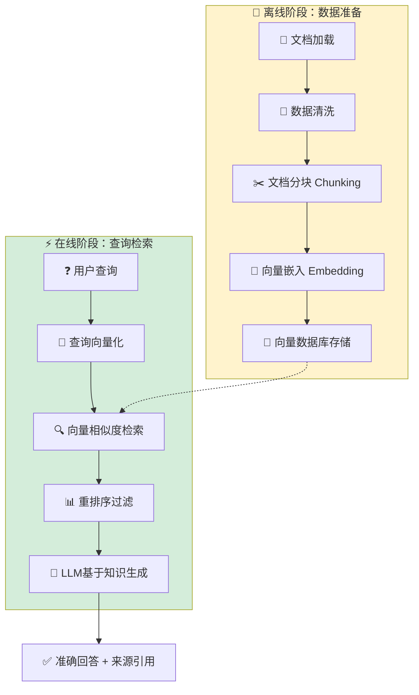
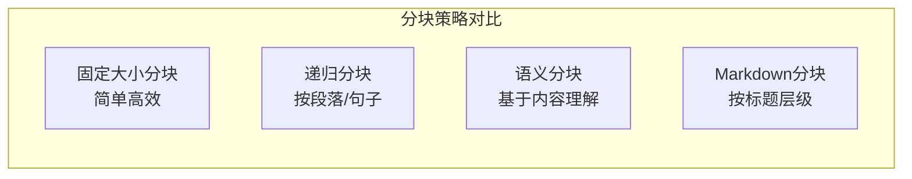

# 第七章：RAG检索增强与知识管理

## 📖 章节概述

本章将深入学习检索增强生成（RAG）技术，这是现代Agent系统中至关重要的知识管理能力。你将掌握如何让Agent从外部知识库中检索相关信息，结合大语言模型的生成能力，构建更准确、更可信的智能应用。

**学习时长**：2-3周  
**难度等级**：⭐⭐⭐ 中高级  
**核心技能**：向量检索、RAG架构、知识库设计、混合检索

---

## 7.1 RAG基础概念

### 7.1.1 什么是RAG？

检索增强生成（Retrieval-Augmented Generation，RAG）是一种将信息检索与语言模型生成相结合的技术。它的核心思想是：在生成回答之前，先从外部知识库中检索相关信息，然后将检索结果作为上下文提供给语言模型。

```
传统LLM流程：
用户问题 → LLM直接生成 → 回答
           ↓
        可能产生幻觉
        知识可能过时
        缺乏专业领域知识

RAG流程：
用户问题 → 检索相关知识 → LLM基于知识生成 → 准确回答
           ↓              ↓
        外部知识库     结合检索结果生成
           ↓              ↓
        解决幻觉问题    提高准确性
        提供最新信息    增强可信度
```

### 7.1.2 为什么需要RAG？

```python
"""
RAG解决了LLM的几个核心问题：

1. 知识时效性
   LLM训练数据有截止日期，无法获取最新信息
   RAG可以从实时更新的知识库中检索最新内容

2. 幻觉问题
   LLM可能生成看似合理但错误的内容
   RAG通过引用真实来源减少幻觉

3. 领域专业知识
   通用LLM缺乏特定领域的专业知识
   RAG可以接入专业知识库提供深度答案

4. 可解释性
   传统LLM难以解释答案来源
   RAG可以提供检索来源，增强可信度

5. 成本效益
   相比微调，RAG更新知识成本更低
   无需重新训练模型，只需更新知识库
"""
```

### 7.1.3 RAG工作流程

```python
"""
完整的RAG流程：

┌─────────────────────────────────────────────────────────┐
│                     RAG 系统架构                          │
├─────────────────────────────────────────────────────────┤
│                                                          │
│  阶段一：数据准备（离线）                                 │
│  ┌─────────┐   ┌──────────┐   ┌──────────────────┐      │
│  │ 文档    │──▶│ 数据清洗 │──▶│ 文档分块        │      │
│  │ 加载    │   │          │   │ (Chunking)      │      │
│  └─────────┘   └──────────┘   └────────┬─────────┘      │
│                                          │                │
│                                          ▼                │
│                                  ┌──────────────────┐      │
│                                  │ 向量化嵌入       │      │
│                                  │ (Embedding)     │      │
│                                  └────────┬─────────┘      │
│                                          │                │
│                                          ▼                │
│                                  ┌──────────────────┐      │
│                                  │ 向量数据库存储   │      │
│                                  │ (Vector Store)  │      │
│                                  └──────────────────┘      │
│                                                          │
│  阶段二：查询检索（在线）                                 │
│  ┌─────────┐   ┌──────────┐   ┌──────────────────┐      │
│  │ 用户    │──▶│ 查询     │──▶│ 向量相似度检索   │      │
│  │ 查询    │   │ 向量化   │   │ (Similarity)    │      │
│  └─────────┘   └──────────┘   └────────┬─────────┘      │
│                                          │                │
│                                          ▼                │
│                                  ┌──────────────────┐      │
│                                  │ 重排序与过滤     │      │
│                                  │ (Reranking)     │      │
│                                  └────────┬─────────┘      │
│                                          │                │
│                                          ▼                │
│  阶段三：生成回答（在线）                                 │
│  ┌─────────┐   ┌──────────┐   ┌──────────────────┐      │
│  │ 检索    │──▶│ 构建     │──▶│ LLM生成回答     │      │
│  │ 结果    │   │ 提示词   │   │ (Generation)    │      │
│  └─────────┘   └──────────┘   └──────────────────┘      │
│                                                          │
└─────────────────────────────────────────────────────────┘
```



---

## 7.2 文档处理与分块策略

### 7.2.1 文档加载

```python
from langchain_community.document_loaders import (
    PyPDFLoader,              # PDF文件
    TextLoader,               # 文本文件
    UnstructuredHTMLLoader,   # HTML文件
    CSVLoader,                # CSV文件
    NotionLoader,             # Notion笔记
    UnstructuredURLLoader,    # 网页内容
    Docx2txtLoader,           # Word文档
    UnstructuredExcelLoader   # Excel文件
)
from typing import List
from langchain_core.documents import Document

class DocumentLoader:
    """文档加载器"""
    
    def __init__(self):
        self.loaders = {
            '.pdf': PyPDFLoader,
            '.txt': TextLoader,
            '.html': UnstructuredHTMLLoader,
            '.csv': CSVLoader,
            '.docx': Docx2txtLoader,
        }
    
    def load_file(self, file_path: str) -> List[Document]:
        """加载单个文件"""
        
        import os
        ext = os.path.splitext(file_path)[1].lower()
        
        if ext not in self.loaders:
            raise ValueError(f"不支持的文件类型: {ext}")
        
        loader_class = self.loaders[ext]
        loader = loader_class(file_path)
        
        return loader.load()
    
    def load_directory(self, directory: str) -> List[Document]:
        """加载目录下的所有文档"""
        
        import os
        all_docs = []
        
        for root, dirs, files in os.walk(directory):
            for file in files:
                file_path = os.path.join(root, file)
                try:
                    docs = self.load_file(file_path)
                    all_docs.extend(docs)
                except Exception as e:
                    print(f"加载 {file_path} 失败: {e}")
        
        return all_docs
    
    def load_url(self, url: str) -> List[Document]:
        """加载网页内容"""
        loader = UnstructuredURLLoader(urls=[url])
        return loader.load()


# 使用示例
def demonstrate_loading():
    """文档加载演示"""
    
    loader = DocumentLoader()
    
    # 加载PDF
    pdf_docs = loader.load_file("document.pdf")
    
    # 加载目录
    all_docs = loader.load_directory("./knowledge_base/")
    
    # 加载网页
    web_docs = loader.load_url("https://example.com/article")
    
    print(f"加载了 {len(pdf_docs)} 个PDF页面")
    print(f"加载了 {len(all_docs)} 个文档")
    print(f"加载了 {len(web_docs)} 个网页")
```

### 7.2.2 文档分块策略

```python
from langchain_text_splitters import (
    RecursiveCharacterTextSplitter,  # 递归字符分割
    CharacterTextSplitter,           # 字符分割
    MarkdownTextSplitter,
    PythonCodeTextSplitter,
    TokenTextSplitter
)
from typing import List

class DocumentChunker:
    """文档分块处理器"""
    
    def __init__(self):
        self.splitters = {}
        self._init_splitters()
    
    def _init_splitters(self):
        """初始化各种分块器"""
        
        # 通用文本分块器
        self.splitters['recursive'] = RecursiveCharacterTextSplitter(
            separators=["\n\n", "\n", " ", ""],
            chunk_size=1000,           # 块大小（字符）
            chunk_overlap=200,         # 重叠大小
            length_function=len
        )
        
        # Markdown分块器（保持结构）
        self.splitters['markdown'] = MarkdownTextSplitter(
            chunk_size=500,
            chunk_overlap=50
        )
        
        # 代码分块器（保持函数/类）
        self.splitters['code'] = PythonCodeTextSplitter(
            chunk_size=500,
            chunk_overlap=50
        )
        
        # Token分块器（基于token数量）
        self.splitters['token'] = TokenTextSplitter(
            chunk_size=500,
            chunk_overlap=50
        )
    
    def chunk_documents(
        self, 
        documents: List[Document],
        splitter_type: str = 'recursive',
        custom_config: dict = None
    ) -> List[Document]:
        """
        分块文档
        
        Args:
            documents: 文档列表
            splitter_type: 分块器类型
            custom_config: 自定义配置
        """
        
        if splitter_type not in self.splitters:
            splitter_type = 'recursive'
        
        splitter = self.splitters[splitter_type]
        
        # 如果有自定义配置，创建新的分块器
        if custom_config:
            splitter = RecursiveCharacterTextSplitter(**custom_config)
        
        return splitter.split_documents(documents)
    
    def smart_chunk(
        self,
        document: Document,
        strategy: str = 'adaptive'
    ) -> List[Document]:
        """
        智能分块策略
        
        根据内容类型自动选择最佳分块策略
        """
        
        content = document.page_content
        
        if strategy == 'adaptive':
            # 自适应策略
            if self._is_code(content):
                return self.chunk_documents(
                    [document], 
                    'code'
                )
            elif self._is_markdown(content):
                return self.chunk_documents(
                    [document], 
                    'markdown'
                )
            else:
                return self.chunk_documents(
                    [document], 
                    'recursive'
                )
        
        elif strategy == 'semantic':
            # 语义分块（基于句子边界）
            return self._semantic_chunk(document)
        
        return self.chunk_documents([document])
    
    def _is_code(self, text: str) -> bool:
        """判断是否为代码"""
        code_indicators = [
            'def ', 'class ', 'import ', 'function ',
            'const ', 'let ', 'var ', '=>', '->'
        ]
        return any(indicator in text for indicator in code_indicators)
    
    def _is_markdown(self, text: str) -> bool:
        """判断是否为Markdown"""
        md_indicators = ['#', '##', '```', '- ', '* ']
        return sum(1 for ind in md_indicators if ind in text) >= 2
    
    def _semantic_chunk(self, document: Document) -> List[Document]:
        """基于语义的智能分块"""
        # 简化实现，实际应使用更复杂的算法
        return self.chunk_documents([document], 'recursive')


# 分块策略对比
"""
不同分块策略的选择：

1. 固定大小分块（Fixed Size）
   优点：简单快速
   缺点：可能打断语义单元
   适用：通用场景

2. 递归分块（Recursive）
   优点：保持语义完整性
   缺点：块大小不均匀
   适用：大多数场景

3. Markdown分块
   优点：保持文档结构
   缺点：依赖格式规范
   适用：技术文档

4. 语义分块
   优点：最大语义保持
   缺点：实现复杂，速度慢
   适用：高质量需求

5. Agentic分块
   优点：智能识别主题边界
   缺点：计算成本高
   适用：复杂长文档
"""
```



### 7.2.3 高级分块技术

```python
class AdvancedChunking:
    """高级分块技术"""
    
    @staticmethod
    def parent_document_chunking(
        documents: List[Document],
        parent_chunk_size: 4000,
        child_chunk_size: 500
    ) -> dict:
        """
        父子文档分块
        
        策略：
        1. 先创建大块（父文档）
        2. 再将大块分割成小块（子文档）
        3. 检索时用子文档，生成时关联父文档
        """
        
        # 父文档分块
        parent_splitter = RecursiveCharacterTextSplitter(
            chunk_size=parent_chunk_size,
            chunk_overlap=0
        )
        parent_docs = parent_splitter.split_documents(documents)
        
        # 子文档分块
        child_splitter = RecursiveCharacterTextSplitter(
            chunk_size=child_chunk_size,
            chunk_overlap=100
        )
        child_docs = child_splitter.split_documents(parent_docs)
        
        # 建立父子关系
        doc_mapping = {}
        for parent in parent_docs:
            parent_id = id(parent)
            doc_mapping[parent_id] = parent
        
        return {
            'parent_docs': parent_docs,
            'child_docs': child_docs,
            'mapping': doc_mapping
        }
    
    @staticmethod
    def hierarchical_chunking(
        document: Document,
        levels: List[int] = [4000, 1000, 500]
    ) -> List[Document]:
        """
        层级分块
        
        创建多个粒度的块，便于不同类型的查询
        """
        
        chunks = []
        
        for level, chunk_size in enumerate(levels):
            splitter = RecursiveCharacterTextSplitter(
                chunk_size=chunk_size,
                chunk_overlap=0
            )
            level_chunks = splitter.split_documents([document])
            
            # 标记层级
            for chunk in level_chunks:
                chunk.metadata['chunk_level'] = level
                chunk.metadata['chunk_size'] = chunk_size
            
            chunks.extend(level_chunks)
        
        return chunks
    
    @staticmethod
    def agentic_chunking(
        document: Document,
        llm_client
    ) -> List[Document]:
        """
        Agent式智能分块
        
        使用LLM识别语义边界进行分块
        """
        
        prompt = f"""
请分析以下文档，识别其自然的主题边界和语义单元。

文档内容：
{document.page_content[:5000]}

请列出你认为应该分割的位置和理由。
格式：段落编号，理由

例如：
3, 新主题开始
7, 讨论转移
10, 总结并引入新话题
        """
        
        # 调用LLM获取分块建议
        response = llm_client.chat(prompt)
        
        # 解析响应，创建分块
        # 这里需要解析LLM输出并实际分块
        # 简化实现
        
        splitter = RecursiveCharacterTextSplitter(
            chunk_size=1000,
            chunk_overlap=100
        )
        
        chunks = splitter.split_documents([document])
        
        # 添加元数据
        for i, chunk in enumerate(chunks):
            chunk.metadata['chunking_method'] = 'agentic'
            chunk.metadata['chunk_index'] = i
        
        return chunks
```

---

## 7.3 向量嵌入与存储

### 7.3.1 嵌入模型选择

```python
from langchain_openai import OpenAIEmbeddings
from langchain_community.embeddings import (
    HuggingFaceEmbeddings,
    CohereEmbeddings
)
from typing import List

class EmbeddingModelSelector:
    """嵌入模型选择器"""
    
    MODELS = {
        # OpenAI 嵌入
        "text-embedding-ada-002": {
            "provider": "OpenAI",
            "dimensions": 1536,
            "max_tokens": 8191,
            "cost_per_1k": 0.0001,
            "best_for": ["通用场景", "生产环境"],
            "quality": "high"
        },
        
        "text-embedding-3-small": {
            "provider": "OpenAI",
            "dimensions": 1536,  # 可缩减
            "max_tokens": 8191,
            "cost_per_1k": 0.00002,
            "best_for": ["成本敏感", "大规模应用"],
            "quality": "medium"
        },
        
        "text-embedding-3-large": {
            "provider": "OpenAI",
            "dimensions": 3072,  # 可缩减
            "max_tokens": 8191,
            "cost_per_1k": 0.00013,
            "best_for": ["高精度需求"],
            "quality": "very_high"
        },
        
        # 本地开源模型
        "sentence-transformers/all-MiniLM-L6-v2": {
            "provider": "HuggingFace",
            "dimensions": 384,
            "max_tokens": 256,
            "cost_per_1k": 0,  # 本地运行
            "best_for": ["本地部署", "隐私敏感"],
            "quality": "medium"
        },
        
        "sentence-transformers/all-mpnet-base-v2": {
            "provider": "HuggingFace",
            "dimensions": 768,
            "max_tokens": 384,
            "cost_per_1k": 0,
            "best_for": ["高质量需求", "本地部署"],
            "quality": "high"
        },
        
        # 中文模型
        "moka-ai/m3e-base": {
            "provider": "MokaAI",
            "dimensions": 768,
            "max_tokens": 512,
            "cost_per_1k": 0,
            "best_for": ["中文场景", "本地部署"],
            "quality": "high"
        }
    }
    
    @classmethod
    def get_embedding_model(
        cls,
        model_name: str = "text-embedding-ada-002",
        **kwargs
    ):
        """获取嵌入模型"""
        
        if model_name.startswith("text-embedding"):
            if "openai" in model_name or model_name == "text-embedding-ada-002":
                return OpenAIEmbeddings(model=model_name, **kwargs)
            elif "cohere" in model_name:
                return CohereEmbeddings(model=model_name, **kwargs)
        
        elif model_name.startswith("sentence-transformers"):
            return HuggingFaceEmbeddings(model_name=model_name, **kwargs)
        
        else:
            # 默认使用OpenAI
            return OpenAIEmbeddings(model="text-embedding-ada-002", **kwargs)
    
    @classmethod
    def recommend_model(
        cls,
        use_case: str,
        budget: str = "medium",
        language: str = "mixed"
    ) -> str:
        """推荐合适的嵌入模型"""
        
        recommendations = {
            "general": {
                "low": "sentence-transformers/all-MiniLM-L6-v2",
                "medium": "text-embedding-3-small",
                "high": "text-embedding-3-large"
            },
            "chinese": {
                "low": "moka-ai/m3e-base",
                "medium": "moka-ai/m3e-base",
                "high": "text-embedding-3-large"
            },
            "code": {
                "low": "sentence-transformers/all-MiniLM-L6-v2",
                "medium": "text-embedding-3-small",
                "high": "text-embedding-3-large"
            },
            "high_precision": {
                "low": "sentence-transformers/all-mpnet-base-v2",
                "medium": "text-embedding-3-large",
                "high": "text-embedding-3-large"
            }
        }
        
        use_case_key = "general" if use_case not in recommendations else use_case
        budget_key = "medium" if budget not in ["low", "medium", "high"] else budget
        
        return recommendations.get(use_case_key, {}).get(
            budget_key, 
            "text-embedding-3-small"
        )


# 使用示例
def demonstrate_embedding_selection():
    """嵌入模型选择演示"""
    
    # 自动推荐
    recommended = EmbeddingModelSelector.recommend_model(
        use_case="chinese",
        budget="medium"
    )
    print(f"推荐模型: {recommended}")
    
    # 获取模型
    embeddings = EmbeddingModelSelector.get_embedding_model(recommended)
    
    # 生成嵌入
    text = "这是一个测试文本"
    vector = embeddings.embed_query(text)
    print(f"嵌入维度: {len(vector)}")
```

### 7.3.2 向量数据库

```python
from langchain_community.vectorstores import (
    Chroma,                # 本地向量数据库
    FAISS,                # Facebook AI语义搜索
    Pinecone,              # 云端向量数据库
    Weaviate,              # 开源向量数据库
    Milvus,                # 开源向量数据库
    Qdrant                 # 高性能向量数据库
)

class VectorStoreManager:
    """向量存储管理器"""
    
    def __init__(self):
        self.stores = {}
    
    def create_chroma_store(
        self,
        documents: List[Document],
        embeddings,
        persist_directory: str = "./chroma_db"
    ) -> Chroma:
        """创建Chroma向量存储"""
        
        vectorstore = Chroma.from_documents(
            documents=documents,
            embedding=embeddings,
            persist_directory=persist_directory
        )
        
        self.stores['chroma'] = vectorstore
        return vectorstore
    
    def create_faiss_store(
        self,
        documents: List[Document],
        embeddings
    ) -> FAISS:
        """创建FAISS向量存储"""
        
        vectorstore = FAISS.from_documents(
            documents=documents,
            embedding=embeddings
        )
        
        self.stores['faiss'] = vectorstore
        return vectorstore
    
    def create_pinecone_store(
        self,
        documents: List[Document],
        embeddings,
        index_name: str,
        environment: str = "gcp-starter"
    ) -> Pinecone:
        """创建Pinecone向量存储"""
        
        import pinecone
        
        # 初始化Pinecone
        pinecone.init(api_key="your-api-key", environment=environment)
        
        # 创建索引（如果不存在）
        if index_name not in pinecone.list_indexes():
            pinecone.create_index(
                name=index_name,
                dimension=len(embeddings.embed_query("test")),
                metric="cosine"
            )
        
        # 创建向量存储
        vectorstore = Pinecone.from_documents(
            documents=documents,
            embedding=embeddings,
            index_name=index_name
        )
        
        self.stores['pinecone'] = vectorstore
        return vectorstore
    
    def load_local_store(
        self,
        store_type: str,
        persist_directory: str
    ):
        """加载本地向量存储"""
        
        if store_type == 'chroma':
            embeddings = OpenAIEmbeddings()
            vectorstore = Chroma(
                persist_directory=persist_directory,
                embedding_function=embeddings
            )
        elif store_type == 'faiss':
            vectorstore = FAISS.load_local(
                persist_directory,
                OpenAIEmbeddings()
            )
        else:
            raise ValueError(f"不支持的存储类型: {store_type}")
        
        self.stores[store_type] = vectorstore
        return vectorstore


# 向量数据库对比
"""
向量数据库对比：

┌────────────┬───────────┬──────────┬───────────┬────────────┐
│ 数据库     │ 部署方式  │ 性能     │ 成本      │ 适用场景   │
├────────────┼───────────┼──────────┼───────────┼────────────┤
│ Chroma     │ 本地      │ 中等     │ 免费      │ 原型开发   │
├────────────┼───────────┼──────────┼───────────┼────────────┤
│ FAISS      │ 本地      │ 高       │ 免费      │ 大规模数据 │
├────────────┼───────────┼──────────┼───────────┼────────────┤
│ Pinecone   │ 云端      │ 高       │ 按量付费  │ 企业生产   │
├────────────┼───────────┼──────────┼───────────┼────────────┤
│ Weaviate   │ 本地/云端│ 高       │ 开源/云端 │ 灵活部署   │
├────────────┼───────────┼──────────┼───────────┼────────────┤
│ Milvus     │ 本地/云端│ 极高     │ 开源/云端 │ 超大规模  │
├────────────┼───────────┼──────────┼───────────┼────────────┤
│ Qdrant     │ 本地/云端│ 极高     │ 开源/云端 │ 高性能需求│
└────────────┴───────────┴──────────┴───────────┴────────────┘
"""
```
（详见 [第4章 - 工具与记忆系统](chapter4-tools-memory/chapter4-tools-memory.md)）

---

## 7.4 检索策略

### 7.4.1 基础检索方法

```python
from langchain.chains import RetrievalQA
from langchain.retrievers import (
    VectorStoreRetriever,
    SVMRetriever,
    TFIDFRetriever,
    ContextualCompressionRetriever
)
from langchain.retrievers.document_compressors import (
    LLMChainExtractor,
    LLMChainFilter,
    EmbeddingsFilter
)

class RetrievalSystem:
    """检索系统"""
    
    def __init__(self, vectorstore, embeddings):
        self.vectorstore = vectorstore
        self.embeddings = embeddings
        self.retriever = None
    
    def create_basic_retriever(
        self,
        search_type: str = "similarity",
        k: int = 4
    ):
        """创建基础检索器"""
        
        self.retriever = self.vectorstore.as_retriever(
            search_type=search_type,
            search_kwargs={"k": k}
        )
        
        return self.retriever
    
    def create_mmr_retriever(
        self,
        k: int = 4,
        fetch_k: int = 20,
        lambda_mult: float = 0.5
    ):
        """
        创建MMR检索器
        
        MMR (Maximum Marginal Relevance) 检索
        在相关性和多样性之间取得平衡
        """
        
        self.retriever = self.vectorstore.as_retriever(
            search_type="mmr",
            search_kwargs={
                "k": k,              # 最终返回数量
                "fetch_k": fetch_k,  # 初始检索数量
                "lambda_mult": lambda_mult  # 多样性参数
                # 1.0 = 完全相似
                # 0.0 = 完全多样
            }
        )
        
        return self.retriever
    
    def create_compression_retriever(
        self,
        base_retriever,
        compression_type: str = "llm_chain_extractor"
    ):
        """
        创建压缩检索器
        
        在检索后对文档进行压缩，过滤无关内容
        """
        
        if compression_type == "llm_chain_extractor":
            from langchain_openai import ChatOpenAI
            compressor = LLMChainExtractor.from_llm(
                ChatOpenAI(temperature=0)
            )
        elif compression_type == "embeddings_filter":
            compressor = EmbeddingsFilter.from_embeddings(
                embeddings=self.embeddings,
                similarity_threshold=0.8
            )
        else:
            compressor = None
        
        if compressor:
            self.retriever = ContextualCompressionRetriever(
                base_retriever=base_retriever,
                compressors=[compressor]
            )
        else:
            self.retriever = base_retriever
        
        return self.retriever
    
    def hybrid_search(
        self,
        query: str,
        k: int = 4,
        alpha: float = 0.5
    ) -> List[Document]:
        """
        混合搜索
        
        结合向量相似度和关键词匹配
        alpha: 0=纯关键词, 1=纯向量
        """
        
        # 向量搜索
        vector_results = self.vectorstore.similarity_search(
            query, k=fetch_k
        )
        
        # 关键词搜索（如果支持）
        if hasattr(self.vectorstore, 'similarity_search_by_vector'):
            # 获取查询向量
            query_vector = self.embeddings.embed_query(query)
            
            # BM25风格搜索（简化实现）
            keyword_results = self._keyword_search(query, k=fetch_k)
            
            # 融合结果
            return self._fusion_results(
                vector_results,
                keyword_results,
                alpha=alpha,
                k=k
            )
        
        return vector_results[:k]
    
    def _keyword_search(
        self, 
        query: str, 
        k: int
    ) -> List[tuple]:
        """简化的关键词搜索"""
        
        # 这里应该使用支持关键词搜索的数据库
        # 简化实现返回空
        return []
    
    def _fusion_results(
        self,
        vector_results: List[Document],
        keyword_results: List[tuple],
        alpha: float,
        k: int
    ) -> List[Document]:
        """融合搜索结果"""
        
        # 简化的RRF (Reciprocal Rank Fusion) 算法
        scores = {}
        
        # 向量结果打分
        for i, doc in enumerate(vector_results):
            doc_id = id(doc)
            scores[doc_id] = scores.get(doc_id, 0) + alpha * (1 / (i + 60))
        
        # 关键词结果打分
        for i, (doc, score) in enumerate(keyword_results):
            doc_id = id(doc)
            scores[doc_id] = scores.get(doc_id, 0) + (1 - alpha) * (1 / (i + 60))
        
        # 排序
        sorted_docs = sorted(
            vector_results + [d for d, _ in keyword_results],
            key=lambda d: scores.get(id(d), 0),
            reverse=True
        )
        
        return sorted_docs[:k]


# 检索策略对比
"""
检索策略选择指南：

1. Similarity Search（相似度搜索）
   最基础的方法，直接基于向量相似度
   适用于：通用场景

2. MMR (Maximum Marginal Relevance)
   在相关性和多样性之间平衡
   适用于：需要多样化结果的场景

3. Compression（压缩检索）
   提取最相关的片段，减少干扰
   适用于：长文档、噪声多的场景

4. Hybrid Search（混合搜索）
   结合向量和关键词搜索
   适用于：需要精确匹配的复杂查询

5. Ensemble（集成搜索）
   结合多个检索器
   适用于：追求最佳效果
"""
```

### 7.4.2 高级检索技术

```python
class AdvancedRetrieval:
    """高级检索技术"""
    
    def __init__(self, vectorstore, llm_client):
        self.vectorstore = vectorstore
        self.llm = llm_client
    
    def query_decomposition(
        self,
        query: str
    ) -> List[str]:
        """
        查询分解
        
        将复杂查询分解为多个简单子查询
        """
        
        prompt = f"""
请将以下复杂查询分解为3-5个简单的子查询。

复杂查询：{query}

分解要求：
1. 每个子查询应该独立且完整
2. 子查询应该覆盖原查询的不同方面
3. 使用简单的句式

子查询列表：
        """
        
        response = self.llm.chat(prompt)
        
        # 解析子查询
        sub_queries = [
            line.strip() for line in response.split('\n')
            if line.strip() and not line.startswith('#')
        ]
        
        return sub_queries
    
    def sub_query_retrieval(
        self,
        query: str,
        k: int = 3
    ) -> List[Document]:
        """
        子查询检索
        
        对每个子查询分别检索，然后合并结果
        """
        
        # 分解查询
        sub_queries = self.query_decomposition(query)
        
        all_docs = []
        seen_ids = set()
        
        # 对每个子查询检索
        for sub_query in sub_queries:
            docs = self.vectorstore.similarity_search(
                sub_query, k=k
            )
            
            # 去重
            for doc in docs:
                doc_id = id(doc)
                if doc_id not in seen_ids:
                    seen_ids.add(doc_id)
                    all_docs.append(doc)
        
        return all_docs
    
    def step_back_prompting(
        self,
        query: str
    ) -> str:
        """
        Step-back提示
        
        将查询泛化为更高层次的概念
        """
        
        prompt = f"""
请将以下问题泛化为一到两个更高层次的概念性问题。

原始问题：{query}

泛化后的问题（更高层次的概念）：
        """
        
        return self.llm.chat(prompt)
    
    def hyde_retrieval(
        self,
        query: str,
        k: int = 3
    ) -> List[Document]:
        """
        HyDE (Hypothetical Document Embeddings)
        
        先让LLM生成一个假设性答案
        再用这个答案去检索相关文档
        """
        
        # 生成假设性答案
        prompt = f"""
请为以下问题生成一个简短、准确的假设性答案。
这个答案不需要完全正确，只需要作为检索的参考。

问题：{query}

假设性答案：
        """
        
        hypothetical_answer = self.llm.chat(prompt)
        
        # 用假设性答案检索
        docs = self.vectorstore.similarity_search(
            hypothetical_answer, k=k
        )
        
        return docs
    
    def citation_aware_retrieval(
        self,
        query: str,
        k: int = 4
    ) -> List[Dict]:
        """
        引用感知检索
        
        检索文档并生成引用信息
        """
        
        # 基础检索
        docs = self.vectorstore.similarity_search(query, k=k)
        
        # 为每个文档生成引用信息
        results = []
        for i, doc in enumerate(docs, 1):
            results.append({
                'document': doc,
                'citation': f"[{i}]",
                'relevance_score': 0.9 - (i * 0.1)  # 简化评分
            })
        
        return results
```

---

## 7.5 RAG系统实现

### 7.5.1 基础RAG Chain

```python
from langchain.chains import RetrievalQA
from langchain.chains.question_answering import (
    load_qa_chain
)
from langchain.prompts import PromptTemplate
from langchain_openai import ChatOpenAI

class BasicRAG:
    """基础RAG系统"""
    
    def __init__(self, vectorstore, llm_client):
        self.vectorstore = vectorstore
        self.llm = llm_client
        self.qa_chain = None
    
    def create_qa_chain(
        self,
        chain_type: str = "stuff",
        return_source_documents: bool = True
    ):
        """
        创建问答Chain
        
        chain_type:
        - "stuff": 将所有文档塞入一个提示（适合少量文档）
        - "map_reduce": 对每个文档单独处理，然后汇总
        - "refine": 迭代优化答案
        - "map_rerank": 对每个文档评分，返回最佳答案
        """
        
        self.qa_chain = RetrievalQA.from_chain_type(
            llm=self.llm,
            chain_type=chain_type,
            retriever=self.vectorstore.as_retriever(
                search_kwargs={"k": 4}
            ),
            return_source_documents=return_source_documents,
            chain_type_kwargs={
                "verbose": True
            }
        )
        
        return self.qa_chain
    
    def query(self, question: str) -> Dict:
        """执行查询"""
        
        if not self.qa_chain:
            self.create_qa_chain()
        
        result = self.qa_chain({"query": question})
        
        return {
            "answer": result["result"],
            "source_documents": result.get("source_documents", [])
        }
    
    def query_with_citation(
        self, 
        question: str
    ) -> str:
        """带引用的查询"""
        
        if not self.qa_chain:
            self.create_qa_chain()
        
        result = self.qa_chain({"query": question})
        
        # 构建带引用的答案
        answer = result["result"]
        sources = result.get("source_documents", [])
        
        if sources:
            answer += "\n\n**参考来源：**\n"
            for i, doc in enumerate(sources, 1):
                source_info = doc.metadata.get('source', '未知来源')
                answer += f"[{i}] {source_info}\n"
        
        return answer


# 使用示例
def demonstrate_basic_rag():
    """基础RAG演示"""
    
    # 初始化
    from langchain_openai import ChatOpenAI
    from langchain_openai import OpenAIEmbeddings
    
    llm = ChatOpenAI(model="gpt-4-turbo")
    embeddings = OpenAIEmbeddings()
    
    # 创建向量存储（示例）
    # vectorstore = Chroma.from_documents(
    #     documents=chunks,
    #     embedding=embeddings
    # )
    
    # 创建RAG系统
    # rag = BasicRAG(vectorstore, llm)
    
    # 查询
    # result = rag.query("什么是人工智能？")
    # print(result["answer"])
    
    print("RAG系统已配置完成")
```

### 7.5.2 高级RAG架构

```python
class AdvancedRAG:
    """高级RAG系统"""
    
    def __init__(self, vectorstore, llm_client):
        self.vectorstore = vectorstore
        self.llm = llm_client
        self.components = {}
    
    def build_rag_pipeline(
        self,
        enable_query_rewrite: bool = True,
        enable_reranking: bool = True,
        enable_citation: bool = True
    ) -> callable:
        """
        构建完整的RAG管道
        
        包含：
        1. 查询重写
        2. 检索
        3. 重排序
        4. 生成
        5. 引用
        """
        
        def pipeline(query: str) -> Dict:
            transformed_query = query
            
            # 1. 查询重写
            if enable_query_rewrite:
                transformed_query = self._rewrite_query(query)
            
            # 2. 检索
            docs = self.vectorstore.similarity_search(
                transformed_query, k=10
            )
            
            # 3. 重排序
            if enable_reranking:
                docs = self._rerank_documents(query, docs)
                docs = docs[:4]  # 只保留top 4
            
            # 4. 生成
            answer = self._generate_answer(query, docs)
            
            # 5. 引用
            if enable_citation:
                answer = self._add_citations(answer, docs)
            
            return {
                "query": query,
                "transformed_query": transformed_query,
                "answer": answer,
                "source_count": len(docs)
            }
        
        return pipeline
    
    def _rewrite_query(self, query: str) -> str:
        """查询重写"""
        
        prompt = f"""
请重写以下查询，使其更加清晰和适合检索。

原始查询：{query}

重写要求：
1. 去除歧义
2. 补充必要的上下文
3. 使用精确的术语

重写后的查询：
        """
        
        return self.llm.chat(prompt).strip()
    
    def _rerank_documents(
        self,
        query: str,
        documents: List[Document]
    ) -> List[Document]:
        """重排序文档"""
        
        # 简化实现
        # 实际应使用专门的Reranker模型
        
        prompt = f"""
请评估以下文档与查询的相关性，并按相关性排序。

查询：{query}

文档：
{documents}

请按1-10分评分，1分最不相关，10分最相关。
返回排序后的文档编号列表，例如：[3, 1, 2, 4]
        """
        
        response = self.llm.chat(prompt)
        
        # 解析响应，重新排序
        # 简化实现
        return documents
    
    def _generate_answer(
        self,
        query: str,
        documents: List[Document]
    ) -> str:
        """生成答案"""
        
        # 构建上下文
        context = "\n\n".join([
            f"文档{i+1}:\n{doc.page_content}"
            for i, doc in enumerate(documents)
        ])
        
        prompt = f"""
基于以下参考文档回答问题。
如果文档中没有相关信息，请明确说明。

参考文档：
{context}

问题：{query}

回答要求：
1. 基于参考文档
2. 清晰准确
3. 引用相关文档
        """
        
        return self.llm.chat(prompt)
    
    def _add_citations(
        self,
        answer: str,
        documents: List[Document]
    ) -> str:
        """添加引用"""
        
        citation_section = "\n\n**参考来源：**\n"
        
        for i, doc in enumerate(documents, 1):
            source = doc.metadata.get('source', '未知')
            citation_section += f"[{i}] {source}\n"
        
        return answer + citation_section


# Self-RAG 实现
class SelfRAG:
    """Self-RAG：自我反思的RAG"""
    
    def __init__(self, vectorstore, llm_client):
        self.vectorstore = vectorstore
        self.llm = llm_client
    
    def is_relevant(self, query: str, document: Document) -> bool:
        """判断文档是否相关"""
        
        prompt = f"""
判断以下文档是否与查询相关。

查询：{query}

文档：{document.page_content[:500]}

回答：是的/不是

判断：
        """
        
        response = self.llm.chat(prompt)
        return "是的" in response or "相关" in response
    
    def is_supported(self, answer: str, document: Document) -> bool:
        """判断答案是否被文档支持"""
        
        prompt = f"""
判断以下答案是否由提供的文档支持。

答案：{answer}

文档：{document.page_content[:500]}

回答：是/否/部分支持

判断：
        """
        
        response = self.llm.chat(prompt)
        return "是" in response or "部分" in response
    
    def retrieve_and_generate(
        self,
        query: str,
        k: int = 5
    ) -> Dict:
        """自我反思的检索生成"""
        
        # 1. 检索
        docs = self.vectorstore.similarity_search(query, k=k)
        
        # 2. 过滤相关文档
        relevant_docs = []
        for doc in docs:
            if self.is_relevant(query, doc):
                relevant_docs.append(doc)
        
        if not relevant_docs:
            return {
                "answer": "抱歉，没有找到相关信息。",
                "used_documents": []
            }
        
        # 3. 生成答案
        context = "\n\n".join([
            doc.page_content for doc in relevant_docs
        ])
        
        prompt = f"""
基于以下文档回答问题：

文档：{context}

问题：{query}

答案：
        """
        
        answer = self.llm.chat(prompt)
        
        # 4. 验证支持
        supported_docs = []
        for doc in relevant_docs:
            if self.is_supported(answer, doc):
                supported_docs.append(doc)
        
        return {
            "answer": answer,
            "used_documents": supported_docs,
            "relevance_score": len(supported_docs) / len(relevant_docs)
        }
```

---

## 7.6 知识图谱集成

### 7.6.1 知识图谱基础

```python
from typing import List, Dict, Tuple
import networkx as nx

class KnowledgeGraph:
    """知识图谱"""
    
    def __init__(self):
        self.graph = nx.DiGraph()
        self.entities = {}  # entity_name -> entity_info
        self.relations = []  # [(subject, predicate, object)]
    
    def add_triple(
        self,
        subject: str,
        predicate: str,
        object_: str,
        properties: Dict = None
    ):
        """添加三元组"""
        
        # 添加节点
        if subject not in self.graph:
            self.graph.add_node(
                subject,
                type='entity',
                properties=properties or {}
            )
        
        if object_ not in self.graph:
            self.graph.add_node(
                object_,
                type='entity',
                properties=properties or {}
            )
        
        # 添加边
        self.graph.add_edge(
            subject,
            object_,
            predicate=predicate,
            properties=properties or {}
        )
        
        self.relations.append((subject, predicate, object_))
    
    def query(
        self,
        subject: str = None,
        predicate: str = None,
        object_: str = None
    ) -> List[Tuple]:
        """查询三元组"""
        
        results = []
        
        for s, p, o in self.relations:
            if subject and s != subject:
                continue
            if predicate and p != predicate:
                continue
            if object_ and o != object_:
                continue
            results.append((s, p, o))
        
        return results
    
    def get_neighbors(
        self,
        entity: str,
        depth: int = 1
    ) -> List[Dict]:
        """获取邻居节点"""
        
        neighbors = []
        
        for node in self.graph.neighbors(entity):
            edge_data = self.graph.get_edge_data(entity, node)
            neighbors.append({
                'entity': node,
                'relation': edge_data.get('predicate'),
                'distance': 1
            })
        
        return neighbors
    
    def find_path(
        self,
        start: str,
        end: str
    ) -> List[str]:
        """查找两个实体之间的路径"""
        
        try:
            path = nx.shortest_path(self.graph, start, end)
            return path
        except nx.NetworkXNoPath:
            return []
    
    def to_cypher(self) -> List[str]:
        """转换为Cypher查询语言"""
        
        cypher_statements = []
        
        for s, p, o in self.relations:
            statement = f"""
MERGE (a:Entity {{name: '{s}'}})
MERGE (b:Entity {{name: '{o}'}})
MERGE (a)-[:{p.upper()}]->(b)
            """
            cypher_statements.append(statement.strip())
        
        return cypher_statements


# 知识图谱RAG集成
class KnowledgeGraphRAG:
    """知识图谱增强的RAG"""
    
    def __init__(self, vectorstore, knowledge_graph, llm_client):
        self.vectorstore = vectorstore
        self.kg = knowledge_graph
        self.llm = llm_client
    
    def hybrid_retrieval(
        self,
        query: str,
        k: int = 4
    ) -> List[Document]:
        """
        混合检索
        
        结合向量检索和知识图谱
        """
        
        # 1. 向量检索
        vector_docs = self.vectorstore.similarity_search(query, k=k)
        
        # 2. 知识图谱检索
        kg_entities = self._extract_entities(query)
        kg_context = self._get_kg_context(kg_entities)
        
        # 3. 合并结果
        combined_docs = vector_docs.copy()
        
        # 如果知识图谱有相关信息，添加进去
        if kg_context:
            # 创建一个包含KG上下文的虚拟文档
            kg_doc = Document(
                page_content=kg_context,
                metadata={"source": "knowledge_graph"}
            )
            combined_docs.append(kg_doc)
        
        return combined_docs[:k]
    
    def _extract_entities(self, text: str) -> List[str]:
        """提取实体"""
        
        # 简化实现
        # 实际应使用NER模型
        return []
    
    def _get_kg_context(self, entities: List[str]) -> str:
        """获取知识图谱上下文"""
        
        if not entities:
            return ""
        
        context_parts = ["基于知识图谱的信息："]
        
        for entity in entities:
            neighbors = self.kg.get_neighbors(entity)
            if neighbors:
                context_parts.append(f"\n关于 {entity}：")
                for neighbor in neighbors[:3]:
                    context_parts.append(
                        f"  - {neighbor['relation']} {neighbor['entity']}"
                    )
        
        return "\n".join(context_parts)
```

---

## 7.7 章节练习

### 🎯 练习一：实现完整的RAG系统

```python
class CompleteRAGSystem:
    """完整RAG系统实现"""
    
    def __init__(self, config: dict):
        self.config = config
        self.vectorstore = None
        self.llm = None
        self.embeddings = None
    
    def setup(self):
        """初始化系统"""
        
        # 1. 初始化LLM
        from langchain_openai import ChatOpenAI
        self.llm = ChatOpenAI(
            model=self.config.get("llm_model", "gpt-4-turbo")
        )
        
        # 2. 初始化嵌入模型
        from langchain_openai import OpenAIEmbeddings
        self.embeddings = OpenAIEmbeddings(
            model=self.config.get("embedding_model", "text-embedding-ada-002")
        )
        
        # 3. 初始化向量存储
        # 根据配置选择
    
    def load_documents(self, file_path: str):
        """加载文档"""
        from langchain_community.document_loaders import PyPDFLoader
        
        loader = PyPDFLoader(file_path)
        documents = loader.load()
        
        return documents
    
    def create_index(self, documents: List[Document]):
        """创建索引"""
        
        # 分块
        from langchain.text_splitter import RecursiveCharacterTextSplitter
        
        splitter = RecursiveCharacterTextSplitter(
            chunk_size=1000,
            chunk_overlap=200
        )
        
        chunks = splitter.split_documents(documents)
        
        # 创建向量存储
        from langchain.vectorstores import Chroma
        
        self.vectorstore = Chroma.from_documents(
            documents=chunks,
            embedding=self.embeddings,
            persist_directory=self.config.get("persist_dir", "./chroma_db")
        )
        
        return len(chunks)
    
    def query(self, question: str) -> Dict:
        """查询"""
        
        if not self.vectorstore:
            raise ValueError("请先创建索引")
        
        # 检索
        docs = self.vectorstore.similarity_search(question, k=4)
        
        # 生成
        context = "\n\n".join([doc.page_content for doc in docs])
        
        prompt = f"""
基于以下参考文档回答问题。如果文档中没有相关信息，请说明。

参考文档：
{context}

问题：{question}

回答：
        """
        
        answer = self.llm.chat(prompt)
        
        return {
            "answer": answer,
            "sources": [
                {
                    "content": doc.page_content[:200],
                    "source": doc.metadata.get("source", "未知")
                }
                for doc in docs
            ]
        }
```

### 🎯 练习二：实现混合检索系统

```python
class HybridSearchSystem:
    """混合搜索系统"""
    
    def __init__(self, vectorstore, llm_client):
        self.vectorstore = vectorstore
        self.llm = llm_client
    
    def search(
        self,
        query: str,
        k: int = 5,
        alpha: float = 0.5
    ) -> List[Dict]:
        """
        混合搜索
        
        alpha: 0=纯关键词, 1=纯向量
        """
        
        # 向量搜索
        vector_results = self.vectorstore.similarity_search(
            query, k=k*2
        )
        
        # 关键词搜索（TF-IDF）
        keyword_results = self.vectorstore.similarity_search(
            query, k=k*2
        )
        
        # RRF融合
        fused_results = self._reciprocal_rank_fusion(
            vector_results,
            [],
            k=60,
            alpha=alpha
        )
        
        return fused_results[:k]
    
    def _reciprocal_rank_fusion(
        self,
        results_a: List,
        results_b: List,
        k: int = 60,
        alpha: float = 0.5
    ) -> List:
        """RRF融合算法"""
        
        scores = {}
        
        # 向量结果
        for i, doc in enumerate(results_a):
            scores[id(doc)] = (
                scores.get(id(doc), 0) + 
                alpha * (1 / (i + k))
            )
        
        # 关键词结果
        for i, doc in enumerate(results_b):
            scores[id(doc)] = (
                scores.get(id(doc), 0) + 
                (1 - alpha) * (1 / (i + k))
            )
        
        # 排序
        all_docs = results_a + results_b
        sorted_docs = sorted(
            all_docs,
            key=lambda d: scores.get(id(d), 0),
            reverse=True
        )
        
        return sorted_docs
```

---

## 📚 延伸阅读

### RAG相关资源

1. [LangChain RAG Tutorial](https://python.langchain.com/docs/tutorials/rag/)
2. [Pinecone RAG Guide](https://docs.pinecone.io/docs/rag)
3. [RAG Survey Papers](https://arxiv.org/abs/2312.10997)

### 向量数据库文档

1. [Chroma Documentation](https://docs.trychroma.com/)
2. [FAISS GitHub](https://github.com/facebookresearch/faiss)
3. [Pinecone Documentation](https://docs.pinecone.io/)
4. [Weaviate Documentation](https://weaviate.io/developers/weaviate)

---

## ✅ 章节总结

### 核心要点回顾

1. **RAG基础**：检索增强生成解决LLM知识时效性和幻觉问题
2. **文档处理**：分块策略影响检索质量，选择合适的分块方法
3. **向量存储**：Chroma、FAISS、Pinecone等向量数据库各有特点
4. **检索策略**：MMR、混合搜索、子查询检索等技术提升效果
5. **高级RAG**：查询重写、重排序、Self-RAG等优化方案
6. **知识图谱**：结构化知识与向量检索的结合

### 下章预告

在下一章中，我们将学习**多Agent系统架构**，包括：
- Agent间通信协议与协作机制
- 主从、对等、层级等架构模式
- 任务分解与分配策略
- 共识形成与决策机制

---

**掌握RAG技术后，你的Agent将具备强大的知识管理和检索能力！🚀**
（详见 [第15章 - Ollama部署](chapter15-ollama-deployment/chapter15-ollama-deployment.md)）

[← 返回课程目录](../course-overview.md) | [→ 进入第八章：多Agent系统架构](../chapter8-multi-agent-systems/chapter8-multi-agent-systems.md)
