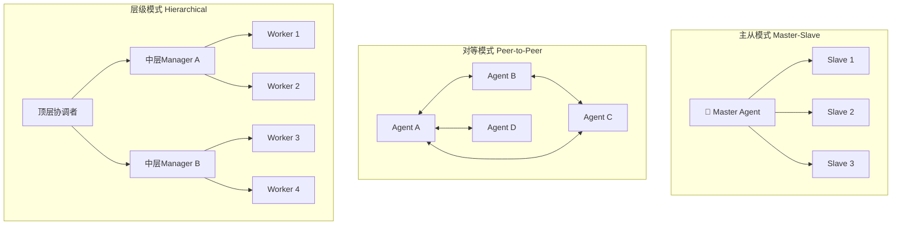
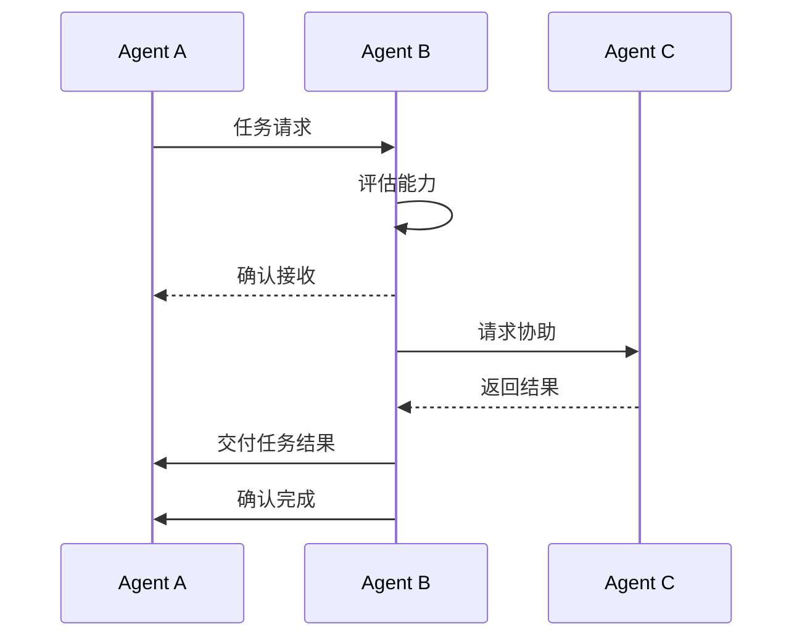

# 第八章：多Agent系统架构

## 📖 章节概述

本章深入探讨多Agent系统的架构设计与协作机制。你将学习如何构建能够相互通信、协作完成复杂任务的Agent群体，掌握主从、对等、层级等不同架构模式，理解任务分解、分配和共识形成的核心原理。

**学习时长**：1-2周  
**难度等级**：⭐⭐⭐ 高级  
**核心技能**：多Agent协作、任务分配、共识机制、分布式推理

---

## 8.1 多Agent系统基础

### 8.1.1 为什么需要多Agent？

```
单Agent局限：
- 能力有限
- 知识孤岛
- 单点故障
- 无法处理复杂任务

多Agent优势：
- 专业化分工
- 知识共享
- 容错性强
- 协同解决问题
```

### 8.1.2 核心概念

```python
class MultiAgentConcepts:
    """多Agent系统核心概念"""
    
    CONCEPTS = {
        "协作": {
            "定义": "多个Agent共同完成单个Agent无法完成的复杂任务",
            "方式": ["信息共享", "任务分担", "结果整合"]
        },
        "通信": {
            "定义": "Agent之间传递信息和指令的机制",
            "协议": ["点对点", "广播", "发布订阅"]
        },
        "协调": {
            "定义": "管理Agent行为，避免冲突和冗余",
            "策略": ["中央协调", "分布式协调", "市场机制"]
        },
        "竞争": {
            "定义": "Agent为资源或目标展开竞争",
            "场景": ["资源分配", "方案选择", "角色分配"]
        }
    }
```

---



## 8.2 架构模式

### 8.2.1 主从模式（Master-Slave）

```python
from typing import List, Dict, Any, Callable
from dataclasses import dataclass
import asyncio

@dataclass
class Task:
    id: str
    description: str
    status: str = "pending"
    result: Any = None
    assigned_to: str = None

class MasterAgent:
    """主Agent：负责任务分解和分配"""
    
    def __init__(self, llm_client):
        self.llm = llm_client
        self.slaves: List[Any] = []
        self.tasks: List[Task] = []
    
    def register_slave(self, slave_agent):
        """注册从Agent"""
        self.slaves.append(slave_agent)
    
    def decompose_task(self, task: str) -> List[Task]:
        """分解任务"""
        prompt = f"将以下任务分解为可并行的子任务：{task}"
        subtasks = self.llm.chat(prompt)
        
        tasks = []
        for i, desc in enumerate(subtasks):
            tasks.append(Task(
                id=f"task_{i}",
                description=desc
            ))
        return tasks
    
    def assign_tasks(self, tasks: List[Task]) -> Dict[str, Any]:
        """分配任务给从Agent"""
        assignments = {}
        
        for i, task in enumerate(tasks):
            slave = self.slaves[i % len(self.slaves)]
            task.assigned_to = slave.name
            assignments[slave.name] = task
            slave.receive_task(task)
        
        return assignments
    
    def collect_results(self) -> List[Any]:
        """收集结果"""
        results = []
        for slave in self.slaves:
            results.extend(slave.get_results())
        return results
    
    def coordinate(self, task: str) -> str:
        """协调执行完整任务"""
        # 分解
        tasks = self.decompose_task(task)
        
        # 分配
        self.assign_tasks(tasks)
        
        # 并行执行
        asyncio.gather(*[s.execute() for s in self.slaves])
        
        # 收集结果
        results = self.collect_results()
        
        # 整合
        return self.integrate_results(results)

class SlaveAgent:
    """从Agent：执行具体任务"""
    
    def __init__(self, name: str, llm_client):
        self.name = name
        self.llm = llm_client
        self.tasks: List[Task] = []
        self.results: List[Any] = []
    
    def receive_task(self, task: Task):
        self.tasks.append(task)
    
    async def execute(self):
        """执行任务"""
        for task in self.tasks:
            result = await self.process_task(task)
            self.results.append(result)
    
    async def process_task(self, task: Task) -> Any:
        """处理单个任务"""
        task.status = "executing"
        # 实际处理逻辑
        return f"{self.name} 完成: {task.description}"
    
    def get_results(self) -> List[Any]:
        return self.results
```

### 8.2.2 对等模式（Peer-to-Peer）

```python
class PeerAgent:
    """对等Agent"""
    
    def __init__(self, name: str, llm_client):
        self.name = name
        self.llm = llm_client
        self.peers: Dict[str, 'PeerAgent'] = {}
        self.knowledge_base = {}
    
    def add_peer(self, peer_id: str, peer: 'PeerAgent'):
        """添加对等节点"""
        self.peers[peer_id] = peer
    
    def request_help(self, query: str) -> str:
        """向其他Agent请求帮助"""
        # 向所有对等节点广播请求
        responses = []
        
        for peer_id, peer in self.peers.items():
            if peer.has_knowledge(query):
                response = peer.respond_to_query(query)
                responses.append(response)
        
        if responses:
            return self.select_best_response(responses)
        
        return self.answer_directly(query)
    
    def has_knowledge(self, query: str) -> bool:
        """检查是否拥有相关知识"""
        return query in self.knowledge_base
    
    def respond_to_query(self, query: str) -> str:
        """响应查询"""
        return self.knowledge_base.get(query, "")
    
    def select_best_response(self, responses: List[str]) -> str:
        """选择最佳响应"""
        # 使用LLM评估
        prompt = f"评估以下回答，选择最好的：{responses}"
        return self.llm.chat(prompt)
    
    def share_knowledge(self, key: str, value: str):
        """共享知识"""
        self.knowledge_base[key] = value
        # 广播给对等节点
        for peer in self.peers.values():
            peer.learn(key, value, from_peer=self.name)
    
    def learn(self, key: str, value: str, from_peer: str):
        """学习新知识"""
        if key not in self.knowledge_base:
            self.knowledge_base[key] = value

class P2PNetwork:
    """对等网络"""
    
    def __init__(self):
        self.agents: Dict[str, PeerAgent] = {}
    
    def add_agent(self, agent: PeerAgent):
        self.agents[agent.name] = agent
        # 连接所有对等节点
        for existing_agent in self.agents.values():
            if existing_agent != agent:
                existing_agent.add_peer(agent.name, agent)
                agent.add_peer(existing_agent.name, existing_agent)
    
    def query_network(self, query: str) -> str:
        """查询整个网络"""
        for agent in self.agents.values():
            result = agent.request_help(query)
            if result:
                return result
        return "网络中没有找到相关信息"
```

### 8.2.3 层级模式（Hierarchical）

```python
class HierarchyManager:
    """层级管理器"""
    
    def __init__(self, llm_client):
        self.llm = llm_client
        self.root: ManagerAgent = None
        self.levels: Dict[int, List[Any]] = {}
    
    def build_hierarchy(self, task_complexity: str):
        """构建层级结构"""
        
        # 根节点：任务协调
        self.root = ManagerAgent(
            "CEO",
            Role.TASK_COORDINATOR,
            self.llm
        )
        
        # 第二层：部门经理
        departments = ["技术部", "市场部", "运营部"]
        for dept in departments:
            manager = ManagerAgent(
                dept,
                Role.DEPARTMENT_MANAGER,
                self.llm
            )
            self.root.add_subordinate(manager)
        
        # 第三层：执行者
        for manager in self.root.subordinates:
            for i in range(2):
                executor = ExecutorAgent(
                    f"{manager.name}_执行者{i+1}",
                    self.llm
                )
                manager.add_subordinate(executor)

class ManagerAgent:
    """管理Agent"""
    
    def __init__(self, name: str, role: 'Role', llm_client):
        self.name = name
        self.role = role
        self.llm = llm_client
        self.subordinates: List[Any] = []
        self.parent: ManagerAgent = None
    
    def add_subordinate(self, agent):
        self.subordinates.append(agent)
        agent.parent = self
    
    def process_task(self, task: str) -> Any:
        """处理任务"""
        if self.can_execute(task):
            return self.execute_task(task)
        
        # 分解并分配
        subtasks = self.decompose_task(task)
        results = []
        
        for subtask in subtasks:
            subordinate = self.select_subordinate(subtask)
            result = subordinate.process_task(subtask)
            results.append(result)
        
        return self.integrate_results(results)
    
    def can_execute(self, task: str) -> bool:
        """判断是否能直接执行"""
        # 简单判断：任务简单则直接执行
        return len(task) < 100
    
    def decompose_task(self, task: str) -> List[str]:
        """分解任务"""
        prompt = f"将任务分解：{task}"
        return self.llm.chat(prompt).split('\n')
    
    def select_subordinate(self, task: str) -> Any:
        """选择最合适的下属"""
        # 简单轮询
        return self.subordinates[0]
    
    def integrate_results(self, results: List) -> str:
        """整合结果"""
        return "\n".join(results)

class ExecutorAgent:
    """执行Agent"""
    
    def __init__(self, name: str, llm_client):
        self.name = name
        self.llm = llm_client
    
    def process_task(self, task: str) -> str:
        """执行任务"""
        return f"{self.name} 执行: {task}"
```
（详见 [第1章 - Agent基础概念](chapter1-agent-basics/chapter1-agent-basics.md)）

---

## 8.3 任务分配策略

### 8.3.1 任务分解

```python
class TaskDecomposer:
    """任务分解器"""
    
    def __init__(self, llm_client):
        self.llm = llm_client
    
    def decompose(
        self,
        task: str,
        strategy: str = "hierarchical"
    ) -> 'TaskTree':
        """
        分解任务
        
        strategy:
        - hierarchical: 层级分解
        - sequential: 顺序分解
        - parallel: 并行分解
        """
        
        if strategy == "hierarchical":
            return self.hierarchical_decompose(task)
        elif strategy == "sequential":
            return self.sequential_decompose(task)
        elif strategy == "parallel":
            return self.parallel_decompose(task)
    
    def hierarchical_decompose(
        self,
        task: str,
        max_depth: int = 3
    ) -> 'TaskTree':
        """层级分解"""
        
        root = TaskNode(task, depth=0)
        
        def decompose_recursive(node: TaskNode, depth: int):
            if depth >= max_depth:
                return
            
            # 获取子任务
            subtasks = self.get_subtasks(node.description)
            
            for subtask in subtasks:
                child = TaskNode(subtask, depth=depth+1)
                node.add_child(child)
                decompose_recursive(child, depth+1)
        
        decompose_recursive(root, 0)
        return TaskTree(root)
    
    def sequential_decompose(self, task: str) -> List[str]:
        """顺序分解"""
        prompt = f"将任务分解为有序步骤：{task}"
        return self.llm.chat(prompt).split('\n')
    
    def parallel_decompose(self, task: str) -> List[str]:
        """并行分解"""
        prompt = f"将任务分解为可独立并行执行的子任务：{task}"
        return self.llm.chat(prompt).split('\n')
    
    def get_subtasks(self, task: str) -> List[str]:
        """获取子任务"""
        prompt = f"识别任务的主要子任务：{task}"
        response = self.llm.chat(prompt)
        return [s.strip() for s in response.split('\n') if s.strip()]

class TaskNode:
    """任务节点"""
    
    def __init__(self, description: str, depth: int = 0):
        self.description = description
        self.depth = depth
        self.children: List[TaskNode] = []
        self.parent: TaskNode = None
        self.status = "pending"
        self.result = None
    
    def add_child(self, child: 'TaskNode'):
        self.children.append(child)
        child.parent = self

class TaskTree:
    """任务树"""
    
    def __init__(self, root: TaskNode):
        self.root = root
    
    def get_parallel_tasks(self, depth: int) -> List[TaskNode]:
        """获取某深度的可并行任务"""
        tasks = []
        
        def traverse(node: TaskNode):
            if node.depth == depth:
                tasks.append(node)
            for child in node.children:
                traverse(child)
        
        traverse(self.root)
        return tasks
    
    def visualize(self) -> str:
        """可视化任务树"""
        def print_tree(node: TaskNode, prefix: str = ""):
            result = prefix + node.description + "\n"
            for child in node.children:
                result += print_tree(child, prefix + "  ")
            return result
        
        return print_tree(self.root)
```

### 8.3.2 Agent能力匹配

```python
from typing import List, Dict, Callable

class CapabilityMatcher:
    """能力匹配器"""
    
    def __init__(self):
        self.agent_capabilities: Dict[str, List[str]] = {}
    
    def register_capability(
        self,
        agent_id: str,
        capabilities: List[str]
    ):
        """注册Agent能力"""
        self.agent_capabilities[agent_id] = capabilities
    
    def match(
        self,
        task_requirements: List[str]
    ) -> List[tuple]:
        """
        匹配任务与Agent
        
        返回: [(agent_id, match_score), ...]
        """
        
        matches = []
        
        for agent_id, capabilities in self.agent_capabilities.items():
            score = self.calculate_match_score(
                task_requirements,
                capabilities
            )
            matches.append((agent_id, score))
        
        # 按分数排序
        return sorted(matches, key=lambda x: x[1], reverse=True)
    
    def calculate_match_score(
        self,
        requirements: List[str],
        capabilities: List[str]
    ) -> float:
        """计算匹配分数"""
        
        if not requirements:
            return 0.0
        
        matched = sum(
            1 for req in requirements
            if any(req.lower() in cap.lower() for cap in capabilities)
        )
        
        return matched / len(requirements)
    
    def assign_tasks(
        self,
        tasks: List[str],
        agents: Dict[str, Any]
    ) -> Dict[str, str]:
        """任务分配"""
        
        assignments = {}
        
        for task in tasks:
            # 分析任务需求
            requirements = self.analyze_requirements(task)
            
            # 匹配最佳Agent
            matches = self.match(requirements)
            
            if matches:
                best_agent = matches[0][0]
                assignments[task] = best_agent
        
        return assignments
    
    def analyze_requirements(self, task: str) -> List[str]:
        """分析任务需求"""
        # 简化实现
        return [task]  # 实际应使用LLM提取
```

---

## 8.4 协作与通信

### 8.4.1 通信协议

```python
from enum import Enum
from dataclasses import dataclass
from typing import Any, Optional

class MessageType(Enum):
    REQUEST = "request"
    RESPONSE = "response"
    QUERY = "query"
    INFORM = "inform"
    BROADCAST = "broadcast"

@dataclass
class Message:
    sender: str
    receiver: str  # "all" for broadcast
    type: MessageType
    content: Any
    conversation_id: Optional[str] = None
    reply_to: Optional[str] = None

class CommunicationProtocol:
    """通信协议"""
    
    def __init__(self):
        self.inbox: Dict[str, List[Message]] = {}
        self.outbox: Dict[str, List[Message]] = {}
    
    def send_message(
        self,
        sender: str,
        receiver: str,
        msg_type: MessageType,
        content: Any
    ):
        """发送消息"""
        message = Message(
            sender=sender,
            receiver=receiver,
            type=msg_type,
            content=content
        )
        
        if sender not in self.outbox:
            self.outbox[sender] = []
        self.outbox[sender].append(message)
        
        if receiver != "all":
            if receiver not in self.inbox:
                self.inbox[receiver] = []
            self.inbox[receiver].append(message)
        else:
            # 广播给所有人
            for agent_id in self.inbox:
                if agent_id != sender:
                    self.inbox[agent_id].append(message)
    
    def receive_messages(self, agent_id: str) -> List[Message]:
        """接收消息"""
        messages = self.inbox.get(agent_id, [])
        self.inbox[agent_id] = []
        return messages
    
    def reply_to(
        self,
        agent_id: str,
        original_message: Message,
        content: Any
    ):
        """回复消息"""
        self.send_message(
            sender=agent_id,
            receiver=original_message.sender,
            msg_type=MessageType.RESPONSE,
            content=content
        )
```

### 8.4.2 共识机制

```python
class ConsensusMechanism:
    """共识机制"""
    
    def __init__(self, llm_client):
        self.llm = llm_client
        self.votes: Dict[str, Dict[str, Any]] = {}
    
    def reach_consensus(
        self,
        agents: List[Any],
        topic: str,
        method: str = "voting"
    ) -> Any:
        """
        达成共识
        
        method:
        - voting: 投票
        - deliberation: 协商
        - auction: 拍卖
        """
        
        if method == "voting":
            return self.voting_consensus(agents, topic)
        elif method == "deliberation":
            return self.deliberation_consensus(agents, topic)
        elif method == "auction":
            return self.auction_consensus(agents, topic)
    
    def voting_consensus(
        self,
        agents: List[Any],
        topic: str
    ) -> Dict[str, Any]:
        """投票共识"""
        
        votes = {}
        
        # 收集投票
        for agent in agents:
            vote = agent.vote(topic)
            votes[agent.id] = vote
        
        # 统计
        vote_counts = {}
        for vote in votes.values():
            vote_key = str(vote)
            vote_counts[vote_key] = vote_counts.get(vote_key, 0) + 1
        
        # 多数票
        winner = max(vote_counts.items(), key=lambda x: x[1])
        
        return {
            "decision": winner[0],
            "votes": votes,
            "vote_counts": vote_counts,
            "agreement_rate": winner[1] / len(agents)
        }
    
    def deliberation_consensus(
        self,
        agents: List[Any],
        topic: str
    ) -> str:
        """协商共识"""
        
        proposals = [agent.propose(topic) for agent in agents]
        
        # 迭代讨论
        for round in range(3):
            for agent in agents:
                # 接收其他提议
                other_proposals = [p for p in proposals if p != agent.current_position]
                
                # 讨论
                new_position = agent.deliberate(topic, other_proposals)
                agent.update_position(new_position)
        
        # 最终投票
        return self.voting_consensus(agents, topic)["decision"]
    
    def auction_consensus(
        self,
        agents: List[Any],
        topic: str
    ) -> Any:
        """拍卖共识"""
        
        bids = {}
        
        for agent in agents:
            bid = agent.bid(topic)
            bids[agent.id] = bid
        
        winner_id = max(bids.items(), key=lambda x: x[1])[0]
        
        return {
            "winner": winner_id,
            "bids": bids
        }
```


（详见 [第5章 - 框架实践](chapter5-framework-practice/chapter5-framework-practice.md)）

---

## 8.5 章节练习

### 🎯 练习一：实现简单协作系统

```python
class SimpleCollaboration:
    """简单协作系统"""
    
    def __init__(self):
        self.agents = {}
        self.protocol = CommunicationProtocol()
    
    def add_agent(self, agent):
        self.agents[agent.id] = agent
    
    def solve_problem(self, problem: str) -> str:
        """协作解决问题"""
        
        # 广播问题
        for agent in self.agents.values():
            agent.receive_problem(problem)
        
        # 收集方案
        proposals = []
        for agent in self.agents.values():
            proposal = agent.analyze(problem)
            proposals.append(proposal)
        
        # 整合方案
        return self.integrate(proposals)
    
    def integrate(self, proposals: List[str]) -> str:
        """整合方案"""
        combined = "\n".join(proposals)
        return f"综合方案：{combined}"
```

---

## ✅ 章节总结

### 核心要点

1. **架构模式**：主从适合集中控制，对等适合分布式协作，层级适合复杂组织
2. **任务分解**：层级、顺序、并行分解策略
3. **能力匹配**：基于技能的任务分配
4. **通信协议**：消息类型、路由、广播机制
5. **共识机制**：投票、协商、拍卖等达成一致的方法

### 下章预告

下一章将学习**Agent评估与测试方法论**

[← 返回课程目录](../course-overview.md) | [→ 进入第九章：评估测试](../chapter9-evaluation-testing/chapter9-evaluation-testing.md)
