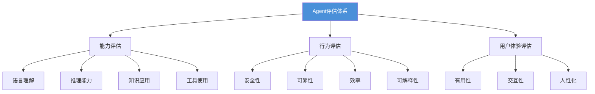
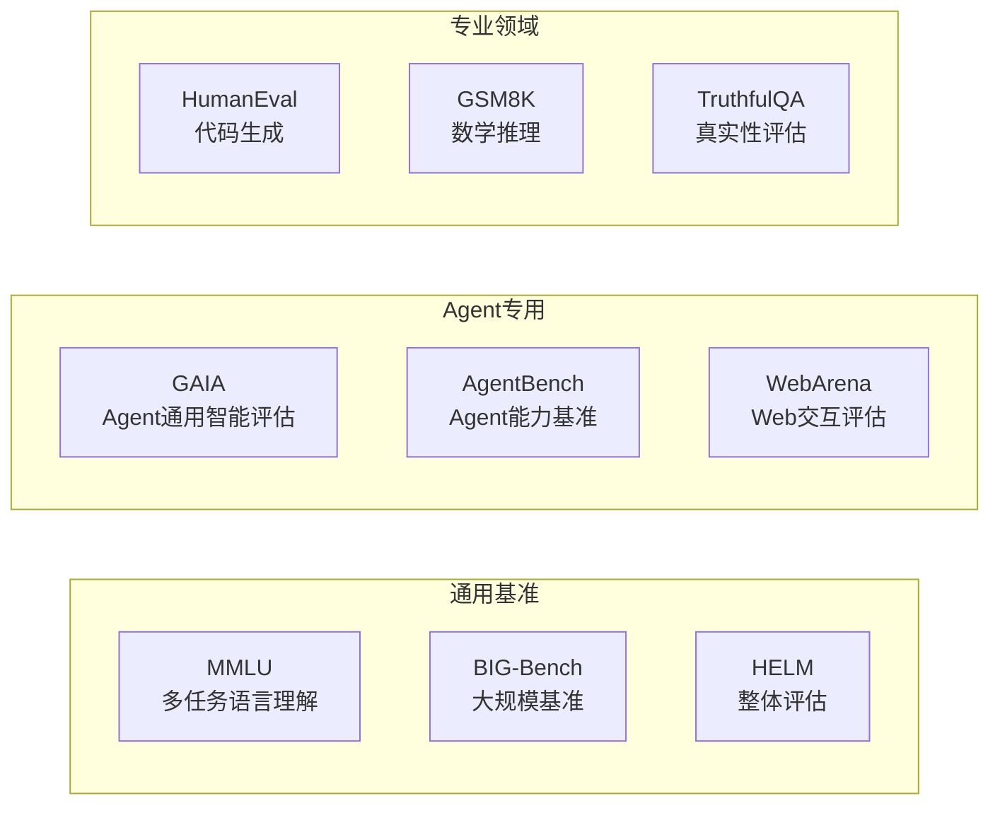

# 第九章：Agent评估与测试

## 📖 章节概述

本章系统学习Agent系统的评估框架和测试方法。你将掌握如何全面评估Agent的能力，理解不同评估基准的特点，学会设计有效的测试用例，并建立完整的质量保证体系。

**学习时长**：1-2周  
**难度等级**：⭐⭐⭐ 中高级  
**核心技能**：评估基准、测试设计、质量度量、A/B测试

---

## 9.1 评估维度与框架

### 9.1.1 核心评估维度



```python
class AgentEvaluationDimensions:
    """Agent评估维度"""
    
    DIMENSIONS = {
        "能力评估": {
            "语言理解": ["意图识别", "实体抽取", "情感分析", "语义匹配"],
            "推理能力": ["逻辑推理", "数学计算", "因果推断", "常识推理"],
            "知识应用": ["知识检索", "事实准确性", "知识整合", "专业领域"],
            "工具使用": ["工具选择", "参数构造", "执行监控", "结果利用"]
        },
        "行为评估": {
            "安全性": ["有害内容", "偏见检测", "隐私保护", "指令遵循"],
            "可靠性": ["一致性", "稳定性", "容错能力", "可预测性"],
            "效率": ["响应速度", "资源消耗", "步骤优化", "成本控制"],
            "可解释性": ["决策透明", "来源追溯", "推理展示", "置信度"]
        },
        "用户体验": {
            "有用性": ["任务完成率", "答案准确率", "问题解决度"],
            "交互性": ["对话流畅", "多轮能力", "上下文理解"],
            "人性化": ["表达自然", "语气适当", "个性化"]
        }
    }
```

### 9.1.2 评估指标体系

```python
from dataclasses import dataclass
from typing import List, Dict
import json

@dataclass
class EvaluationMetrics:
    """评估指标"""
    
    name: str
    category: str
    description: str
    measurement: str  # how to measure
    score_range: tuple  # (min, max)

class MetricsRepository:
    """指标库"""
    
    METRICS = {
        # 准确性指标
        "exact_match": EvaluationMetrics(
            name="精确匹配率",
            category="accuracy",
            description="答案与标准答案完全匹配的比例",
            measurement="EM = 匹配数 / 总数",
            score_range=(0, 1)
        ),
        
        "rouge_score": EvaluationMetrics(
            name="ROUGE分数",
            category="accuracy",
            description="生成内容与参考内容的重叠度",
            measurement="n-gram重叠率",
            score_range=(0, 1)
        ),
        
        "bleu_score": EvaluationMetrics(
            name="BLEU分数",
            category="accuracy",
            description="机器翻译质量评估",
            measurement="n-gram精确率几何平均",
            score_range=(0, 1)
        ),
        
        # 效率指标
        "response_time": EvaluationMetrics(
            name="响应时间",
            category="efficiency",
            description="从请求到返回的时间",
            measurement="毫秒(ms)",
            score_range=(0, float('inf'))
        ),
        
        "token_usage": EvaluationMetrics(
            name="Token消耗",
            category="efficiency",
            description="每次交互的token使用量",
            measurement="tokens数",
            score_range=(0, float('inf'))
        ),
        
        # 安全性指标
        "safety_score": EvaluationMetrics(
            name="安全评分",
            category="safety",
            description="内容安全性评估",
            measurement="人工标注或自动检测",
            score_range=(0, 1)
        ),
        
        # 任务完成指标
        "task_completion": EvaluationMetrics(
            name="任务完成率",
            category="effectiveness",
            description="成功完成任务的比例",
            measurement="完成数 / 总数",
            score_range=(0, 1)
        ),
        
        # 工具使用指标
        "tool_accuracy": EvaluationMetrics(
            name="工具调用准确率",
            category="tool_use",
            description="正确选择和使用工具的比例",
            measurement="正确调用数 / 总调用数",
            score_range=(0, 1)
        )
    }
    
    @classmethod
    def get_metrics(cls, category: str = None) -> List[EvaluationMetrics]:
        """获取指定类别的指标"""
        if category is None:
            return list(cls.METRICS.values())
        
        return [
            m for m in cls.METRICS.values()
            if m.category == category
        ]
```

---

## 9.2 主流评估基准



### 9.2.1 通用能力基准

```python
class EvaluationBenchmarks:
    """主流评估基准"""
    
    BENCHMARKS = {
        "GAIA": {
            "全称": "General AI Assistants",
            "描述": "通用AI助手基准，测试真实世界任务能力",
            "特点": [
                "真实世界问题",
                "需要多步骤推理",
                "可能需要工具使用",
                "人类专家验证答案"
            ],
            "评估维度": ["推理", "工具使用", "事实准确性"]
        },
        
        "MMLU": {
            "全称": "Massive Multitask Language Understanding",
            "描述": "大规模多任务语言理解",
            "特点": [
                "57个学科",
                "从小学到专业水平",
                "选择题格式",
                "广泛知识覆盖"
            ],
            "评估维度": ["知识广度", "专业知识", "零样本学习"]
        },
        
        "BIG-Bench": {
            "全称": "Beyond the Imitation Game Benchmark",
            "描述": "超越模仿游戏的综合基准",
            "特点": [
                "200+任务",
                "涵盖推理、代码、伦理等",
                "强调"涌现能力"",
                "协作开发"
            ],
            "评估维度": ["综合能力", "特殊任务", "新能力探测"]
        },
        
        "HELM": {
            "全称": "Holistic Evaluation of Language Models",
            "描述": "语言模型综合评估",
            "特点": [
                "全面多维度",
                "场景化评估",
                "公平性考量",
                "持续更新"
            ],
            "评估维度": ["准确性", "鲁棒性", "公平性", "效率"]
        }
    }
    
    @classmethod
    def get_benchmark_info(cls, name: str) -> Dict:
        """获取基准信息"""
        return cls.BENCHMARKS.get(name, {})
    
    @classmethod
    def select_benchmark(cls, evaluation_goal: str) -> List[str]:
        """根据评估目标选择基准"""
        
        goal_mapping = {
            "general": ["GAIA", "BIG-Bench", "HELM"],
            "knowledge": ["MMLU", "BIG-Bench"],
            "reasoning": ["GAIA", "BIG-Bench"],
            "safety": ["BIG-Bench", "HELM"],
            "efficiency": ["HELM"]
        }
        
        return goal_mapping.get(evaluation_goal, ["GAIA"])
```

### 9.2.2 专业领域基准

```python
class DomainBenchmarks:
    """专业领域基准"""
    
    BENCHMARKS = {
        # 代码相关
        "HumanEval": {
            "描述": "Python代码生成测试",
            "格式": "函数签名+文档字符串→实现代码",
            "指标": "pass@k"
        },
        
        "MBPP": {
            "描述": "基本Python编程问题",
            "格式": "自然语言描述→代码",
            "指标": "准确率"
        },
        
        # 数学相关
        "GSM8K": {
            "描述": "小学数学应用题",
            "格式": "数学问题→逐步解答",
            "指标": "准确率"
        },
        
        "MATH": {
            "描述": "竞赛数学问题",
            "格式": "数学问题→解答过程",
            "指标": "准确率"
        },
        
        # Agent相关
        "AgentBench": {
            "描述": "Agent系统综合评估",
            "格式": "真实环境任务",
            "指标": "任务完成率"
        },
        
        "ToolBench": {
            "描述": "工具使用能力评估",
            "格式": "需要API调用的任务",
            "指标": "工具调用准确率"
        }
    }
```

---

## 9.3 测试方法论

### 9.3.1 测试用例设计

```python
from typing import List, Dict, Callable
from dataclasses import dataclass
import random

@dataclass
class TestCase:
    """测试用例"""
    
    id: str
    category: str
    input_data: str
    expected_output: str
    metadata: Dict
    difficulty: str = "medium"

class TestCaseGenerator:
    """测试用例生成器"""
    
    def __init__(self, llm_client):
        self.llm = llm_client
    
    def generate_unit_tests(
        self,
        agent_capability: str,
        num_cases: int = 20
    ) -> List[TestCase]:
        """生成单元测试用例"""
        
        cases = []
        
        for i in range(num_cases):
            case = self.generate_single_case(
                agent_capability,
                difficulty=self.select_difficulty(i, num_cases)
            )
            cases.append(case)
        
        return cases
    
    def generate_single_case(
        self,
        capability: str,
        difficulty: str
    ) -> TestCase:
        """生成单个测试用例"""
        
        prompt = f"""
为以下Agent能力生成测试用例：
能力：{capability}
难度：{difficulty}

请生成：
1. 测试输入（问题/指令）
2. 期望输出（标准答案或格式）
3. 评分标准
        """
        
        result = self.llm.chat(prompt)
        
        # 解析生成的内容
        # 简化实现
        return TestCase(
            id=f"test_{random.randint(1000, 9999)}",
            category=capability,
            input_data="测试输入",
            expected_output="期望输出",
            metadata={"difficulty": difficulty}
        )
    
    def select_difficulty(
        self,
        index: int,
        total: int
    ) -> str:
        """选择难度分布"""
        
        ratio = index / total
        
        if ratio < 0.2:
            return "easy"
        elif ratio < 0.8:
            return "medium"
        else:
            return "hard"
    
    def generate_edge_cases(
        self,
        normal_cases: List[TestCase]
    ) -> List[TestCase]:
        """生成边界用例"""
        
        edge_cases = []
        
        for case in normal_cases[:5]:  # 基于前5个正常用例
            # 模糊输入
            edge_cases.append(self.create_variant(
                case,
                transformation="fuzz"
            ))
            
            # 空输入
            edge_cases.append(self.create_variant(
                case,
                transformation="empty"
            ))
            
            # 超长输入
            edge_cases.append(self.create_variant(
                case,
                transformation="long"
            ))
        
        return edge_cases
    
    def create_variant(
        self,
        base_case: TestCase,
        transformation: str
    ) -> TestCase:
        """创建用例变体"""
        
        if transformation == "fuzz":
            # 添加噪声
            input_data = f"{base_case.input_data} [干扰信息]"
        elif transformation == "empty":
            input_data = ""
        elif transformation == "long":
            input_data = base_case.input_data * 10
        else:
            input_data = base_case.input_data
        
        return TestCase(
            id=f"{base_case.id}_{transformation}",
            category=base_case.category,
            input_data=input_data,
            expected_output=base_case.expected_output,
            metadata={"transformation": transformation}
        )
```

### 9.3.2 自动化测试框架

```python
import time
from typing import Callable, Any
from dataclasses import dataclass

@dataclass
class TestResult:
    """测试结果"""
    
    test_id: str
    passed: bool
    actual_output: str
    expected_output: str
    execution_time: float
    error_message: str = None
    metadata: Dict = None

class AgentTestRunner:
    """Agent测试运行器"""
    
    def __init__(self, agent):
        self.agent = agent
        self.results: List[TestResult] = []
    
    def run_test(
        self,
        test_case: TestCase,
        timeout: float = 30.0
    ) -> TestResult:
        """运行单个测试"""
        
        start_time = time.time()
        
        try:
            # 执行测试
            output = self.agent.process(
                test_case.input_data,
                timeout=timeout
            )
            
            execution_time = time.time() - start_time
            
            # 评估结果
            passed = self.evaluate_output(
                output,
                test_case.expected_output
            )
            
            return TestResult(
                test_id=test_case.id,
                passed=passed,
                actual_output=output,
                expected_output=test_case.expected_output,
                execution_time=execution_time
            )
        
        except Exception as e:
            return TestResult(
                test_id=test_case.id,
                passed=False,
                actual_output="",
                expected_output=test_case.expected_output,
                execution_time=time.time() - start_time,
                error_message=str(e)
            )
    
    def run_test_suite(
        self,
        test_cases: List[TestCase],
        parallel: bool = False
    ) -> Dict[str, Any]:
        """运行测试套件"""
        
        self.results = []
        
        if parallel:
            # 并行执行
            import concurrent.futures
            with concurrent.futures.ThreadPoolExecutor() as executor:
                futures = [
                    executor.submit(self.run_test, tc)
                    for tc in test_cases
                ]
                self.results = [f.result() for f in futures]
        else:
            # 顺序执行
            for tc in test_cases:
                result = self.run_test(tc)
                self.results.append(result)
        
        return self.generate_report()
    
    def evaluate_output(
        self,
        actual: str,
        expected: str
    ) -> bool:
        """评估输出"""
        
        # 精确匹配
        if actual.strip() == expected.strip():
            return True
        
        # 使用LLM评估语义等价
        prompt = f"""
判断以下回答是否正确：
期望输出：{expected}
实际输出：{actual}

回答：是/否
        """
        
        # 这里应该调用LLM
        return "是" in prompt  # 简化
    
    def generate_report(self) -> Dict[str, Any]:
        """生成测试报告"""
        
        total = len(self.results)
        passed = sum(1 for r in self.results if r.passed)
        failed = total - passed
        
        avg_time = sum(r.execution_time for r in self.results) / total
        
        return {
            "summary": {
                "total": total,
                "passed": passed,
                "failed": failed,
                "pass_rate": passed / total if total > 0 else 0,
                "avg_time": avg_time
            },
            "failed_tests": [
                r for r in self.results if not r.passed
            ],
            "slow_tests": sorted(
                self.results,
                key=lambda r: r.execution_time,
                reverse=True
            )[:5]
        }}"""
```
（详见 [第6章 - 高级优化](chapter6-advanced-optimization/chapter6-advanced-optimization.md)）

---

## 9.4 A/B测试与在线评估

### 9.4.1 A/B测试框架

```python
import random
from typing import Dict, Any

class ABTestFramework:
    """A/B测试框架"""
    
    def __init__(self):
        self.experiments: Dict[str, 'Experiment'] = {}
        self.results: Dict[str, Dict] = {}
    
    def create_experiment(
        self,
        experiment_id: str,
        variants: Dict[str, Any],
        metric: str
    ) -> 'Experiment':
        """创建实验"""
        
        experiment = Experiment(
            id=experiment_id,
            variants=variants,
            target_metric=metric
        )
        
        self.experiments[experiment_id] = experiment
        return experiment
    
    def get_variant(
        self,
        experiment_id: str,
        user_id: str
    ) -> Any:
        """获取用户对应的变体"""
        
        experiment = self.experiments[experiment_id]
        return experiment.assign_variant(user_id)
    
    def record_metric(
        self,
        experiment_id: str,
        user_id: str,
        metric_value: float
    ):
        """记录指标"""
        
        if experiment_id not in self.results:
            self.results[experiment_id] = {}
        
        if user_id not in self.results[experiment_id]:
            self.results[experiment_id][user_id] = []
        
        self.results[experiment_id][user_id].append(metric_value)
    
    def analyze_results(
        self,
        experiment_id: str
    ) -> Dict[str, Any]:
        """分析实验结果"""
        
        experiment = self.experiments[experiment_id]
        user_results = self.results.get(experiment_id, {})
        
        variant_stats = {}
        
        for variant_name in experiment.variants.keys():
            values = []
            for user_id, metrics in user_results.items():
                assigned_variant = experiment.assign_variant(user_id)
                if assigned_variant == variant_name:
                    values.extend(metrics)
            
            if values:
                variant_stats[variant_name] = {
                    "count": len(values),
                    "mean": sum(values) / len(values),
                    "std": self.calculate_std(values)
                }
        
        return {
            "experiment_id": experiment_id,
            "variants": variant_stats,
            "winner": self.determine_winner(variant_stats)
        }
    
    def calculate_std(self, values: List[float]) -> float:
        """计算标准差"""
        
        if not values:
            return 0
        
        mean = sum(values) / len(values)
        variance = sum((x - mean) ** 2 for x in values) / len(values)
        return variance ** 0.5
    
    def determine_winner(
        self,
        stats: Dict[str, Dict]
    ) -> str:
        """确定获胜变体"""
        
        if not stats:
            return None
        
        return max(
            stats.items(),
            key=lambda x: x[1]["mean"]
        )[0]

class Experiment:
    """实验配置"""
    
    def __init__(
        self,
        id: str,
        variants: Dict[str, Any],
        target_metric: str
    ):
        self.id = id
        self.variants = variants
        self.target_metric = target_metric
        self.assignments: Dict[str, str] = {}
    
    def assign_variant(self, user_id: str) -> str:
        """分配变体"""
        
        if user_id in self.assignments:
            return self.assignments[user_id]
        
        # 随机分配（可改进为加权分配）
        variant_names = list(self.variants.keys())
        variant = random.choice(variant_names)
        
        self.assignments[user_id] = variant
        return variant
```
（详见 [第12章 - 企业实践](chapter12-enterprise-best-practices/chapter12-enterprise-best-practices.md)）

---

## 9.5 章节练习

### 🎯 练习一：构建评估仪表板

```python
class EvaluationDashboard:
    """评估仪表板"""
    
    def __init__(self):
        self.metrics_history = []
    
    def add_result(self, result: TestResult):
        """添加测试结果"""
        self.metrics_history.append(result)
    
    def get_summary(self) -> Dict:
        """获取摘要统计"""
        
        total = len(self.metrics_history)
        passed = sum(1 for r in self.metrics_history if r.passed)
        
        return {
            "total_tests": total,
            "passed": passed,
            "failed": total - passed,
            "pass_rate": passed / total if total > 0 else 0
        }
    
    def visualize_trends(self) -> str:
        """可视化趋势"""
        
        # 简化实现
        return """
测试通过率趋势：
Week 1: ████████████░░ 85%
Week 2: █████████████░ 90%
Week 3: ████████████░░ 88%
        """
```

---

## ✅ 章节总结

### 核心要点

1. **评估维度**：能力、行为、用户体验三维度全面评估
2. **评估基准**：GAIA、MMLU、BIG-Bench等主流基准
3. **测试方法**：单元测试、集成测试、A/B测试
4. **质量指标**：准确性、效率、安全性、可解释性

### 下章预告

下一章将学习**前沿研究方向与未来展望**

[← 返回课程目录](../course-overview.md) | [→ 进入第十章：前沿研究](../chapter10-frontier-research/chapter10-frontier-research.md)
