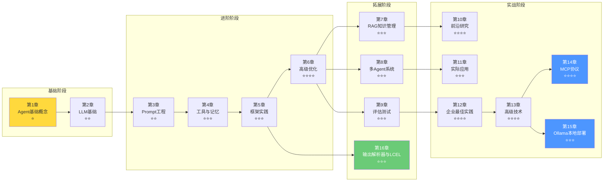

# 📚 Agent 学习课程体系

## 课程概览

欢迎来到Agent（智能体）完整学习课程！本课程将带你从零基础开始，系统地掌握Agent的核心概念、架构设计、关键技术以及实际应用开发能力。课程涵盖从基础理论到前沿研究，从理论原理到企业级实践的完整知识体系。

## 🎯 课程目标

完成本课程后，你将能够：
- ✅ 深入理解Agent的定义、特征与核心架构
- ✅ 掌握大语言模型的工作原理与能力边界
- ✅ 熟练运用Prompt工程技术和Agent设计模式
- ✅ 开发完整的Agent系统，具备实际项目能力
- ✅ 构建RAG知识检索增强系统
- ✅ 设计多Agent协作系统
- ✅ 建立完整的Agent评估测试体系
- ✅ 了解前沿研究方向和技术趋势
- ✅ 将Agent技术应用于实际业务场景
- ✅ 掌握Agent微调、模型蒸馏、A/B实验等高级技术
- ✅ 掌握MCP协议与本地模型部署
- ✅ 熟练使用输出解析器与LCEL
- ✅ 通过Jupyter Notebook动手实践每个章节的代码

## 📖 课程结构

本课程分为**十六大章节**，按照从基础到进阶的顺序编排，建议按章节顺序学习：

```
第一章：Agent基础概念
├── 1.1 Agent的定义与特征
├── 1.2 Agent的基本架构
├── 1.3 Agent的发展历程
└── 1.4 章节练习

第二章：大语言模型基础
├── 2.1 Transformer架构原理
├── 2.2 主流大语言模型对比
├── 2.3 LLM的能力与局限性
├── 2.4 API调用实践
└── 2.5 章节练习

第三章：Prompt工程与Agent设计
├── 3.1 提示词基础与结构
├── 3.2 高级Prompt技术
├── 3.3 Agent设计模式
└── 3.4 章节练习

第四章：工具使用与记忆系统
├── 4.1 Agent工具系统设计
├── 4.2 函数调用与API集成
├── 4.3 记忆系统架构
└── 4.4 章节练习

第五章：Agent框架实践
├── 5.1 LangChain核心概念
├── 5.2 LangGraph进阶应用
├── 5.3 AutoGen多Agent开发
├── 5.4 CrewAI实践
├── 5.5 实际项目案例
├── 5.6 Semantic Kernel实践
├── 5.7 Dify低代码平台
└── 5.8 章节练习

第六章：高级主题与优化
├── 6.1 规划与推理能力
├── 6.2 安全性与可靠性
├── 6.3 性能优化策略
├── 6.4 监控与可观测性
└── 6.5 章节练习

第七章：RAG检索增强与知识管理 ⭐新增
├── 7.1 RAG基础概念
├── 7.2 文档处理与分块策略
├── 7.3 向量嵌入与存储
├── 7.4 检索策略
├── 7.5 RAG系统实现
├── 7.6 知识图谱集成
└── 7.7 章节练习

第八章：多Agent系统架构 ⭐新增
├── 8.1 多Agent系统基础
├── 8.2 架构模式（主从/对等/层级）
├── 8.3 任务分配策略
├── 8.4 协作与通信
├── 8.5 共识机制
└── 8.6 章节练习

第九章：Agent评估与测试 ⭐新增
├── 9.1 评估维度与框架
├── 9.2 主流评估基准
├── 9.3 测试方法论
├── 9.4 A/B测试与在线评估
└── 9.5 章节练习

第十章：前沿研究方向 ⭐新增
├── 10.1 自主学习与自我改进
├── 10.2 持续学习
├── 10.3 多模态融合
├── 10.4 具身智能
├── 10.5 通用人工智能展望
└── 10.6 章节练习

第十一章：Agent实际应用案例 ⭐新增
├── 11.1 企业级应用
├── 11.2 开发工具应用
├── 11.3 内容创作应用
├── 11.4 科研教育应用
└── 11.5 章节练习

第十二章：企业级最佳实践
├── 12.1 安全合规
├── 12.2 数据隐私保护
├── 12.3 成本优化策略
├── 12.4 性能调优
├── 12.5 监控与可观测性
├── 12.6 高可用性架构
└── 12.7 章节练习

第十三章：高级技术补充 ⭐最新
├── 13.1 Agent微调（Fine-tuning）
├── 13.2 模型蒸馏（Knowledge Distillation）
├── 13.3 A/B实验框架
├── 13.4 Prompt版本管理
└── 13.5 章节练习

第十四章：MCP模型上下文协议 ⭐最新
├── 14.1 MCP协议简介
├── 14.2 MCP架构与核心能力
├── 14.3 MCP传输方式
├── 14.4 实现MCP服务器与客户端
├── 14.5 LangChain中使用MCP
└── 14.6 章节练习

第十五章：Ollama本地部署与调用 ⭐最新
├── 15.1 Ollama简介
├── 15.2 安装与配置
├── 15.3 常用命令
├── 15.4 安装与验证模型
├── 15.5 LangChain整合Ollama
└── 15.6 章节练习

第十六章：输出解析器与LCEL ⭐最新
├── 16.1 输出解析器简介
├── 16.2 常见解析器用法
├── 16.3 结构化输出
├── 16.4 LCEL简介
├── 16.5 LCEL组合方式
└── 16.6 章节练习
```



## 🕐 学习时间规划

| 章节 | 主题 | 建议学习时间 | 难度等级 |
|------|------|-------------|---------|
| 第一章 | Agent基础概念 | 1-2周 | ⭐ 入门 |
| 第二章 | 大语言模型基础 | 2-3周 | ⭐⭐ 基础 |
| 第三章 | Prompt工程与Agent设计 | 2-3周 | ⭐⭐ 中级 |
| 第四章 | 工具使用与记忆系统 | 2-3周 | ⭐⭐⭐ 中高级 |
| 第五章 | Agent框架实践 | 2-3周 | ⭐⭐⭐ 高级 |
| 第六章 | 高级主题与优化 | 2-3周 | ⭐⭐⭐⭐ 进阶 |
| 第七章 | RAG检索增强 | 2-3周 | ⭐⭐⭐ 中高级 |
| 第八章 | 多Agent系统 | 1-2周 | ⭐⭐⭐ 高级 |
| 第九章 | 评估与测试 | 1-2周 | ⭐⭐⭐ 中高级 |
| 第十章 | 前沿研究 | 1-2周 | ⭐⭐⭐⭐ 进阶 |
| 第十一章 | 实际应用 | 2-3周 | ⭐⭐⭐ 高级 |
| 第十二章 | 企业级最佳实践 | 2-3周 | ⭐⭐⭐⭐ 进阶 |
| 第十三章 | 高级技术补充 | 2-3周 | ⭐⭐⭐⭐ 进阶 |
| 第十四章 | MCP模型上下文协议 | 1-2周 | ⭐⭐⭐⭐ 进阶 |
| 第十五章 | Ollama本地部署 | 1-2周 | ⭐⭐⭐ 中级 |
| 第十六章 | 输出解析器与LCEL | 1-2周 | ⭐⭐⭐ 高级 |

**总学习周期：约26-38周**

## 📦 新增内容亮点

### 第七章：RAG检索增强与知识管理
- ✅ RAG基础概念与工作流程
- ✅ 文档分块策略（固定/递归/Markdown/语义分块）
- ✅ 向量嵌入模型选择与对比
- ✅ 向量数据库（Chroma/FAISS/Pinecone等）
- ✅ 检索策略（MMR/混合搜索/压缩检索）
- ✅ 高级RAG架构（Self-RAG/HyDE）
- ✅ 知识图谱集成

### 第八章：多Agent系统架构
- ✅ 主从模式架构
- ✅ 对等模式架构
- ✅ 层级模式架构
- ✅ 任务分解与分配策略
- ✅ Agent能力匹配
- ✅ 通信协议设计
- ✅ 共识机制（投票/协商/拍卖）

### 第九章：Agent评估与测试
- ✅ 评估维度体系
- ✅ 主流评估基准（GAIA/MMLU/BIG-Bench/HELM）
- ✅ 专业领域基准（HumanEval/GSM8K/AgentBench）
- ✅ 测试用例生成
- ✅ 自动化测试框架
- ✅ A/B测试与在线评估
- ✅ 评估仪表板设计

### 第十章：前沿研究方向
- ✅ 自主学习与自我改进
- ✅ 持续学习与灾难遗忘
- ✅ 多模态融合技术
- ✅ 具身智能与机器人
- ✅ AGI发展路径
- ✅ 关键研究方向（认知架构/因果推理/世界模型）

### 第十一章：实际应用案例
- ✅ 企业智能客服系统
- ✅ 业务流程自动化（RPA+AI）
- ✅ 知识管理系统
- ✅ AI编程助手
- ✅ 自动化测试生成
- ✅ 内容创作平台
- ✅ 多语言本地化
- ✅ 科研文献综述助手
- ✅ 智能辅导系统

### 第十二章：企业级最佳实践
- ✅ 安全合规（输入输出过滤、数据加密、访问控制）
- ✅ 数据隐私保护（PII识别、数据脱敏、GDPR合规）
- ✅ 成本优化策略（API成本监控、模型选择、缓存策略）
- ✅ 性能调优（批处理、异步处理、负载均衡）
- ✅ 监控与可观测性（日志系统、指标监控）
- ✅ 高可用性架构（故障恢复、健康检查）

### 第十三章：高级技术补充
- ✅ Agent微调（Fine-tuning）：OpenAI Fine-tuning API、LoRA/QLoRA高效微调
- ✅ 模型蒸馏（Knowledge Distillation）：教师-学生模型知识迁移
- ✅ A/B实验框架：流量分配、统计显著性检验、可视化
- ✅ Prompt版本管理：语义化版本、分支管理、Canary发布

### 第十四章：MCP模型上下文协议 ⭐最新
- ✅ MCP定义：统一接入外部能力的协议标准
- ✅ MCP架构：Host/Client/Server三层架构
- ✅ 核心能力：Tools/Resources/Prompts三大能力
- ✅ 传输方式：stdio/Streamable HTTP两种主流传输
- ✅ 代码实现：完整的MCP服务器与客户端示例
- ✅ LangChain集成：MultiServerMCPClient与Agent协作

### 第十五章：Ollama本地部署与调用 ⭐最新
- ✅ Ollama简介：本地运行开源LLM的工具
- ✅ 安装配置：各平台安装、模型目录配置
- ✅ 常用命令：pull/run/list/rm/ps/serve等
- ✅ 本地模型：qwen/llama/mistral等开源模型
- ✅ LangChain集成：ChatOllama完整用法
- ✅ 最佳实践：本地开发、隐私敏感场景、离线测试

### 第十六章：输出解析器与LCEL ⭐最新
- ✅ 输出解析器：StrOutputParser/JsonOutputParser/PydanticOutputParser
- ✅ 结构化输出：TypedDict/Pydantic/JSON Schema三种方式
- ✅ LCEL简介：LangChain Expression Language管道语法
- ✅ 组合方式：RunnableSequence/RunnableBranch/RunnableParallel/RunnableLambda
- ✅ 完整案例：端到端的链式调用应用

## 🧪 配套资源

- 📝 **章节自测题库**：每章配备10道练习题（单选/多选/判断/简答），附答案和解析
- 📖 **术语词汇表**：68条中英文对照Agent领域核心术语，按字母排序
- 📓 **Jupyter Notebook**：`1-jupyternotebook/` 目录下15个配套Notebook，代码开箱即用

## 💻 学习前置要求

### 基础知识
- ✅ 编程基础：熟悉Python语言
- ✅ 了解基本的机器学习概念
- ✅ 了解HTTP协议和API基本概念
- ✅ 了解向量和矩阵基础概念（有益）

### 环境准备
- ✅ Python 3.8+ 环境
- ✅ 代码编辑器（VS Code / PyCharm）
- ✅ OpenAI API密钥或其他LLM API访问权限
- ✅ Git版本控制基础
- ✅ 向量数据库（可选：Chroma/FAISS）
- ✅ Ollama（可选：本地模型运行）

### 推荐开发环境配置

```bash
# 创建虚拟环境
python -m venv agent-course-env
source agent-course-env/bin/activate  # Linux/Mac
# 或
agent-course-env\Scripts\activate  # Windows

# 安装基础依赖
pip install openai anthropic langchain langchain-openai langchain-community
pip install langchain-ollama  # 本地Ollama
pip install chromadb faiss-cpu  # 向量数据库
pip install jupyter notebook
pip install python-dotenv requests
pip install numpy pandas
```

## 🛠 实践项目汇总

| 章节 | 实践项目 | 技能点 |
|------|---------|--------|
| 第一章 | 简单的对话Agent | 基础架构理解 |
| 第二章 | LLM能力测试工具 | 模型特性理解 |
| 第三章 | 智能问答系统 | Prompt设计 |
| 第四章 | 带记忆的助手 | 工具集成、记忆系统 |
| 第五章 | 多Agent协作系统 | 框架使用、协作设计 |
| 第六章 | 企业级Agent应用 | 系统设计、优化 |
| 第七章 | 知识库问答系统 | RAG实现、向量检索 |
| 第八章 | 协作型任务Agent | 多Agent设计 |
| 第九章 | Agent评估平台 | 测试与度量 |
| 第十章 | 自主学习Agent | 前沿技术探索 |
| 第十一章 | 完整业务Agent系统 | 端到端开发 |
| 第十二章 | 企业级部署方案 | 安全合规、监控运维 |
| 第十三章 | 微调蒸馏实验 | LLM高级优化技术 |
| 第十四章 | MCP服务器开发 | 协议实现、工具接入 |
| 第十五章 | 本地模型应用 | Ollama部署、离线开发 |
| 第十六章 | 链式调用应用 | LCEL编程、结构化输出 |

## 📚 学习资源导航

### 官方文档
- [OpenAI API Documentation](https://platform.openai.com/docs)
- [Anthropic Claude Documentation](https://docs.anthropic.com/)
- [LangChain Documentation](https://python.langchain.com/)
- [AutoGen Documentation](https://microsoft.github.io/autogen/)
- [CrewAI Documentation](https://docs.crewai.com/)
- [MCP Protocol Documentation](https://modelcontextprotocol.io/)
- [Ollama Documentation](https://ollama.com/docs)

### 推荐书籍
- 《Building LLM Applications》
- 《Prompt Engineering Guide》
- 《Hands-On LLMs》
- 《Generative AI with LangChain》

### 关注的研究
- arXiv: cs.AI, cs.CL, cs.LG
- ACL, NeurIPS, ICML, ICLR
- OpenAI Blog, Anthropic Blog, DeepMind Blog

## ⚠️ 学习注意事项

1. **循序渐进**：不要跳过基础章节，后续内容依赖前面的知识
2. **动手实践**：每个知识点都要亲自实践代码，不要只看不动手
3. **记录笔记**：养成整理笔记的习惯，方便复习和回顾
4. **完成练习**：每个章节的练习项目是巩固知识的关键
5. **耐心坚持**：Agent技术内容较多，保持耐心，持续学习
6. **参与社区**：遇到问题积极搜索和提问，善于利用社区资源

## 🎯 下一步行动

现在开始你的学习之旅！

1. 📖 **阅读第一章**：Agent基础概念
2. 💻 **搭建环境**：配置好开发环境
3. 💻 **运行示例**：尝试运行第一个Agent代码
4. 📝 **记录问题**：记录学习中遇到的问题和心得

## 📈 课程更新日志

- **v4.0 (最新)**：新增第14-16章（MCP协议、Ollama本地部署、输出解析器与LCEL）；16章配套自测题库；16个Jupyter Notebook；扩展课程结构到16章；补充本地开发与离线运行能力
- **v3.0**：新增第13章高级技术补充；12章配套自测题库；68条术语词汇表；12个Jupyter Notebook；补充Semantic Kernel和Dify框架；全课程Mermaid可视化图表
- **v2.0**：新增5个章节，涵盖RAG、多Agent、评估测试、前沿研究和实际应用
- **v1.0**：初始版本，包含6个基础章节

---

**准备好了吗？让我们开始吧！🚀**

[→ 进入第一章：Agent基础概念](./chapter1-agent-basics/chapter1-agent-basics.md)
